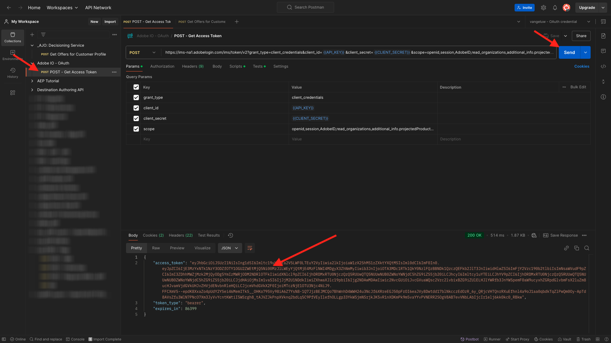

# 3.3.6 Test your decision using the API

## 3.3.6.1 Work with the Offer Decisioning API using Postman

Download [this Postman Collection for Offer Decisioning](./../../../assets/postman/postman_offer-decisioning.zip) to your desktop and unzip it. You'll then have this:

You now have this file on your desktop:

- `_AJO- Decisioning Service.postman_collection.json`

In [Exercise 2.1.3 - Postman authentication to Adobe I/O](./../../../modules/rtcdp-b2c/module2.1/ex3.md) you installed Postman. You'll need to use Postman again for this exercise.

Open Postman and import the file `_AJO- Decisioning Service.postman_collection.json`. You'll then have this collection available in Postman.

You now have everything you need in Postman to start interacting with Adobe Experience Platform through the APIs.

Before you can use the below APIs, be sure to reauthenticate using the collection **Adobe IO - OAuth** which you configured in Exercise 2.1.3.

### 3.3.6.2 Get Offers for Customer Profile

Click to open the request **POST - Get Offers for Customer Profile**. The first thing to update is the **Header** variable for **x-sandbox-name**. You should set it to `--aepSandboxName--`.

For this request, there are a number of fields that need to be updated. Go to **Body**.

- **xdm:placementId**
- **xdm:activityId** 
- **xdm:id** 
- **xdm:itemCount** (change it to a value of choice)

The field **xdm:activityId** needs to be filled out. You can retrieve that in the Adobe Experience Platform UI, as indicated below.

The field **[!UICONTROL xdm:placementId]** needs to be filled out. You can retrieve that in the Adobe Experience Platform UI, as indicated below. In the below example, you can see the placementId for the placement **[!UICONTROL Web - Image]**.

For the field **xdm:id**, enter the email address of the customer profile for whom you'd like to request an offer. Once all the values are set as desired, click **[!UICONTROL Send]**.

Finally, you'll then see the result of what kind of personalized offer and what assets need to be displayed to this customer. In this example 2 items were requested, and as you can see, 2 personalized offers have been returned. 1 offer for Apple Watch and another offer for Galaxy Watch 7.

You've now completed this exercise.

Next Step: [Summary and benefits](./summary.md)

[Go Back to Module 3.3](./offer-decisioning.md)

[Go Back to All Modules](./../../../overview.md)
