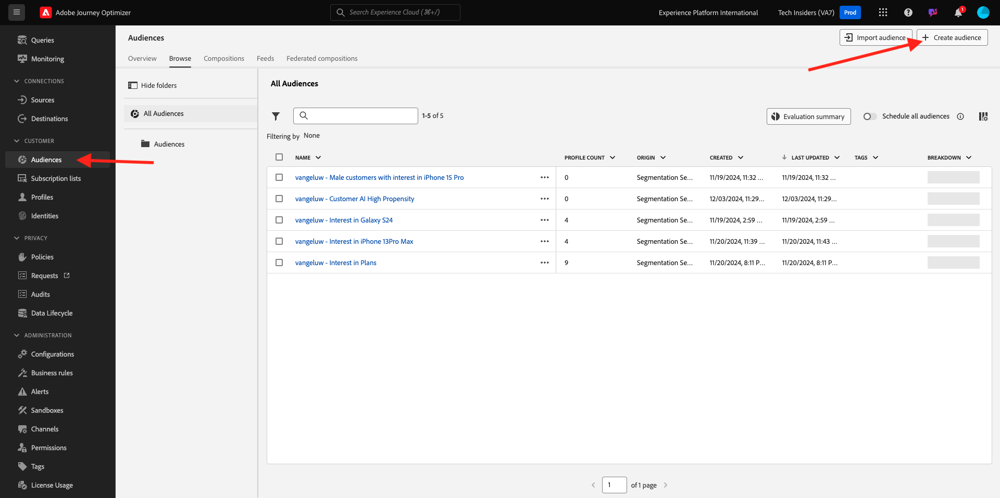
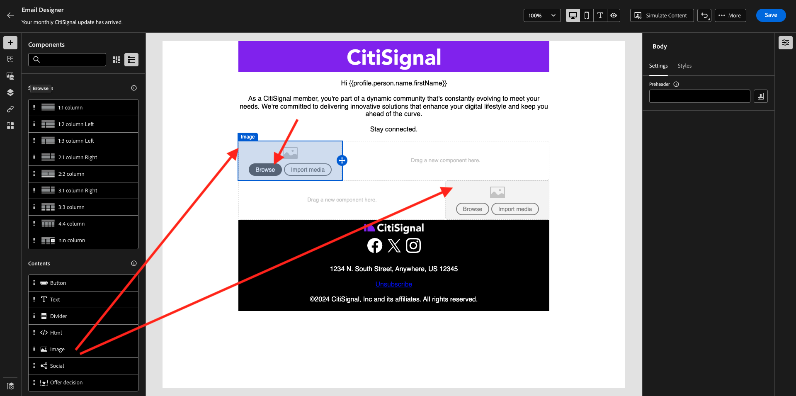

# 3.4.2 Configure a Campaign 

Login to Adobe Journey Optimizer by going to [Adobe Experience Cloud](https://experience.adobe.com). Click **Journey Optimizer**.


You'll be redirected to the **Home**  view in Journey Optimizer. First, make sure you're using the correct sandbox. The sandbox to use is called `--aepSandboxName--`. You'll then be in the **Home** view of your sandbox `--aepSandboxName--`.


## 3.4.2.1 Create audience

Before creating your campaign, you should define the audience that should receive the campaign. To create an audience, go to **Audiences** in the left menu. You'll see all previously created audience there.

Click **+ Create Audience**.



Select **Build rule** and click **Create**.


Select the field **XDM Individual Profile > Personal Email > Address** and add it to the canvas. Set the rule condition to **exists**. 

To avoid sending emails to other users in your shared training environment, you can also add a filter such as **First Name equals -your first name-**.

Set the name of your audience to `--aepUserLdap-- - All customers with email` and click **Publish**.


Your audience is now published and can be used in a campaign.

## 3.4.2.2 Create newsletter campaign

You'll now create a campaign. Unlike the event-based journey of the previous exercise which relies on incoming experience events or audience entries or exits to trigger a journey for 1 specific customer, campaigns target a whole audience once with unique content like newsletters, one-off promotions, or generic information or periodically with similar content sent on a regular basis like for instance birthday campaigns and reminders. 

In the menu, go to **Campaigns** and click **Create campaign**.


Select **Scheduled - Marketing** and click **Create**.


On the campaign creation screen, configure the following:

- **Name**: `--aepUserLdap-- - CitiSignal Newsletter`.
- **Description**: Monthly Newsletter
- **Identity type**: change to Email

Click **Select audience**.


For the **Audience**, select the audience you created in the previous step, `--aepUserLdap-- - All customers with email`. Click **Save**.


For the **Action**, select **Email** and select an existing **Email configuration**. You'll edit the content in a couple of minutes.


For the **Schedule**, choose **On a specific date and time** and set a time of choice.


You can now start creating the email message itself. Scroll up a little bit, and click **Edit content**.


You'll then see this. For the **Subject line**, use this: `Your monthly CitiSignal update has arrived.`. Next, click **Edit email body**.


Choose **Design from scratch**.


You'll then see this. In the left menu, you'll find the structure components that you can use to define the structure of the email (rows and columns).

Drag and drop 3 times a **1:1 column** on the canvas, 1 time a 1:2 column left and 1 time a 2:1 column right which should give you this structure:


In the left menu, go to **Fragments**. Drag the header you created earlier in [exercise 3.1.2.1](./../module3.1/ex2.md) onto the first component in the canvas. Drag the footer you created earlier in [exercise 3.1.2.2](./../module3.1/ex2.md) onto the last component in the canvas.


Click the **+** icon in the left menu. Go to **Contents** to start adding content onto the canvas.


Drag and drop a **Text** component on the second row. 


Select the default text in that component **Please type your text here.** and replace it by the below text. Change the alignment to **Center alignment**.

```javascript

Hi {{profile.person.name.firstName}}

As a CitiSignal member, you're part of a dynamic community that's constantly evolving to meet your needs. We're committed to delivering innovative solutions that enhance your digital lifestyle and keep you ahead of the curve.

Stay connected.

```


Drag and drop an **Image** component on the 3rd and 4th row. Click **Browse** on the 3rd row.



Open the folder **citi-signal-images**, click to select the image **Offer_AirPods.jpg**, and click **Select**.


Click **Browse** on the image placeholder on the 4th row.


Open the folder **citi-signal-images**, click to select the image **Offer_Phone.jpg**, and click **Select**.


Drag and drop a **Text** component on the 3rd and 4th row. 


Select the default text in the component on the 3rd row **Please type your text here.** and replace it by the below text.

```javascript

Get AirPods for free:

Experience seamless connectivity like never before with CitiSignal. Sign up for select premium plans and receive a complimentary pair of Apple AirPods. Stay connected in style with our unbeatable offer.

```

Select the default text in the component on the 4th row **Please type your text here.** and replace it by the below text.

```javascript

We'll pay off your phone:

Make the switch to CitiSignal and say goodbye to phone payments! Switching to CitiSignal has never been more rewarding. Say farewell to hefty phone bills as we help pay off your phone, up to 800$!

```


Your basic newsletter email is now ready. Click **Save**.


Go back to the campaign dashboard by clicking the **arrow** next to the subject line text in the top-left corner.


Click **Review to activate**.


You may then get this error. If that is the case, then you may need to wait up to 24 hours until the audience has been evaluated, and then try to activate your campaign again. You may also need to update the schedule of your campaign to run at a later time.

Click **Activate**.


Once acivated, your campaign will then be scheduled to run.


Your campaign is now activated. Your newsletter email message will be sent as you defined it in your schedule, and your campaign will stop as soon as the last email has been sent.

You should also receive the email on the email address you used for the demo profile you created earlier.


You have finished this exercise.

Next Step: [3.4.3 Apply segment-based personalization in an email message](./ex3.md)

[Go Back to Module 3.4](./journeyoptimizer.md)

[Go Back to All Modules](../../../overview.md)
