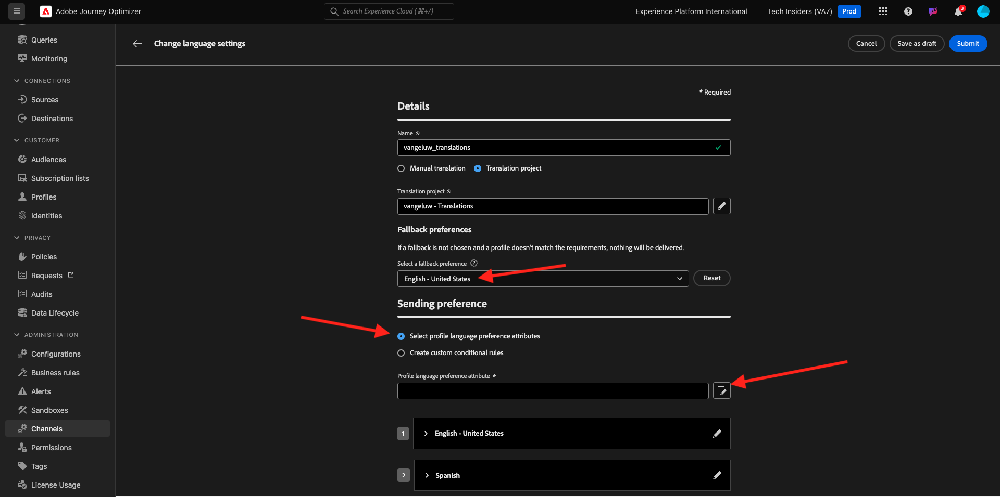
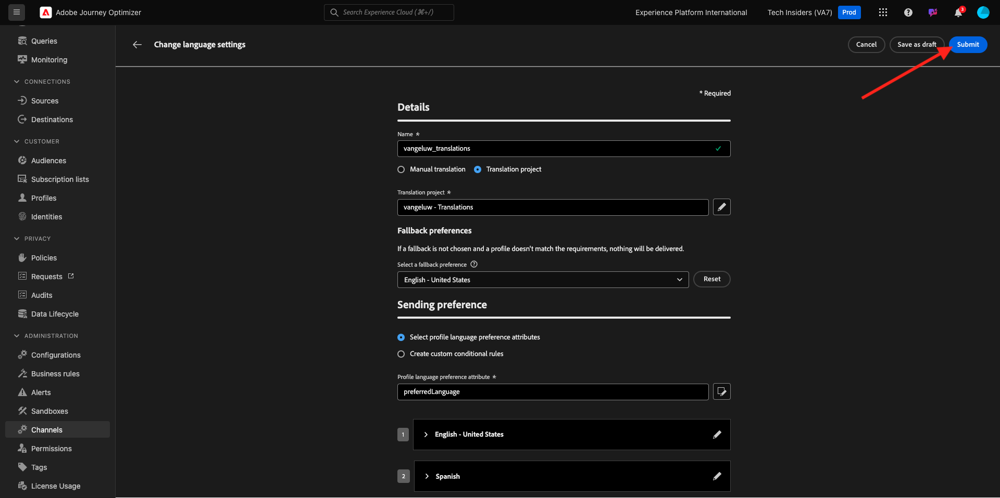

# 3.5.1 Translations Provider

## 3.5.1.1 Configure Microsoft Azure Translator

Go to [https://portal.azure.com/#home](https://portal.azure.com/#home).

In the search bar, enter `translators`. Then, click **+ Create**.

Select **Create Translator**.

Choose your **Subscription ID** and **Resource group**.
Set **Region** to **Global**.
Set **Pricing Tier** to **Free F0**.

Select **Review + create**.

Select **Create**.

Select **Go to resource**.

In the left menu, go to **Resource Management** > **Keys and Endpoint**. Click to copy your key.

## 3.5.1.2 Locale Dictionary

Go to [https://experience.adobe.com/](https://experience.adobe.com/). Click **Journey Optimizer**.

In the left menu, go to **Translations** and then go to **Locale Dictionary**. If you see this message, click **Add Default Locales**.

You should then see this.

## 3.5.1.3 Configure Translations Provider in AJO

Go to [https://experience.adobe.com/](https://experience.adobe.com/). Click **Journey Optimizer**.

In the left menu, go to **Translations** and then go to **Providers**. Click **Add Provider**.

Under **Providers**, select **Microsoft Translator**. Check the checkbox to enable the usage of the translation provider. Paste the key you copied from Microsoft Azure Translators. Then, click **Validate Credentials**.

Your credentials should then be successfully validated. If they are, scroll down to select the languages for translation.

Make sure to select `[en-US] English`, `[es] Spanish`, `[fr] French`, `[nl] Dutch`.

Scroll up and click **Save**.

Your **Translations Provider** is now ready to be used.

## 3.5.1.4 Configure Translations Project

Go to [https://experience.adobe.com/](https://experience.adobe.com/). Click **Journey Optimizer**.

In the left menu, go to **Translations** and then go to **Locale Dictionary**. If you see this message, click **Create Project**.

Enter the name `--aepUserLdap-- - Translations`, set the **Source Locale** to `[en-US] English - United States` and check the checkboxes to enable both **Automatically publish approved translations** and **Enable review workflow**. Next, click **+ Add a locale**.

Search for `fr`, enable the checkbox for `[fr] French` and then enable the checkbox for **Microsoft Translator**. Click **+ Add a locale**.

Search for `es`, enable the checkbox for `[es] Spanish` and then enable the checkbox for **Microsoft Translator**. Click **+ Add a locale**.

Search for `nl`, enable the checkbox for `[nl] Spanish` and then enable the checkbox for **Microsoft Translator**. Click **+ Add a locale**.

Click **Save**.

Your **Translations** project is now ready to be used.

## 3.5.1.5 Configure Language Settings

Go to **Channels** > **General Settings** > **Language Settings**. Click **Create language settings**.

Use the name `--aepUserLdap--_translations`. Select **Translation project**. Then, click the **edit** icon.

Select the Translations Project that you created in the previous step. Click **Select**.

You should then see this. Set the **Fallback preference** to **English - United Stats**. Click to select **Select profile language preferred attribute**, which will decide which field from the customer profile to use to load the translations. Then, click the **edit** icon to select which field will be used.

Enter **preferred language** in the search bar, then select the field **Preferred language**.

Click the **edit** icon for both **English - United States** and **Dutch** to review its configuration.

Here's the configuration for **English - United States**. Click **Cancel**.

Click to view the configuration for **Dutch**. Click **Cancel**.

Scroll up and click **Submit**.

Your language settings are now configured.

You have finished this exercise.

## Next Steps

Go to [3.5.2 Create your Campaign](./ex2.md)

Go back to [Module 3.5](./ajotranslationsvcs.md){target="_blank"}

Go back to [All modules](./../../../overview.md){target="_blank"}
