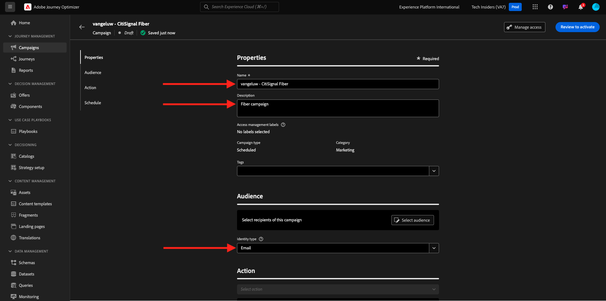
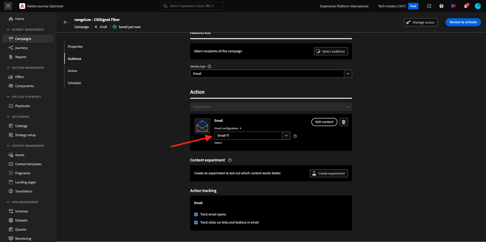
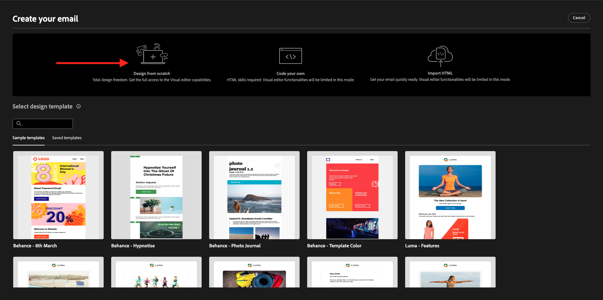
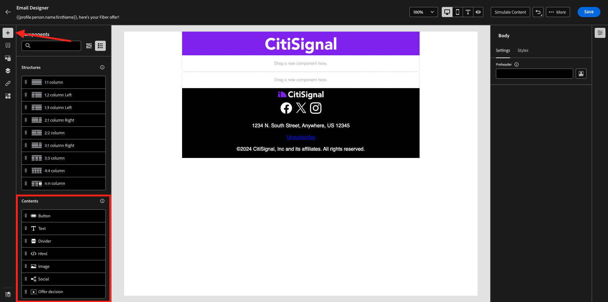
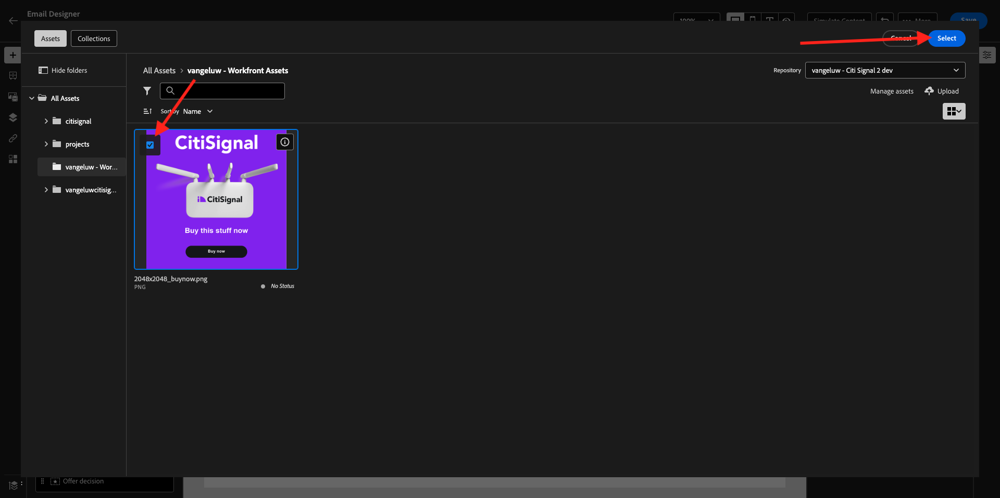

# 3.5.2 Create your Campaign

Go to [https://experience.adobe.com/](https://experience.adobe.com/). Click **Journey Optimizer**.


You'll be redirected to the **Home**  view in Journey Optimizer. First, make sure you're using the correct sandbox. The sandbox to use is called `--aepSandboxName--`.


>[!NOTE]
>
>In case you have already created your Header and Footer fragments as part of exercise [exercise 3.1.2.1](./../module3.1/ex2.md) and [exercise 3.1.2.2](./../module3.1/ex2.md), please jump forward to exercise 3.5.2.3 Create Fiber campaign. Do not create your Header and Footer fragments again.

## 3.5.2.1 Create your Header fragment

In the left menu, click **Fragments**. A Fragment is a reusable component within Journey Optimizer, which avoids duplication and facilitates future changes that should impact all messages, such as changes to a header or footer in an email message.

Click **Create fragment**.


Enter the name `--aepUserLdap-- - CitiSignal - Header` and select the **Type: Visual Fragment**. Click **Create**.


You'll then see this. In the left menu, you'll find the structure components that you can use to define the structure of the email (rows and columns).

Drag and drop a **1:1 column** from the menu into the canvas. This will be the placeholder for the logo image.


Next, you can use Content Components to add content inside these blocks. Drag and drop an **Image** component in the first cell on the first row. Click **Browse**.


You'll then see a popup opening, showing you your AEM Assets Media Library. Go to the folder **citi-signal-images**, click to select the image **CitiSignal-Logo-White.png** and click **Select**.

>[!NOTE]
>
>If you don't see the Citi Signal images in your AEM Assets Library, you can find them [here](../../../assets/ajo/CitiSignal-images.zip). Download them to your desktop, create the folder **citi-signal-images** and upload all the images in that folder.


You'll then see this. Your image is white, and isn't showing yet. You should now define a background color to make the image show correctly. Click **Styles**, then click the **Background color** box.


In the popup, change the **Hex** color code to **#8821F4** and then change focus by clicking into the **100%** field. You'll then see the new color applied to the image.


The image is also a bit to big right now. Let's change the width by sliding the **Width** switcher to **40%**.


Your header fragment is now ready. Click **Save** and then click the arrow to go back to the previous screen.


Your fragment needs to be published before it can be used. Click **Publish**.


After a couple of minutes, you'll see that you fragment's status has changed to **Live**. 
Next, you should create a new fragment for the footer of your email messages. Click **Create fragment**.


## 3.5.2.2 Create your Footer fragment

Click **Create fragment**.


Enter the name `--aepUserLdap-- - CitiSignal - Footer` and select the **Type: Visual Fragment**. Click **Create**.


You'll then see this. In the left menu, you'll find the structure components that you can use to define the structure of the email (rows and columns).

Drag and drop a **1:1 column** from the menu into the canvas. This will be the placeholder for the footer content.


Next, you can use Content Components to add content inside these blocks. Drag and drop an **HTML** component in the first cell on the first row. Click the component to select it and then, click the **</>** icon to edit the HTML source code.


You'll then see this.


Copy the below HTML code fragment and paste it in the **Edit HTML** window in Journey Optimizer.

```html
<!--[if mso]><table cellpadding="0" cellspacing="0" border="0" width="100%"><tr><td style="text-align: center;" ><![endif]-->
<table style="width: auto; display: inline-block;">
  <tbody>
    <tr class="component-social-container">
      <td style="padding: 5px">
        <a style="text-decoration: none;" href="https://www.facebook.com" data-component-social-icon-id="facebook">
        
        </a>
      </td>
      <td style="padding: 5px">
        <a style="text-decoration: none;" href="https://x.com" data-component-social-icon-id="twitter">
        
        </a>
      </td>
      <td style="padding: 5px">
        <a style="text-decoration: none;" href="https://www.instagram.com" data-component-social-icon-id="instagram">
         
        </a>
      </td>
    </tr>
  </tbody>
</table>
<!--[if mso]></td></tr></table><![endif]-->
```

You'll then have this. On lines 7, 12 and 17 you now need to insert a image file, using the assets in your AEM Assets library.


Make sure that your cursor is located on line 7, and then click **Assets** in the left menu. Click **Open asset selector** to select your image.


Open the folder **citi-signal-images** and click to select the image **Icon_Facebook.png**. Click **Select**.


Make sure that your cursor is located on line 12, and then click **Open asset selector** to select your image.


Open the folder **citi-signal-images** and click to select the image **Icon_X.png**. Click **Select**.


Make sure that your cursor is located on line 17, and then click **Open asset selector** to select your image.


Open the folder **citi-signal-images** and click to select the image **Icon_Instagram.png**. Click **Select**.


You'll then see this. Click **Save**.


You'll then be back in the editor. Your icons aren't visible yet because the background and the image files are all in white. To change the background color, go to **Styles** and click the **Background color** checkbox.


Change the **Hex** color code to **#000000**.


Change the alignment to be centered.

 

Let's add some other parts to the footer. Drag and drop an **Image** component above the HTML component you just created. Click **Browse**.

 

Click to select the image file **`CitiSignal_Footer_Logo.png`** and click **Select**.


Go to **Styles** and click the **Background color** checkbox, let's change it to black again. Change the **Hex** color code to **#000000**.

 

Change the width to **20%** and verify that the alignment is set to be centered.


Next, drag and drop a **Text** component under the HTML component you created. Click **Browse**.


Copy and paste the below text by replacing the placeholder text.

```

1234 N. South Street, Anywhere, US 12345

Unsubscribe

©2024 CitiSignal, Inc and its affiliates. All rights reserved.

```

Set the **Text alignment** to be centered.


Change the **Font color** to white, **#FFFFFF**.


Change the **Background color** to black, **#000000**.


Select the text **Unsubscribe** in the footer, and click the **Link** icon in the menu bar. Set the **Type** to **External Opt-out/Unsubscription** and set the url to **https://aepdemo.net/unsubscribe.html** (it's not allowed to have a blank URL for the unsubscribe link).


You'll then have this. Your footer is now ready. Click **Save** and then click the arrow to go back to the previous page.


Click **Publish** to publish your footer so it can be used in an email.


After a couple of minutes, you'll see that the status of your footer has changed to **Live**.


## 3.5.2.3 Create Fiber campaign

You'll now create a campaign. Unlike the event-based journey of the previous exercise which relies on incoming experience events or audience entries or exits to trigger a journey for 1 specific customer, campaigns target a whole audience once with unique content like newsletters, one-off promotions, or generic information or periodically with similar content sent on a regular basis like for instance birthday campaigns and reminders. 

In the menu, go to **Campaigns** and click **Create campaign**.


Select **Scheduled - Marketing** and click **Create**.


On the campaign creation screen, configure the following:

- **Name**: `--aepUserLdap-- - CitiSignal Fiber`.
- **Description**: Fiber campaign
- **Identity type**: change to Email



Scroll down to **Action**. For the **Action**, select **Email**. 


Then, select an existing **Email configuration**. You'll edit the content in a couple of minutes.



Scroll up to **Audience**. Click **Select audience**.


For the **Audience**, select the audience you created in [1.3.3 Create a federated composition](./../../datacollection/module1.3/ex3.md), which is named `--aepUserLdap-- - CitiSignal Eligible for Fiber`. Click **Save**.


Scroll down to **Schedule**. For the **Schedule**, choose **On a specific date and time** and set a time of choice.


You can now start creating the email message itself. Scroll up, and click **Edit content**.


You'll then see this. For the **Subject line**, use this: 

```
{{profile.person.name.firstName}}, here's your Fiber offer!
```

Next, click **Edit email body**.


Choose **Design from scratch**.



You'll then see this. In the left menu, you'll find the structure components that you can use to define the structure of the email (rows and columns).

Drag and drop 4 times a **1:1 column** on the canvas, which should give you this structure:


In the left menu, go to **Fragments**. Drag the header you created earlier onto the first component in the canvas. Drag the footer you created earlier onto the last component in the canvas.


Click the **+** icon in the left menu. Go to **Contents** to start adding content onto the canvas.



Drag and drop a **Text** component on the second row. 


Select the default text in that component **Please type your text here.** and replace it by the below text. Change the alignment to **Center alignment**.

```javascript

Hi {{profile.person.name.firstName}}

As a CitiSignal customer, you're in pole position to discover our new Fiber offering. Have a look at the below offer and update your contract!

Stay connected.

```


Drag and drop an **Image** component on the 3rd row. Click **Browse**.


Select the AEM Assets repository that you created as part of previous modules. That repository should be named `--aepUserLdap-- - Citi Signal dev`. Click to open the folder `--aepUserLdap-- - Workfront Assets`.


Click to select the image **2048x2048_buynow.png**, and click **Select**.



Your basic newsletter email is now ready. Click **Save**.


Go back to the campaign dashboard by clicking the **arrow** next to the subject line text in the top-left corner.


Click **Review to activate**.


You may then get this error. If that is the case, then you may need to wait up to 24 hours until the audience has been evaluated, and then try to activate your campaign again. You may also need to update the schedule of your campaign to run at a later time.


Click **Activate**.


Once activated, your campaign will then be scheduled to run.


You have finished this exercise.

## Next Steps

Go to [3.5.3 Add Languages to your Email](./ex3.md)

Go back to [Module 3.5](./ajotranslationsvcs.md){target="_blank"}

Go back to [All modules](./../../../overview.md){target="_blank"}
