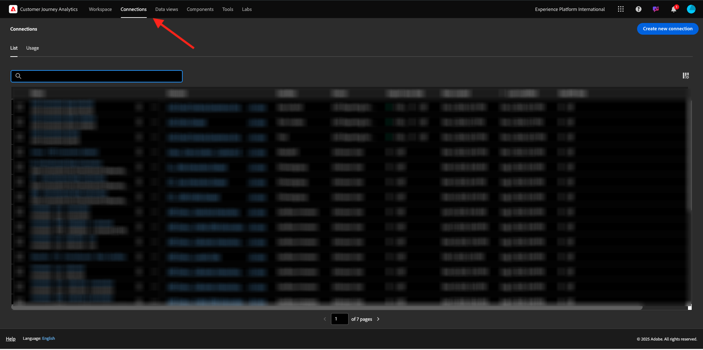
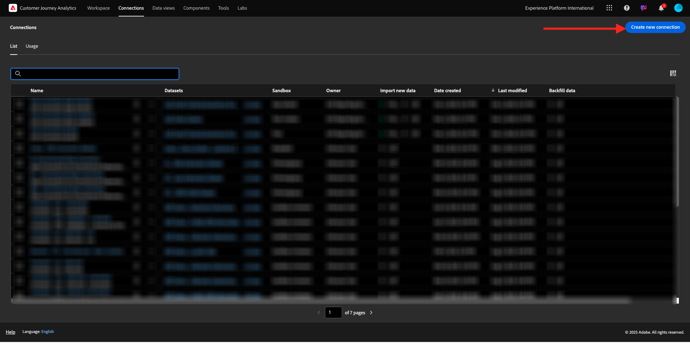
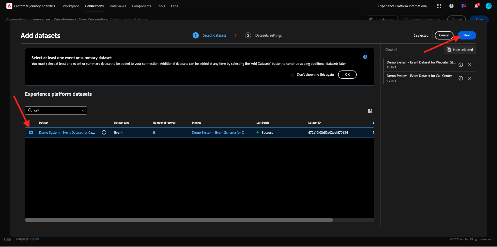
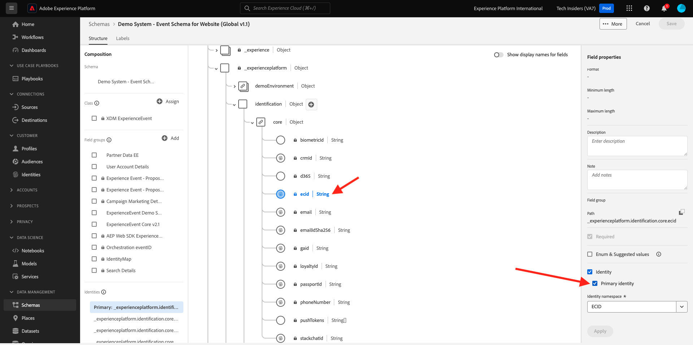
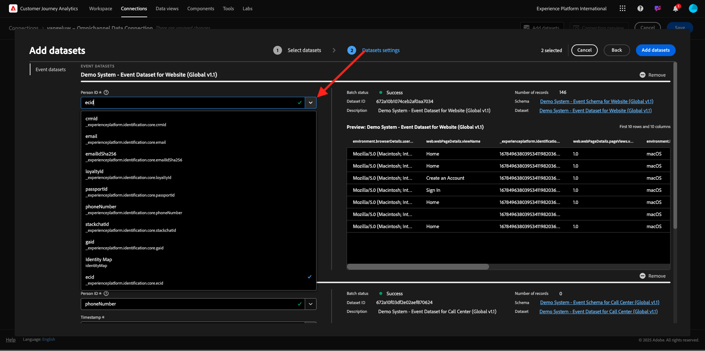
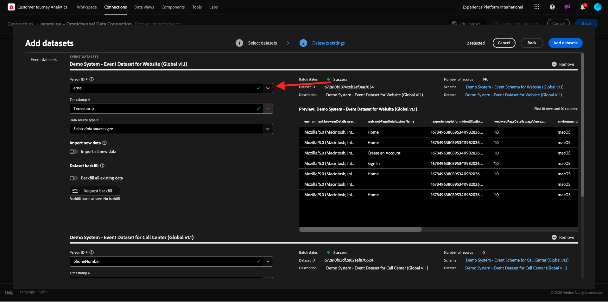
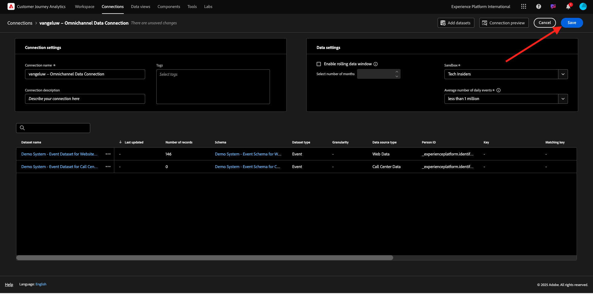

# 4.1.2 Connect Adobe Experience Platform Datasets in Customer Journey Analytics

## Objectives

- Understand the Data Connection UI
- Bring Adobe Experience Platform data into CJA
- Understand Person ID and data stitching
- Learn the concept of data streaming in Customer Journey Analytics

## 4.1.2.1 Connection

Go to [analytics.adobe.com](https://analytics.adobe.com) to access Customer Journey Analytics.

On the Customer Journey Analytics-homepage, go to **Connections**. 

Here you can see all the different connections made between CJA and Platform. These connections have the same goal as report suites in Adobe Analytics. However, the collection of the data is totally different. All data is coming from Adobe Experience Platform datasets. 

Let's create your first connection. Click **Create new connection**.

You'll then see the **Create Connection** UI.

You can now give a name to your connection. 

Please use this naming convention: `--aepUserLdap-- – Omnichannel Data Connection`. 

You also need to select the correct sandbox to use. In the sandbox menu, select your sandbox, which should be `--aepSandboxName--`. In this example, the sandbox is **Tech Insiders**. You also need to set the **Average number of daily events** to **less than 1 million**.

After selecting your sandbox, you can start adding datasets. Click **Add datasets**.

## 4.1.2.2 Select Adobe Experience Platform datasets

Search for the dataset `Demo System - Event Dataset for Website (Global v1.1)`. Enable the box for this dataset to add it to this connection.

Stay in the same screen, and now search and check the checkbox for `Demo System - Event Dataset for Call Center (Global v1.1)`. 

You'll then have this. Click **Next**.

## 4.1.2.3 Person ID and Data Stitching

### Person ID

The goal now is to join these datasets. For every dataset you selected, you’ll see a field called **Person ID**. Each dataset has its own Person ID field. 

As you can see, most of them have the Person ID selected automatically. This is because a Primary Identity is selected in every schema in Adobe Experience Platform. As an example, here's the schema for `Demo System - Event Schema for Website (Global v1.1)`, where you can see that the Primary Identity is set to `ecid`.

However, you can still influence which identifier will be used to stitch datasets together for your connection. You can use any identifier that is configured in the schema linked to your dataset. Click on the dropdown to explore the IDs available on each dataset.

As mentioned, you can set different Person IDs for each dataset. This allows you to bring different datasets from multiple origins together in CJA. Imagine bringing in NPS or survey data which would be very interesting and helpful to understand the context and why something has happened.

The name of the Person ID field isn't important, as long as the value in the Person ID fields correspond. Let say we have `email` in one dataset and `emailAddress` in another dataset defined as Person ID. If `delaigle@adobe.com` is the same value for the Person ID-field on both datasets, CJA will be able to stitch the data.

Review the CJA FAQs here to understand the nuances with identity stitching: [FAQ](https://experienceleague.adobe.com/docs/analytics-platform/using/cja-overview/cja-faq.html). 

### Stitching the data using the Person ID

Now that you understand the concept of stitching datasets using the Person ID, let's choose `email` as your Person ID for each dataset. 

Go to each dataset to update the Person ID. Now fill the field Person ID choosing the `email` on the dropdown list.

Once you have stitched the two datasets, you're ready to continue. 

|  dataset       | Person ID | 
| ----------------- |-------------| 
| Demo System - Event Dataset for Website (Global v1.1) | email         | 
| Demo System - Event Dataset for Call Center (Global v1.1) | email         | 

You also need to ensure that for both datasets, these options are enabled:

- Import all new data
- Backfill all existing data

(Don't forget to enable both these options for the second dataset)

You also need to select a **Data source type** for each dataset.

These are the settings for the dataset **Demo System - Event Dataset for Website (Global v1.1)**.

These are the settings for the dataset **Demo System - Event Dataset for Website (Global v1.1)**.

Click **Add datasets**.

Click **Save** and go to the next exercise. 

After having created your **Connection** it may take a few hours before your data is available in CJA.

Next Step: [4.1.3 Create a Data View](./ex3.md)

[Go Back to Module 4.1](./customer-journey-analytics-build-a-dashboard.md)

[Go Back to All Modules](./../../../overview.md)
