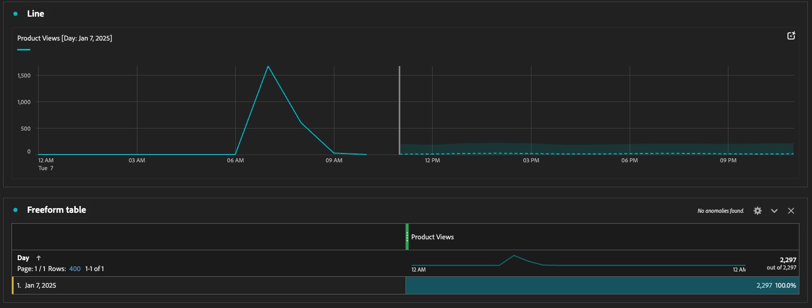
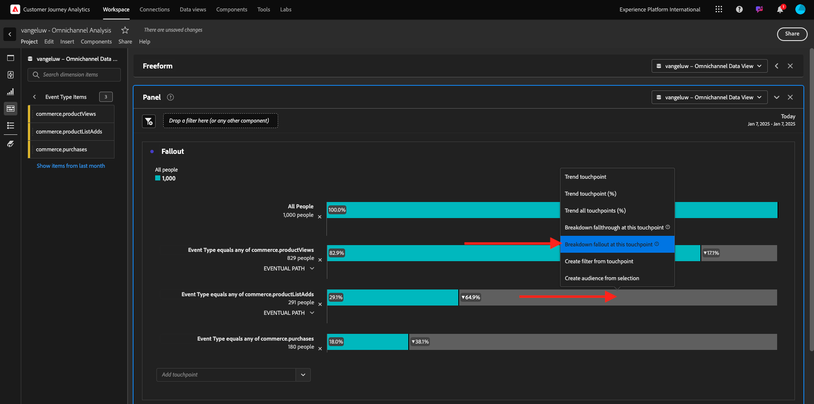

# 4.1.5 Visualization using Customer Journey Analytics

## Objectives

- Understand Analysis Workspace UI
- Learn some feature that make Analysis Workspace so different.
- Learn how to analyze in CJA using Analysis Workspace

## Context

In this exercises you will use Analysis Workspace within CJA to analyze product views, product funnels, churn etc.

We will cover some of the queries done in  Module 7 - Query Service so you can see how easy is to run the same queries and more but without using SQL and relying only on the drag and drop philosophy of Analysis Workspace.

Let's use the project you created in [11.4 Data Preparation in Analysis Workspace](./ex4.md), so go to [https://analytics.adobe.com](https://analytics.adobe.com).

Open your project `--aepUserLdap-- - Omnichannel Analysis`.

With your project opened and the Data View `--aepUserLdap-- - Omnichannel Analysis` selected, you're ready to start building your first visualizations.

## How many product views do we have on a daily basis

First of all, we need to select the right dates to analyze the data. Go to the calendar dropdown on the right side of the canvas. Click on it and select the applicable date range.

In the left side menu (components area), find the Calculated Metric **Product Views**. Select it and drag and drop it in to the canvas, on the top right within the freeform table.

Automatically the dimension **Day** will be added to create your first table. Now you can see your question answered on the fly. 

Next, right-click on the metric summary.

Click on **Visualize** and then select **Line** as visualization.

You’ll see your products views by day.  

You can change the time scope to day by clicking on **Settings** within the visualization.

Click on the dot next to **Line** to **Manage the Data Source**.

Next, click **Lock Selection** and select **Selected Items** to lock this visualization so that it always displays a timeline of Product Views.

## Top 5 Products Viewed

What are the top 5 products viewed?

Remember to save project every now and then.

|  OS        | Short cut   | 
| ----------------- |-------------| 
| Windows | Control + S          | 
| Mac | Command + S          |

Let's start finding the top 5 products viewed. In the left side menu, find the **Product Name** - Dimension.

Now drag and drop **Product Name** to replace the **Day** dimension:

This will be the result

Next, try to breakdown one of the products by Brand Name. Search for **brandName** and drag it under the first product name.

Next, do a breakdown using the User Agent. Search for **User Agent** and drag it under the brand name.

You'll then see this:

Finally you can add more visualizations. On the left side, under visualizations, search for `Donut`. Take `Donut`, drag-and-drop it on the canvas under the **Line** visualization.

Next, in the Table, select the first 5 **User Agent**  rows from the breakdown we did under **Google Pixel XL 32GB Black Smartphone** > **Citi Signal**. While selecting the 3 rows, hold the **CTRL** button (on Windows) or the **Command** button (on Mac).

You'll see the donut chart changed:

You can even adapt the design to be more readable, by making both the **Line** graph and the **Donut** graph a bit smaller so they can fit next to each other:

Click on the dot next to **Donut** to **Manage the Data Source**.
Next, click **Lock Selection** to lock this visualization so that it always displays a timeline of Product Views.

Find out more about visualizations using Analysis Workspace here: 

- [https://experienceleague.adobe.com/docs/analytics/analyze/analysis-workspace/visualizations/freeform-analysis-visualizations.html](https://experienceleague.adobe.com/docs/analytics/analyze/analysis-workspace/visualizations/freeform-analysis-visualizations.html)
- [https://experienceleague.adobe.com/docs/analytics/analyze/analysis-workspace/visualizations/t-sync-visualization.html](https://experienceleague.adobe.com/docs/analytics/analyze/analysis-workspace/visualizations/t-sync-visualization.html)

## Product Interaction funnel, from viewing to buying

There are many ways to solve this question. One of them is to use Product Interaction Type and use it on a freeform table. Another way is to use a **Fallout Visualization**. Let's use the last one as we want to visualize and analyze at the same time.

Close the current panel we have by clicking here:

Now add a new blank panel by clicking on **+ Add Blank Panel**.

Click the visualization **Fallout**.

Select the same date range as in the previous exercise.

You'll then see this.

Find the dimension **Event Type** under the components on the left side:

Click on the arrow to open the dimension:

You'll see all available Event Types. 

Select the item **commerce.productViews** and drag and drop it onto the **Add Touchpoint** field inside the **Fallout Visualization**.

Do the same with **commerce.productListAdds** and **commerce.purchases** and drop them onto the **Add Touchpoint** field inside the **Fallout Visualization**. Your visualization will now look like this:

You can do many things here. Some examples: compare over time, compare each step by device or compare by loyalty. However, if we want to analyze interesting things like why customers don't purchase after adding an item to their cart, we can use the best tool in CJA: right-click.

Right click on the touchpoint **commerce.productListAdds**. Then click on **Breakdown fallout at this touchpoint**.

A new freeform table will be created to analyze what the people did if they didn't purchase. 

Change the **Event Type** by **Page Name**, in the new freeform table, to see which pages they are going instead of the Purchase Confirmation Page.

## What do people do on the site before reaching the Cancel Service page?

Again, there are many ways to perform this analysis. Let's use the flow analysis to start the discovery part.

Close the current panel by clicking here:

Now add a new blank panel by clicking on **+ Add Blank Panel**.

Click the visualization **Flow**.

You'll then see this:

Select the same date range as in the previous exercise.

Find the dimension **Page Name** under the components on the left side:

Click on the arrow to open the dimension:

You'll find all pages viewed. Find the page name: **Cancel Service**.
Drag and drop **Cancel Service** into the Flow Visualization on the middle field:

You'll then see this:

Let's now analyze if customers who visited the **Cancel Service** page on the website also called the callcenter, and what the outcome was.

Under the dimensions, go back and then find **Call Interaction Type**.
Drag and drop **Call Interaction Type** to replace the first interaction on the right within the **Flow Visualization**. 

You're now seeing the support ticket of the customers that called the call center after visiting the **Cancel Service** page.

Next, under the dimensions, search for **Call Feeling**.  Drag and drop it to replace the first interaction on the right within the **Flow Visualization**.

You'll then see this:

As you can see, we have run an omnichannel analysis using the Flow Visualization. Thanks to that we have found it seems that some customers that were thinking of canceling their service, had a positive feeling after calling the callcenter. Have we maybe changed their minds with a promotion? 

## How are customers with a Positive Callcenter contact performing against the main KPIs?

Let's first segment the data to get only users with **positive** calls. In CJA, Segments are called Filters. Go to filters within the component area (on the left-side) and click **+**.

Inside the Filter builder, give a name to the filter

|  Name        | Description    | 
| ----------------- |-------------| 
| Call Feeling - Positive | Call Feeling - Positive          | 

Under the components (inside the Filter Builder), find **Call Feeling** and drag and drop it into the Filter Builder Definition.

Now select **positive** as value for the filter.

Change the scope to be **Person** level.

To finish, simply click **Save**.

You'll then be back here. If not done yet, close the previous panel.

Now add a new blank panel by clicking on **+ Add Blank Panel**.

Select the same date range as in the previous exercise.

Click on **Freeform table**.

Now drag and drop the filter you've just created.

Time to add some metrics. Start with **Product Views**. Drag and drop into the freeform table. You can also delete the **Events** metric.

Do the same with **People**,  **Add to Cart** and **Purchases**. You'll end up with a table like this.

Thanks to the first flow analysis, a new question came to mind. So we decided to create this table and check some KPIs against a segment to answer that question. As you can see, time to insight is much faster than using SQL or using other BI solutions.

## Customer Journey Analytics and Analysis Workspace recap

As you've learned in this lab, Analysis Workspace stitches data from all channels together to analyze the full customer journey. Also, remember that you can bring in data to the same workspace that is not stitched to the journey. 
It can be really useful to bring disconnected data into your analysis to give context to the journey. Some examples include things like NPS data, surveys, Facebook Ads events or offline interactions (non identified).

Next Step: [Summary & benefits](./summary.md)

[Go Back to Module 4.1](./customer-journey-analytics-build-a-dashboard.md)

[Go Back to All Modules](./../../../overview.md)
