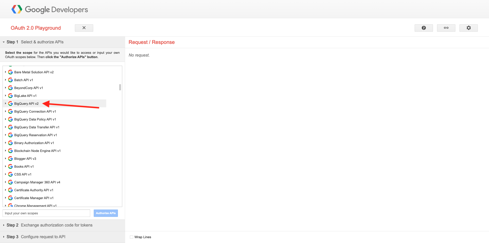
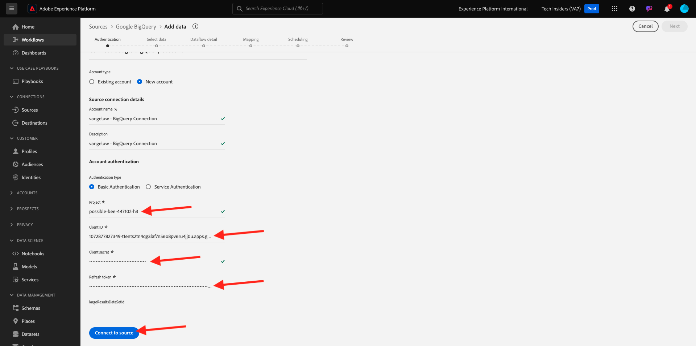

# 4.2.3 Connect GCP & BigQuery to Adobe Experience Platform

## Objectives

- Explore the API & Services within Google Cloud Platform 
- Be familiar with OAuth Playground for testing Google APIs 
- Create your first BigQuery connection in Adobe Experience Platform

## Context

Adobe Experience Platform provides a connector within **Sources** that will help you bring BigQuery datasets into Adobe Experience Platform. This data connector is based on the Google BigQuery API. Therefore, it's important to properly prepare your Google Cloud Platform and your BigQuery environment to receive API calls from Adobe Experience Platform.

To configure the BigQuery Source Connector in Adobe Experience Platform, you'll need these 4 values:

- project
- clientId
- clientSecret
- refreshToken

So far you only have the first one, the **Project ID**. This **Project ID** value is a random ID that was generated by Google when you created your BigQuery project during exercise 12.1. 

Please copy project id in a separated text file.

| Credential         | Naming| Example|   
| ----------------- |-------------| -------------|
| Project ID | random | possible-bee-447102-h3 |

You can check your Project ID any time by clicking on your **Project Name** in the top menu bar:

You'll see you Project ID on the right side:

In this exercise you'll learn how to get the other 3 required fields:

- clientId
- clientSecret
- refreshToken

## 4.2.3.1 Google Auth Platform

To start, please go back to the Google Cloud Platform home page. To do this, simply click on the logo in the top left-corner of your screen.

Once you are on the home page, search for **Google Auth Platform** in the search bar. Click the first result to open it.

You'll now see the **Google Auth Platform** homepage. Click **GET STARTED**.

For the **App name**, use this:

| Naming         | Example|    
| ----------------- |-------------| 
| `--aepUserLdap-- - AEP BigQuery Connector` | vangeluw - AEP BigQuery Connector | 

Seledct your email address for the field **User support email**.

Click **NEXT**.

Select **External** and click **NEXT**.

Enter your email address and click **NEXT**.

Check the checkbox and click **CONTINUE**. Then, click **CREATE**.

## 4.2.3.2 Create OAuth Client

Click **CREATE OAUTH CLIENT**.

You'll then see this. 

Select **Web application**.

Several new fields will pop up. You now need to enter the **Name** of the OAuth Client ID and also enter the **Authorised redirect URIs**. 

FOr the field **Name**, use this:

| Field         | Value  | Example  |   
| ----------------- |-------------| -------------| 
| Name | ldap - AEP BigQuery Connector  |  vangeluw - Platform BigQuery Connector  |

Click **+ ADD URI** under **Authorised redirect URIs**. Add the below new URI. 

| Field         | Value  |   
| ----------------- |-------------| 
| Authorised redirect URIs | https://developers.google.com/oauthplayground | 

The **Authorised redirect URIs** field is a very important field because you'll need it later to get the RefreshToken you need to finish the setup of the BigQuery Source Connector in Adobe Experience Platform.

Click **Create**.

Your OAuth Client ID is now created. Click it to see now your Client ID and your Client Secret.

You'll then see the values for Client ID and Client Secret.

Please copy these two fields and paste them in a text file on your desktop. You can always access these credentials at a later stage, but it's easier if you save them in a text file next to your BigQuery Project ID.

As recap for your BigQuery Source Connector setup in Adobe Experience Platform, you now have these values already available:

| BigQuery Connector Credentials         | Value |  
| ----------------- |-------------| 
| Project ID | your own Project ID (ex.: possible-bee-447102-h3)| 
| clientid | yourclientid| 
| cilentsecret | yourclientsecret |

Next, you need to publish your OAuth app. Go to **Audience** and click **PUBLISH APP**.

Click **CONFIRM**.

You're still missing the **refreshToken**. The refreshToken is a requirement because of security reasons. In the world of APIs, tokens typically expire every 24 hours. So the **refreshToken** is needed to refresh the security token every 24 hours, so that your Source Connector setup can keep connecting to Google Cloud Platform and BigQuery.

## 4.2.3.3 BigQuery API and the refreshToken

There are many ways to get a refreshToken to access Google Cloud Platform APIs. One of these options is for instance using Postman.
However, Google has built something easier to test and play with their APIs, a tool called **OAuth 2.0 Playground**.

To access **OAuth 2.0 Playground**, go to [https://developers.google.com/oauthplayground](https://developers.google.com/oauthplayground).

You'll then see the **OAuth 2.0 Playground** homepage.

Click on the **gear** icon in the top right side of your screen. Make sure your settings are the same as what you can see in the image above.

Check the checkbox: **Use your own OAuth credentials**

Two fields will appear.

Please fill the fields following this table:

| Playground API settings         | Your Google API credentials |  
| ----------------- |-------------| 
| OAuth Client ID | your own Client ID (in the text file on your desktop) | 
| OAuth Client Secret | your own Client Secret (in the text file on your desktop) | 

Once you've fill out your credentials, please click **Close**.

In the left menu, you can see all available Google APIs. Search for **BigQuery API v2** and click it to open it.

Next, select the scope as indicated in the below image. You need to click each of the available APIs, and a checkmark will be shown for each selected API.

Next, cliclk **Authorize APIs**.

Click the email address you used for setting up GCP and BigQuery.

You'll then see a big warning: **This app isn't verified**. This is happening because your Platform BigQuery Connector hasn't been formally reviewed yet, so Google doesn't know if it's an authentic app or not. 

Click **Advanced**.

Next, click on **Go to --aepUserLdap-- - AEP BigQuery Connector (unsafe)**.

You'll then see a security prompt for access. Click **Select all**.

Scroll down and click **Continue**.

You'll now be sent back to the OAuth 2.0 Playground and you'll see this. Click **Exchange authorization code for tokens**. 

After a couple of seconds, the **Step 2 - Exchange authorization code for tokens** view will automatically close, and you'll see **Step 3 - Configure request to API**.

You have to go back to **Step 2 Exchange authorization code for tokens**, so click on **Step 2 Exchange authorization code for tokens** again to visualize the **Refresh token**.

You'll now see the **Refresh token**. 

Copy the **Refresh token** and paste it in the text file on your desktop along with the other BigQuery Source Connector Credentials:

| BigQuery Source Connector Credentials         | Value |  
| ----------------- |-------------| 
| Project ID | your own random Project ID (ex.: apt-summer-273608)| 
| clientid | yourclientid| 
| cilentsecret | yourclientsecret | 
| refreshtoken | yourrefreshtoken | 

Next, let's setup your Source Connector in Adobe Experience Platform.

## 4.2.3.5 - Connect Platform with your own BigQuery table

Log in to Adobe Experience Platform by going to this URL: [https://experience.adobe.com/platform](https://experience.adobe.com/platform).

After logging in, you'll land on the homepage of Adobe Experience Platform.

Before you continue, you need to select a **sandbox**. The sandbox to select is named ``--aepSandboxName--``. After selecting the appropriate sandbox, you'll see the screen change and now you're in your dedicated sandbox.

In the left menu, go to Sources. You'll then see the **Sources** homepage. In the **Sources** menu, click on **Databases**. Click the **Google BigQuery** card. Next, click **Set up**.

You should now create a new connection. 

Click **New account**. You now need to fill out all the below fields, based on the setup you did in GCP and BigQuery. 

Let's start by naming the connection:

Please use this naming convention:

| BigQuery Connector Credentials         | Value  | Example  |   
| ----------------- |-------------| -------------| 
| Account Name | `--aepUserLdap-- - BigQuery Connection`  |  vangeluw - BigQuery Connection  |
| Description | `--aepUserLdap-- - BigQuery Connection` | vangeluw - BigQuery Connection  | 

You'll then have this:

Next, fill out the GCP and BigQuery API **Account Authentication**-details that you stored in a text-file on your desktop:

| BigQuery Connector Credentials         | Value |  
| ----------------- |-------------| 
| Project ID | your own random Project ID (ex.: possible-bee-447102-h3)| 
| clientId | ...| 
| cilentSecret | ... | 
| refreshToken | ... | 

Your **Account Authentication**-details should now look like this. Click **Connect to source**.

If your **Account Authentication** details were correctly filled out, you should now see a visual confirmation that the connection is working properly, by seeing the **Connected** confirmation. Click **Next**.

You will now see the BigQuery dataset you created in the previous exercise. 

Well done! In the next exercise, you'll load data from that table and map it against a schema and dataset in Adobe Experience Platform.

Next Step: [4.2.4 Load data from BigQuery into Adobe Experience Platform](./ex4.md)

[Go Back to Module 4.2](./customer-journey-analytics-bigquery-gcp.md)

[Go Back to All Modules](./../../../overview.md)
