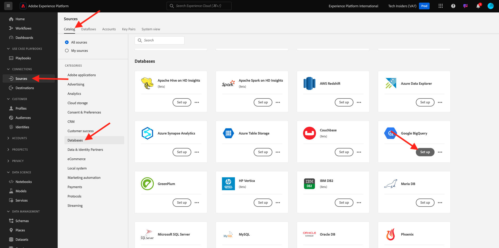
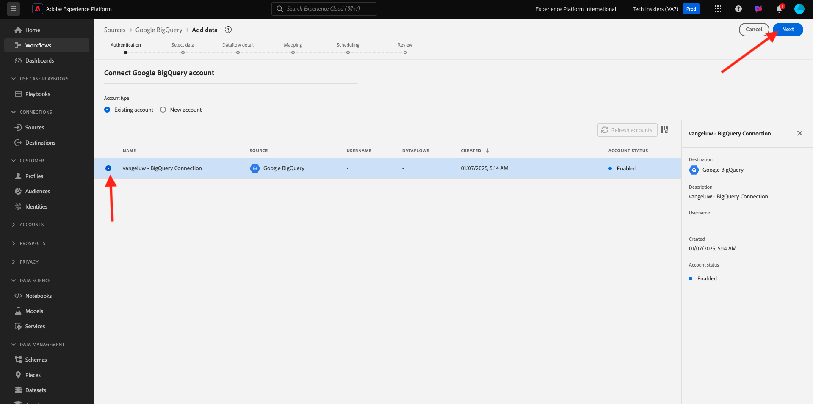
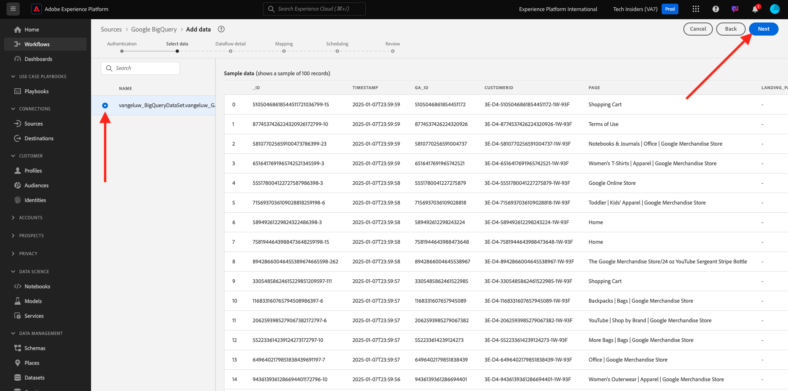
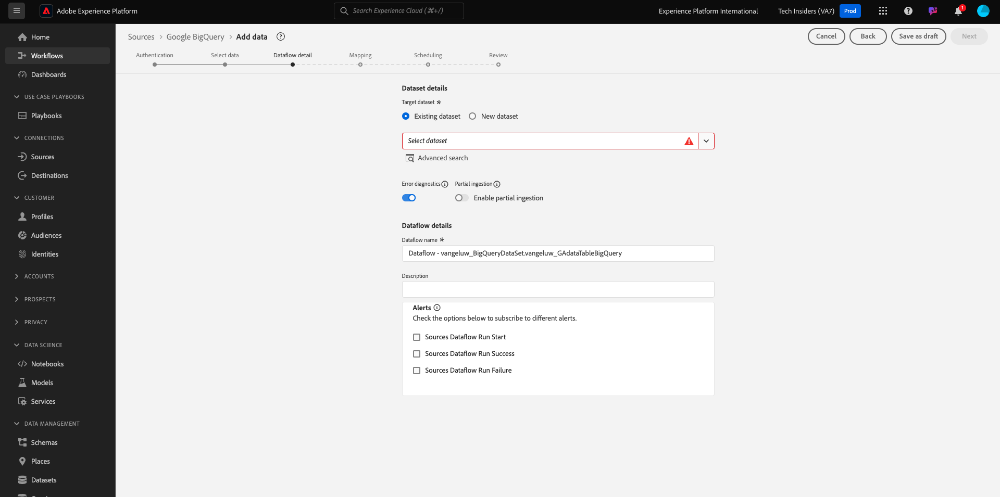
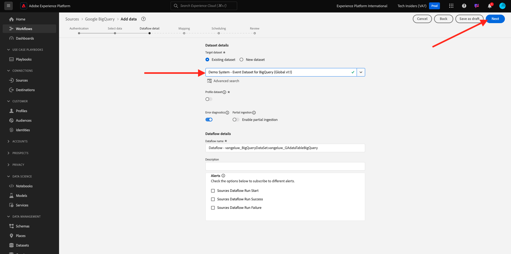
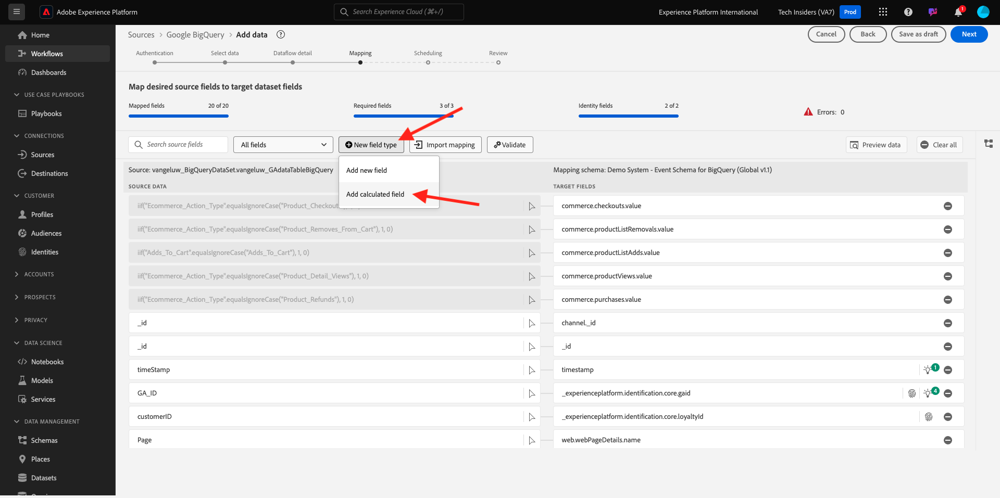
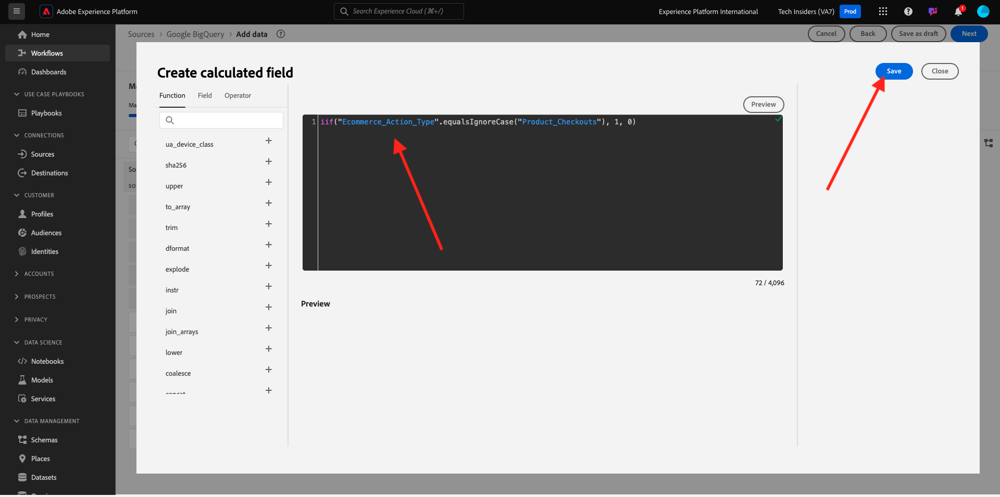
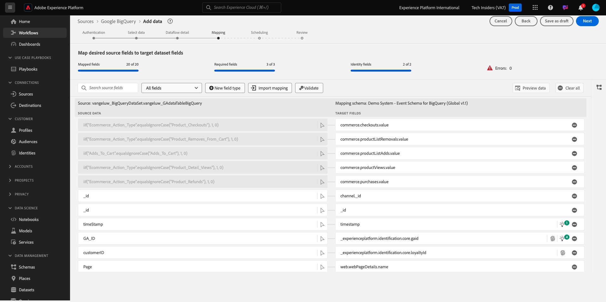
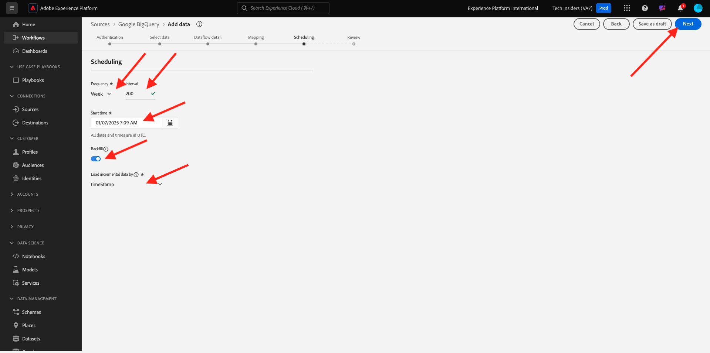
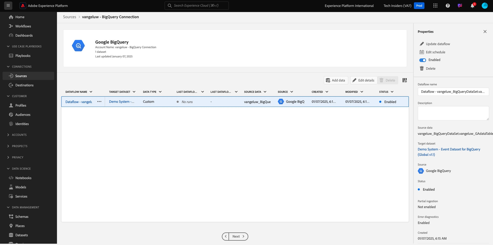

# 4.2.4 Load data from BigQuery into Adobe Experience Platform

## Objectives

- Map BigQuery data to an XDM schema
- Load BigQuery data into Adobe Experience Platform
- Become familiar with the BigQuery Source Connector UI

## Before you start

After the previous exercise, you should have this page open in Adobe Experience Platform:

**If you have it open, continue with the next exercise.**

**If you don't have it open, go to [Adobe Experience Platform](https://experience.adobe.com/platform/home).**

In the left menu, go to Sources. You'll then see the **Sources** homepage. In the **Sources** menu, go to the **Google BigQuery** source connector and click **Set up**.

You'll then see the Google BigQuery Account selection screen. Select your account and click **Next**.

You'll then see the **Select data** screen.

## 4.2.4.1 BigQuery Table Selection

In the **Select data** screen, select your BigQuery dataset. You can now see a sample data preview of the Google Analytics data in BigQuery. 

Click **Next**.

## 4.2.4.2 XDM mapping

You'll now see this:

You now have to either create a new dataset or select an existing dataset to load the Google Analytics data into. For this exercise, a dataset and schema have already been created. You do not need to create a new schema or dataset.

Select **Existing dataset**. Open the dropdown menu to select a dataset. Search for the dataset named `Demo System - Event Dataset for BigQuery (Global v1.1)` and select it. Click **Next**.

Scroll down. You now need to map every **Source Field** from Google Analytics/BigQuery to an XDM **Target Field**, field by field. You may see a number of errors, which will be addressed by the below mapping exercise.

Use the below mapping table for this exercise.

| Source Field        | Target Field |   
| ----------------- |-------------| 
| `_id` | `_id` | 
| `_id` | channel._id | 
| `timeStamp` | timestamp | 
| `GA_ID` | ``--aepTenantId--``.identification.core.gaid | 
| `customerID` | ``--aepTenantId--``. identification.core.crmId | 
| `Page` | web.webPageDetails.name | 
| `Device` | device.type | 
| `Browser` | environment.browserDetails.vendor| 
| `MarketingChannel` | marketing.trackingCode | 
| `TrafficSource` | channel.typeAtSource | 
| `TrafficMedium` | channel.mediaType | 
| `TransactionID` | commerce.order.payments.transactionID | 
| `Ecommerce_Action_Type` | eventType | 
| `Pageviews` | web.webPageDetails.pageViews.value| 

For some fields, you need to remove the original mapping and create a new one, for a **Calculated Field**.

| Calculated Field        | Target Field |   
| ----------------- |-------------| 
| `iif(Unique_Purchases == null, 0, Unique_Purchases)` | commerce.purchases.value | 
| `iif(Product_Detail_Views == null, 0, Product_Detail_Views)` | commerce.productViews.value | 
| `iif(Adds_To_Cart == null, 0, Adds_To_Cart)` | commerce.productListAdds.value | 
| `iif(Product_Removes_From_Cart == null, 0, Product_Removes_From_Cart), 1, 0)` | commerce.productListRemovals.value | 
| `iif(Product_Checkouts == null, 0, Product_Checkouts)` | commerce.checkouts.value | 

To create a **Calculated Field**, click **+ New field type** and then click **Calculated field**.

Paste the above rule and click **Save** for each of the fields in the above table.

You now have a **Mapping** like this one.

The source fields **GA_ID** and **customerID** are mapped to an Identifier in this XDM Schema. This will allow you to enrich Google Analytics data (web/app behavior data) with other datasets such as Loyalty or Call Center-data.

Click **Next**.

## 4.2.4.3 Connection and the data ingestion scheduling

You'll now see the **Scheduling** tab:

In the **Scheduling** tab, you are able to define a frequency for the data ingestion process for this **Mapping** and data. 

As you're using demo data in Google BigQuery that won't be refreshed, there's no real need for setting a schedule in this exercise. You do have to select something, and to avoid too many useless data ingestion processes, you need to set the frequency like this:

- Frequency: **Week**
- Interval: **200**
- Start time: **any time in the next hour**

**Important**: be sure you activate the **Backfill** switch.

Last but not least, you must define a **delta** field. 

The **delta** field is used to schedule the connection and upload only new rows that come into your BigQuery dataset. A delta field is typically always a timestamp column. So for future scheduled data ingestions, only the rows with a new, more recent timestamp will be ingested.

Select **timeStamp** as the delta field.
Click **Next**.

## 4.2.4.4 Review and launch connection

You now see a detailed overview of your connection. Make sure everything is correct before you continue, as some settings can't be changed anymore afterwards, like for instance the XDM mapping.

Click **Finish**.

Once the connection has been created, you'll see this:

You're now ready to continue with the next exercise, in which you'll use Customer Journey Analytics to build powerful visualizations on top of Google Analytics data.

Next Step: [4.2.5 Analyze Google Analytics Data using Customer Journey Analytics](./ex5.md)

[Go Back to Module 4.2](./customer-journey-analytics-bigquery-gcp.md)

[Go Back to All Modules](./../../../overview.md)
