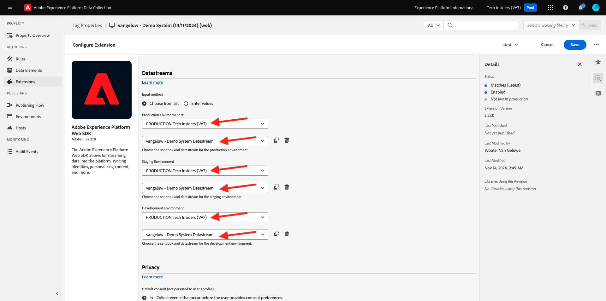
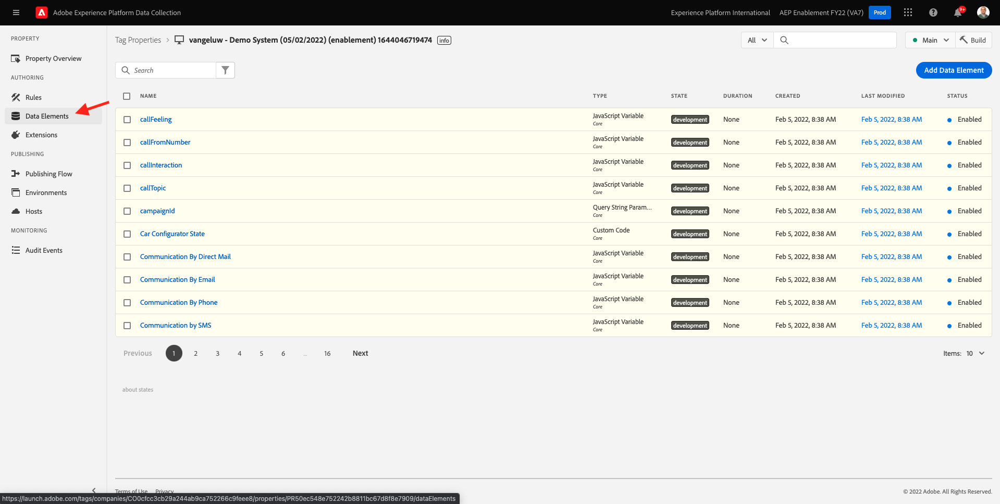
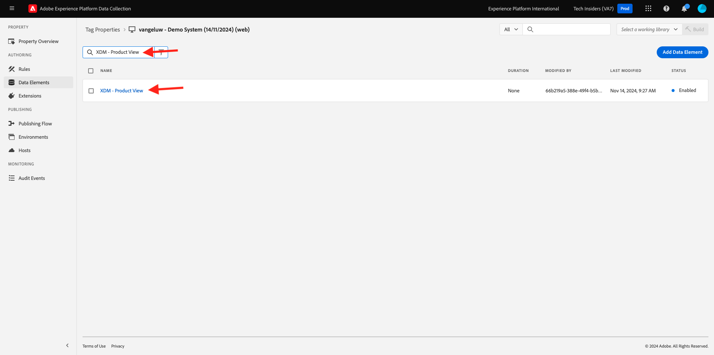
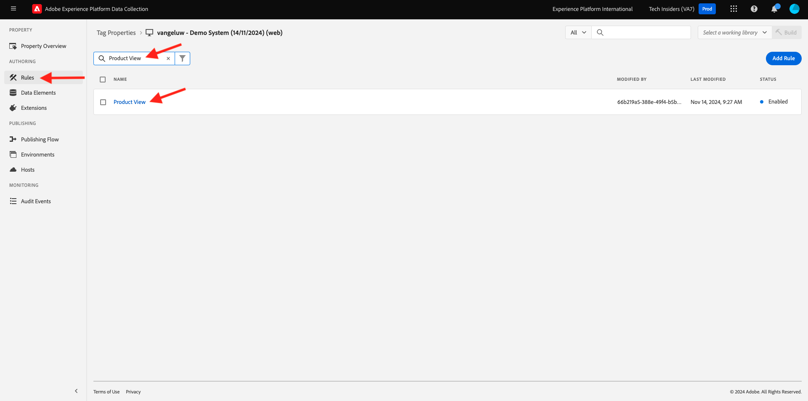
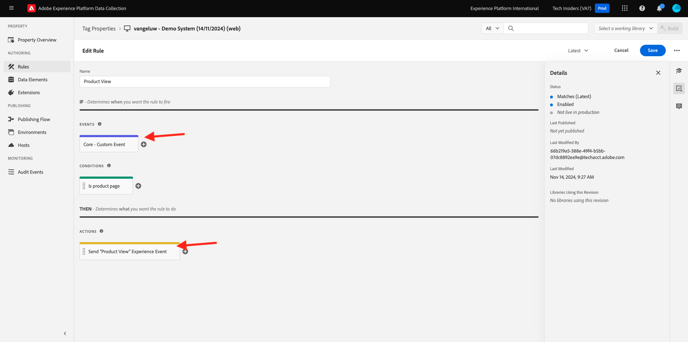
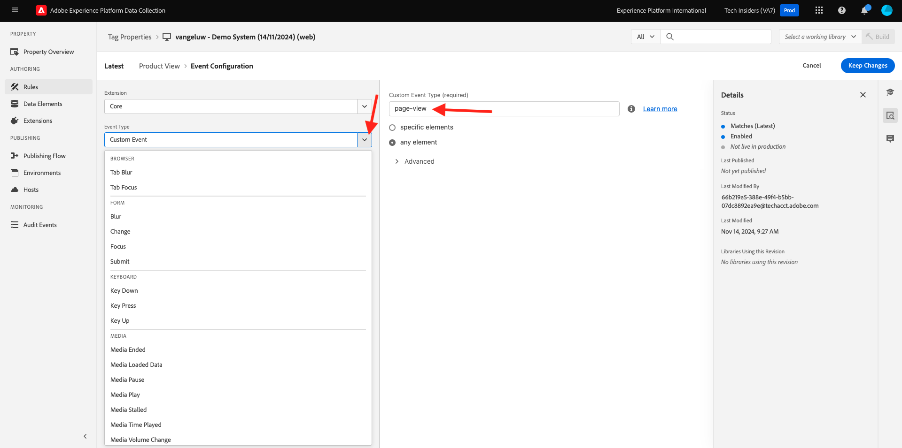
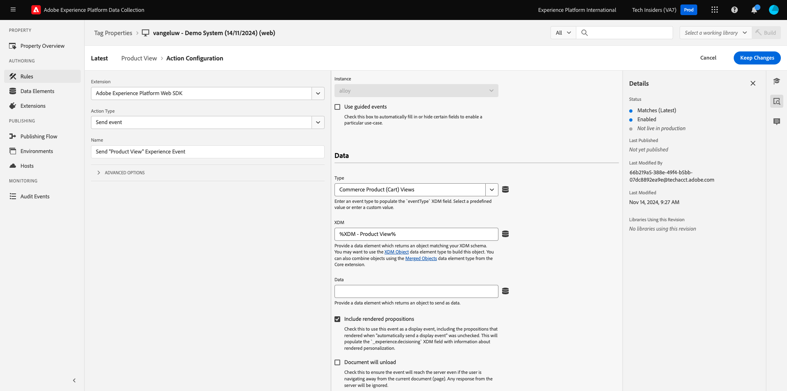
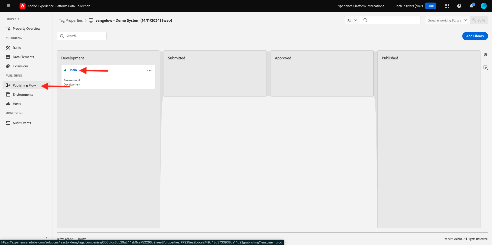
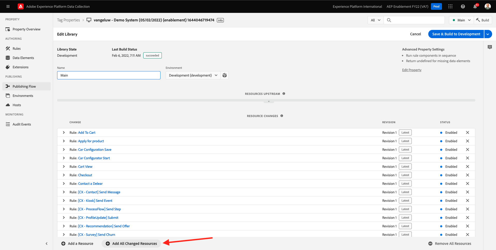
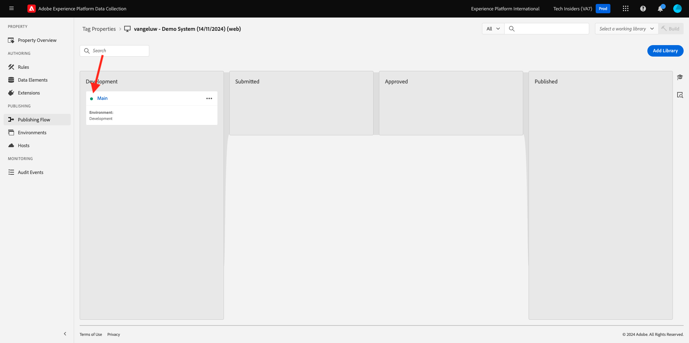

# 1.1.3 - Introduction to Adobe Experience Platform Data Collection

## Context

Now let's take a deeper look at the building blocks of Adobe Experience Platform Data Collection, to understand what is installed on your demo website. You will have a closer look at the Adobe Experience Platform Web SDK Extension, you'll configure a data element and a rule and you'll learn how to publish a library.

## 1.1.3.1 - Adobe Experience Platform Web SDK Extension

An extension is a packaged set of code that extends the Adobe Experience Platform Data Collection interface and the library functionality. Adobe Experience Platform Data Collection is the platform, and extensions are like apps that run on the platform. All of the extensions used in the tutorial are created and managed by Adobe, but 3rd-parties can create their own extensions to limit the amount of custom code Adobe Experience Platform Data Collection users have to manage.

Go to [Adobe Experience Platform Data Collection](https://experience.adobe.com/launch/) and select **Tags**.

This is the Adobe Experience Platform Data Collection Properties page you saw before.

 

In **Getting Started**, Demo System created two Client properties for you: one for the website and one for the mobile app. Find them by searching for `--aepUserLdap--` in the **[!UICONTROL Search]** box.
Click to open the **Web** property.

You'll then see the Property Overview page. Click on **[!UICONTROL Extensions]** in the left rail, then click on **Adobe Experience Platform Web SDK** and then click **[!UICONTROL Configure]**.

Welcome to the the Adobe Experience Platform Web SDK! Here you can configure the extension with the Datastream you created in [Getting Started](./../../../modules/gettingstarted/gettingstarted/ex2.md) as well as some more advanced configuration.

The default edge domain is always **edge.adobedc.net**. If you've implemented a CNAME configuration in your Adobe Experience Cloud or Adobe Experience Platform environment, you'll need to update the **[!UICONTROL Edge Domain]**. 

If your instance's edge domain is different from default one, please update the edge domain here. If you're not sure, use the default domain. An edge domain makes it possible to configure a 1st party tracking server, which then uses a CNAME configuration in the backend to ensure data is collected into Adobe.

Under **[!UICONTROL Datastreams]**, you already selected your datastream in the **Getting Started** section. You selected this datastream: `--aepUserLdap-- - Demo System Datastream`, from the list in the **[!UICONTROL Datastream]** box, for each of the environments.

Click **[!UICONTROL Save]** to go back to the Extensions view.

## 1.1.3.2 Data Elements

Data elements are the building blocks for your data dictionary (or data map). Use data elements to collect, organize, and deliver data across marketing and ad technology.

A single data element is a variable whose value can be mapped to query strings, URLs, cookie values, JavaScript variables, and so on. You can reference this value by its variable name throughout Adobe Experience Platform Data Collection. This collection of data elements becomes the dictionary of defined data that you can use to build your rules (events, conditions, and actions). This data dictionary is shared across all of Adobe Experience Platform Data Collection for use with any extension you've added to your property.

You're now going to edit an already existing data element in a Web SDK Friendly format.

Click on Data Elements in the left rail to be taken to the Data Elements page.

>[!NOTE]
>
>You're only editing a data element in this exercise, but you can see the **[!UICONTROL Add Data Element]** button on this page, which would be used to add a new variable to the data dictionary. This could then be used throughout Adobe Experience Platform Data Collection. Feel free to look at some of the other already existing data elements, mostly using local storage as the data source.

In the search bar, type **XDM - Product View** and click on the Data Element it returns.

This screen shows the XDM Object you'll be editing. The Experience Data Model (XDM) is a concept that will be explored much further throughout this Technical Tutorial, but for now it's enough to understand it as the format which the Adobe Experience Platform Web SDK requires. You'll be adding a bit more information to the data collected on Article pages of the demo website.

Click the plus button next to **web** at the bottom of the tree.

Click the plus button next to **webPageDetails**.

Click on **siteSection**. You now see that **siteSection** isn't linked to any data element yet. Let's change that.

Scroll up, and enter the text `%Product Category%`. Click **[!UICONTROL Save]**.

At this point, the Adobe Experience Platform Web SDK Extension is installed and you've updated a data element to collect data against an XDM structure. Next, let's check the rules that will send data at the correct time.

## 1.1.3.3 Rules

Adobe Experience Platform Data Collection is a rule-based system. It looks for user interaction and associated data. When the criteria outlined in your rules are met, the rule triggers the extension, script, or client-side code you identified.

Build rules to integrate the data and functionality of marketing and ad tech that unifies disparate products into a single solution.

Let's break-down the rule that sends data on Article pages.

Click on **[!UICONTROL Rules]** in the left rail.

**[!UICONTROL Search]** for `Product View`.

Click on the rule that is returned.

Let's have a look at the individual elements that make up this rule. 

For all rules: If a specified **[!UICONTROL Event]** occurs, the **[!UICONTROL Conditions]** are evaluated, then the specified **[!UICONTROL Actions]** take place if needed.

Click on the Event **Core - Custom Event**. This is the view that loads.

Click on the **Event Type** drop down.

This lists some of the standard interactions you can use to signal Adobe Experience Platform Data Collection to run the actions, should the conditions be true.

Click **[!UICONTROL Cancel]** to go back to the Rule.

Click on the Action **Send "Product View" Experience Event**.

Here you can see the data that's being sent to the edge by the Adobe Experience Platform Web SDK. More specifically, this is using the **alloy** **[!UICONTROL Instance]** of the Web SDK. The event **[!UICONTROL Type]** is set to **Commerce Product (Cart) Views** and the XDM Data you're sending is the **XDM - Product View** data element you changed earlier.

Now that you've looked at the Rule, you can publish all your changes in Adobe Experience Platform Data Collection.

## 1.1.3.4 Publish in a Library

Finally, in order to validate the rule and data element you just updated, you need to publish a library containing the edited items in our property. There are a few quick steps you need to take in the **[!UICONTROL Publishing]** section of Adobe Experience Platform Data Collection.

Click **[!UICONTROL Publishing Flow]** in the left navigation

Click on the existing library, called **Main**.

Click the **Add All Changed Resources** button. Next, 
Click the **Save & Build for Development** button.

The library may take a few minutes to build and when it is complete it will display a green dot to the left of the library name.

As you can see on the Publishing Flow screen, there is a lot more to the publishing process in Adobe Experience Platform Data Collection which is beyond the scope of this tutorial. We are just going to use a single library in our Development environment.

Next Step: [1.1.4 Client-side Web Data Collection](./ex4.md)

[Go Back to Module 1.1](./data-ingestion-launch-web-sdk.md)

[Go Back to All Modules](./../../../overview.md)
