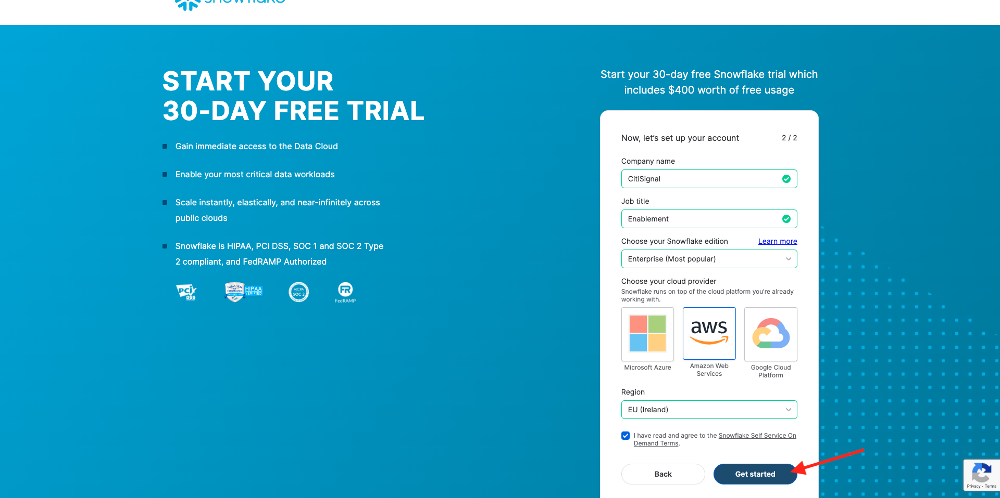
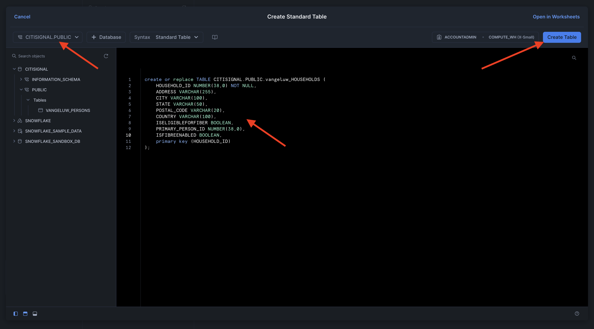
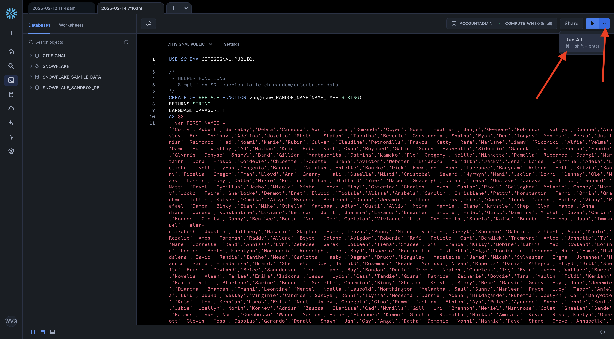
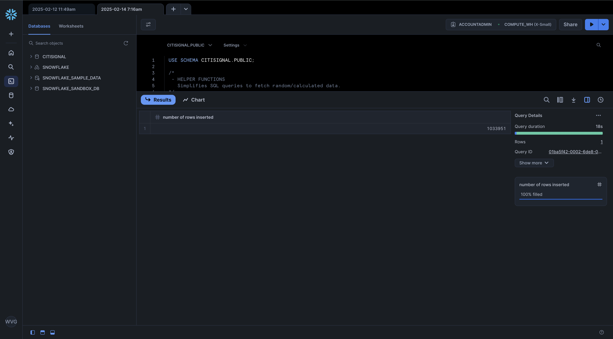

# 1.3.1 Setup your Snowflake environment

## 1.3.1.1 Create your account

Go to [https://snowflake.com](https://snowflake.com). Click **START FOR FREE**.


Enter your details and click **Continue**.


Enter your details, choose your cloud provider and click **Get started**.



Enter your details or click **Skip** (x2).


You'll then see this. Check your email and click the confirmation email that was sent to you.


Click the link in the confirmation email to activate your account, define your user name and password. Click **Get Started**. You'll need to use this user name and password in the next exercise.


You'll then be logged in to Snowflake. Click **Skip for now**.


## 1.3.1.2 Create your database

Go to **Data > Databases**. Click **+ Database**.


Use the name **CITISIGNAL** for your database. Click **CREATE**.


## 1.3.1.3 Create your tables

You can now start creating your tables in Snowflake. You'll find scripts below to run to create your tables.

### Table `--aepUserLdap--_PERSONS`

Click **+ Create**, then click **Table** and then click **Standard**.


You'll then see this. Copy the below query and paste it in Snowflake. Make sure to select the **CITISIGNAL** database in the top left corner of your screen before creating your table.

```sql
create or replace TABLE CITISIGNAL.PUBLIC.--aepUserLdap--_PERSONS (
	PERSON_ID NUMBER(38,0) NOT NULL,
	NAME VARCHAR(255),
	AGE NUMBER(38,0),
	EMAIL VARCHAR(255),
	PHONE_NUMBER VARCHAR(20),
	GENDER VARCHAR(10),
	OCCUPATION VARCHAR(100),
	ISMOBILESUB BOOLEAN,
	primary key (PERSON_ID)
);
```

Click **Create Table**.


Once the script has run, you can find your table under **Databases > CITISIGNAL > PUBLIC**.


### Table `--aepUserLdap--_HOUSEHOLDS`

Click **+ Create**, then click **Table** and then click **Standard**.


You'll then see this. Copy the below query and paste it in Snowflake. Make sure to select the **CITISIGNAL** database in the top left corner of your screen before creating your table.

```sql
create or replace TABLE CITISIGNAL.PUBLIC.--aepUserLdap--_HOUSEHOLDS (
	HOUSEHOLD_ID NUMBER(38,0) NOT NULL,
	ADDRESS VARCHAR(255),
	CITY VARCHAR(100),
	STATE VARCHAR(50),
	POSTAL_CODE VARCHAR(20),
	COUNTRY VARCHAR(100),
	ISELIGIBLEFORFIBER BOOLEAN,
	PRIMARY_PERSON_ID NUMBER(38,0),
	ISFIBREENABLED BOOLEAN,
	primary key (HOUSEHOLD_ID)
);
```

Click **Create Table**.



Once the script has run, you can find your table under **Databases > CITISIGNAL > PUBLIC**.


### Table `--aepUserLdap--_USERS`

Click **+ Create**, then click **Table** and then click **Standard**.


You'll then see this. Copy the below query and paste it in Snowflake. Make sure to select the **CITISIGNAL** database in the top left corner of your screen before creating your table.

```sql
create or replace TABLE CITISIGNAL.PUBLIC.--aepUserLdap--_USERS (
	USER_ID NUMBER(38,0) NOT NULL,
	PERSON_ID NUMBER(38,0),
	HOUSEHOLD_ID NUMBER(38,0),
	primary key (USER_ID),
	foreign key (PERSON_ID) references CITISIGNAL.PUBLIC.--aepUserLdap--_PERSONS(PERSON_ID),
	foreign key (HOUSEHOLD_ID) references CITISIGNAL.PUBLIC.--aepUserLdap--_HOUSEHOLDS(HOUSEHOLD_ID)
);
```

Click **Create Table**.


Once the script has run, you can find your table under **Databases > CITISIGNAL > PUBLIC**.


### Table `--aepUserLdap--_MONTHLY_DATA_USAGE`

Click **+ Create**, then click **Table** and then click **Standard**.


You'll then see this. Copy the below query and paste it in Snowflake. Make sure to select the **CITISIGNAL** database in the top left corner of your screen before creating your table.

```sql
create or replace TABLE CITISIGNAL.PUBLIC.--aepUserLdap--_MONTHLY_DATA_USAGE (
	USAGE_ID NUMBER(38,0) NOT NULL autoincrement start 1 increment 1 noorder,
	USER_ID NUMBER(38,0),
	MONTH DATE,
	DATA_USAGE_GB NUMBER(10,2),
	primary key (USAGE_ID)
);
```

Click **Create Table**.


Once the script has run, you can find your table under **Databases > CITISIGNAL > PUBLIC**.


### Table `--aepUserLdap--_MOBILE_DATA_USAGE`

Click **+ Create**, then click **Table** and then click **Standard**.


You'll then see this. Copy the below query and paste it in Snowflake. Make sure to select the **CITISIGNAL** database in the top left corner of your screen before creating your table.


```sql
create or replace TABLE CITISIGNAL.PUBLIC.--aepUserLdap--_MOBILE_DATA_USAGE (
	USAGE_ID NUMBER(38,0) NOT NULL autoincrement start 1 increment 1 noorder,
	USER_ID NUMBER(38,0),
	DATE DATE,
	TIME TIME(9),
	APP_NAME VARCHAR(255),
	DATA_USAGE_MB NUMBER(10,2),
	NETWORK_TYPE VARCHAR(50),
	DEVICE_TYPE VARCHAR(50),
	COUNTRY_CODE VARCHAR(10),
	primary key (USAGE_ID)
);
```

Click **Create Table**.


Once the script has run, you can find your table under **Databases > CITISIGNAL > PUBLIC**.


All your tables are now created.

## 1.3.1.4 Ingest sample data

You can now start loading sample data into your database.

Click **+ Create** and then select **SQL Worksheet**. 


You should then have this:


Copy the below query and paste it in the Snowflake worksheet.

```sql
USE SCHEMA CITISIGNAL.PUBLIC;

/*
 - HELPER FUNCTIONS
   Simplifies SQL queries to fetch random/calculated data.
*/
CREATE OR REPLACE FUNCTION --aepUserLdap--_RANDOM_NAME(NAME_TYPE STRING)
RETURNS STRING
LANGUAGE JAVASCRIPT
AS $$
  var FIRST_NAMES = ['Colly','Aubert','Berkeley','Debra','Caressa','Van','Gerome','Romonda','Clywd','Noemi','Heather','Benji','Gwenore','Robinson','Kathye','Roanne','Ainsley','Far','Chrissy','Adelina','Joseito','Shelbi','Stafani','Tabatha','Beverie','Constancia','Shalna','Ryan','Den','Iorgos','Monique','Becka','Justinian','Raimondo','Had','Noami','Karie','Rubin','Culver','Claudine','Petronilla','Frayda','Ketty','Rafa','Marlane','Jimmy','Ricoriki','Alfie','Velma','Dame','Ham','Westley','Ad','Nathan','Kris','Reba','Kort','Owen','Reynard','Gabie','Sandy','Evangelin','Sidonnie','Garrek','Uta','Morganica','Fannie','Glynnis','Denyse','Sharyl','Bard','Gillian','Martguerita','Catrina','Kameko','Flo','Gregory','Neille','Ninnette','Pamella','Riccardo','Georgi','Martainn','Dona','Frasco','Cordelie','Chloette','Rosette','Brena','Avictor','Webster','Elianora','Meridith','Jacky','Jena','Loise','Charmine','Adela','Letisha','Lyell','Tyrus','Eugenio','Bancroft','Quintus','Estelle','Bourke','Dick','Emmaline','Base','Tarrance','Baryram','Roldan','Holt','Silvia','Bonny','Fidelia','Gregor','Fran','Lloyd','Ann','Granny','Hali','Gusella','Misti','Cristobal','Seward','Myrwyn','Nani','Jaclin','Dorri','Denney','Ole','Maxy','Lorrin','Huey','Celle','Nixie','Rollins','Ethan','Staffard','Ynez','Galen','Gradeigh','Quinn','Liesa','Gustave','Janaya','Winthrop','Leonard','Matti','Pavel','Cyrillus','Jecho','Nicola','Misha','Locke','Ethyl','Caterina','Charles','Lewes','Guntar','Raoul','Gallagher','Melamie','Corney','Matty','Jocko','Faina','Sherlocke','Dermot','Bret','Elwood','Tootsie','Alissa','Arabela','Carolin','Christiane','Patty','Konstantin','Perri','Orrin','Graehme','Tallie','Kaiser','Camila','Ailyn','Myranda','Bertrand','Danna','Jeramie','Jillane','Tadeas','Kiel','Corey','Tedda','Jason','Bailey','Vinny','Rafael','Damon','Binky','Etan','Mike','Othella','Karissa','Adler','Gusti','Allix','Moira','Merrie','Elane','Krystle','Shep','Glyn','Yance','Anna-diane','Janene','Konstantine','Luciano','Beltran','Jamil','Shermie','Lazarus','Brewster','Brodie','Fidel','Quill','Dimitry','Michel','Daven','Carlin','Monroe','Cicily','Danny','Bentlee','Berta','Nari','Odo','Carleton','Vivianne','Lita','Carmencita','Sharia','Kaile','Brnaba','Corinna','Juan','Immanuel','Helen-elizabeth','Jacklin','Jefferey','Malanie','Skipton','Farr','Travus','Penny','Miles','Victoir','Darryl','Sheeree','Gabriel','Gilbert','Abba','Keefe','Rozalie','Amos','Tamqrah','Raddy','Allene','Boyce','Delano','Avigdor','Robenia','Rafi','Felicle','Cart','Bendick','Tremayne','Arlee','Jennette','Ty','Gare','Cornelle','Rand','Annissa','Lyn','Zebedee','Garek','Colleen','Tiena','Stacee','Gil','Chance','Killy','Bobine','Kahlil','Mac','Rowland','Lorine','Leoine','Booth','Karalynn','Hortensia','Randolph','Leo','Boyd','Ulberto','Mariquilla','Giulietta','Elga','Louisette','Leeanne','Rafe','Esme','Maddalena','David','Randie','Ianthe','Mead','Carlotta','Hasty','Dagmar','Drucy','Kingsley','Madeleine','Jarad','Micah','Sylvester','Ingra','Johannes','Harold','Rania','Friederike','Brandy','Sheffield','Dov','Jerrold','Rosemary','Reade','Morissa','Niven','Ruperta','Dacia','Allegra','Floyd','Bill','Sheila','Faunie','Devland','Brice','Saunderson','Jodi','Lane','Ray','Bondon','Daria','Tommie','Nealon','Charlena','Ivy','Evin','Judon','Wallace','Burch','Novelia','Aleen','Farlee','Erika','Isidora','Jessa','Lydon','Cass','Tandie','Giana','Patrica','Zacharie','Boycie','Tana','Madlin','Tildi','Keriann','Maxim','Vikki','Starlene','Sarine','Bennett','Mariette','Charmion','Binny','Shelton','Kristo','Micky','Bear','Garvin','Grady','Fay','Jane','Jeremie','Diandra','Branden','Franni','Leontine','Mendel','Noella','Leupold','Worthington','Melantha','Saul','Sunny','Marleen','Pryce','Lucy','Tabor','Anjela','Lulu','Juana','Wesley','Virginie','Candide','Sandye','Ronni','Ilyssa','Modesta','Dannie','Adena','Hildagarde','Rubetta','Joelynn','Car','Danyette','Kelsi','Loy','Kessiah','Karol','Evita','Neal','Jamey','Georgeta','Gino','Pammi','Jobina','Elston','Ayn','Price','Agnesse','Sarah','Lennie','Xenia','Jakie','Joellyn','North','Korney','Adrian','Zsazsa','Clarisse','Cad','Myrilla','Gill','Uri','Brannon','Meriel','Maryrose','Colet','Sheelah','Sande','Palmer','Ivar','Nomi','Corabelle','Warde','Morton','Homer','Eleanora','Kimmi','Ginelle','Rochella','Neilla','Amelita','Kevon','Risa','Karlyn','Garrott','Clovis','Foss','Cassius','Gerardo','Donall','Shawn','Jan','Gay','Angel','Datha','Domenic','Vonni','Mannie','Faye','Shane','Grove','Annabelle','Anita','Jeramey','Hurleigh','Ingelbert','Rhea','Chaddie','Tam','Lorry','Fedora','Ilsa','Jeannie','Geri','Lillian','Derrick','Rog','Rosella','Kirsten','Gonzales','Chuck','Ody','Dexter','Jerrylee','Jarrad','Wilmette','Amerigo','Vinnie','Urbano','Inigo','Rose','Teador','Burton','Bird','Bud','Jacki','Alberta','Felipe','Shadow','Judi','Rockey','Trueman','Freeland','Leela','Aurthur','Boot','Bucky','Anetta','Rhiamon','Lorna','Yule','Bary','Magdalene','Kalie','Robinett','Erasmus','Kellen','Reese','Jolie','Ruprecht','Sam','Shirlee','Jessie','Quinton','Shelagh','Blair','Debbi','Concordia','Bent','Brady','Carmen','Dionis','Skipp','De witt','Bastian','Napoleon','Cordie','Flor','Frannie','Carlye','Bondie','Anestassia','Andre','Mauricio','Bobbee','Hastings','Prudy','Willie','Geordie','Alphonso','Mamie','Casi','Sterne','Shelli','Hill','Jaymee','Harmonia','Brita','Charil','Zeb','Ekaterina','Ailis','Barde','Ellen','Hersch','Shae','Ronica','Gaultiero','Lissie','Alanah','Matt','Erie','Domenico','Free','Cly','Libbi','Mason','Terese','Helena','Brittan','Cyrille','Wells','Birk','Nessie','Kalila','Bel','Bartholomeo','Hinze','Faythe','Midge','Alaine','Wilmar','Sawyer','Karrah','Rabi','Jervis','Charla','Maryanne','Leola','Beckie','Thacher','Staci','Johnny','Melvyn','Carrie','Micki','Armin','Brooke','Valdemar','Halette','Malina','Haydon','Katusha','Ferrel','Sidnee','Shirleen','Forest','Magdalena','Lillis','Lock','Dominik','Vernen','Lib','Giordano','Jareb','Town','Doris','Chevalier','Arte','Smith','Carlee','Davine','Beaufort','Corbin','Janeva','Spencer','Melicent','Alfy','Emerson','Gerladina','Margo','Elyssa','Tyler','Dru','Care','Kirk','Lambert','Julietta','Brett','Lida','Cody','Kass','Dalenna','Maud','Garrick','Broderick','Darill','Maia','Reed','Lyndel','Tremaine','Angy','Eldredge','Mara','Brien','Nancey','Carmita','Siouxie','Winslow','Ezra','Robyn','Pearce','Hussein','Zacharia','Bernie','Darb','Truman','Felisha','Seth','Nikita','Milo','Rivi','Krisha','Adlai','Ursula','Korey','Valencia','Randene','Anya','Aimil','Zulema','Aundrea','Yoshiko','Adelaide','Berni','Nessa','Alys','Evyn','Fernanda','Linus','Eugine','Mareah','Maryl','Dolley','Debora','Sonny','Isac','Kerrill','Hershel','Berti','Fairfax','Guinna','Randee','Brantley','Mariann','Kaela','Lamond','Vasili','Chancey','Isidro','Amabel','Liane','Nikkie','Aldus','Alonso','Louis','Kimbell','Cami','Hanni','Morie','Ceil','Farrand','Romeo','Flint','Meaghan','Marquita','Lucienne','Terri','Rubie','Garnette','Fawn','Victor','Nikolaos','Aurore','Sly','Archy','Lazaro','Valerie','Prent','Mira','Rriocard','Felice','Hastie','Mel','Lenard','Renee','Paolina','Murdoch','Bellanca','Merlina','Clary','Izaak','Cherida','Uriel','Megen','Susette','Karney','Philipa','Karna','Charmain','Jennine','Jorrie','Gawain','Lishe','Darnell','Blake','Lina','Thorstein','Sydelle','Lind','Wandie','Pierrette','Johnath','Dianna','Wallis','Lemmie','Maddi','Ardra','Akim','Burg','Patsy','Alverta','Cristina','Chloris','Aindrea','Vi','Boigie','Harman','Stanfield','Hilario','Tova','Vida','Smitty','Arman','Ewell','Cos','Sibbie','Corri','Laurence','Marion','Doralynne','Dominique','Hailey','Rem','Doe','Cthrine','Dina','Nola','Pepito','Fredelia','Wileen','Thane','Christoffer','Uriah','Caldwell','Claudio','Lucho','Darby','Papagena','Hy','Lindsy','Gena','Natale','Dwight','Clea','Molly','Brandea','Gaby','Stesha','Etty','Margarethe','Grace','Melisande','Cathrin','Khalil','Jasmina','Niccolo','Maurise','Elana','Leonie','Chadd','Justina','Lindon','Ofilia','Cooper','Grantham','Georgetta','Jacobo','Cinderella','Julian','Monte','Sawyere','Saunders','Josi','Salvatore','Mylo','Missie','Jaquelyn','Orsola','Gareth','Denver','Bobby','Naoma','Gretal','Reid','Alexine','Rodrick','Rori','Rudyard','Norean','Bobinette','Lynett','Ronny','Theresina','Anabelle','Alana','Mahala','Joletta','Vonnie','Jordan','Adella','Ermentrude','Garrard','Helge','Raynor','Clevie','Sibby','Clementine','Michelina','Rosene','Peyton','Malchy','Rosalie','Rudie','Dominga','Berte','Phebe','Chrysa','Doroteya','Suzanna','Bren','Lionel','Clarke','Nils','Bridgette','Alysa','Abigail','Augustine','Zollie','Barnie','Veda','Row','Anet','Ryon','Cleopatra','Alejandro','Alfonse','Janos','Glynn','Andrei','Tannie','Latashia','Gertie','Daniele','Damien','Samson','Rockie','Theobald','Delainey','Itch','Charlie','Inglis','Florence','Kay','Fonz','Ezekiel','Max','Ruth','Nichols','Nellie','Reena','Candace','Beatrix','Templeton','Aloin','Mitchel','Noell','Lorinda','Alley','Gard','Sybila','Tressa','Nanny'];

  var LAST_NAMES = ['Fayer','MacKereth','Boddington','Balassi','Trustrie','Casin','Spry','Dashkovich','Hopkyns','Tant','Birkenshaw','Grube','Ricoald','Gudd','Chesnut','Eilers','Cadwell','Frayn','Filpi','Skypp','Medhurst','Bidgod','Giovannelli','Annon','Benedicte','Killigrew','Oldfield','Donwell','Charter','Rainsden','Farrants','Boniface','Chillingworth','Langstone','Cubuzzi','Hubner','Peye','Spada','Dwelly','Krysztofiak','Brazener','Kingman','Ceyssen','Wheelwright','McGarry','Novakovic','Gietz','Blenkharn','Mesnard','Twiddy','McPaik','Wonter','Cabrara','Catterson','De Bruyn','Charke','Salan','Rayne','Pollington','Gascoyen','Giannazzi','Peggs','Bigly','Connow','Noddings','Tuminelli','Puleston','Meere','Palumbo','Veevers','Matyushkin','Austin','Winsom','Yacobsohn','Flawn','Stanlock','Rookledge','Sherewood','Penhall','Barcroft','Menat','Driffill','Egarr','Funnell','Motte','Hender','Aron','Hutten','Borris','McGeorge','Perillo','Burdon','Reina','Fillingham','Errol','Winger','Morlon','Isaacson','Senogles','Clewes','Lafee','Jasik','Kernoghan','Newbatt','Mariault','Walls','Jubert','Bunclark','Perryman','Brough','Aickin','Dumphries','Mauger','Dabinett','Donizeau','Oakwell','Coppo','Rodder','Grigoriev','Veitch','Campo','Stoddard','Ferruzzi','MacAfee','Grindle','Mussotti','Hebburn','Cornils','Thornton-Dewhirst','Spofforth','Alyonov','Harrema','Yarnton','Stinchcombe','Spafford','Smout','Schlagman','Lethibridge','MacGuigan','Fuke','Lohrensen','Leat','Hedgeman','Jachimiak','Lockey','Cuolahan','Aitcheson','Kelemen','Kneaphsey','Housaman','Maffezzoli','Reay','Haggleton','Bavester','Barratt','Albrecht','Pattillo','Surplice','Adams','Shone','Rigglesford','Pinxton','Hexham','Calafato','Hillin','O\'Lone','Buntain','Masey','Thunderchief','Derkes','Kenwood','Gleave','Garretson','Gorghetto','Studdeard','Malam','Haquin','Allsebrook','Bethell','Diver','Grancher','Whittaker','Balasin','Copcote','Bartelli','Selman','Matousek','De Vaan','Hoolaghan','Elcoat','Medforth','Mullineux','Parminter','Elliott','Sherland','Kivelhan','Toplin','Cobello','Helsdon','Burberye','Jeske','Petrowsky','Eslinger','Challens','Senyard','Bucklee','Vidloc','Goldup','Rousel','Pendleton','Husset','Tonbridge','Dufour','Lisamore','Sinfield','Southall','Penna','Yeliashev','Edsall','Jiruca','Cunnington','Rathe','Outhwaite','Pooke','Quinnelly','Roja','Krysztofowicz','Iglesia','Mawd','Sive','Whife','Wymer','Gravey','Befroy','Shitliffe','Pierro','Ginnane','McFayden','Creaven','Dutnall','Garfield','Bilton','Bramwell','Ram','Sheldrake','Pittendreigh','Sondon','Larret','Navein','Rames','Trobridge','Bakhrushkin','Leer','Garratt','Culshaw','Jayme','Croisdall','Cooling','Cavy','Grandisson','Minear','Spoward','Isakson','Normabell','Klimpt','Cheeke','Peeke-Vout','Lippitt','Wason','Beyer','MacIlhagga','Sterley','Arguile','Ingamells','Beininck','O\'Connell','Mulles','Owbrick','Jerzycowski','Ferreres','Cribbin','Bodill','Folke','McDonnell','Whittles','Gelletly','Merali','Karolczyk','Pes','Borsnall','Wakefield','Dulake','Risdale','Garvagh','Robiot','Klarzynski','O\'Brien','Cordeix','Keling','Camden','Bellay','Pimlett','Vodden','Merfin','Longland','Cometson','Menel','O\'Connor','Swallow','Challinor','Dalyell','Huscroft','Sherlock','Greneham','Tizard','Hetterich','Ethersey','Faragan','Lorkin','Mewis','Gwyneth','Mansion','Crook','Aloshkin','Vondrasek','Went','Vittery','Scarman','Tynan','Alessandrucci','Housam','Pluck','Clever','Ritchard','Dunham','Domnin','Bollon','Bavister','Sketcher','Conyers','Chaize','Fernanando','Minchell','Berni','Barrim','Arnaudi','Buesnel','Belcham','Poolman','Lovie','Dorset','Thaller','Dellenty','Sidwick','Gawne','Butteris','Sawl','Malley','Thomason','Poundsford','Sumner','Minchinton','Pietersen','Hrynczyk','Narrie','Palfreman','Blees','Galia','Fredi','Endricci','Beard','Penbarthy','Sparkes','Dilks','Piesing','Lerhinan','Cattroll','Durnell','Coppard','Littlecote','Grant','Dionisetti','Mager','Gynn','Ellett','Warrener','Ahrend','Strasse','Diben','Shalloe','Radwell','Shingles','Benton','Lutman','Heppenspall','Firpo','Marioneau','Rubenov','Seyler','Woodley','Dowbekin','Nason','Brownscombe','Gronou','Cluckie','Moreside','Hirsch','Raffon','Girardet','McDermid','Fenwick','Layfield','Dabernott','Doyle','Burborough','McLewd','Jevons','James','McCoish','Chiplin','Dalbey','Bodiam','Morforth','Rickaert','Taylour','Daglish','Teasell','Carlsson','Kennerley','Provost','Harome','Battram','Howels','Brunt','Abry','Wiltshier','Astill','Wither','Schwander','Kleinsmuntz','Clausner','Kroon','Pitcock','Lerven','Lorens','Jupe','Connechie','Dennington','Leehane','Dohmer','Townley','Michelet','Gorrick','Varney','Allin','Agget','Lown','Sterke','Chatain','Jurczik','Kemwal','Houldcroft','Le febre','Smerdon','Alderman','Gimber','Kilgrew','Berriball','Sparshatt','Plester','Bartoleyn','Kelmere','Doelle','Jaimez','Trodden','Sandiland','Treneer','Iannazzi','Danihel','Gallyon','Teasdale-Markie','Spinney','Colnet','Bugg','Cochran','Schimoni','Lakey','Nuscha','Cottingham','Arnaudin','Dory','Tejada','Plewman','Diego','Swarbrick','Wilse','Axtonne','Armytage','Kinzel','Tomankiewicz','Schanke','Chitson','Lange','Totaro','Clausen-Thue','Barham','Aikin','McIlmorie','Sains','Burgan','Nanelli','Niblock','Matthewson','Dovidaitis','Claremont','Frostdicke','Ilyunin','Wright','Padbery','Lightwing','Warden','Higgonet','Worsnup','Gergolet','Sellack','Standell','Iddens','Jeandeau','Renforth','Tanti','Henzley','Goby','Cornels','Hazeldean','Pringell','Holwell','Picken','Sima','Puddicombe','d\'Elboux','Muscott','Seville','MacAughtrie','Merton','Empleton','Dadd','Lawrenz','Vaneschi','Witheford','Walworth','Dodell','Kopke','Lauritzen','Rudwell','Klyner','Franceschielli','Gilbank','Birkbeck','Rivallant','Sweeney','Thurston','Strethill','Franklyn','Adamovicz','Glaum','Brockman','Basso','Kimmings','Rockcliffe','Alphege','Greensall','Canario','Brickett','Eacle','Woller','Weond','McKeaveney','Portlock','Piggott','Davidge','Schrieves','Reubbens','Woodrup','McGowan','Romme','Bohlens','Standfield','Poacher','Mateiko','Bezzant','Copin','male','Cereceres','Senn','Ganter','Allberry','Ife','Uvedale','Pretsell','Maryman','Folcarelli','McAuliffe','Wansbury','Glasby','Ingle','Culham','Line','Cristol','Stronghill','Medlin','Rowledge','Dowdeswell','Conneely','Halhead','Vivien','Winstone','Guitt','Walbridge','Escala','Anton','Bernardoux','MacGrath','Fieldstone','Hearl','Roels','Gallandre','Bauldrey','Keningham','Blything','Fontin','O\'Shea','Escreet','Kennelly','Cushion','Randalston','Ravilus','Worvell','Gulliver','Micklewright','Voas','Grimmert','Ashton','Horsewood','Scrivens','Gammel','Casado','Juniper','Shacklady','Hacard','Duddell','Stitwell','Kelle','Richemont','Mendes','Gerauld','Bowcher','Fischer','Snare','Grayham','Selvester','Babbe','Coalburn','Denzey','Featherstone','Carillo','Kinvan','Vater','Garrish','Keeltagh','Belleny','Jerzak','Loveredge','MacMichael','McAlinion','Pykett','Tendahl','Cackett','Rainforth','Closs','Mellish','Ronayne','Gatch','Moynham','Talman','Stow','Gleed','Apted','Swannie','Flahy','Bugdall','Clowes','Staniford','Sauvage','Yates','Pirri','Fairebrother','Townsend','Vasilyevski','Downey','Crotch','Toffano','Harefoot','Fownes','Theurer','Parffrey','Hargrave','Dorgon','Saben','Inwood','Hars','Juorio','Darcey','Blasi','Toft','Rodenborch','Pickthall','Chastelain','Brettoner','Goodie','Fransewich','Maplethorpe','Bierton','Minchella','Keyse','Moody','Pietz','Petroff','Ismirnioglou','Somersett','Byne','Lathleiffure','Nield','Burbudge','Wibrew','Goldney','Van der Kruijs','Nutter','Giacopetti','Dufore','Blackhall','Hallas','Cullabine','Newling','Lengthorn','Blandford','Alred','Phillcock','Twinbrow','Ipplett','Bluck','Minchin','McShea','Flecknoe','Renehan','Sproat','Lujan','Deerness','Vaines','Aldins','Bewick','Lambrook','Kaman','Mathias','Rampley','Kops','Jeanneau','Grebner','Comizzoli','Jossum','Netherwood','Edgeson','Fattorini','Tunnadine','Stoppe','Pasquale','Node','Kleinstein','Teather','Ledwich','Etty','Gownge','Blyth','Thies','Beldan','Durber','Giuron','Tether','Callingham','Murden','Sarrell','Licciardiello','Dommersen','Steuart','Saxton','Gobbett','Halleybone','Duplan','Novak','Burnip','Keri','Redparth','Body','Sollam','Powlesland','Waghorn','Geeson','Kidde','Magill','Duberry','Godding','Gudgion','Burney','Lean','Perigoe','Shearmur','Doblin','Deniscke','Orring','Jull','Berardt','Stookes','Thiem','Trevain','D\'Elias','Guilloud','Chasteau','Oboy','Klemz','Savidge','Nation','Silburn','Coldridge','Paskerful','Bicknell','Handke','Aldwick','Ostridge','Pascho','Brotherick','Millican','O\'Donnelly','Serginson','Gosse','Filyukov','Moyles','Rembrant','Poolton','Jeacock','Totton','Burkart','Charles','Storah','Newark','Baden','Manifold','Meacher','Tolomei','Andrick','Dyke','Bordis','Neno','Murray','Calrow','Leicester','Durek','Pilkington','Deme','Francescuccio','Leftridge','Rubel','Loren','McCay','Bellard','d\'Eye','Gilder','Krahl','Corbyn','Leades','Bewly','Adamovsky','Yeowell','Jeacocke','Gaitung','Maffia','Delahunty','Liddicoat','Durward','Solomonides','Bidewell','Capstake','Cutajar','Erwin','Remington','Coole','Birkinshaw','Dewdeny','Artois','Dunkley','Dungee','Gait','Minton','Cowherd','Rattenbury','Suche','Comfort','Manuaud','Gut','Siemandl','Aleshintsev','Baty','Matushevich','Bernardin','Stoaks','Lanmeid','O\'Concannon','Riping','Grand','Rivel','Middell','Sibbons','Mouser','Dudenie','Horrigan','McPhelimy','Heintsch','Sabater','Genn','Brydon','Merrell','Maudling','Purseglove','Gisbey','Wormleighton','Linge','Daniel','Owlner','Kohrsen','Ray','Coyett','Meir','Moyser','Mizen','Speechly','Barck','Gossage','De la croix','Shute','Woodham','Gedge','Biermatowicz','Whitchurch','Curmi','Chave','Bingham','Muncey','Giles','Yeude','Dissman','Mariet','Kintish','MacPeake','Atkinson','Gaw','Tryhorn','Rendle','Everil','Milan','Tyler','MacIntosh','Pridmore','Shyres','Aucock','Gott','Arnow','Highton','Richardes','Yateman','Gergely','Westover','Ellerker','Whitmore','Robak','Say','Bisatt','Doumerque','Tommaseo','Vasyunin','Colbourne','Marrow','Paulson','Hathorn','Hartman','Lyman','Leband','Glowinski','Beccles','Kildale','Noblett','Gobourn','Kissock'];

  if (NAME_TYPE.toLowerCase().trim() === 'first')
    return FIRST_NAMES[(Math.floor(Math.random() * FIRST_NAMES.length))];

  if (NAME_TYPE.toLowerCase().trim() === 'last')
    return LAST_NAMES[(Math.floor(Math.random() * LAST_NAMES.length))];

  return FIRST_NAMES[(Math.floor(Math.random() * FIRST_NAMES.length))] + ' ' + LAST_NAMES[(Math.floor(Math.random() * LAST_NAMES.length))];

$$;


CREATE OR REPLACE FUNCTION --aepUserLdap--_RANDOM_ADDRESS(LOC_TYPE STRING, CITY STRING)
RETURNS STRING
LANGUAGE JAVASCRIPT
AS $$
  var LOCATIONS = [
      { "city": "Pune", "state": "Maharashtra", "statecode": "MH", "country": "India", "countrycode": "IN", "postalcode": "89847" },
      { "city": "Los Angeles", "state": "California", "statecode": "CA", "country": "United States", "countrycode": "US", "postalcode": "81280" },
      { "city": "San Francisco", "state": "California", "statecode": "CA", "country": "United States", "countrycode": "US", "postalcode": "99840" },
      { "city": "Foshan", "state": "Guangdong", "statecode": "GD", "country": "China", "countrycode": "CN", "postalcode": "21579" },
      { "city": "Birmingham", "state": "England", "statecode": "ENG", "country": "United Kingdom", "countrycode": "GB", "postalcode": "60712" },
      { "city": "Foshan", "state": "Guangdong", "statecode": "GD", "country": "China", "countrycode": "CN", "postalcode": "52870" },
      { "city": "Mumbai", "state": "Maharashtra", "statecode": "MH", "country": "India", "countrycode": "IN", "postalcode": "31893" },
      { "city": "Paris", "state": "\u00cele-de-France", "statecode": "IDF", "country": "France", "countrycode": "FR", "postalcode": "50967" },
      { "city": "Shinjuku", "state": "Tokyo", "statecode": "TK", "country": "Japan", "countrycode": "JP", "postalcode": "75700" },
      { "city": "Los Angeles", "state": "California", "statecode": "CA", "country": "United States", "countrycode": "US", "postalcode": "88979" },
      { "city": "Shenzhen", "state": "Guangdong", "statecode": "GD", "country": "China", "countrycode": "CN", "postalcode": "39336" },
      { "city": "Boulogne", "state": "\u00cele-de-France", "statecode": "IDF", "country": "France", "countrycode": "FR", "postalcode": "64890" },
      { "city": "Mumbai", "state": "Maharashtra", "statecode": "MH", "country": "India", "countrycode": "IN", "postalcode": "80106" },
      { "city": "Augsburg", "state": "Bavaria", "statecode": "BY", "country": "Germany", "countrycode": "DE", "postalcode": "82025" },
      { "city": "Houston", "state": "Texas", "statecode": "TX", "country": "United States", "countrycode": "US", "postalcode": "56054" },
      { "city": "Augsburg", "state": "Bavaria", "statecode": "BY", "country": "Germany", "countrycode": "DE", "postalcode": "79325" },
      { "city": "New York", "state": "New York", "statecode": "NY", "country": "United States", "countrycode": "US", "postalcode": "23525" },
      { "city": "Guangzhou", "state": "Guangdong", "statecode": "GD", "country": "China", "countrycode": "CN", "postalcode": "32643" },
      { "city": "Houston", "state": "Texas", "statecode": "TX", "country": "United States", "countrycode": "US", "postalcode": "20728" },
      { "city": "Versailles", "state": "\u00cele-de-France", "statecode": "IDF", "country": "France", "countrycode": "FR", "postalcode": "94255" },
      { "city": "Tokyo", "state": "Tokyo", "statecode": "TK", "country": "Japan", "countrycode": "JP", "postalcode": "24381" },
      { "city": "San Francisco", "state": "California", "statecode": "CA", "country": "United States", "countrycode": "US", "postalcode": "35891" },
      { "city": "Shinjuku", "state": "Tokyo", "statecode": "TK", "country": "Japan", "countrycode": "JP", "postalcode": "57425" },
      { "city": "Chiyoda", "state": "Tokyo", "statecode": "TK", "country": "Japan", "countrycode": "JP", "postalcode": "20908" },
      { "city": "Versailles", "state": "\u00cele-de-France", "statecode": "IDF", "country": "France", "countrycode": "FR", "postalcode": "54605" },
      { "city": "New York", "state": "New York", "statecode": "NY", "country": "United States", "countrycode": "US", "postalcode": "83120" },
      { "city": "Austin", "state": "Texas", "statecode": "TX", "country": "United States", "countrycode": "US", "postalcode": "20947" },
      { "city": "Munich", "state": "Bavaria", "statecode": "BY", "country": "Germany", "countrycode": "DE", "postalcode": "43801" },
      { "city": "Foshan", "state": "Guangdong", "statecode": "GD", "country": "China", "countrycode": "CN", "postalcode": "98660" },
      { "city": "Paris", "state": "\u00cele-de-France", "statecode": "IDF", "country": "France", "countrycode": "FR", "postalcode": "52348" },
      { "city": "Augsburg", "state": "Bavaria", "statecode": "BY", "country": "Germany", "countrycode": "DE", "postalcode": "30496" },
      { "city": "Guangzhou", "state": "Guangdong", "statecode": "GD", "country": "China", "countrycode": "CN", "postalcode": "57780" },
      { "city": "Dallas", "state": "Texas", "statecode": "TX", "country": "United States", "countrycode": "US", "postalcode": "86819" },
      { "city": "Guangzhou", "state": "Guangdong", "statecode": "GD", "country": "China", "countrycode": "CN", "postalcode": "55787" },
      { "city": "Versailles", "state": "\u00cele-de-France", "statecode": "IDF", "country": "France", "countrycode": "FR", "postalcode": "98976" },
      { "city": "Mumbai", "state": "Maharashtra", "statecode": "MH", "country": "India", "countrycode": "IN", "postalcode": "11270" },
      { "city": "San Francisco", "state": "California", "statecode": "CA", "country": "United States", "countrycode": "US", "postalcode": "95082" },
      { "city": "Birmingham", "state": "England", "statecode": "ENG", "country": "United Kingdom", "countrycode": "GB", "postalcode": "78474" },
      { "city": "Buffalo", "state": "New York", "statecode": "NY", "country": "United States", "countrycode": "US", "postalcode": "69713" },
      { "city": "Manchester", "state": "England", "statecode": "ENG", "country": "United Kingdom", "countrycode": "GB", "postalcode": "63192" },
      { "city": "Guangzhou", "state": "Guangdong", "statecode": "GD", "country": "China", "countrycode": "CN", "postalcode": "37839" },
      { "city": "Nuremberg", "state": "Bavaria", "statecode": "BY", "country": "Germany", "countrycode": "DE", "postalcode": "30748" },
      { "city": "Houston", "state": "Texas", "statecode": "TX", "country": "United States", "countrycode": "US", "postalcode": "78363" },
      { "city": "Versailles", "state": "\u00cele-de-France", "statecode": "IDF", "country": "France", "countrycode": "FR", "postalcode": "94358" },
      { "city": "Shenzhen", "state": "Guangdong", "statecode": "GD", "country": "China", "countrycode": "CN", "postalcode": "18200" },
      { "city": "Mumbai", "state": "Maharashtra", "statecode": "MH", "country": "India", "countrycode": "IN", "postalcode": "12997" },
      { "city": "Nagpur", "state": "Maharashtra", "statecode": "MH", "country": "India", "countrycode": "IN", "postalcode": "50806" },
      { "city": "Tokyo", "state": "Tokyo", "statecode": "TK", "country": "Japan", "countrycode": "JP", "postalcode": "53856" },
      { "city": "Nagpur", "state": "Maharashtra", "statecode": "MH", "country": "India", "countrycode": "IN", "postalcode": "66905" },
      { "city": "Nuremberg", "state": "Bavaria", "statecode": "BY", "country": "Germany", "countrycode": "DE", "postalcode": "18334" },
      { "city": "Versailles", "state": "\u00cele-de-France", "statecode": "IDF", "country": "France", "countrycode": "FR", "postalcode": "84015" },
      { "city": "Munich", "state": "Bavaria", "statecode": "BY", "country": "Germany", "countrycode": "DE", "postalcode": "43580" },
      { "city": "Albany", "state": "New York", "statecode": "NY", "country": "United States", "countrycode": "US", "postalcode": "11824" },
      { "city": "Chiyoda", "state": "Tokyo", "statecode": "TK", "country": "Japan", "countrycode": "JP", "postalcode": "73129" },
      { "city": "London", "state": "England", "statecode": "ENG", "country": "United Kingdom", "countrycode": "GB", "postalcode": "39677" },
      { "city": "Chiyoda", "state": "Tokyo", "statecode": "TK", "country": "Japan", "countrycode": "JP", "postalcode": "50078" },
      { "city": "Boulogne", "state": "\u00cele-de-France", "statecode": "IDF", "country": "France", "countrycode": "FR", "postalcode": "45942" },
      { "city": "Tokyo", "state": "Tokyo", "statecode": "TK", "country": "Japan", "countrycode": "JP", "postalcode": "47718" },
      { "city": "Birmingham", "state": "England", "statecode": "ENG", "country": "United Kingdom", "countrycode": "GB", "postalcode": "22691" },
      { "city": "Shinjuku", "state": "Tokyo", "statecode": "TK", "country": "Japan", "countrycode": "JP", "postalcode": "29946" },
      { "city": "Albany", "state": "New York", "statecode": "NY", "country": "United States", "countrycode": "US", "postalcode": "29990" },
      { "city": "London", "state": "England", "statecode": "ENG", "country": "United Kingdom", "countrycode": "GB", "postalcode": "32487" },
      { "city": "Birmingham", "state": "England", "statecode": "ENG", "country": "United Kingdom", "countrycode": "GB", "postalcode": "92014" },
      { "city": "London", "state": "England", "statecode": "ENG", "country": "United Kingdom", "countrycode": "GB", "postalcode": "37411" },
      { "city": "Albany", "state": "New York", "statecode": "NY", "country": "United States", "countrycode": "US", "postalcode": "64737" },
      { "city": "London", "state": "England", "statecode": "ENG", "country": "United Kingdom", "countrycode": "GB", "postalcode": "16935" },
      { "city": "Shenzhen", "state": "Guangdong", "statecode": "GD", "country": "China", "countrycode": "CN", "postalcode": "71090" },
      { "city": "Los Angeles", "state": "California", "statecode": "CA", "country": "United States", "countrycode": "US", "postalcode": "41428" },
      { "city": "Los Angeles", "state": "California", "statecode": "CA", "country": "United States", "countrycode": "US", "postalcode": "75721" },
      { "city": "Guangzhou", "state": "Guangdong", "statecode": "GD", "country": "China", "countrycode": "CN", "postalcode": "63059" },
      { "city": "Boulogne", "state": "\u00cele-de-France", "statecode": "IDF", "country": "France", "countrycode": "FR", "postalcode": "38026" },
      { "city": "Boulogne", "state": "\u00cele-de-France", "statecode": "IDF", "country": "France", "countrycode": "FR", "postalcode": "80720" },
      { "city": "Nagpur", "state": "Maharashtra", "statecode": "MH", "country": "India", "countrycode": "IN", "postalcode": "75033" },
      { "city": "Chiyoda", "state": "Tokyo", "statecode": "TK", "country": "Japan", "countrycode": "JP", "postalcode": "78620" },
      { "city": "Pune", "state": "Maharashtra", "statecode": "MH", "country": "India", "countrycode": "IN", "postalcode": "43180" },
      { "city": "Munich", "state": "Bavaria", "statecode": "BY", "country": "Germany", "countrycode": "DE", "postalcode": "91340" },
      { "city": "Pune", "state": "Maharashtra", "statecode": "MH", "country": "India", "countrycode": "IN", "postalcode": "64069" },
      { "city": "Foshan", "state": "Guangdong", "statecode": "GD", "country": "China", "countrycode": "CN", "postalcode": "78737" },
      { "city": "Birmingham", "state": "England", "statecode": "ENG", "country": "United Kingdom", "countrycode": "GB", "postalcode": "85770" },
      { "city": "Chiyoda", "state": "Tokyo", "statecode": "TK", "country": "Japan", "countrycode": "JP", "postalcode": "60044" },
      { "city": "Dallas", "state": "Texas", "statecode": "TX", "country": "United States", "countrycode": "US", "postalcode": "77590" },
      { "city": "Munich", "state": "Bavaria", "statecode": "BY", "country": "Germany", "countrycode": "DE", "postalcode": "66003" },
      { "city": "Dallas", "state": "Texas", "statecode": "TX", "country": "United States", "countrycode": "US", "postalcode": "48590" },
      { "city": "Albany", "state": "New York", "statecode": "NY", "country": "United States", "countrycode": "US", "postalcode": "53375" },
      { "city": "Guangzhou", "state": "Guangdong", "statecode": "GD", "country": "China", "countrycode": "CN", "postalcode": "61355" },
      { "city": "Boulogne", "state": "\u00cele-de-France", "statecode": "IDF", "country": "France", "countrycode": "FR", "postalcode": "10854" },
      { "city": "Tokyo", "state": "Tokyo", "statecode": "TK", "country": "Japan", "countrycode": "JP", "postalcode": "71714" },
      { "city": "Tokyo", "state": "Tokyo", "statecode": "TK", "country": "Japan", "countrycode": "JP", "postalcode": "98879" },
      { "city": "Buffalo", "state": "New York", "statecode": "NY", "country": "United States", "countrycode": "US", "postalcode": "49238" },
      { "city": "Pune", "state": "Maharashtra", "statecode": "MH", "country": "India", "countrycode": "IN", "postalcode": "97134" },
      { "city": "Boulogne", "state": "\u00cele-de-France", "statecode": "IDF", "country": "France", "countrycode": "FR", "postalcode": "74784" },
      { "city": "Tokyo", "state": "Tokyo", "statecode": "TK", "country": "Japan", "countrycode": "JP", "postalcode": "89242" },
      { "city": "Guangzhou", "state": "Guangdong", "statecode": "GD", "country": "China", "countrycode": "CN", "postalcode": "80931" },
      { "city": "Birmingham", "state": "England", "statecode": "ENG", "country": "United Kingdom", "countrycode": "GB", "postalcode": "78054" },
      { "city": "Shenzhen", "state": "Guangdong", "statecode": "GD", "country": "China", "countrycode": "CN", "postalcode": "24361" },
      { "city": "Manchester", "state": "England", "statecode": "ENG", "country": "United Kingdom", "countrycode": "GB", "postalcode": "85786" },
      { "city": "Boulogne", "state": "\u00cele-de-France", "statecode": "IDF", "country": "France", "countrycode": "FR", "postalcode": "77298" },
      { "city": "Austin", "state": "Texas", "statecode": "TX", "country": "United States", "countrycode": "US", "postalcode": "47941" },
      { "city": "London", "state": "England", "statecode": "ENG", "country": "United Kingdom", "countrycode": "GB", "postalcode": "81595" },
      { "city": "Austin", "state": "Texas", "statecode": "TX", "country": "United States", "countrycode": "US", "postalcode": "12236"}
    ];

  if (LOC_TYPE.toLowerCase().trim() === 'city')
    return LOCATIONS[(Math.floor(Math.random() * LOCATIONS.length))]['city'];

  if (LOC_TYPE.toLowerCase().trim() === 'state' && CITY) {
    var selected_loc = LOCATIONS.filter(r => r.city===CITY);
    return selected_loc[(Math.floor(Math.random() * selected_loc.length))]['state'];
  }

  if (LOC_TYPE.toLowerCase().trim() === 'statecode' && CITY) {
    var selected_loc = LOCATIONS.filter(r => r.city===CITY);
    return selected_loc[(Math.floor(Math.random() * selected_loc.length))]['statecode'];
  }

  if (LOC_TYPE.toLowerCase().trim() === 'country' && CITY) {
    var selected_loc = LOCATIONS.filter(r => r.city===CITY);
    return selected_loc[(Math.floor(Math.random() * selected_loc.length))]['country'];
  }

  if (LOC_TYPE.toLowerCase().trim() === 'countrycode' && CITY) {
    var selected_loc = LOCATIONS.filter(r => r.city===CITY);
    return selected_loc[(Math.floor(Math.random() * selected_loc.length))]['countrycode'];
  }

  if (LOC_TYPE.toLowerCase().trim() === 'postalcode' && CITY) {
    var selected_loc = LOCATIONS.filter(r => r.city===CITY);
    return selected_loc[(Math.floor(Math.random() * selected_loc.length))]['postalcode'];
  }

  return 'NOT AVAILABLE';

$$;


/*
 - GENERATE DATA
   Use the following queries to insert data into tables.
*/

INSERT INTO --aepUserLdap--_PERSONS (
  person_id,
  name,
  age,
  email,
  phone_number,
  gender,
  occupation,
  ismobilesub
)
SELECT person_id,
       CONCAT(first_name, ' ', last_name) AS name,
       age,
       email,
       phone_number,
       gender,
       occupation,
       ismobilesub
  FROM (
    SELECT CAST(CONCAT(UNIFORM(1000, 9999, RANDOM()),UNIFORM(1000, 9999, RANDOM()),UNIFORM(1000, 9999, RANDOM()),UNIFORM(1000, 9999, RANDOM())) AS NUMBER) AS person_id,
           --aepUserLdap--_RANDOM_NAME('first') AS first_name,
           --aepUserLdap--_RANDOM_NAME('last') AS last_name,
           UNIFORM(20, 80, RANDOM()) AS age,
           CONCAT(LOWER(first_name),'.',LOWER(last_name),'+',LEFT(MD5(RANDOM()), 5),'@emailsim.io') AS email,
           CONCAT('+',UNIFORM(1, 999, RANDOM()),UNIFORM(100, 999, RANDOM()),UNIFORM(100, 999, RANDOM()),UNIFORM(1000, 9999, RANDOM())) AS phone_number,
           ARRAY_CONSTRUCT('male', 'female', 'NA', NULL)[UNIFORM(0, 3, RANDOM())] AS gender,
           ARRAY_CONSTRUCT('Chief Executive Officer', 'Marketing Manager', 'Software Developer', 'Financial Analyst', 'Product Manager', 'Human Resources Manager', 'Sales Executive', 'Operations Manager', 'Customer Service Representative', 'Graphic Designer', 'Business Development Manager', 'Supply Chain Analyst', 'Data Scientist', 'IT Support Specialist', 'Quality Assurance Engineer', 'Content Strategist', 'Project Manager', 'Accountant', 'Logistics Coordinator', 'Creative Director', 'Medical Assistant', 'Event Coordinator', 'UX/UI Designer', 'Digital Marketing Specialist', 'Corporate Trainer', 'Legal Advisor', 'Environmental Consultant', 'Public Relations Manager', 'Investment Analyst', 'Talent Acquisition Specialist', NULL)[UNIFORM(0, 30, RANDOM())] AS occupation,
           ARRAY_CONSTRUCT(true, true, false, true, true, true, true, true, true, true)[UNIFORM(0, 9, RANDOM())] AS ismobilesub
      FROM TABLE(GENERATOR(ROWCOUNT => 20000))
  ) vw;


-- Relationship with --aepUserLdap--_PERSONS as 1:1
-- Assuming data is available for 95% of Profiles.
-- You may choose to adjust the percentage OR remove `SAMPLE` clause, if you wish to include all Profiles.
INSERT INTO --aepUserLdap--_HOUSEHOLDS (
  household_id,
  address,
  city,
  state,
  postal_code,
  country,
  iseligibleforfiber,
  primary_person_id,
  isfibreenabled
)
SELECT CAST(CONCAT(UNIFORM(1000, 9999, RANDOM()),UNIFORM(1000, 9999, RANDOM()),UNIFORM(1000, 9999, RANDOM()),UNIFORM(1000, 9999, RANDOM())) AS NUMBER) AS household_id,
       NULL AS address,
       --aepUserLdap--_RANDOM_ADDRESS('city', null) AS city,
       --aepUserLdap--_RANDOM_ADDRESS('state', city) AS state,
       --aepUserLdap--_RANDOM_ADDRESS('postalCode', city) AS postal_code,
       --aepUserLdap--_RANDOM_ADDRESS('country', city) AS country,
       ARRAY_CONSTRUCT(true, true, false, true, true, true, true, true, true, true)[UNIFORM(0, 9, RANDOM())] AS iseligibleforfiber,
       person_id,
       CASE
         WHEN iseligibleforfiber = true
           THEN ARRAY_CONSTRUCT(true, true, false, true, true, true, true, true, true, true)[UNIFORM(0, 9, RANDOM())]
         ELSE false
       END AS isfibreenabled
  FROM --aepUserLdap--_persons
SAMPLE (95);


-- Relationship with --aepUserLdap--_PERSONS as 1:N
-- Upto 4 users
-- Assuming data is available for 90% of Profiles.
-- You may choose to adjust the percentage OR remove `SAMPLE` clause, if you wish to include all Profiles.
INSERT INTO --aepUserLdap--_USERS (
  user_id,
  person_id,
  household_id
)
SELECT CAST(CONCAT(UNIFORM(1000, 9999, RANDOM()),UNIFORM(1000, 9999, RANDOM()),UNIFORM(1000, 9999, RANDOM()),UNIFORM(1000, 9999, RANDOM())) AS NUMBER) AS user_id,
       primary_person_id AS person_id,
       household_id
  FROM (
    SELECT a.primary_person_id, a.household_id,
           UNIFORM(1, 4, RANDOM()) AS repeater
      FROM (SELECT primary_person_id, household_id FROM --aepUserLdap--_households SAMPLE (90)) a
    ) p,
       (SELECT ROW_NUMBER() OVER(PARTITION BY NULL ORDER BY NULL) AS loops
          FROM TABLE(GENERATOR(ROWCOUNT => 4))
       ) i
 WHERE p.repeater >= i.loops;


-- Assuming relationship with --aepUserLdap--_USERS as 1:N
-- Assuming data is available for 95% of Profiles.
-- You may choose to adjust the percentage OR remove `SAMPLE` clause, if you wish to include all Profiles.
INSERT INTO --aepUserLdap--_MONTHLY_DATA_USAGE (
  user_id,
  month,
  data_usage_gb
)
SELECT user_id,
       DATEADD(day, -1*UNIFORM(0, 30, RANDOM()), CURRENT_TIMESTAMP)::DATE AS month,
       UNIFORM(1, 10::NUMBER(10,2), RANDOM()) AS data_usage_gb
  FROM (
    SELECT a.user_id, a.person_id, a.household_id,
           UNIFORM(1, 50, RANDOM()) AS repeater
      FROM (SELECT user_id, person_id, household_id FROM --aepUserLdap--_users SAMPLE (95)) a
    ) p,
       (SELECT ROW_NUMBER() OVER(PARTITION BY NULL ORDER BY NULL) AS loops
          FROM TABLE(GENERATOR(ROWCOUNT => 50))
       ) i
 WHERE p.repeater >= i.loops;

INSERT INTO --aepUserLdap--_MOBILE_DATA_USAGE (
  user_id,
  date,
  time,
  app_name,
  data_usage_mb,
  network_type,
  device_type,
  country_code
)
SELECT user_id,
       DATEADD(day, -1*UNIFORM(0, 30, RANDOM()), CURRENT_TIMESTAMP)::DATE AS "date",
       TO_CHAR(DATEADD('minute', UNIFORM(0, 1440, RANDOM()), "date"), 'HH24:MI:SS.FF9') AS "time",
       ARRAY_CONSTRUCT('Facebook', 'Instagram', 'Snapchat', 'TikTok', 'YouTube', 'WhatsApp', 'Twitter', 'Spotify', 'Netflix', 'Amazon', 'Google Maps', 'Uber', 'Venmo', 'Gmail', 'Zoom', 'Cash App', 'Pinterest', 'LinkedIn', 'Disney+', 'Reddit')[UNIFORM(0, 19, RANDOM())] AS network_type,
       UNIFORM(1, 5120::NUMBER(10,2), RANDOM()) AS data_usage_mb,
       ARRAY_CONSTRUCT('2G', '3G', '4G', '5G', 'LTE', 'WiFi', '3G', '3G', '4G', '5G', '5G', '5G', '5G')[UNIFORM(0, 12, RANDOM())] AS network_type,
       ARRAY_CONSTRUCT('Mobile', 'Tablet', 'TV', 'Watch', 'Mobile', 'Mobile', 'Mobile')[UNIFORM(0, 6, RANDOM())] AS device_type,
       --aepUserLdap--_RANDOM_ADDRESS('countryCode', h.city) AS country_code
  FROM (
    SELECT a.user_id, a.person_id, a.household_id,
           UNIFORM(1, 50, RANDOM()) AS repeater
      FROM (SELECT user_id, person_id, household_id FROM --aepUserLdap--_users SAMPLE (95)) a
    ) p,
       (SELECT ROW_NUMBER() OVER(PARTITION BY NULL ORDER BY NULL) AS loops
          FROM TABLE(GENERATOR(ROWCOUNT => 50))
       ) i,
       --aepUserLdap--_households h
 WHERE p.repeater >= i.loops
   AND p.household_id = h.household_id;
```

You should then see this. Click to open the **dropdown** list, and then select **Run All** to execute all the queries.



This will take a couple of minutes, after which you'll see this.



You now have demo data loaded in your Snowflake database. Feel free to explore the data in there by opening any table

You've now finished the setup in Snowflake. 


Next Step: [1.3.2 Create schemas, data model and links](./ex2.md)

[Go Back to Module 1.3](./fac.md)

[Go Back to All Modules](../../../overview.md)