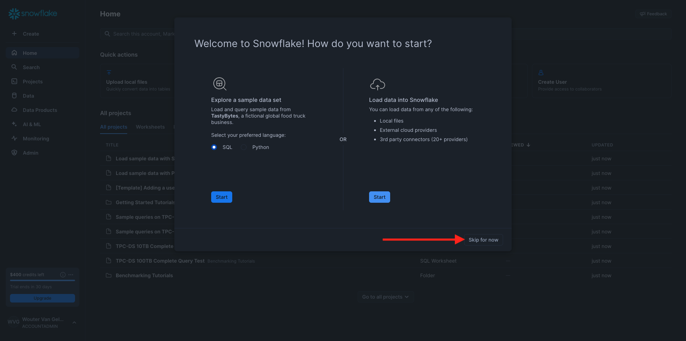
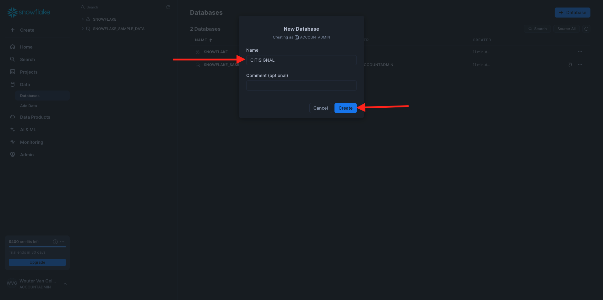
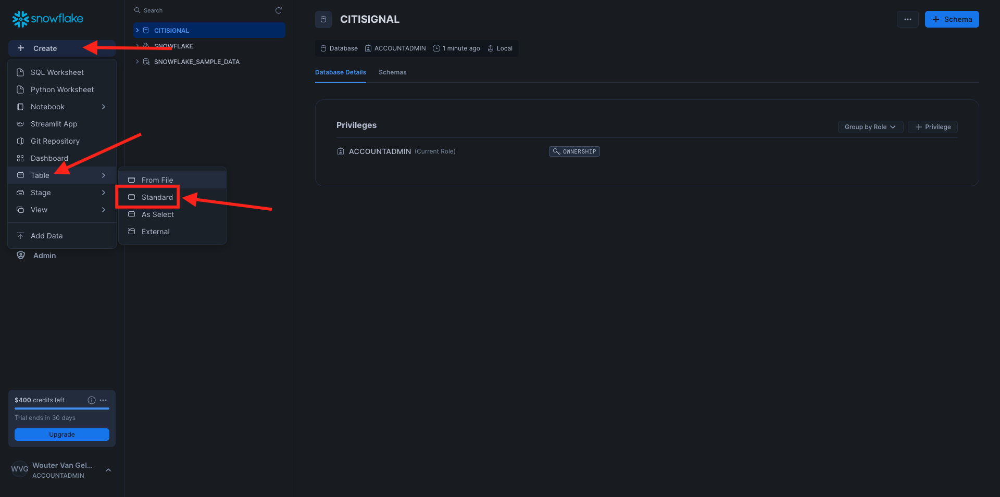
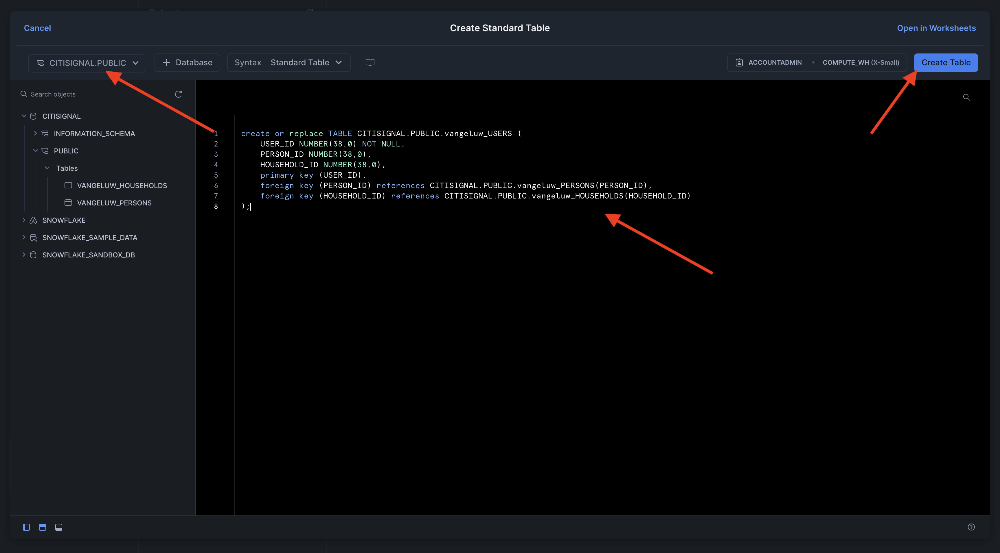
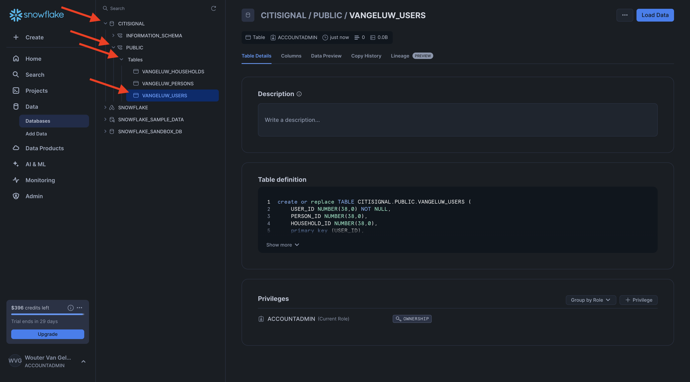

# 1.3.1 Setup your Snowflake environment

## 1.3.1.1 Create your account

Go to [https://snowflake.com](https://snowflake.com). Click **START FOR FREE**.


Enter your details and click **Continue**.


Enter your details, choose your cloud provider and click **Get started**.


Enter your details or click **Skip** (x2).


You'll then see this. Check your email and click the confirmation email that was sent to you.


Click the link in the confirmation email to activate your account, define your user name and password. Click **Get Started**.


You'll then be logged in to Snowflake. Click **Skip for now**.



## 1.3.1.2 Create your database

Go to **Data > Databases**. Click **+ Database**.


Use the name **CITISIGNAL** for your database. Click **CREATE**.



## 1.3.1.3 Create your tables

You can now start creating your tables in Snowflake. You'll find scripts below to run to create your tables.

### Table CK_PERSONS

Click **+ Create**, then click **Table** and then click **Standard**.



You'll then see this. Copy the below query and paste it in Snowflake. Make sure to select the **CITISIGNAL** database in the top left corner of your screen before creating your table.

```sql
create or replace TABLE CITISIGNAL.PUBLIC.CK_PERSONS (
	PERSON_ID NUMBER(38,0) NOT NULL,
	NAME VARCHAR(255),
	AGE NUMBER(38,0),
	EMAIL VARCHAR(255),
	PHONE_NUMBER VARCHAR(20),
	GENDER VARCHAR(10),
	OCCUPATION VARCHAR(100),
	ISATTMOBILESUB BOOLEAN,
	primary key (PERSON_ID)
);
```

Click **Create Table**.


Once the script has run, you can find your table under **Databases > CITISIGNAL > PUBLIC**.


### Table CK_HOUSEHOLDS

Click **+ Create**, then click **Table** and then click **Standard**.


You'll then see this. Copy the below query and paste it in Snowflake. Make sure to select the **CITISIGNAL** database in the top left corner of your screen before creating your table.

```sql
create or replace TABLE CITISIGNAL.PUBLIC.CK_HOUSEHOLDS (
	HOUSEHOLD_ID NUMBER(38,0) NOT NULL,
	ADDRESS VARCHAR(255),
	CITY VARCHAR(100),
	STATE VARCHAR(50),
	POSTAL_CODE VARCHAR(20),
	COUNTRY VARCHAR(100),
	ISELIGIBLEFORFIBER BOOLEAN,
	PRIMARY_PERSON_ID NUMBER(38,0),
	ISFIBREENABLED BOOLEAN,
	primary key (HOUSEHOLD_ID)
);
```

Click **Create Table**.


Once the script has run, you can find your table under **Databases > CITISIGNAL > PUBLIC**.


### Table CK_USERS

Click **+ Create**, then click **Table** and then click **Standard**.


You'll then see this. Copy the below query and paste it in Snowflake. Make sure to select the **CITISIGNAL** database in the top left corner of your screen before creating your table.

```sql
create or replace TABLE CITISIGNAL.PUBLIC.CK_USERS (
	USER_ID NUMBER(38,0) NOT NULL,
	PERSON_ID NUMBER(38,0),
	HOUSEHOLD_ID NUMBER(38,0),
	primary key (USER_ID),
	foreign key (PERSON_ID) references CITISIGNAL.PUBLIC.CK_PERSONS(PERSON_ID),
	foreign key (HOUSEHOLD_ID) references CITISIGNAL.PUBLIC.CK_HOUSEHOLDS(HOUSEHOLD_ID)
);
```

Click **Create Table**.



Once the script has run, you can find your table under **Databases > CITISIGNAL > PUBLIC**.



### Table CK_MONTHLY_DATA_USAGE

Click **+ Create**, then click **Table** and then click **Standard**.


You'll then see this. Copy the below query and paste it in Snowflake. Make sure to select the **CITISIGNAL** database in the top left corner of your screen before creating your table.

```sql
create or replace TABLE CITISIGNAL.PUBLIC.CK_MONTHLY_DATA_USAGE (
	USAGE_ID NUMBER(38,0) NOT NULL autoincrement start 1 increment 1 noorder,
	USER_ID NUMBER(38,0),
	MONTH DATE,
	DATA_USAGE_GB NUMBER(10,2),
	primary key (USAGE_ID)
);
```

Click **Create Table**.


Once the script has run, you can find your table under **Databases > CITISIGNAL > PUBLIC**.


### Table CK_MOBILE_DATA_USAGE

Click **+ Create**, then click **Table** and then click **Standard**.


You'll then see this. Copy the below query and paste it in Snowflake. Make sure to select the **CITISIGNAL** database in the top left corner of your screen before creating your table.


```sql
create or replace TABLE CITISIGNAL.PUBLIC.CK_MOBILE_DATA_USAGE (
	USAGE_ID NUMBER(38,0) NOT NULL autoincrement start 1 increment 1 noorder,
	USER_ID NUMBER(38,0),
	DATE DATE,
	TIME TIME(9),
	APP_NAME VARCHAR(255),
	DATA_USAGE_MB NUMBER(10,2),
	NETWORK_TYPE VARCHAR(50),
	DEVICE_TYPE VARCHAR(50),
	COUNTRY_CODE VARCHAR(10),
	primary key (USAGE_ID)
);
```

Click **Create Table**.


Once the script has run, you can find your table under **Databases > CITISIGNAL > PUBLIC**.


All your tables are now created.


## 1.3.1.4 Ingest sample data

You can now start loading sample data into your database.

...

You've now finished the setup in Snowflake. 


Next Step: [1.3.2 Create schemas, data model and links](./ex2.md)

[Go Back to Module 1.3](./fac.md)

[Go Back to All Modules](../../../overview.md)
