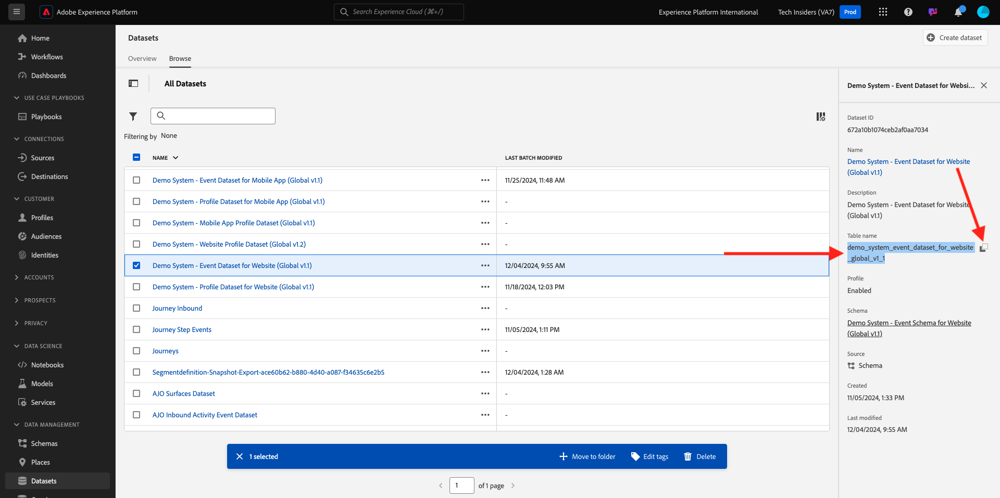
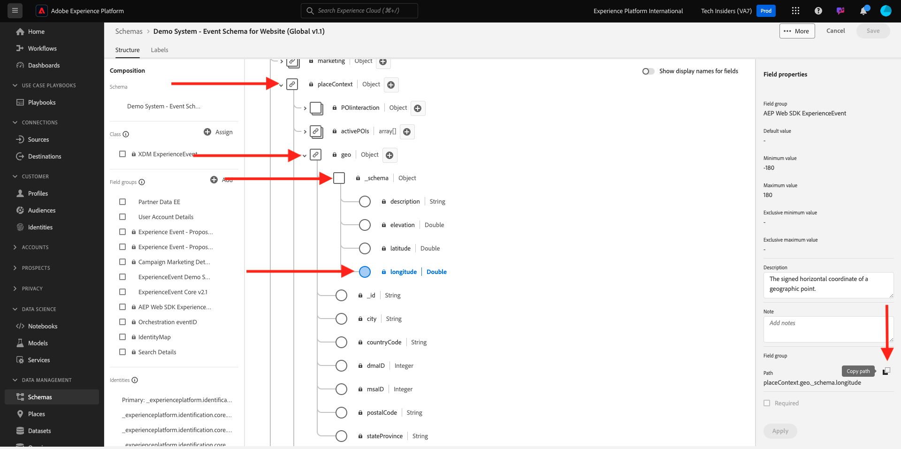

# 5.1.3 Using the Query Service

## Objective

- Find and explore datasets
- Learn how to address Experience Data Models objects and attributes in your queries

## Context

In this you will learn how to use PSQL to retrieve information about the available datasets, how to write a queries for Experience Data Model (XDM), and write your first simple reporting queries using the Query Service and Citi Signal datasets.

## Basic Queries

In this you will learn about the methods to retrieve information about the available datasets and how to properly retrieve data with a query from an XDM dataset.

All the datasets hat we have explored via Adobe Experience Platform in the beginning of 1, are also available for access via a SQL interface as tables. To list those tables you can use the **show tables;** command.

Execute `show tables;` in your **PSQL command-line interface**. (do not forget to end your command with a semicolon).

Copy the command `show tables;` and paste it at the prompt:


You will see the following result:

```text
tech-insiders:all=> show tables;
                               name                               |                                                  dataSetId                                                   |                                       dataSet                                        | description |        labels        
------------------------------------------------------------------+--------------------------------------------------------------------------------------------------------------+--------------------------------------------------------------------------------------+-------------+----------------------
 ajo_bcc_feedback_event_dataset                                   | 672a07cb7728e82aefa1ec56                                                                                     | AJO BCC Feedback Event Dataset                                                       |             | 
 ajo_classification_dataset                                       | 672a07cab55b0d2aef6f9626                                                                                     | AJO Classification Dataset                                                           |             | 
 ajo_consent_service_dataset                                      | 672a07c80fd5fd2aee4155ca                                                                                     | AJO Consent Service Dataset                                                          |             | 'PROFILE'
 ajo_email_tracking_experience_event_dataset                      | 672a07c926d57d2aef020230                                                                                     | AJO Email Tracking Experience Event Dataset                  :
                               name                               |                                                  dataSetId                                                   |                                       dataSet                                        | description |        labels        
------------------------------------------------------------------+--------------------------------------------------------------------------------------------------------------+--------------------------------------------------------------------------------------+-------------+----------------------
 ajo_bcc_feedback_event_dataset                                   | 672a07cb7728e82aefa1ec56                                                                                     | AJO BCC Feedback Event Dataset                                                       |             | 
 ajo_classification_dataset                                       | 672a07cab55b0d2aef6f9626                                                                                     | AJO Classification Dataset                                                           |             | 
 ajo_consent_service_dataset                                      | 672a07c80fd5fd2aee4155ca                                                                                     | AJO Consent Service Dataset                                                          |             | 'PROFILE'
 ajo_email_tracking_experience_event_dataset                      | 672a07c926d57d2aef020230                                                                                     | AJO Email Tracking Experience Event Dataset   
```

At the colon, press space bar to see the next page of the resultset, or enter `q` to revert to the command prompt.

Every dataset in AEP has its corresponding Query Service table. You can find a dataset's table via the Datasets UI:



The `demo_system_event_dataset_for_website_global_v1_1` table is the Query Service table that corresponds with the `Demo System - Event Schema for Website (Global v1.1)` dataset.

To query some information about where a product was viewed, we will select the **geo** information.

Copy the query below and paste it at the prompt in your **PSQL command-line interface** and hit enter:

```sql
select placecontext.geo
from   demo_system_event_dataset_for_website_global_v1_1
where  eventType = 'commerce.productViews'
and placecontext.geo.countryCode <> ''
limit 1;
```

In your query result, you will notice that columns in the Experience Data Model (XDM) can be complex types and not just scalar types. In the query above we would like to identify geo locations where a **commerce.productViews** did occur. To identify a **commerce.productViews** we have to navigate through the XDM model using the **.** (dot) notation.

```text
tech-insiders:all=> select placecontext.geo
from   demo_system_event_dataset_for_website_global_v1_1
where  eventType = 'commerce.productViews'
and placecontext.geo.countryCode <> ''
limit 1;
                 geo                  
--------------------------------------
 ("(51.59119,-1.407848)",Charlton,GB)
(1 row)
```

Notice the result is a flat object rather than a single value? The **placecontext.geo** object contains four attributes: schema, country and city. And when an object is declared as a column it will return the entire object as a string. The XDM schema may be more complex than what you are familiar with but it's very powerful and was architected to support many solutions, channels, and use cases.

To select the individual properties of an object, you use the **.** (dot) notation.

Copy the statement below and paste it at the prompt in your **PSQL command-line interface**:

```sql
select placecontext.geo._schema.longitude
      ,placecontext.geo._schema.latitude
      ,placecontext.geo.city
      ,placecontext.geo.countryCode
from   demo_system_event_dataset_for_website_global_v1_1
where  eventType = 'commerce.productViews'
and placecontext.geo.countryCode <> ''
limit 1;
```

The result of the above query should look like this.
The result is now a set simple values:

```text
tech-insiders:all=> select placecontext.geo._schema.longitude
      ,placecontext.geo._schema.latitude
      ,placecontext.geo.city
      ,placecontext.geo.countryCode
from   demo_system_event_dataset_for_website_global_v1_1
where  eventType = 'commerce.productViews'
and placecontext.geo.countryCode <> ''
limit 1;
 longitude | latitude |   city   | countrycode 
-----------+----------+----------+-------------
 -1.407848 | 51.59119 | Charlton | GB
(1 row)
```

Don't worry, there is an easy way to obtain the path towards a specific property. In the following part you will learn how. 

You will need to edit a query, so let's first open an editor.

On Windows: use **Notepad**

On Mac: install any Text Editor app of choice and open it. 

Copy the following statement to your text editor:

```sql
select your_attribute_path_here
from   demo_system_event_dataset_for_website_global_v1_1
where  eventType = 'commerce.productViews'
and placecontext.geo.countryCode <> ''
limit 1;
```

Go back to your Adobe Experience Platform UI (should be open in your browser) or navigate to [Adobe Experience Platform](https://experience.adobe.com/platform).

Select **Schemas**, enter `Demo System - Event Schema for Website` in the **search** field and click to open the schema `Demo System - Event Schema for Website (Global v1.1) Schema`.


Explore the XDM model for **Demo System - Event Schema for Website (Global v1.1)**, by clicking on an object. Expand the tree for **placecontext**, **geo** and **schema**. When you select the actual attribute **longitude**, you will see the complete path in the highlighted red box. To copy the attribute's path, click on the copy path icon.



Switch to your notepad/brackets and remove **your_attribute_path_here** from the first line. Position your cursor after **select** on the first line and paste (CTRL-V). 


Copy the modified statement and paste it at the prompt in your **PSQL command-line interface** and hit enter.

The result should look like this:

```text
tech-insiders:all=> select placeContext.geo._schema.longitude
from   demo_system_event_dataset_for_website_global_v1_1
where  eventType = 'commerce.productViews'
and placecontext.geo.countryCode <> ''
limit 1;
 longitude 
-----------
 -1.407848
(1 row)
```

Next Step: [5.1.4 Queries, queries, queries...  and churn analysis](./ex4.md)

[Go Back to Module 5.1](./query-service.md)

[Go Back to All Modules](../../../overview.md)
