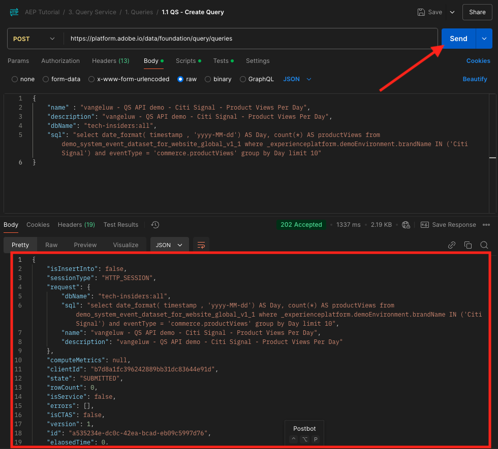
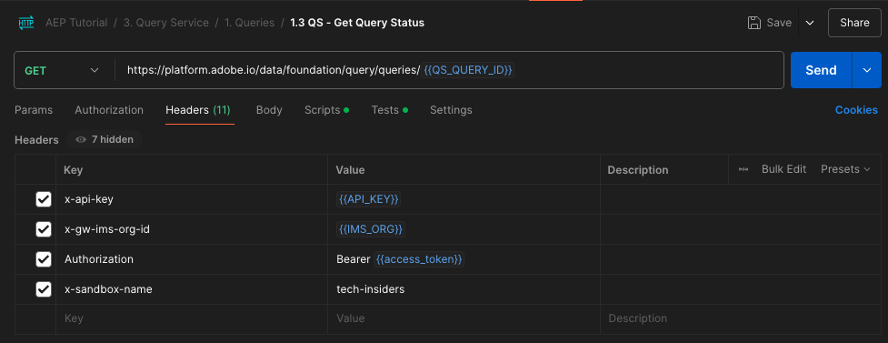
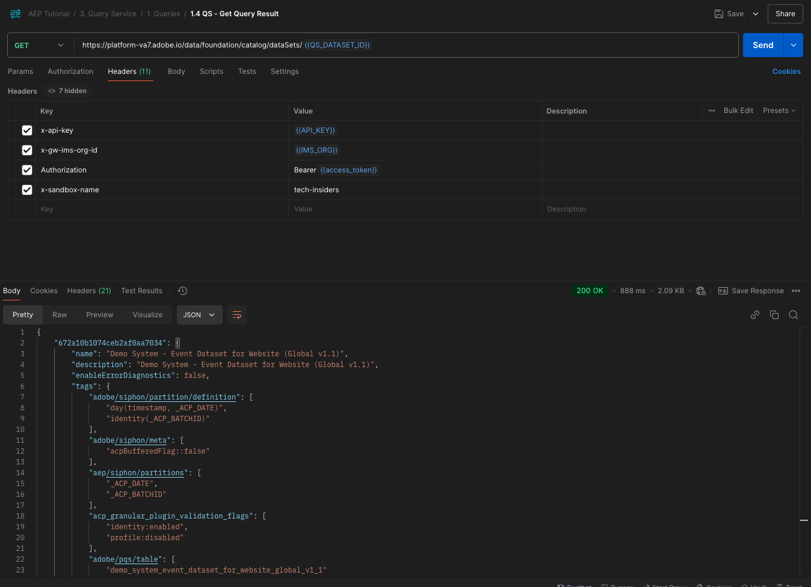

# 5.1.8 Query Service API

## Objective

- Use the Query Service API to manage query templates and query schedules

## Context

In this exercise you will execute API calls to manage query templates and query schedules using a Postman collection. You will define query templates, execute regular queries and CTAS queries. A **CTAS** query (create table as select query) stores its resultset in an explicit dataset. While regular queries are stored in a implicit (or system generated) dataset, that is typically exported in parquet file format.

## Documentation

- [Adobe Experience Platform Query Service Help](https://experienceleague.adobe.com/docs/experience-platform/query/api/getting-started.html)
- [Query Service API](https://www.adobe.io/apis/experienceplatform/home/api-reference.html#!acpdr/swagger-specs/qs-api.yaml)

## Query Service API

The Query Service API lets you manage non-interactive queries against the Adobe Experience Platform data-lake. 

Non-interactive means that a request to execute a query will not result in an immediate response. The query will be processed and its resultset will be stored in an implicit or explicit (CTAS: create table as select) dataset. 

## Sample Query

As a sample query you'll use the first query listed in [4.3 - Queries, queries, queries...  and churn analysis](./ex3.md):

How many product views do we have on a daily basis? 

**SQL**

```sql
select date_format( timestamp , 'yyyy-MM-dd') AS Day,
       count(*) AS productViews
from   demo_system_event_dataset_for_website_global_v1_1
where  --aepTenantId--.demoEnvironment.brandName IN ('Citi Signal')
and eventType = 'commerce.productViews'
group by Day
limit 10;
```

## Queries

Open Postman on your computer. As part of Module 2.1, you created a Postman environment and imported a Postman collection. Follow the instructions in [Exercise 2.1.3](./../../../modules/rtcdp-b2c/module2.1/ex3.md) in case you haven't done that yet. 

As part of the Postman collection you imported, you'll see a folder **3. Query Service**. If you don't see this folder, please redownload the [Postman collection](./../../../assets/postman/postman_profile.zip) and reimport that collection in Postman as instructed in [Exercise 2.1.3](./../../../modules/rtcdp-b2c/module2.1/ex3.md).


>[!NOTE]
>
>At this moment, only the folder **1. Queries** contains requests. Other requests will be added at a layer stage.

Open that folder and get to know the Query Service API calls to execute, monitor and download the query resultset.

A POST call to [/query/queries] with the following payload will trigger the execution of our query;

### Create Query

Click on the request named **1.1 QS - Create Query** and go to **Headers**. You'll then see this:


Let's focus on this header field:

| Key      | Value |
| ----------- | ----------- |
| x-sandbox-name      |`--aepSandboxName--`|

>[!NOTE]
>
>You need to specify the name of the Adobe Experience Platform sandbox you're using. The header field **x-sandbox-name** should be `--aepSandboxName--`.

Go the the **Body** section of this request. In the **Body** of this request, you'll see the following:


```sql
{
    "name" : "ldap - QS API demo - Citi Signal - Product Views Per Day",
	"description": "ldap - QS API demo - Citi Signal - Product Views Per Day",
	"dbName": "--aepSandboxName--:all",
	"sql": "select date_format( timestamp , 'yyyy-MM-dd') AS Day, count(*) AS productViews from demo_system_event_dataset_for_website_global_v1_1 where --aepTenantId--.demoEnvironment.brandName IN ('Citi Signal') and eventType = 'commerce.productViews' group by Day limit 10"
}
```

Attention: please update the variable **name** in the below request by replacing **ldap** with your specific **--aepUserLdap--**.

After adding your specific **ldap**, the Body should look similar to this:

```json
{
    "name" : "vangeluw - QS API demo - Citi Signal - Product Views Per Day",
	"description": "vangeluw - QS API demo - Citi Signal - Product Views Per Day",
	"dbName": "tech-insiders:all",
	"sql": "select date_format( timestamp , 'yyyy-MM-dd') AS Day, count(*) AS productViews from demo_system_event_dataset_for_website_global_v1_1 where _experienceplatform.demoEnvironment.brandName IN ('Citi Signal') and eventType = 'commerce.productViews' group by Day limit 10"
}
```

>[!NOTE]
>
>The key **dbName** in the above JSON body refers to the sandbox that is used in your Adobe Experience Platform instance. If you're using the PROD sandbox, the dbName should be **prod:all**, if you use another sandbox like for instance **tech-insiders**, the dbName should be equal to **tech-insiders:all**.

Next, click the blue **Send** button to create the segment and view the results of that.



When successful the POST request will return the following response:

```json
{
    "isInsertInto": false,
    "request": {
        "dbName": "module7:all",
        "sql": "select date_format( timestamp , 'yyyy-MM-dd') AS Day, count(*) AS productViews from demo_system_event_dataset_for_website_global_v1_1 where _experienceplatform.demoEnvironment.brandName IN ('Luma Telco', 'Citi Signal') and eventType = 'commerce.productViews' group by Day limit 10",
        "name": "vangeluw - QS API demo - Citi Signal - Product Views Per Day",
        "description": "vangeluw - QS API demo - Citi Signal - Product Views Per Day"
    },
    "clientId": "5a143b5ae4aa4631a1f3b09cd051333f",
    "state": "SUBMITTED",
    "rowCount": 0,
    "errors": [],
    "isCTAS": false,
    "version": 1,
    "id": "8f0d7f25-f7aa-493b-9792-290f884a7e5b",
    "elapsedTime": 0,
    "updated": "2021-01-20T13:23:13.951Z",
    "client": "API",
    "userId": "A3392DB95FFF08EE0A495E87@techacct.adobe.com",
    "created": "2021-01-20T13:23:13.951Z",
    "_links": {
        "self": {
            "href": "https://platform-va7.adobe.io/data/foundation/query/queries/8f0d7f25-f7aa-493b-9792-290f884a7e5b",
            "method": "GET"
        },
        "soft_delete": {
            "href": "https://platform-va7.adobe.io/data/foundation/query/queries/8f0d7f25-f7aa-493b-9792-290f884a7e5b",
            "method": "PATCH",
            "body": "{ \"op\": \"soft_delete\"}"
        },
        "cancel": {
            "href": "https://platform-va7.adobe.io/data/foundation/query/queries/8f0d7f25-f7aa-493b-9792-290f884a7e5b",
            "method": "PATCH",
            "body": "{ \"op\": \"cancel\"}"
        }
    }
}
```

The current **state** of the query is **SUBMITTED**, once executed its state will become **SUCCESS**.

You can also lookup submitted queries via Adobe Experience Platform UI, open [Adobe Experience Platform](https://experience.adobe.com/#/@experienceplatform/platform/home), navigate to **Queries**, to **Log** and select your query:


### Get Queries

Click on the request named **1.2 QS - Get Queries** and go to **Headers**. You'll then see this:


Let's focus on this header field:

| Key      | Value |
| ----------- | ----------- |
| x-sandbox-name      |`--aepSandboxName--`|

>[!NOTE]
>
>You need to specify the name of the Adobe Experience Platform sandbox you're using. The header field **x-sandbox-name** should be `--aepSandboxName--`.

Go to **Params**. You'll then see this:


The **orderby** parameter allows you to specify a sort order based on the **created** property. Notice the **'-'** sign in front of created, which means that the order in which the list of queries is returned will be using their created date in **descending** order. Your query should be on top of the list.

Next, click the blue **Send** button to create the segment and view the results of that.


When successful the request will return a response similar to the below one. The **state** of the response may be **SUBMITTED**, **IN_PROGRESS** or **SUCCESS**. It may take several minutes before the query has a **SUCCESS** state. You can repeat sending this request several times, until you see the **SUCCESS** state.

```json
{
    "queries": [
        {
            "isInsertInto": false,
            "sessionType": "HTTP_SESSION",
            "request": {
                "dbName": "tech-insiders:all",
                "sql": "select date_format( timestamp , 'yyyy-MM-dd') AS Day, count(*) AS productViews from demo_system_event_dataset_for_website_global_v1_1 where _experienceplatform.demoEnvironment.brandName IN ('Citi Signal') and eventType = 'commerce.productViews' group by Day limit 10",
                "name": "vangeluw - QS API demo - Citi Signal - Product Views Per Day",
                "description": "vangeluw - QS API demo - Citi Signal - Product Views Per Day"
            },
            "computeMetrics": null,
            "clientId": "b7d8a1fc396242889bb31dc83644e91d",
            "state": "IN_PROGRESS",
            "rowCount": 0,
            "isService": false,
            "errors": [],
            "isCTAS": false,
            "version": 1,
            "id": "a535234e-dc0c-42ea-bcad-eb09c5997d76",
            "elapsedTime": 8088,
            "updated": "2024-12-04T14:17:10.627Z",
            "client": "API",
            "effectiveSQL": "select date_format( timestamp , 'yyyy-MM-dd') AS Day, count(*) AS productViews from demo_system_event_dataset_for_website_global_v1_1 where _experienceplatform.demoEnvironment.brandName IN ('Citi Signal') and eventType = 'commerce.productViews' group by Day limit 10",
            "userId": "8CD31E54673C49EE0A495E05@techacct.adobe.com",
            "isParentLevel": true,
            "created": "2024-12-04T14:14:22.637Z",
                "version": 1,
    "_links": {
        "next": {
            "href": "https://platform-va7.adobe.io/data/foundation/query/queries?orderby=-created&start=2024-11-22T00:32:04.505Z"
        },
        "prev": {
            "href": "https://platform-va7.adobe.io/data/foundation/query/queries?orderby=-created&start=2024-12-04T14:14:22.637Z&isPrevLink=true"
        }
    }
}
```

When the state is **SUCCESS**, please continue with the next request.

### Get Query Status

Click on the request named **1.3 QS - Get Query Status** and go to **Headers**. You'll then see this:



Let's focus on this header field:

| Key      | Value |
| ----------- | ----------- |
| x-sandbox-name      |`--aepSandboxName--`|

>[!NOTE]
>
>You need to specify the name of the Adobe Experience Platform sandbox you're using. The header field **x-sandbox-name** should be `--aepSandboxName--`.

Next, click the blue **Send** button to create the segment and view the results of that.


When successful the request will return a response similar to the below one.

```json
{
    "isInsertInto": false,
    "sessionType": "HTTP_SESSION",
    "request": {
        "dbName": "tech-insiders:all",
        "sql": "select date_format( timestamp , 'yyyy-MM-dd') AS Day, count(*) AS productViews from demo_system_event_dataset_for_website_global_v1_1 where _experienceplatform.demoEnvironment.brandName IN ('Citi Signal') and eventType = 'commerce.productViews' group by Day limit 10",
        "name": "vangeluw - QS API demo - Citi Signal - Product Views Per Day",
        "description": "vangeluw - QS API demo - Citi Signal - Product Views Per Day"
    },
    "computeMetrics": {
        "executorVMSeconds": 138,
        "clusterCpuSeconds": 3312,
        "clusterVMHours": 0.07666666805744171,
        "driverVMSeconds": 138,
        "clusterVMSeconds": 276
    },
    "clientId": "b7d8a1fc396242889bb31dc83644e91d",
    "state": "SUCCESS",
    "rowCount": 1,
    "isService": false,
    "errors": [],
    "isCTAS": false,
    "version": 1,
    "id": "a535234e-dc0c-42ea-bcad-eb09c5997d76",
    "elapsedTime": 199219,
    "updated": "2024-12-04T14:17:41.856Z",
    "client": "API",
    "effectiveSQL": "select date_format( timestamp , 'yyyy-MM-dd') AS Day, count(*) AS productViews from demo_system_event_dataset_for_website_global_v1_1 where _experienceplatform.demoEnvironment.brandName IN ('Citi Signal') and eventType = 'commerce.productViews' group by Day limit 10",
    "userId": "8CD31E54673C49EE0A495E05@techacct.adobe.com",
    "isParentLevel": true,
    "created": "2024-12-04T14:14:22.637Z",
    "_links": {
        "self": {
            "href": "https://platform-va7.adobe.io/data/foundation/query/queries/a535234e-dc0c-42ea-bcad-eb09c5997d76",
            "method": "GET"
        },
        "soft_delete": {
            "href": "https://platform-va7.adobe.io/data/foundation/query/queries/a535234e-dc0c-42ea-bcad-eb09c5997d76",
            "method": "PATCH",
            "body": "{ \"op\": \"soft_delete\"}"
        },
        "referenced_datasets": [
            {
                "id": "672a10b1074ceb2af0aa7034",
                "href": "https://platform-va7.adobe.io/data/foundation/catalog/dataSets/672a10b1074ceb2af0aa7034"
            }
        ]
    }
}
```

When a query reaches the state of **SUCCESS**, the response will also indicate the number of rows retrieved by the query via the **rowCount** property. In our example 10 rows are returned by the query. Let's see in the next section how we can retrieve the 10 rows.

### Retrieve Query Result

The **SUCCESS** response above includes a **referenced_datasets** property, which points to the implicit dataset which stores the query result. To get access to the result, we use its **href** or **id** property. 

Click on the request named **1.4 QS - Get Query Result** and go to **Headers**. You'll then see this:


Let's focus on this header field:

| Key      | Value |
| ----------- | ----------- |
| x-sandbox-name      |`--aepSandboxName--`|

>[!NOTE]
>
>You need to specify the name of the Adobe Experience Platform sandbox you're using. The header field **x-sandbox-name** should be `--aepSandboxName--`.

Next, click the blue **Send** button to create the segment and view the results of that.



The response of this request will point to the dataset files:

```json
{
    "672a10b1074ceb2af0aa7034": {
        "name": "Demo System - Event Dataset for Website (Global v1.1)",
        "description": "Demo System - Event Dataset for Website (Global v1.1)",
        "enableErrorDiagnostics": false,
        "tags": {
            "adobe/siphon/partition/definition": [
                "day(timestamp, _ACP_DATE)",
                "identity(_ACP_BATCHID)"
            ],
            "adobe/siphon/meta": [
                "acpBufferedFlag::false"
            ],
            "aep/siphon/partitions": [
                "_ACP_DATE",
                "_ACP_BATCHID"
            ],
            "acp_granular_plugin_validation_flags": [
                "identity:enabled",
                "profile:disabled"
            ],
            "adobe/pqs/table": [
                "demo_system_event_dataset_for_website_global_v1_1"
            ],
            "acp_granular_validation_flags": [
                "requiredFieldCheck:enabled"
            ],
            "aep/siphon/cleanup/trash/timestamp": [
                "1733302532212"
            ],
            "acp_validationContext": [
                "enabled"
            ],
            "adobe/siphon/table/format": [
                "delta"
            ],
            "unifiedProfile": [
                "enabled:true",
                "enabledAt:2024-11-05 12:33:59"
            ],
            "aep/siphon/cleanup/meta/timestamp": [
                "1733302532287"
            ],
            "unifiedIdentity": [
                "enabled:true"
            ]
        },
        "state": "ACTIVE",
        "imsOrg": "907075E95BF479EC0A495C73@AdobeOrg",
        "sandboxId": "79e3c8b2-0609-4564-a3c8-b20609a5648c",
        "extensions": {
            "adobe_lakeHouse": {
                "metrics": {
                    "storageSize": 810709,
                    "rowCount": 1141,
                    "asOf": 1732494676514
                }
            },
            "adobe_unifiedProfile": {}
        },
        "version": "1.0.21",
        "created": 1730810034023,
        "updated": 1733302532348,
        "createdClient": "d75039d36ca543c78612f7aac18e6c2b",
        "createdUser": "53FB1E5E66CDC87D0A495FC0@techacct.adobe.com",
        "updatedUser": "acp_foundation_dataTracker@AdobeID",
        "classification": {
            "dataBehavior": "time-series",
            "managedBy": "CUSTOMER"
        },
        "viewId": "672a10b2074ceb2af0aa7035",
        "fileDescription": {
            "format": "parquet"
        },
        "files": "@/dataSetFiles?dataSetId=672a10b1074ceb2af0aa7034",
        "schemaRef": {
            "id": "https://ns.adobe.com/experienceplatform/schemas/d9b88a044ad96154637965a97ed63c7b20bdf2ab3b4f642e",
            "contentType": "application/vnd.adobe.xed-full+json;version=1"
        }
    }
}
```

Next Step: [Summary and benefits](./summary.md)

[Go Back to Module 5.1](./query-service.md)

[Go Back to All Modules](../../../overview.md)
