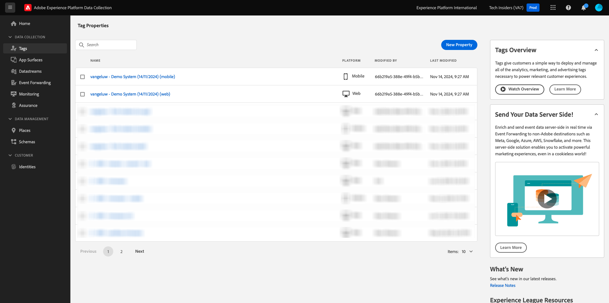

# Create your Datastream

Go to [https://experience.adobe.com/#/data-collection/](https://experience.adobe.com/#/data-collection/). 

In the left menu, click **[!UICONTROL Tags]**. After the previous exercise, you now have 3 Data Collection properties: one for web, one for mobile and one for CX app.

These properties are almost ready to be used, but before you can start collecting data using these properties you need to set up a datastream. You'll get more information around the concept of what a datastream is and what it means in a later exercise in the Data Collection module.

For now, please follow these steps.

## Create your Datastream for Web

Click **[!UICONTROL Datastreams]**.

In the top right corner of your screen, select your sandbox name, which should be `--aepSandboxName--`.

Click **[!UICONTROL New Datastream]**.

For the **[!UICONTROL Name]**, and for the optional description, enter `--aepUserLdap-- - Demo System Datastream`. For **Mapping Schema**, select **Demo System - Event Schema for Website (Global v1.1)**. Click **Save**.

You'll then see this. Click **Add Service**.

Select the service **[!UICONTROL Adobe Experience Platform]**, which will expose additional fields. You'll then see this. 

For Event Dataset, select **Demo System - Event Dataset for Website (Global v1.1)** and for Profile Dataset, select **Demo System - Profile Dataset for Website (Global v1.1)**. Click **Save**.

You'll now see this.

That's it for now. In [Module 1.1](./../../../modules/datacollection/module1.1/data-ingestion-launch-web-sdk.md) you'll learn more about Web SDK and how to configure all of its capabilities.

In the left menu, click **[!UICONTROL Tags]**.

Filter the search results to see your Data Collection properties. Open the property for **Web** by clicking it.

You'll then see this. Click **Extensions**.

First, click the Adobe Experience Platform Web SDK extension and then click **Configure**.

You'll then see this. Have a kook at the **Datastreams** menu and make sure the right sandbox is selected, which in you case should be `--aepSandboxName--`.

Open the **Datastreams** dropdown, and select the Datastream you created earlier.

Make sure to have selected your **Datastream** in all three different environments. Then, click **Save**.

Go to **Publishing Flow**.

Click the **...** for **Main**, then click **Edit**.

Click **Add All Changed Resources** and then click **Save & Build for Development**.

Your changes are now being published and will be ready in a couple of minutes, after which you'll see the green dot next to **Main**.

## Create your Datastream for Mobile

Go to [https://experience.adobe.com/#/data-collection/](https://experience.adobe.com/#/data-collection/). 

Click **[!UICONTROL Datastreams]**.

In the top right corner of your screen, select your sandbox name, which should be `--aepSandboxName--`.

Click **[!UICONTROL New Datastream]**.

For the **[!UICONTROL Friendly Name]**, and for the optional description, enter `--aepUserLdap-- - Demo System Datastream (Mobile)`. For **Mapping Schema**, select **Demo System - Event Schema for Mobile App (Global v1.1)**. Click **Save**.

Click **[!UICONTROL Save]**.

You'll then see this. Click **Add Service**.

Select the service **[!UICONTROL Adobe Experience Platform]**, which will expose additional fields. You'll then see this.

For Event Dataset, select **Demo System - Event Dataset for Mobile App (Global v1.1)** and for Profile Dataset, select **Demo System - Profile Dataset for Mobile App (Global v1.1)**. Click **Save**.

You'll then see this.

Your datastream is now ready to be used in your Adobe Experience Platform Data Collection Client property for Mobile.

Go to **Tags** and filter the search results to see your Data Collection properties. Open the property for **Mobile** by clicking it. 

You'll then see this. Click **Extensions**.

Click the **Adobe Experience Platform Edge Network** extension and then click **Configure**.

You'll then see this. You now need to select the correct sandbox and datastream that you just configured. The sandbox to use is `--aepSandboxName--` and the datastream is called `--aepUserLdap-- - Demo System Datastream (Mobile)`. 

For the **Edge Network domain**, please use the default domain.

Click **Save** to save your changes.

Go to **Publishing Flow**.

Click the **...** next to **Main**, then click **Edit**.

Click **Add All Changed Resources**, then click **Save & Build for Development**.

Your changes are now being published and will be ready in a couple of minutes, after which you'll see the green dot next to **Main**.

Next Step: [Use the website](./ex4.md)

[Go Back to Getting Started](./getting-started.md)

[Go Back to All Modules](./../../../overview.md)
