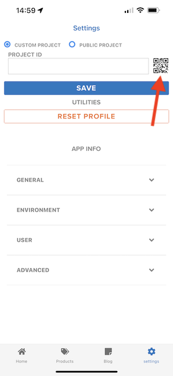
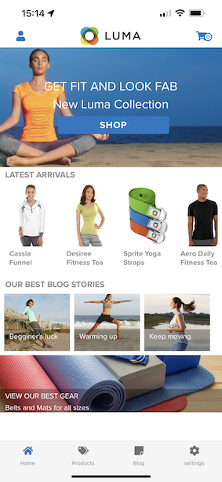

# 0.5 Use the mobile app

## 0.5.1 Download the app

Go to [https://bit.ly/dx-demo-app](https://bit.ly/dx-demo-app) on your computer. You'll then see this.

Use the **Camera** app on your smartphone to install the mobile app for your device's OS. For this enablement, you need to install the **Version 2.x** which uses the Adobe Experience Platform Mobile SDK's.

>[!NOTE]
>
>After installing the app for the first time on an iOS device, you might get an error message when trying to open the app which says: **Untrusted Enterprise Developer**. In order to fix this, you need to go to **Settings > General > Device Management > Adobe Systems Inc.** and click **Trust Adobe Systems Inc.**.

Once the app is installed, you'll find it on your device's home screen. Click the icon to open the app.

When you're using the app the first time, you'll be requested to log in using your Adobe ID. Complete the login process.

After logging in, you'll see a notification requesting your permission to send notifications. We'll send notifications as part of the tutorial, so click **Allow**.

You'll then see the app's homepage. Go to **Settings**.

In settings, you'll see that currently a **Public Project** is loaded in the app. Click **Custom Project**.

You can now load a custom project. Click the QR code to easily load your project.

After exercise 0.1, you had this result. Click to open the **Mobile Retail project** that was created for you.

In case you had accidentally closed your browser window, or for future demo or enablement sessions, you can also access your website project by going to [https://builder.adobedemo.com/projects](https://builder.adobedemo.com/projects). After logging in with your Adobe ID, you'll see this. Click your mobile app project to open it.

You'll then see this. Click **Integrations**.

You need to select the Data Collection property for mobile that was created in exercise 0.1. Next, click **Run**.

You'll then see this popup, which contains a QR code. Scan this QR-code from within the mobile app.

You'll then see your project ID show in the app, after which you can click **Save**.

Now, go back to **Home** in the app. Your app is now ready to be used.

You've now completed module 0.

[Go Back to Module 0](./getting-started.md)

[Go Back to All Modules](./../../overview.md)
