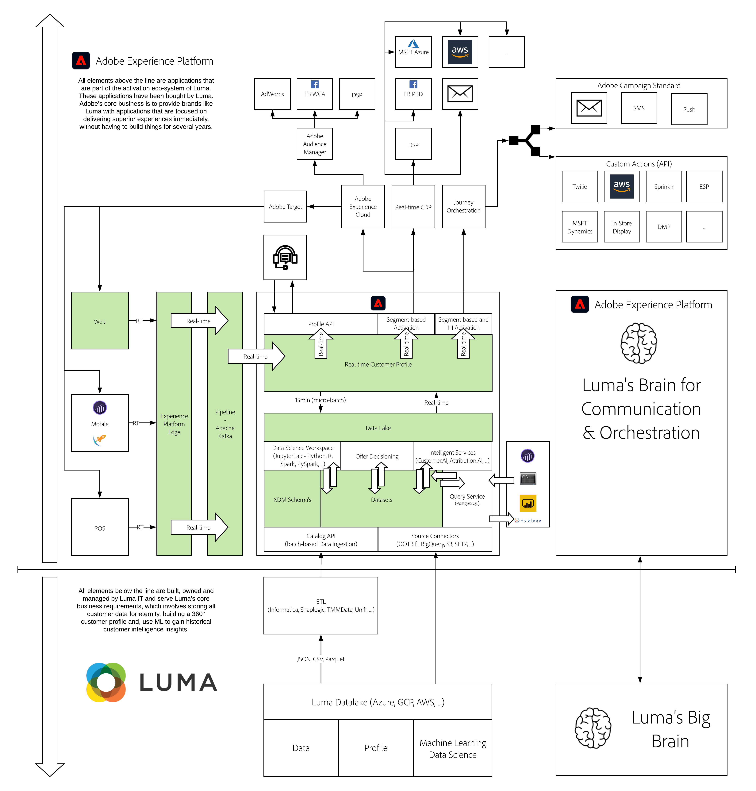

# 1. Foundation - Setup of Adobe Experience Platform Launch and the Web SDK extension

**Author: [Wouter Van Geluwe](https://www.linkedin.com/in/woutervangeluwe/)**

## Learning Objectives

- Learn how to ...

## Prerequisites

- Access to Adobe Experience Platform: [https://experience.adobe.com/platform](https://experience.adobe.com/platform)
- Access to Adobe Experience Platform Launch: [https://launch.adobe.com](https://launch.adobe.com)
- Access to a Platform demo website
- This documentation has been created to facilitate hands-on, technical enablement around Adobe Experience Platform. In order to complete some of the modules, you'll need to change some variables and replace them by your specific **Environment Variables**. Please contact your Adobe contact who will provide you with the required **Environment Variables** of your specific Adobe Experience Platform instance.

>[!IMPORTANT] 
>
>This tutorial was created to facilitate a particular workshop format. It uses specific systems and accounts to which you might not have access. Even without access, we think you can still learn a lot by reading through this very detailed content. If you're a participant in one of the workshops and need your access credentials, please contact your Adobe representative who will provide you with the required information.

## Architecture Overview

Have a look at the below architecture, which highlights the components that will be discussed and used in this module.

## Exercises

### **Exercises for this module are currently being developed**

[Summary and benefits](./summary.md)

Summary of this module and overview of the benefits.

[Go Back to All Modules](../../overview.md)
