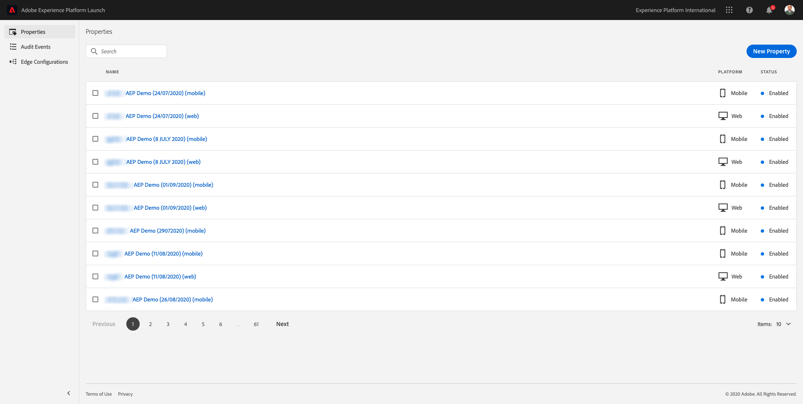

# 1.1 Understanding Adobe Experience Platform Launch

## Context

Adobe Experience Platform Launch is used by brands for a number of use cases. It is a next generation Tag Management System (TMS) that gives customers a simple way to deploy and manage all of the analytics, marketing and advertising solutions necessary to power relevant customer experiences. There is no additional charge for Launch and it's available for any Adobe Experience Cloud customer. A brand could use Experience Platform Launch to:

- Implement Adobe Experience Cloud applications as well as Adobe Experience Platform.
- Manage the different requirements of different parts of the organization by providing each with their own **Property** to manage.
- Allow for testing and lifecycle management.
- Inject custom javascript and 3rd party tags, all managed in one place.

## Explore the UI

Go to [Adobe Experience Platform Launch](https://launch.adobe.com/).

You're in the **[!UICONTROL Properties]** view. Properties listed here are for tutorial management. These properties represent...

- App and Web properties
- Different websites serving customers in different ways. For example Luma Retail would have one property, Luma Travel would have another
- Legacy as well as current websites
- A specific Analytics design common to multiple differing websites
- Internal intranet pages alongside external sites

Now, take a look at the left rail.

- **[!UICONTROL Properties]** give an overview of all properties
- **[!UICONTROL Audit Events]** give a governance tool to see what users are doing in your organization
- **[!UICONTROL Edge Configurations]** are explored in the [next exercise](./ex2.md)

## Further Information

Launch is a very advanced tool that has scope beyond an Adobe Experience Platform tutorial. Organizations might not use Launch for its tag management capabilities and instead use non-Adobe tag management solutions for injecting code and managing tags. Using a non-Adobe tag management solution is supported by Adobe and Adobe Professional Services. In this Comprehensive Technical Tutorial for Adobe Experience Platform, you'll also learn how to use for instance Google Tag Manager to ingest data into Adobe Experience Platform, as part of [Module 9. Data Ingestion using Google Tag Manager and Google Analytics](./../module9/data-ingestion-using-google-tag-manager-and-google-analytics.md).

Some further reading for those interested in understanding Launch further are included below.

- [Launch User Guide](https://experienceleague.adobe.com/docs/launch/using/overview.html)
- [Implementing the Experience Cloud in Websites with Launch](https://experienceleague.adobe.com/docs/core-services-learn/implementing-in-websites-with-launch/index.html)
- [Set-up user permissions](https://experienceleague.adobe.com/docs/launch/using/reference/admin/user-permissions.html)
- [API documentation](https://developer.adobelaunch.com/api/)

Next Step: [1.2 Edge Network and Server Side Data Collection](./ex2.md)

[Go Back to Module 1](./data-ingestion-launch-web-sdk.md)

[Go Back to All Modules](./../../overview.md)
