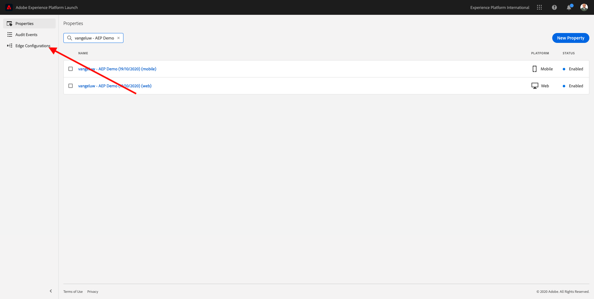
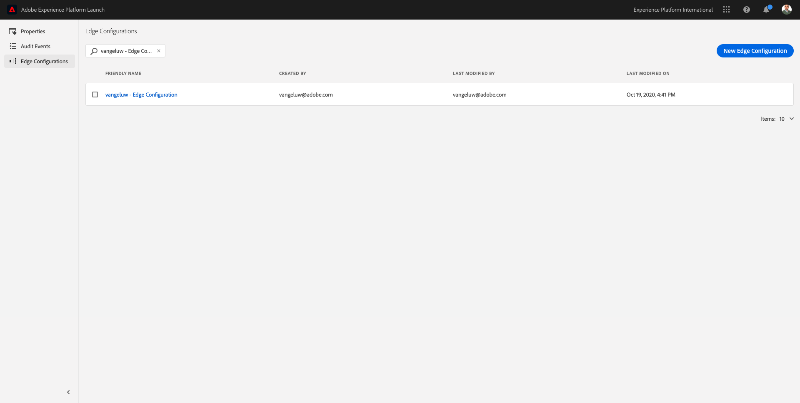
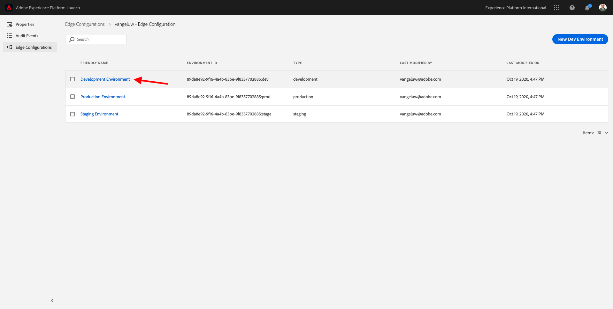
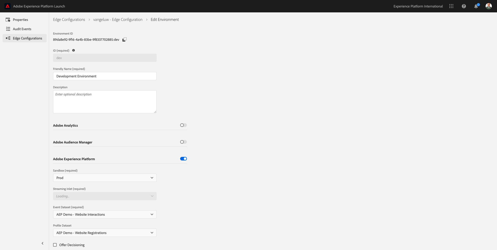

# 1.2 Edge Network and Server Side Data Collection

## Context

In this exercise you'll create an Edge Configuration. An Edge Configuration tells the Adobe Edge servers where to send the data after it is collected by Web SDK. For example, do you want to send the data to Experience Platform? Adobe Analytics? Adobe Audience Manager? Adobe Target? 

Edge Configurations are always managed in the Launch user interface and are critical to Adobe Experience Platform data collection with Web SDK. Even when you implement Web SDK with a non-Adobe tag management solution, you'll still need to create your Edge Configuration in the Adobe Experience Platform Launch user interface.

You'll be implementing the Web SDK on the browser in the next exercise. It will then be more clear to you what the data that is being collected looks like. For now, we are just telling the Edge Network where to forward the data.

## Create an Edge Configuration

In [Exercise 0.2](./../module0/ex2.md) you already created an Edge Configuration, but we didn't discuss the background and reason for being of the Edge Configuration. 

An Edge Configuration tells the Adobe Edge servers where to send the data after it is collected by the Web SDK. For example, do you want to send the data to Experience Platform? Adobe Analytics? Adobe Audience Manager? Adobe Target? Edge Configurations are managed in the Launch user interface and are critical to Platform data collection with Web SDK, regardless of whether or not you are implementing Web SDK via Launch.

Let's review your [!UICONTROL Edge Configuration]:

Go to [https://experience.adobe.com/launch/](https://experience.adobe.com/launch/).

Click **[!UICONTROL Edge Configurations]** in the left menu.

Search for your Edge Configuration, which is named **ldap - Edge Configuration** (replace **ldap** with your ldap).

Click on your Edge Configuration to open it. You'll then see the three environments (Development, Staging, Production). Click the **Development** environment.

You'll then see the details of your Edge Configuration. 

At this moment, you've only enabled Adobe Experience Platform. Your configuration will look similar to the configuration below. (Depending on your environment and Adobe Experience Platform instance, the Sandbox Name might be different)

You should interpret the below fields like this:

For this Edge Configuration...

- all data that is collected will be stored in the `--aepSandboxId--`sandbox in Adobe Experience Platform
- when data is ingested into Adobe Experience Platform, it is forwarded by Edge to the selected **Streaming Inlet**
- all Experience Event data is collected by default into the dataset **AEP Demo - Website Interactions**
- all Profile data will be collected by default into the dataset **AEP Demo - Website Registrations** (this feature currently isn't supported yet by Web SDK, and will be made available at a later stage)
- if you want to use the **Offer Decisioning** application service for this Edge Configuration, you need to check the box for Offer Decisioning. (This will be part of [Module 14](./../module14/offer-decisioning.md))

For now, no other configuration is needed for your Edge Configuration.

Next Step: [1.3 Introduction to Launch](./ex3.md)

[Go Back to Module 1](./data-ingestion-launch-web-sdk.md)

[Go Back to All Modules](./../../overview.md)
