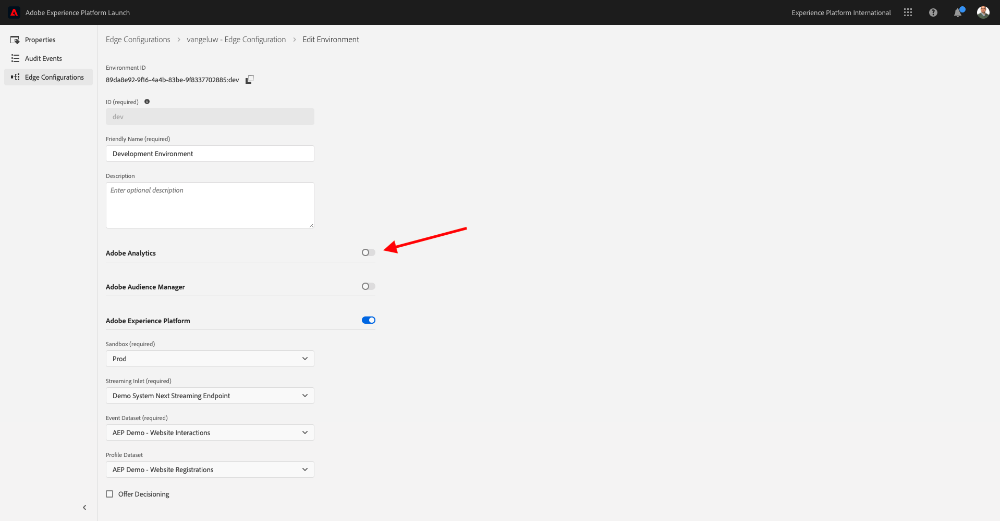
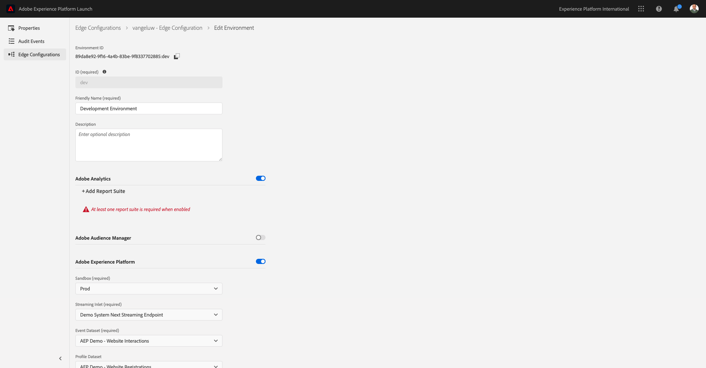
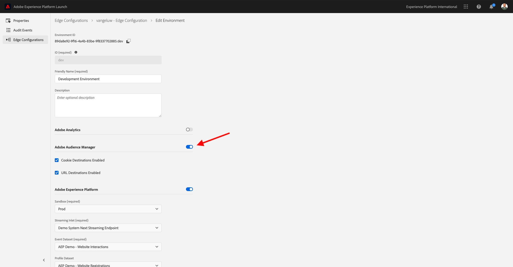

# 1.5 - Implement Adobe Analytics and Adobe Audience Manager

## Context

You now know that XDM data is flowing into platform. You'll explore more about what XDM is in [Module 2](./../module2/data-ingestion.md), as well as how to build your own schema to track custom variables. For now you're going to look at what happens when you set your Datastream to forward data to Analytics and Audience Manager.

## 1.5.1 Mapping variables in Analytics

The Adobe Experience Platform [!DNL Web SDK] maps certain values automatically, making a new implementation of Analytics via the Web SDK as quick as possible. The automatically mapped variables are listed [here](https://experienceleague.adobe.com/docs/experience-platform/edge/data-collection/adobe-analytics/automatically-mapped-vars.html#data-collection).

For XDM data that is not automatically mapped to [!DNL Adobe Analytics], you can use [context data](https://experienceleague.adobe.com/docs/analytics/implementation/vars/page-vars/contextdata.html) to match your [schema](https://experienceleague.adobe.com/docs/experience-platform/xdm/schema/composition.html). Then it can be mapped into [!DNL Analytics] using [processing rules](https://experienceleague.adobe.com/docs/analytics/admin/admin-tools/processing-rules/processing-rules-configuration/t-processing-rules.html) to populate [!DNL Analytics] variables. Context Data and Processing Rules will be concepts familiar to those that have worked with Analytics in the past, but don't worry about the details for now if they are new concepts.

You can also use a default set of actions and product lists to send or retrieve data with the AEP [!DNL Web SDK]. To do this, see [Products](https://experienceleague.adobe.com/docs/experience-platform/edge/data-collection/collect-commerce-data.html?lang=en#data-collection).

### Context data

To be used by [!DNL Analytics], XDM data is flattened using dot notation and made available as `contextData`. The following list of value pairs shows an example of `context data`:

```javascript
{
    "bh": "900",
    "bw": "1680",
    "c": "24",
    "c.a.d.key.[0]": "value1",
    "c.a.d.key.[1]": "value2",
    "c.a.d.object.key1": "value1",
    "c.a.d.object.key2.[0]": "value2",
    "c.a.x.environment.browserdetails.javascriptenabled": "true",
    "c.a.x.environment.type": "browser",
    "cust_hit_time_gmt": "1579781427",
    "g": "http://example.com/home",
    "gn": "home",
    "j": "1.8.5",
    "k": "Y",
    "s": "1680x1050",
    "tnta": "218287:1:0|0,218287:1:0|2,218287:1:0|1,218287:1:0|32767,218287:1:01,218287:1:0|0,218287:1:0|1,218287:1:0|0,218287:1:0|1",
    "user_agent": "Mozilla/5.0 AppleWebKit/537.36 Safari/537.36",
    "v": "Y"
}
```

### Processing rules

All data collected by the edge network can be accessed via [processing rules](https://experienceleague.adobe.com/docs/analytics/admin/admin-tools/processing-rules/processing-rules-configuration/t-processing-rules.html). In [!DNL Analytics], you can use processing rules to incorporate context data into [!DNL Analytics] variables.

## 1.5.2 Audience Manager on the Experience Platform Edge Network

Server-side forwarding is a not a new concept for Audience Manager, and the same process as before applies. You can also sync identities.

## 1.5.3 Review your Datastream to send data to Adobe Analytics

In case you want to send data collected by Web SDK to Adobe Analytics and Adobe Audience Manager, follow these steps.

Go to [https://experience.adobe.com/launch/](https://experience.adobe.com/launch/) and go to **Datastreams**. 

In the top right corner of your screen, select your sandbox name, which should be `--aepSandboxId--`. Open your specific datastream, which is named `--demoProfileLdap-- - Demo System Datastream`.


You'll then see this. To enable Adobe Analytics, click **+Add Service**.



You'll then see this. Select the service **Adobe Analytics**, after which you need to add the report suite in Adobe Analytics to send data into. In this tutorial, this is out of scope. Click **Cancel**.



## 1.5.4 Review your Datastream to send data to Adobe Audience Manager

You'll then see this. To enable Adobe Audience Manager, click **+Add Service**.


You'll then see this. Select the service **Adobe Audience Manager** after which you can decide to enable or disable Adobe Audience Manager cookie destinations and/or URL destinations. In this tutorial, this configuration is out of scope. Click **Cancel**.



Next step: [1.6 Implement Adobe Target](./ex6.md)

[Go Back to Module 1](./data-ingestion-launch-web-sdk.md)

[Go Back to All Modules](./../../overview.md)
