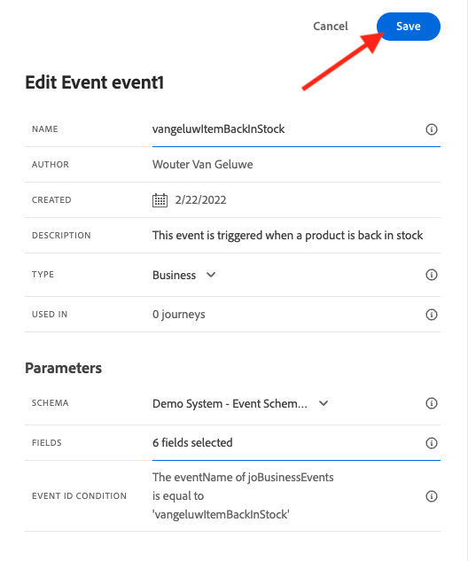
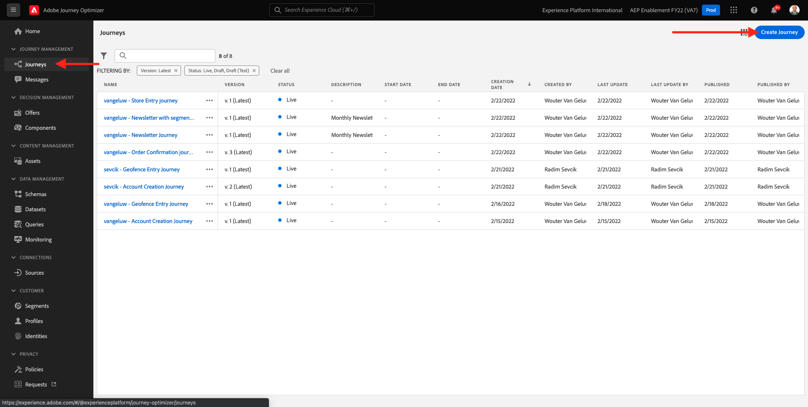
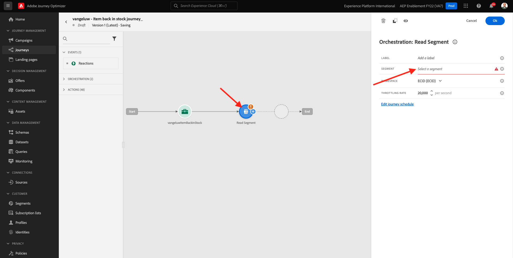
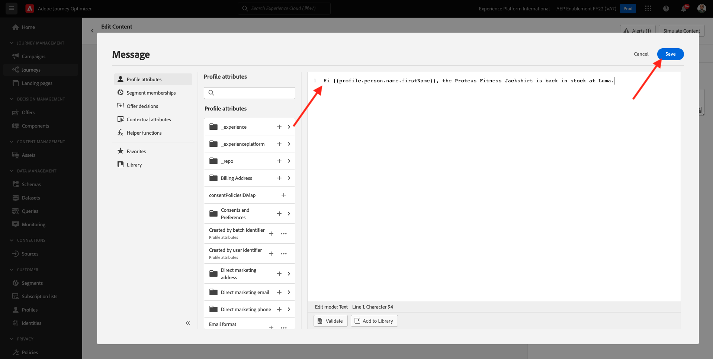
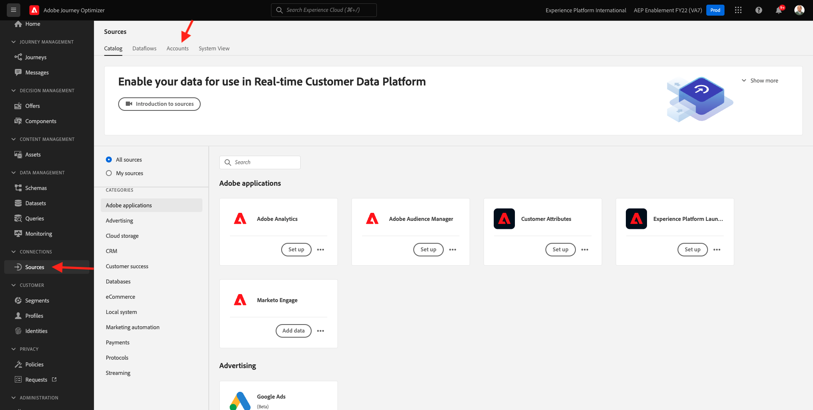

# 10.5 Create a business event journey

Login to Adobe Journey Optimizer by going to [Adobe Experience Cloud](https://experience.adobe.com). Click **Journey Optimizer**.


You'll be redirected to the **Home**  view in Journey Optimizer. First, make sure you're using the correct sandbox. The sandbox to use is called `--aepSandboxId--`. To change from one sandbox to another, click on **PRODUCTION Prod (VA7)** and select the sandbox from the list. In this example, the sandbox is named **AEP Enablement FY22**. You'll then be in the **Home** view of your sandbox `--aepSandboxId--`.


## 10.5.1 Create a business event

In the left menu, click **Configurations**. Click on the **Manage** button inside the **Events** card.


Business events are a new type of event you can create inside Journey Optimizer. Unlike the **Unitary** events that you have created in previous modules, the business events are not triggered by the customer but by the organization. You'll now create your business event. 

Click **Create Event**.


Enter the following values in the Event creation form:

- **Name**: `--demoProfileLdap--ItemBackInStock`. For instance: **vangeluwItemBackInStock**
- **Description**: This event is triggered when a product is back in stock
- **Type**: select **Business** in the drop down


For the Schema, select **Demo System - Event Schema for JO Business Events (Global v1.1) v.1**. You now need to select the fields in the schema that you require for our use case. 


Follow these steps:

Click the **pencil** icon on the field where it says **1 field selected**.


Select all available fields in the schema, then click **OK**.


For the condition: you need to specify which records in this schema will be triggering the business event. 
  
Follow these steps:

Click the **pencil** icon on the field where it says **Add a condition**.


On the left-hand side, expand the `--aepTenantId--` object, expand the object **joBusinessEvents** and drag and drop the field **eventName** onto the canvas.


For the field **eventName**, enter the following value: `--demoProfileLdap--ItemBackInStock`. For instance: vangeluwItemBackInStock.
Click **OK**.


Click **OK**.


Finally your event creation form should look like this. Click **Save** to save your business event.



## 10.5.2 Create a business event journey

You can now leverage this business event and the message inside a journey. Go to **Journeys**. Click **Create Journey**.



On the right-hand side you will see a form where you need to specify the journey name and description. Enter the following values:

- **Name**: `--demoProfileLdap-- - Item back in stock journey`. For instance: vangeluw - Item back in stock journey
- **Description**: This journey sends an SMS when an item is back in stock to visitor who have shown an interest.

Click **OK**. 


In the left menu, under **Events**, search for your ldap. You'll find the previously created business event `--demoProfileLdap--ItemBackInStock`. Drag and drop this event onto the canvas as this will be the starting point of the journey. 


As you can see, a **Read Segment** activity has automatically been added to the canvas. This is because the business events only send a trigger for the journey to read a specific segment, which will then retrieve the list of profiles for that journey.

Click the **Read Segment** activity.
The **Read Segment** configuration expects you to select the segment that you want to notify of the business event that just happened. Click the **Select a segment** field.



In the **Choose a segment** popup, search for your ldap and select the segment you created in [Module 6 - Real-time CDP - Build a segment and take action](../module6/real-time-cdp-build-a-segment-take-action.md) named `--demoProfileLdap-- - Interest in PROTEUS FITNESS JACKSHIRT`. for example: vangeluw - Interest in PROTEUS FITNESS JACKSHIRT. Click **Save**.


Next, click **Ok**. 


The next step is to drag and drop the action that we want to perform in this journey. Select the action **SMS**, then drag and drop it after the condition you just added. 


Set the **Category** to **Marketing** and select a sms surface that enables you to send sms. In this case, the email surface to select is **SMS**. 


The next step is to create your message. To do that, click **Edit content**.


You'll now see the message dashboard, where you can configure the text of your SMS. Click the **Compose message** area to create your message.


Enter the following text: `Hi {{profile.person.name.firstName}}, the Proteus Fitness Jackshirt is back in stock at Luma.`. Click **Save**.



Go back to the message dashboard by clicking the **arrow** next to the subject line text in the top-left corner.


You'll now see your completed SMS action. Click **Ok**.


Your journey is now ready to be published. Click **Publish**.


Click **Publish** again.


Your journey is now published, you can now test it!


## 10.5.3 Test your business event journey

You'll now simulate the re-stock of a product by ingesting a new event against the **Demo System - Event Schema for JO Business Events (Global v1.1) v.1** using Postman.

In the left menu, click **Sources** and then click on the **Accounts** tab.



On the **Accounts** tab, you'll find the account named **Journey Optimizer Business Events**. Click it to open it.


This account only has one dataflow, click on the dataflow name to select it.


Click **Copy schema payload** in the right menu. This option copies the entire **curl** command to insert a record against the **Demo System - Event Schema for JO Business Events (Global v1.1) v.1** to your clipboard.


Paste the Curl command inside a text editor


Let's have a closer look to this request,

- The POST request is sent to the DCS Inlet ID
- The request references the schema, the dataset and the Organization ID.
- Finally it contains the xdmEntity node which represents the data that we want to create inside the dataset. 

You now need to replace the following `xdmEntity` line...

```json
"xdmEntity": {
  "_experienceplatform": {
    "joBusinessEvents": {
      "eventDescription": "string",
      "eventName": "string",
      "stockEventId": "string"
    }
  },
  "_id": "/uri-reference",
  "eventType": "advertising.completes",
  "timestamp": "2018-11-12T20:20:39+00:00"
}
```

...by this line, make sure to verify the field eventName as it should say `--demoProfileLdap--ItemBackInStock`, which represents the condition you have specified in your business event to trigger your journey.

```json
"xdmEntity": {
  "_experienceplatform": {
    "joBusinessEvents": {
      "eventDescription": "Product Proteus Fitness Jackshirt is back in stock",
      "eventName": "--demoProfileLdap--ItemBackInStock",
      "stockEventId": "1"
    }
  },
  "_id": "/uri-reference",
  "eventType": "productBackInStock",
  "timestamp": "2021-04-19T15:25:39+00:00"
}
```

The updated **curl** command should look like this:


Select all of it and copy it to your clipboard.

Open Postman. On the left-hand side of Postman, click **Import**.


Select the **Raw text** tab and paste the command previously copied here. Click **Continue**.


Click **Import**.


Postman has automatically converted the **curl** command into a REST command ready to be triggered, simply press the **Send** button to request the creation of that record inside the dataset.


Verify that your request has been successfully received. Look for a **200 OK** status in postman.


The SMS may take a couple of minutes to arrive on your mobile phone. If it does not, your **Interest in Proteus Fitness Jackshirt** segment may not contain a profile with a correct mobile phone. If so, go on the Luma website, visit the **Proteus Fitness Jackshirt** product and register while making sure you provide the correct mobile phone number.


You have now finished this exercise.

Next Step: [Summary and benefits](./summary.md)

[Go Back to Module 10](./journeyoptimizer.md)

[Go Back to All Modules](../../overview.md)
