# 11.2 Configure an Advertising Destination like Google DV360

>[!IMPORTANT]
>
>The below content is intended as FYI - You do **NOT** have to configure a new destination for DV360. The destination has already been created and you can use it in the next exercise.

Log in to Adobe Experience Platform by going to this URL: [https://experience.adobe.com/platform](https://experience.adobe.com/platform)

After logging in, you'll land on the homepage of Adobe Experience Platform.

Before you continue, make sure you are in the `Production Prod` environment in the blue line on top of your screen.

In the left menu, go to **Destinations**.

You'll then see the **Destinations** homepage.

Set the **Type** switcher to **Connections**.

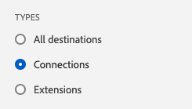

You'll now see this:

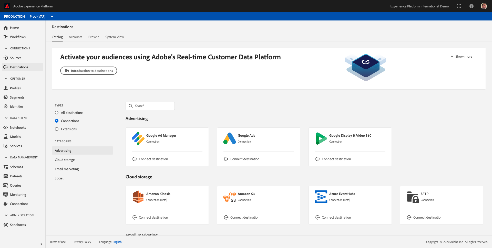

In **Destinations**, click on **Google Display & Video 360**.

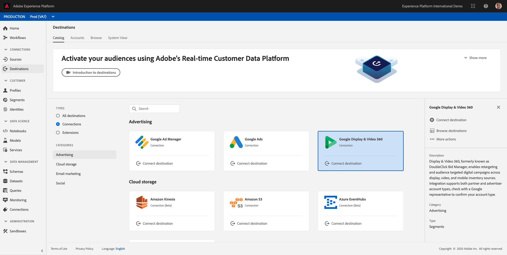

Click on **Connect Destination**.

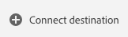

You'll then see this:

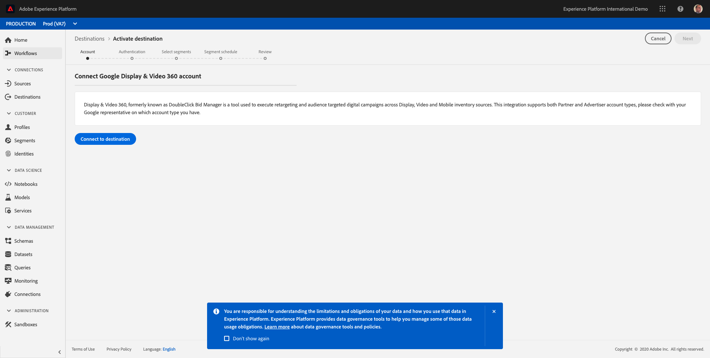

Click **Connect to destination**.

You'll then see a visual confirmation.

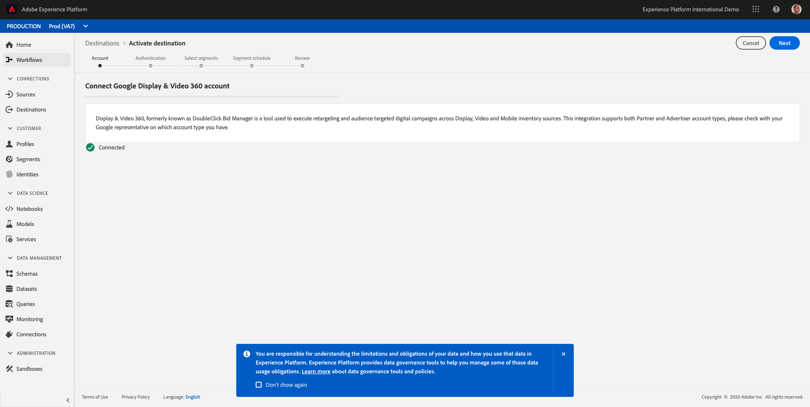

Click **Next**.

In the next screen, you'll see the Self-Service UI to configure your destination to Google DV360.

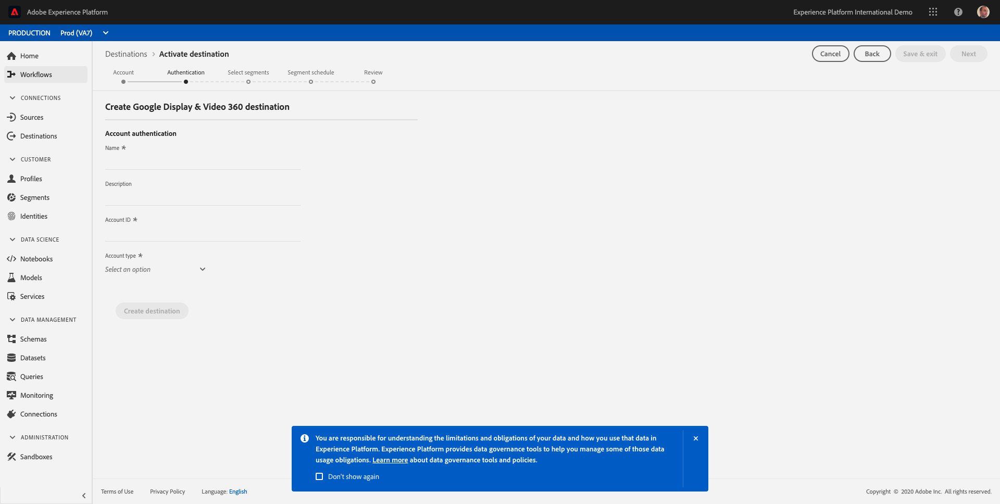

Enter a value in the fields **Name** and **Description**.

The field **Account ID** is the **Advertiser ID** of the DV360 Account. You can find that here:

The **Account Type** should be set to **Invite Advertiser**.

Now you have something like this:

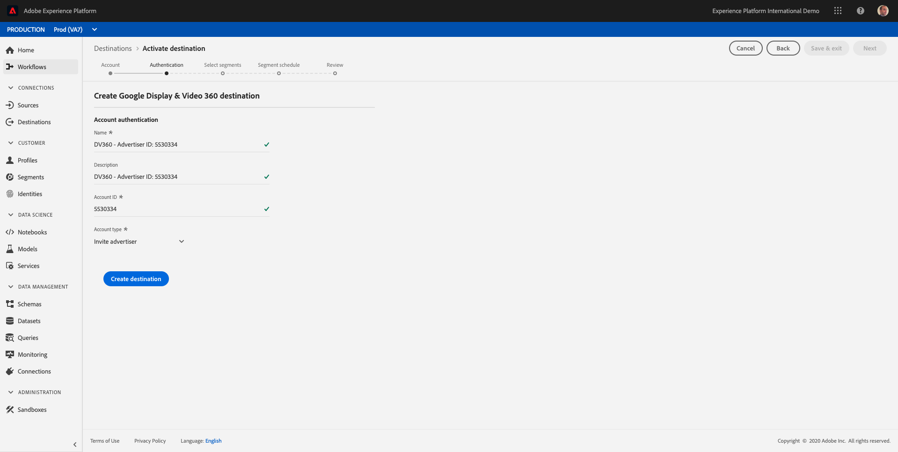

FYI - If you have configured DV360/DBM integrations in the past for Adobe Audience Manager projects, it was also required to contact Google for this setup and request Google to **allow-list** Adobe to send segments to DV360/DBM. This step is still required and as such, Google needs to allow-list Adobe in order for Adobe Experience Platform to speak with Google DV360.

Click **Create** to create your destination.

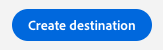

After creating the destination, you'll see this:

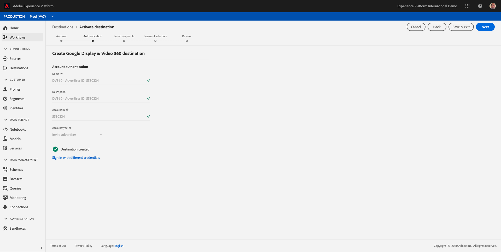

Click **Next**.

You can then select segments to be sent to this destination:

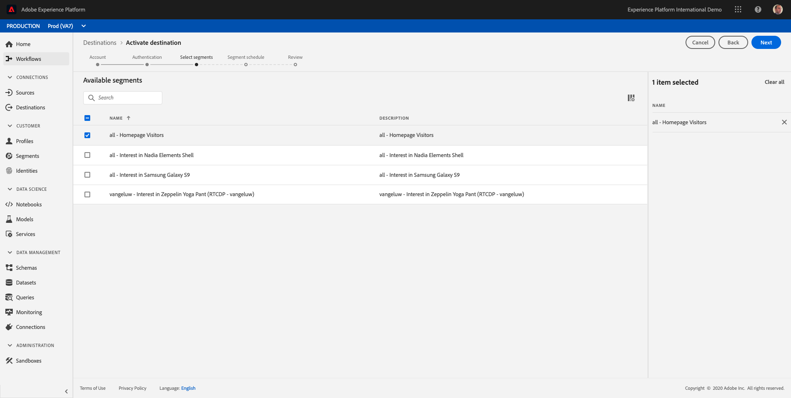

Click **Next**.

On the **Segment Schedule** page, click **Next**.

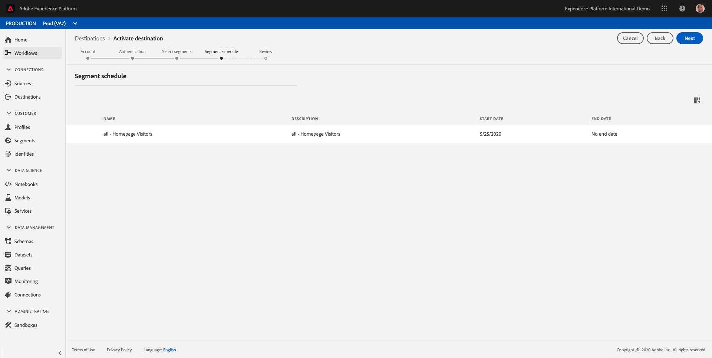

Finally, on the **Review** page, click **Finish**.

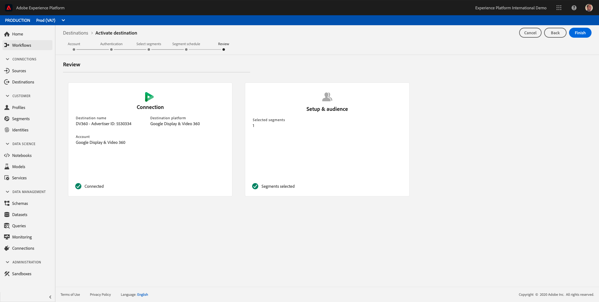

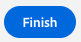

In the next exercise, you'll connect the segment you built in the previous to the Google DV360 destination.

Next Step: [11.3 Take Action: send your segment to DV360](./ex3.md)

[Go Back to Module 11](./real-time-cdp-build-a-segment-take-action.md)

[Go Back to All Modules](../../overview.md)
