# 11.4 - Take Action: Send your segment to Google AdWords RLSA using Adobe Audience Manager (AAM)

Adobe Experience Platform and Adobe Audience Manager are closely connected to each other. The way they are connected is through a bi-directional segment sharing connector. This means that all segments built in Adobe Experience Platform are shared to Adobe Audience Manager, and all segments built in Adobe Audience Manager are shared to Adobe Experience Platform.

When a segment is first built in Adobe Experience Platform, it will take an initial 4-6 hours to synchronize the segment definition and after this initial 4-6 hours, new segment qualifications in Adobe Experience Platform are shared in real-time towards Adobe Audience Manager.

When a segment is first built in Adobe Audience Manager, it will take an initial 2-3 hours to synchronize the segment definition and after this initial 2-3 hours, new segment qualifications in Adobe Audience Manager are shared with an 30-60 minute delay towards Adobe Experience Platform.

Let's have a look at Adobe Audience Manager now.

## Use a Platform Segment as a Segment in AAM

The URL to login to Adobe Audience Manager is: [http://experiencecloud.adobe.com/](http://experiencecloud.adobe.com/).

Click on **Audience Manager** to open it.

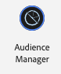

You'll then see this page:

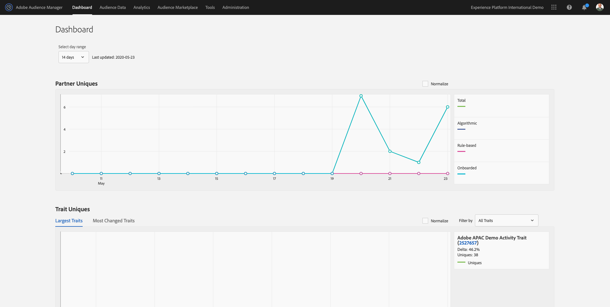

Go to **Audience Data** and then to **Segments**.

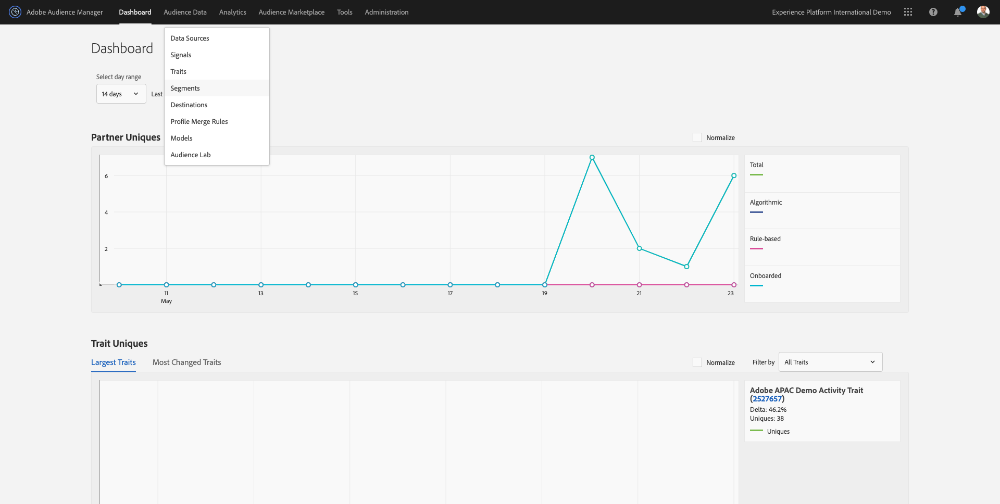

In **Segments** in Adobe Audience Manager, you can now see all the Adobe Experience Platform Segments already available in the folder **Experience Platform Segments**.

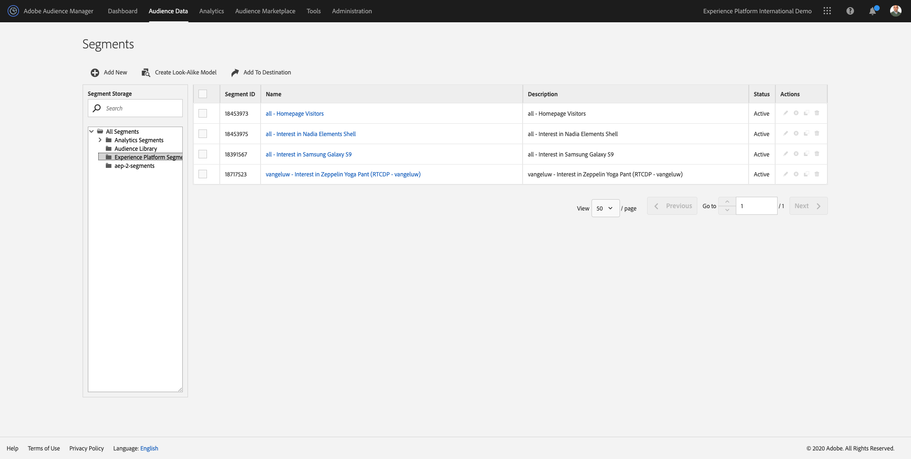

Search for your Platform segment, which may be on a different page.

Open the segment you built in 1 by clicking it. In this example, that is the segment `vangeluw - Interest in Zeppelin Yoga Pant (RTCDP - vangeluw)`. Make sure to copy the **Segment ID** as you'll need it in a couple of seconds.

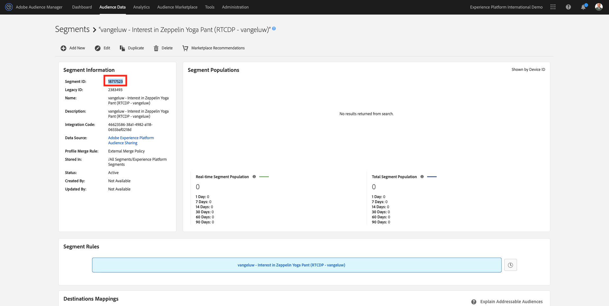

This segment was built in Adobe Experience Platform and cannot be edited anymore in Adobe Audience Manager. The only thing you can do here is link it to a **Destination** that is available in Adobe Audience Manager.

Click **Edit**.

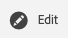

The screen now defaults to the **Destinations Mapping** view, so that you can link a Destination to the Segment.

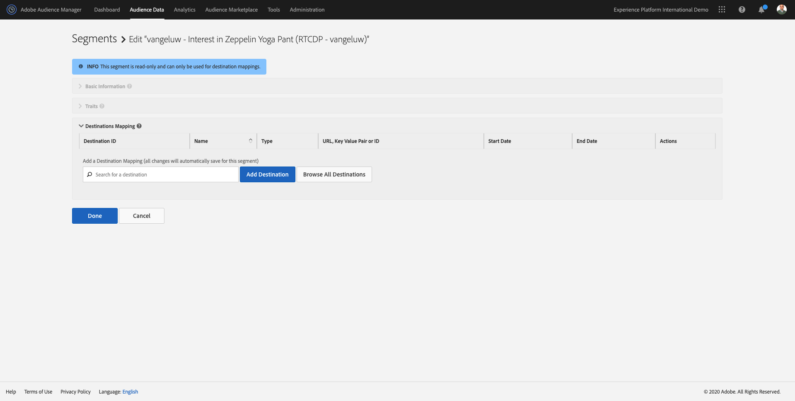

Click **Browse All Destinations**.

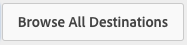

You'll see this popup, which makes it possible to link your segment that was built in Adobe Experience Platform to Google Adwords.

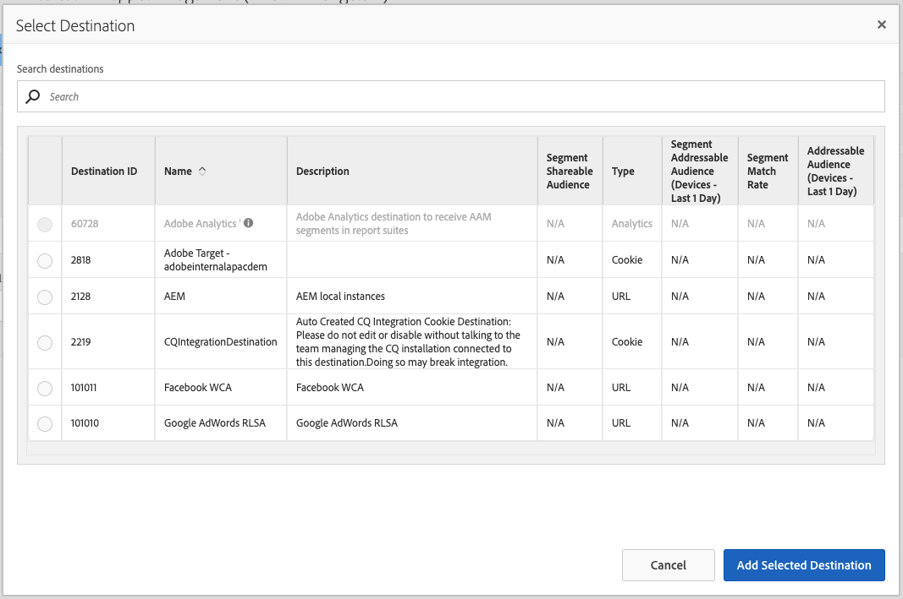

Click the button for the destination **Google AdWords RLSA**, followed by clicking **Add Selected Destination**.

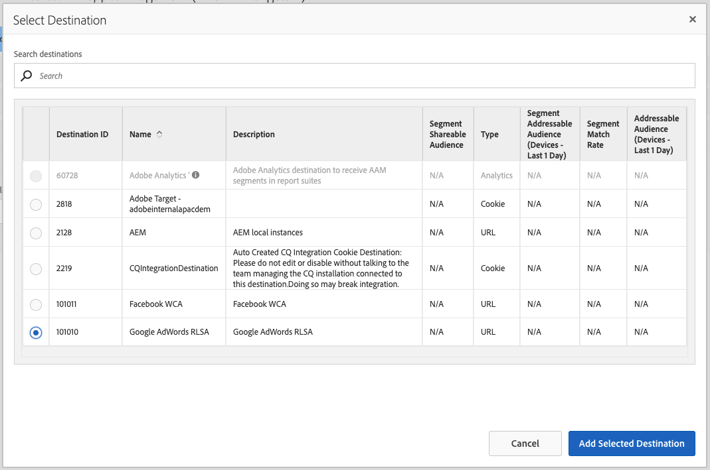

Fill out the Destination Value to send to Google AdWords. In this case, AdWords expects the format `aam=segmentId`. The Segment ID of this segment is `18717523` so that gives `aam=18717523`.

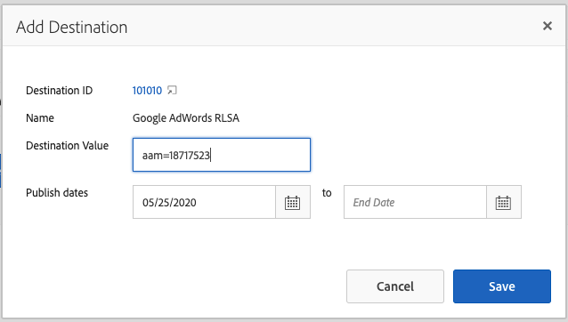

Click **Save**.

You'll then see your destination added to the segment.

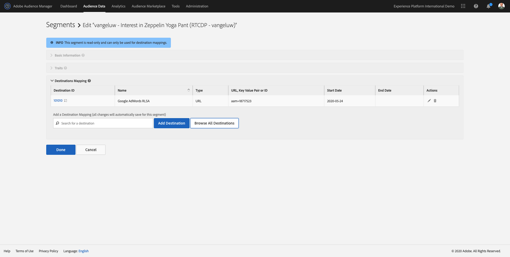

Click **Done** to save your changes.

As of this moment, everybody who qualifies for this segment in Adobe Experience Platform, will be sent to a Google AdWords Remarketing List for Search Advertising.

## Use a Platform Segment as a Trait in AAM

Every segment built in Adobe Experience Platform will also show up in Adobe Audience Manager as a Trait. This means that it is possible to enrich Adobe Experience Platform segments with for instance 2nd or 3rd Party Data in Adobe Audience Manager.

* 2nd Party Data = the 1st Party Data from another company that has been shared to your company because of an established partnership with that company
* 3rd Party Data = Data that you've purchased in a public Audience Marketplace

Go to **Audience Data** and then to **Traits**.

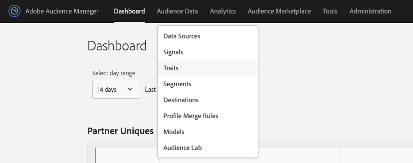

In **Traits** in Adobe Audience Manager, you can now see all the Adobe Experience Platform Segments already available as Traits, in the folder **Experience Platform Traits**.

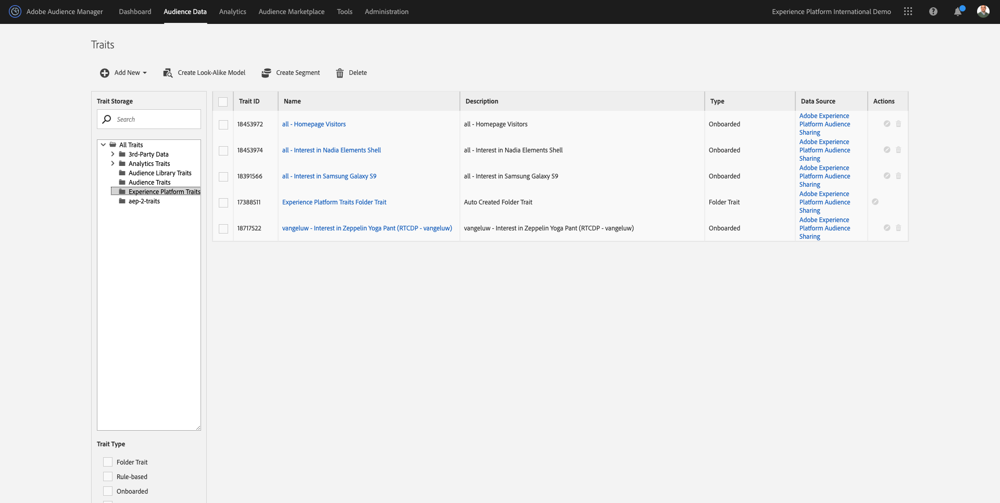

You can also see other Traits, like for instance, **All Traits** > **1st Party Data** > **Display Advertising Data** > **Impression Pixels**.
Every time a customer is seeing a Display Ad as part of for instance a Google DV360 Display Ad campaign, an impression pixel can fire and store the fact that a customer has seen this ad in Adobe Audience Manager.

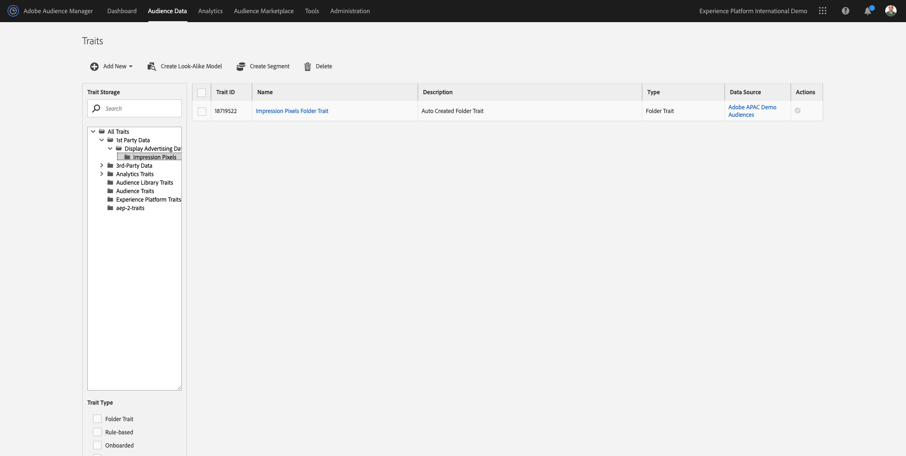

Our use-case here, will be to configure an Impression Pixel for an imaginary Display Ad Campaign for the product that was selected in 1. In this case, the selected product was **Zeppelin Yoga Pant** so an impression pixel needs to be defined for that now. You will then combine the segment of people who are interested in your product with the Impression Pixel, to avoid that a customer is seeing your Display Ad too many times. In our case, too many times is defined as more than 10 in the last 2 weeks.

Click **+ Add New** and select **Rule-Based** to add a new Trait.

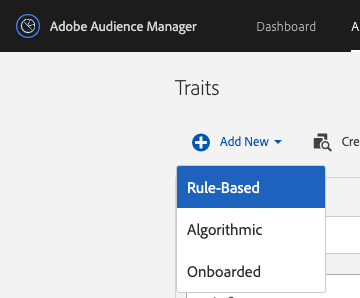

You now have an empty Trait to be configured.

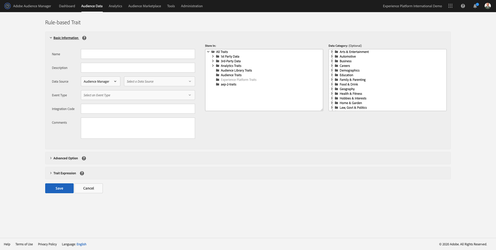

Fill out the details like this:

| Field Name              | Field Name              |
|:-----------------------:| :-----------------------|
| Name               | Display Ad Campaign - **Product Name** - ldap, for instance Display Ad Campaign - Zeppelin Yoga Pant - vangeluw|
| Description               | Display Ad Campaign - **Product Name** - ldap, for instance Display Ad Campaign - Zeppelin Yoga Pant - vangeluw|
| Data Source               | Audience Library              |
| Event Type               | Delivery Event             |
| Store In               | **All Traits** > **1st Party Data** > **Display Advertising Data** > **Impression Pixels**             |

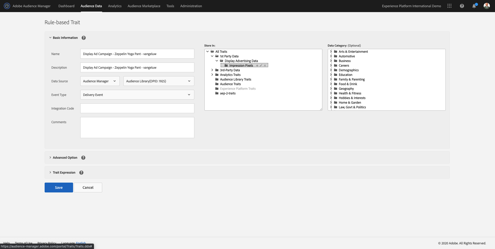

Click **Save**.

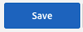

After saving, you'll be on this screen.

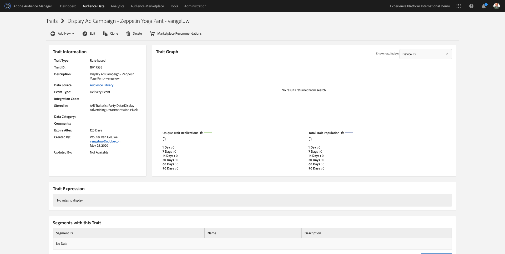

Go back to **Traits**.

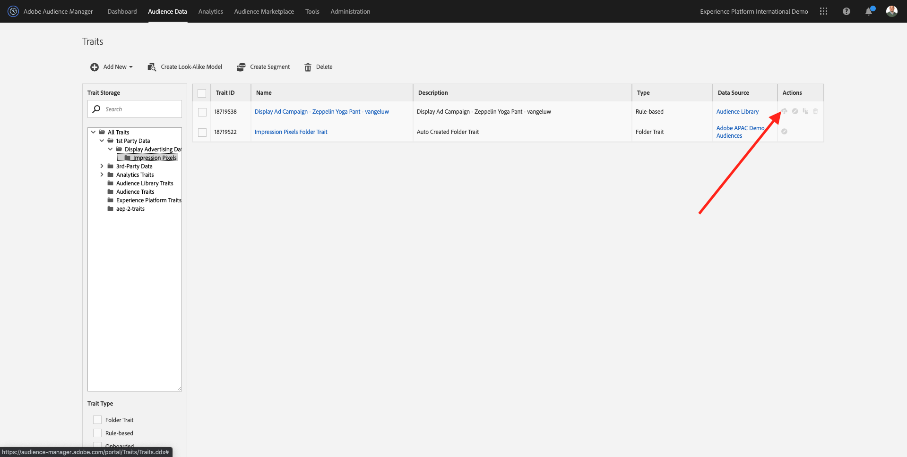

For completeness, if you'd want to deploy this Impression Pixel, you need the URL or Image Tag to embed in your creative, as part of your Display Ad Campaign. To find the URL or Image Tag, you need to click the little **cloud** icon as indicated in the screenshot.

You'll then see this. These URLs and Image Tags can used to embed them in the Display Ad Campaign.

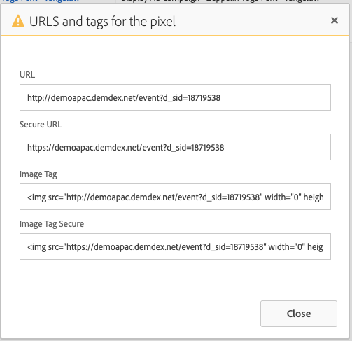

You now have 1 Trait for your Platform Segment, and another Trait for your Impression Pixel. Let's now combine these 2 Traits into a segment in Adobe Audience Manager.

Go to **Audience Data** and then to **Segments**.

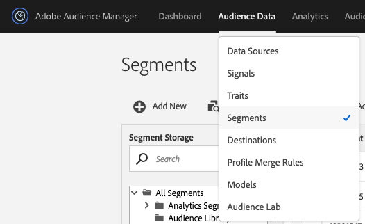

You'll see this screen:

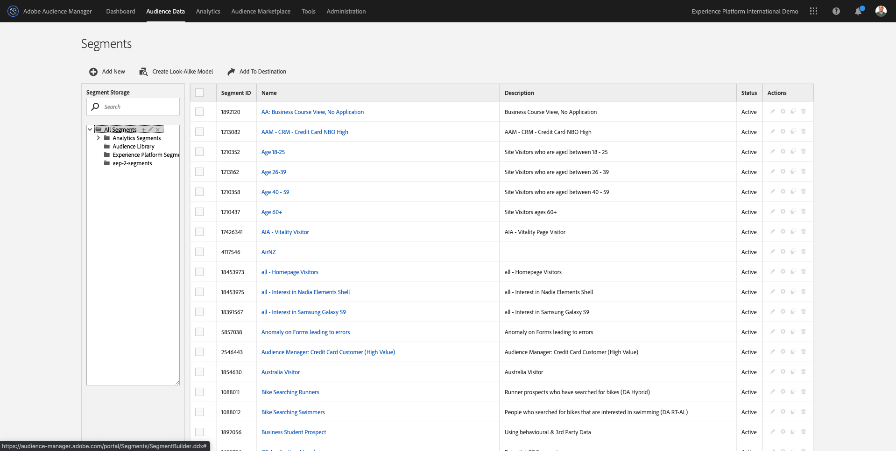

Click **+ Add New**.

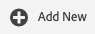

You'll then see an empty segment.

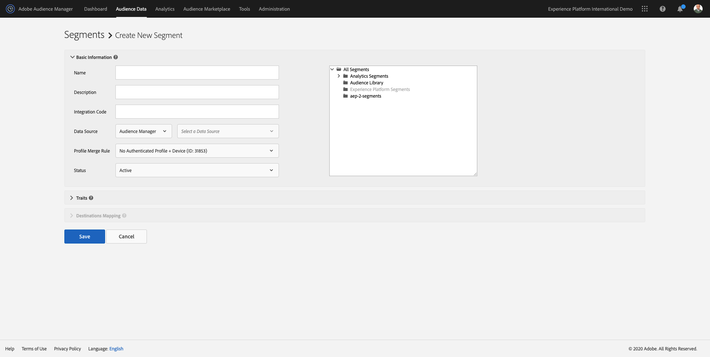

Fill out the Segment Basic Information like this:

| Field Name              | Field Name              |
|:-----------------------:| :-----------------------|
| Name               | Display Campaign **Product Name** - 10 impressions/2 weeks - ldap, for instance Display Campaign Zeppelin Yoga Pant - 10 impressions/2 weeks - vangeluw|
| Description               | Display Campaign **Product Name** - 10 impressions/2 weeks - ldap, for instance Display Campaign Zeppelin Yoga Pant - 10 impressions/2 weeks - vangeluw|
| Data Source               | Audience Library             |
| Profile Merge Rule               | Use the default Profile Merge Rule            |
| Status               | Active           |
| Store In               | **All Segments** > **Enablement Segments**|

That should look like this:

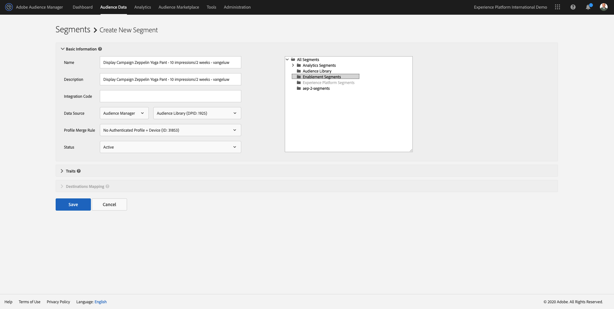

Go to the **Traits** view.

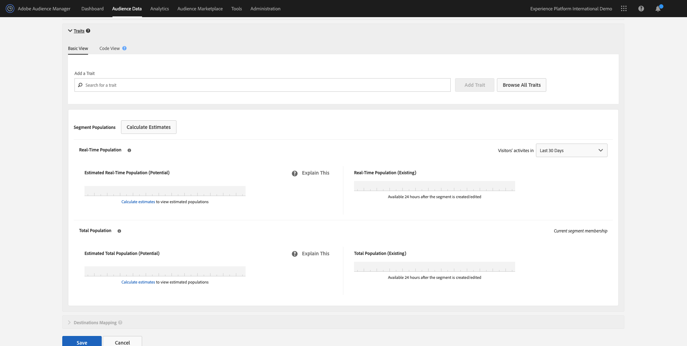

Click **Browse All Traits**.

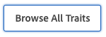

In the popup, navigate the Traits hierarchy to retrieve the Trait for your Adobe Experience Platform segment and select it.

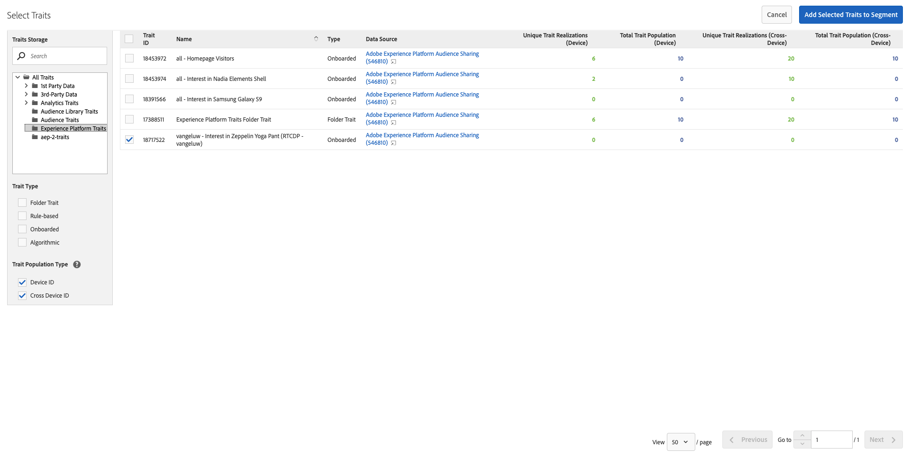

Next, navigate the Traits hierarchy to retrieve your Impression Pixel Trait and select it.

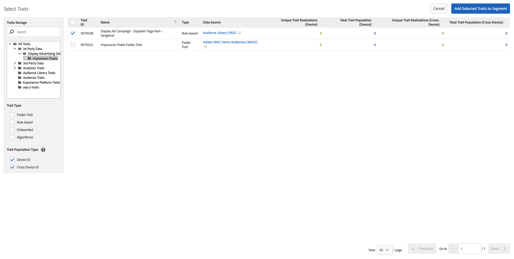

Click **Add Selected Traits to Segment**.

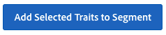

Your screen should now look like this:

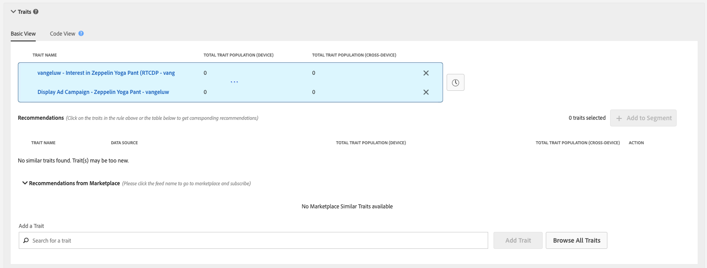

Hover over the 3 dots between your 2 Traits. You'll see a dropdown-list open up to define a relationship between your 2 Traits. Select the operator **AND NOT**.

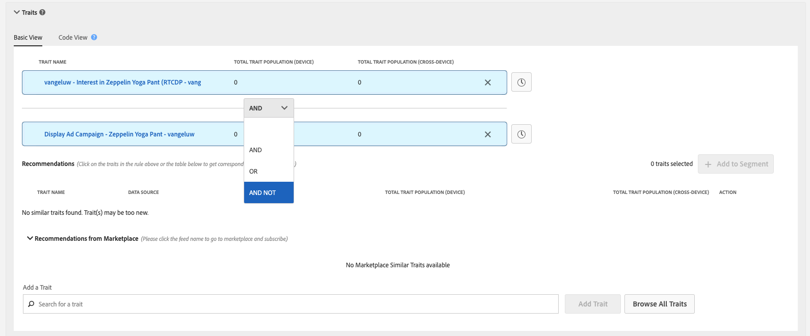

Next, click the little **clock** icon next to your Impression Pixel Trait.

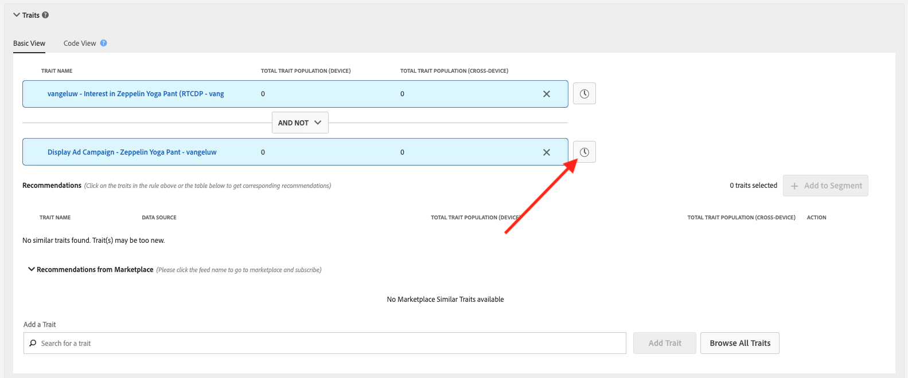

You can now set a recency and frequency for the Impression Pixel. Set it like this:

| Field               | Value              |
|:-----------------------:| :-----------------------|
| >=             | **10** times in            |
| <=             | **14** days ago         |

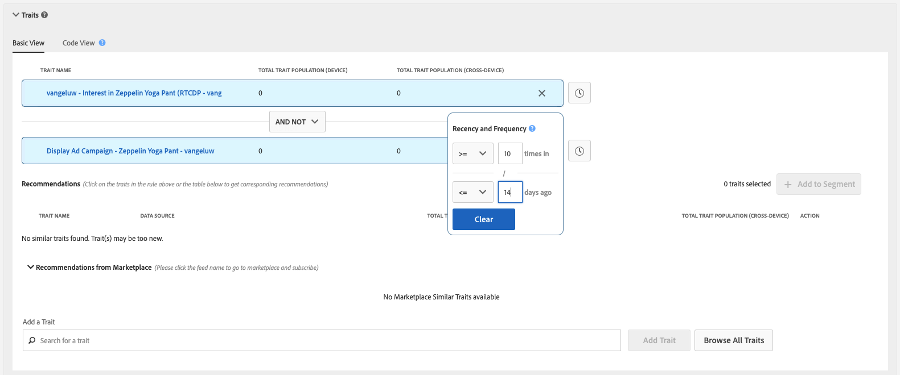

You should read this as follows:

Include everyone in this segment that qualifies for the Platform Segment of Interest in **product name**, but not those who have had 10 or more Ad Impressions for **productname** in the last 14 days.

Adobe Audience Manager will dynamically and in real-time re-evaluate this expression for every new hit. So at first, a customer will be included in this segment and the destinations linked to this segment will be able to target this customer. For every Ad Impression, a pixel will be fired, and the counter on the Impression Pixel will be incremented. When it reaches 10 or more, the **AND NOT** clause will be triggered and will remove that customer from the Segment in Adobe Audience Manager.

Next, scroll down and click **Save** to save your segment.

### Use an AAM Trait or Segment in Adobe Experience Platform

The Bi-directional Segment Sharing - connector works in both ways. That means that if you have a Trait or Segment that was built in Adobe Audience Manager natively, it will be shared towards Adobe Experience Platform.

To view AAM Traits or Segments in Adobe Experience Platform, log in to Adobe Experience Platform by going to this URL: [https://experience.adobe.com/platform](https://experience.adobe.com/platform)

After logging in, you'll land on the homepage of Adobe Experience Platform.

Before you continue, make sure you are in the `Production Prod` environment in the blue line on top of your screen.

In the menu on the left side, go to **Segments**.

On this page, you can see an overview of all existing segments.

Click on the **Create Segment** button to start creating a new segment.

Go to **Audiences** in the Segment Builder.

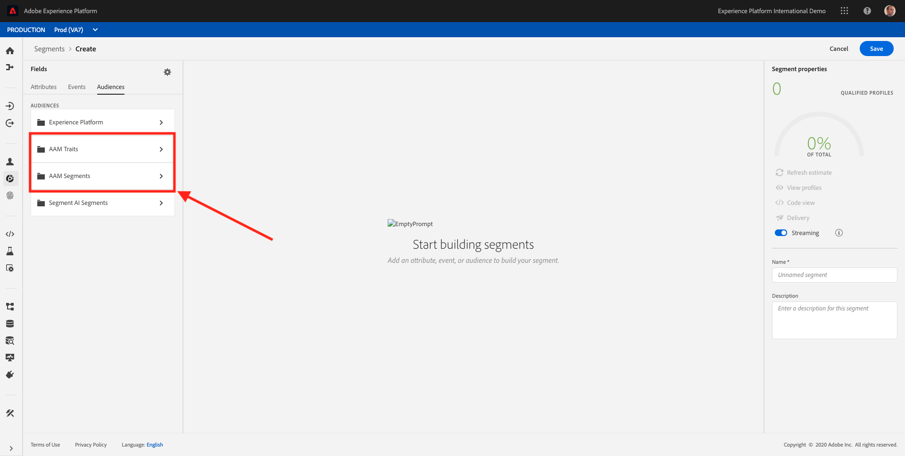

In the list of available Audiences, you can see **AAM Traits** and **AAM Segments**.

Those lists will dynamically populate with all AAM Traits and AAM Segments, so that they can be reused and enriched in Adobe Experience Platform.

Next Step: [11.5 Take Action: send your segment to an S3-destination](./ex5.md)

[Go Back to Module 11](./real-time-cdp-build-a-segment-take-action.md)

[Go Back to All Modules](../../overview.md)
