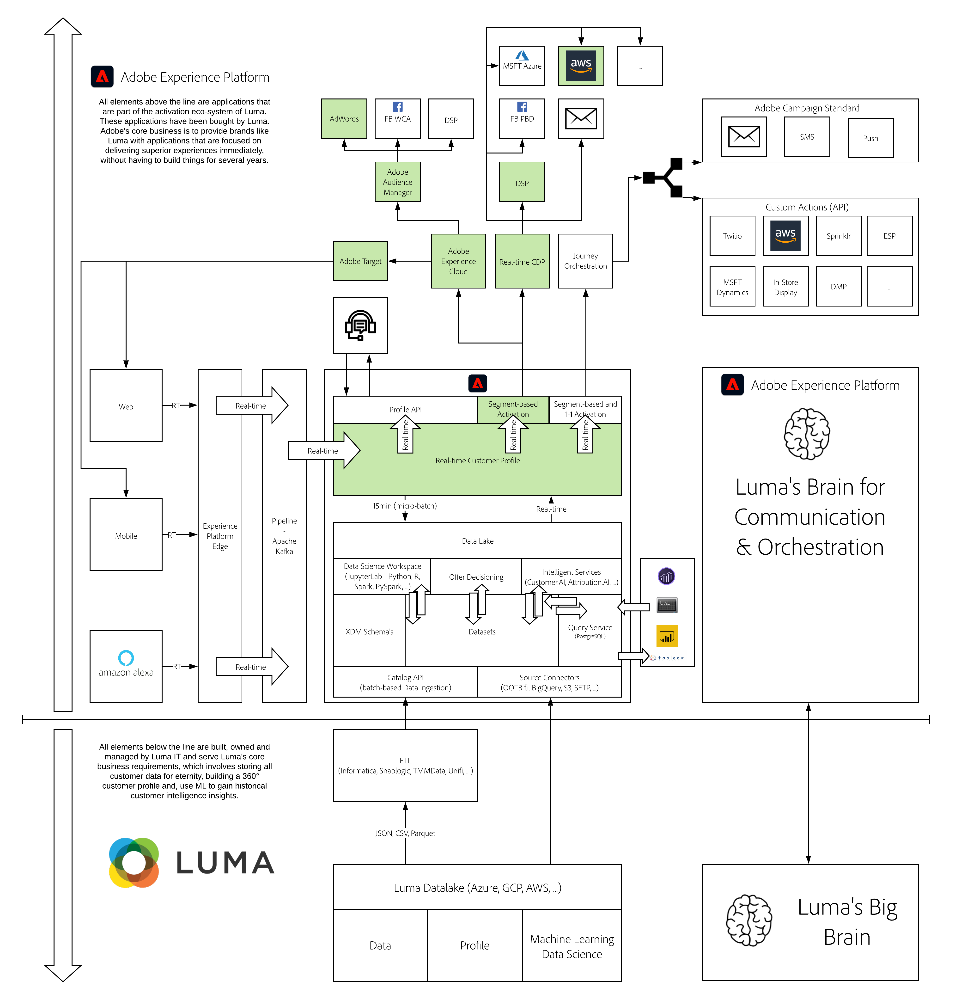

# 11. Real-time CDP - Build a segment and take action

**Author: [Wouter Van Geluwe](https://www.linkedin.com/in/woutervangeluwe/)**

In this module, you'll configure a streaming segment and activate the segment to multiple destinations.

## Learning Objectives

- Learn how to build a segment and enable it for streaming.
- Learn how to configure an advertising destination using the Adobe Experience Platform UI.
- Learn how to connect a segment to a destination and activate it.
- Learn how to use Adobe Experience Platform segments in Adobe Audience Manager, and how to use Adobe Audience Manager segments in Adobe Experience Platform, thanks to bi-directional segment sharing.

## Prerequisites

- Access to Adobe Experience Platform: [https://experience.adobe.com/platform](https://experience.adobe.com/platform)
- Access to Adobe Audience Manager
- Access to Adobe Target
- Access to AWS S3
- This documentation has been created to facilitate hands-on, technical enablement around Adobe Experience Platform. In order to complete some of the modules, you'll need to change some variables and replace them by your specific **Environment Variables**. Please contact your Adobe contact who will provide you with the required **Environment Variables** of your specific Adobe Experience Platform instance.

>[!IMPORTANT]
>
>This tutorial was created to facilitate a particular workshop format. It uses specific systems and accounts to which you might not have access. Even without access, we think you can still learn a lot by reading through this very detailed content. If you're a participant in one of the workshops and need your access credentials, please contact your Adobe representative who will provide you with the required information.

## Architecture Overview

Have a look at the below architecture, which highlights the components that will be discussed and used in this module.

## Sandbox to use

For this module, please use this sandbox: `--module11sandbox--`.

>[!NOTE]
>
>Don't forget to install, configure and use the Chrome Extension as referenced in [0.5 - Install the Chrome extension for the Experience League documentation](../module0/ex5.md)

## Exercises

[11.1 Build a segment and enable Streaming Segmentation](./ex1.md)

Learn how to build a segment and enable streaming segmentation.

[11.2 Review how to configure DV360 Destination using Destinations](./ex2.md)

Learn how to configure an advertising destination using the Adobe Experience Platform UI.

[11.3 Take Action: send your segment to DV360](./ex3.md)

Connect the segment you built in Exercise 11.1 to the destination DV360.

[11.4 Take Action: Send your segment to Google AdWords RLSA using Adobe Audience Manager](./ex4.md)

Connect the segment you built in Exercise 11.1 to the destination Google Remarketing List for Search Advertising by making use of Adobe Audience Manager.

[11.5 Take Action: send your segment to an S3-destination](./ex5.md)

Use the segment you built in Exercise 11.1 and send it to an S3-destination, typically used for Email Marketing-destinations.

[11.6 Take Action: send your segment to Adobe Target](./ex6.md)

Use the segment you built in Exercise 11.1 to configure an Experience Targeting Activity in Adobe Target.

[Summary and benefits](./summary.md)

Summary of this module and overview of the benefits.

>[!NOTE]
>
>Thank you for investing your time in learning all there is to know about Adobe Experience Platform. If you have questions, want to share general feedback of have suggestions on future content, please contact Wouter Van Geluwe directly, by sending an email to **vangeluw@adobe.com**.

[Go Back to All Modules](../../overview.md)
