# 12.5 Trigger your Orchestrated Customer Journey

In this exercise, you'll test and trigger the Orchestrated Journey you configured in this module.

* Go to your Platform Demo website.

* You'll be redirected to the **Admin** page. Go to **Select LDAP**.

   

* Select your LDAP and click **Save**.

   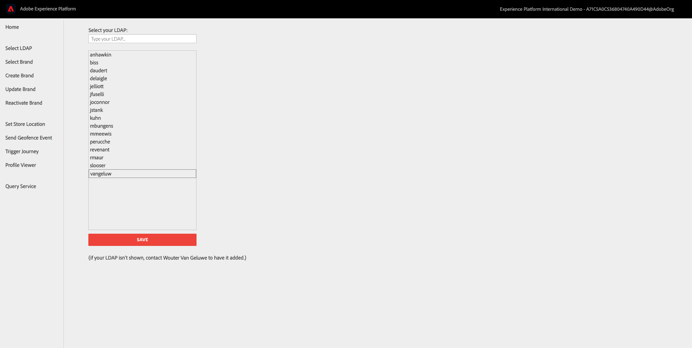

* Back on the **Admin** page, click **Select Brand**.

   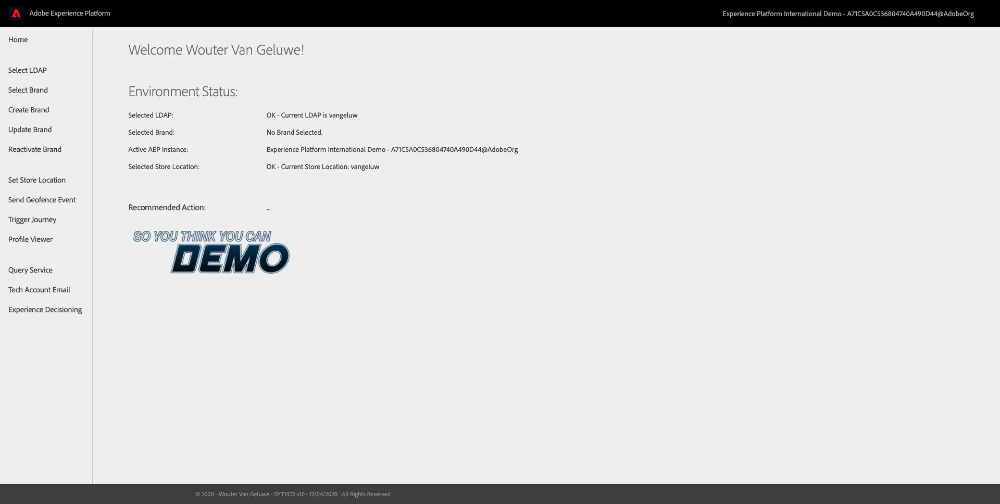

* Select a brand from the list of available brands. Click **Save**.

   

* Wait 10 seconds for the brand to load.

* From the Admin homepage, click the logo of your brand.

   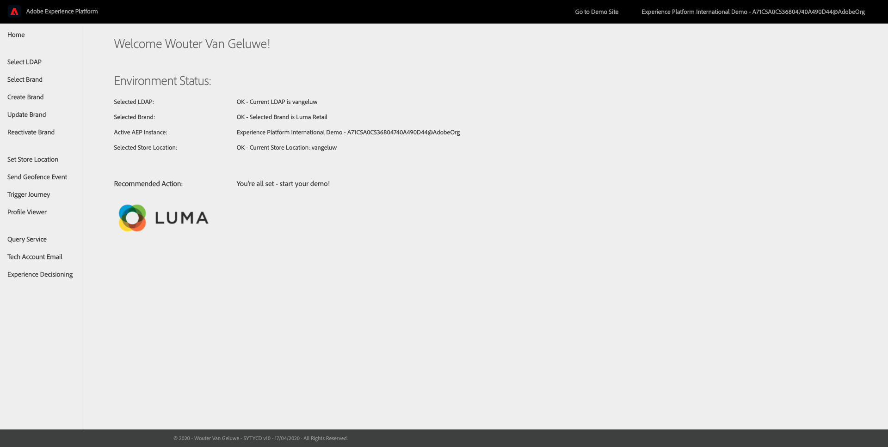

* You're now on the homepage of your brand.

   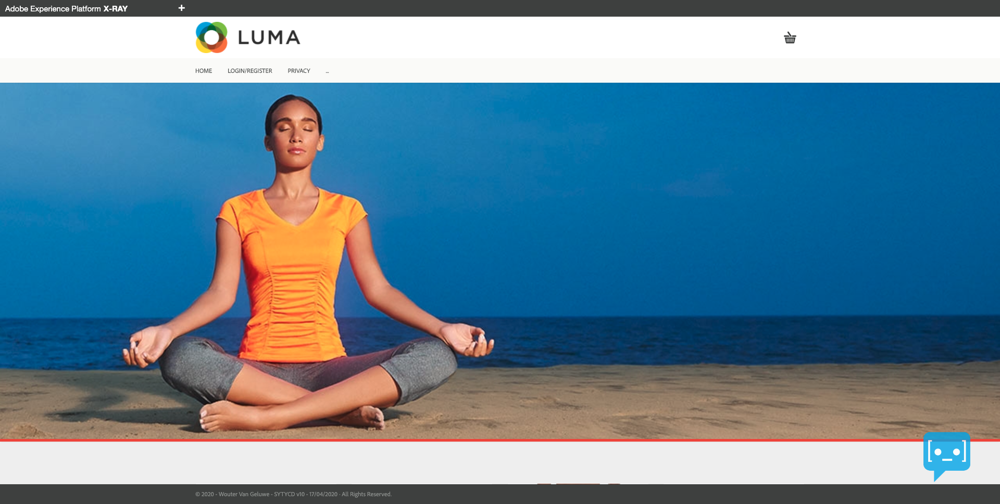

* Go to the Register/Login page
  
   >[!IMPORTANT]
   >
   > Please use the following naming convention for your Mobile Phone Number:
   > If your number is 0473622044, you have to enter **+32473622044+DDMMYYYY-XX** as a number, otherwise the sending of SMSs doesn't work. For instance, **+32473622044+26052020-1**
  
  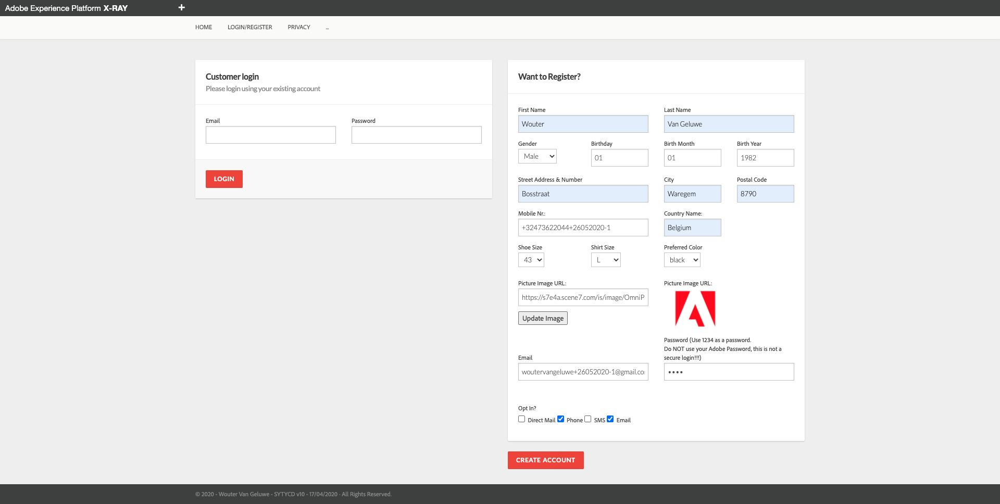

* Fill out your registration details and click **CREATE ACCOUNT**.

* After login, go to the Homepage of the website and open the X-ray panel, go to Real-time Customer Profile. On the X-ray panel, you should see all of your personal data displayed.

   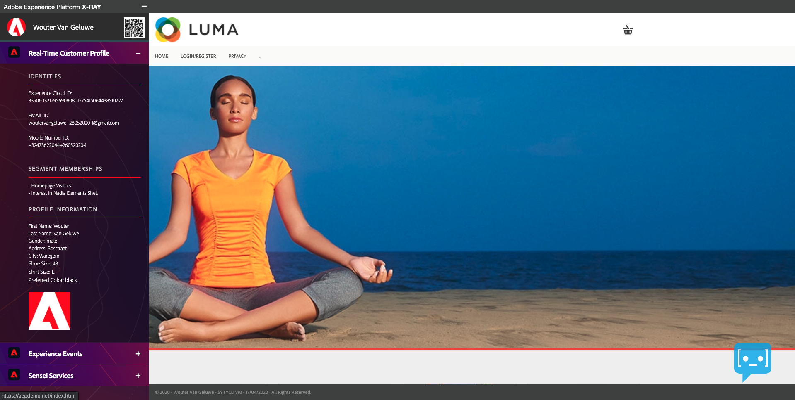

* In the website's menu, click on the **3 dots** and select **Admin**.

   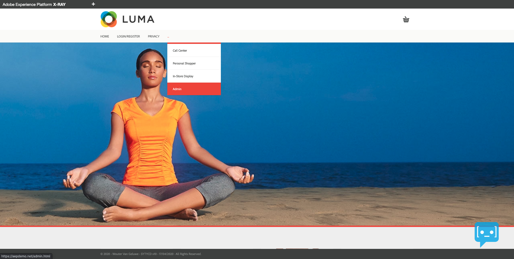

* You'll then see the **Admin** page. Click **Send Geofence Event**.

   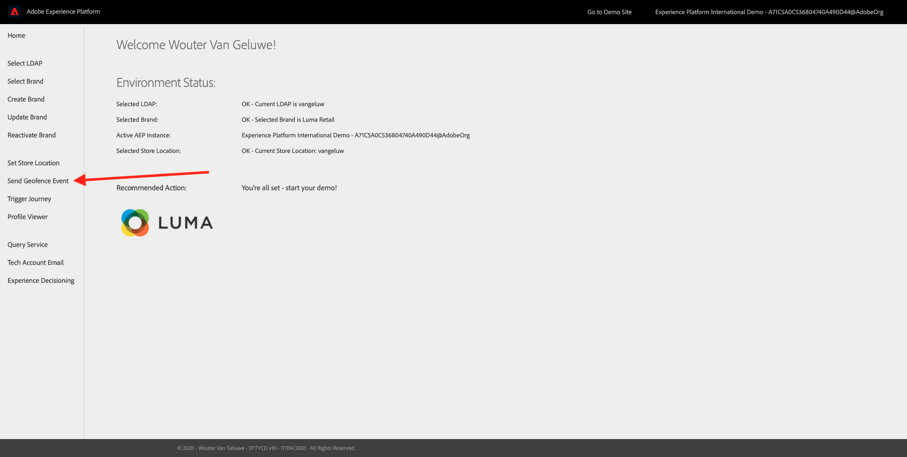

* You'll then see this:

   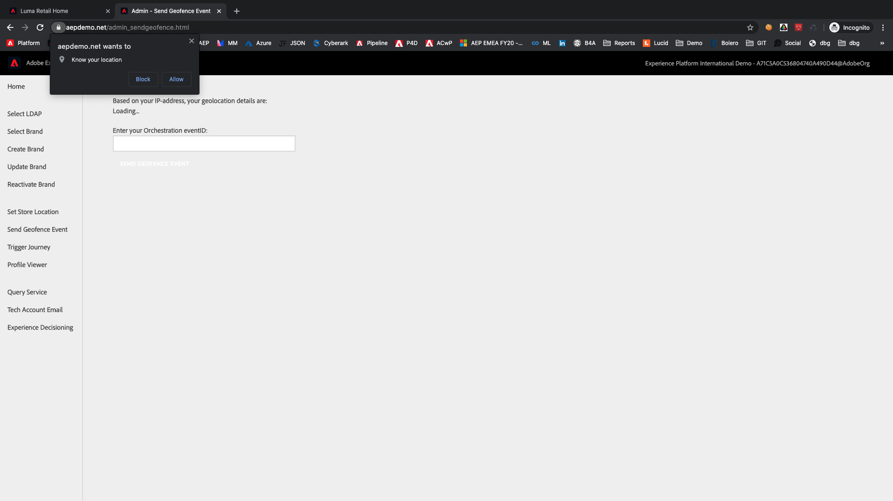

* On the **Send Geofence Event** page, click **Allow** on the prompt to **Know your location**.

   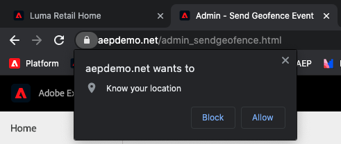

* After 1-2 seconds (sometimes this can take up to 1-2 minutes), you'll see the coordinates, city and country of your approximate location. Once the coordinates are shown, you have to enter your Orchestration eventID from 1. In this example, the **eventID** is **d9b5069cebd47bb3394e192da031d933a9e10d67046dadde999ec7401eb7bd51**.

   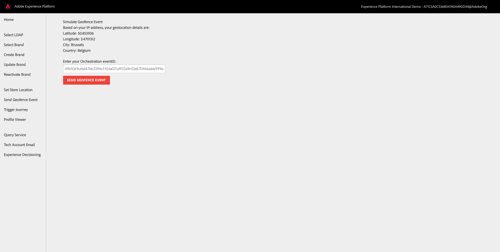

* Click **Send Geofence Event**. You'll get a visual confirmation when the Geofence Event has been sent.

  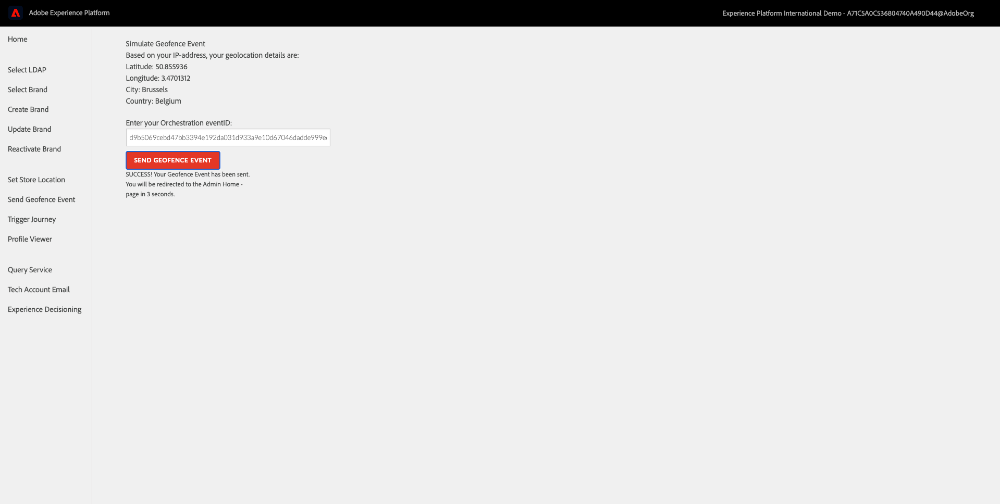

* You should then receive a SMS Message on the Mobile Phone that was attached to your Real-time Customer Profile. The SMS Message will depend on the current weather and the temperature, just like you configured in your Journey.

   >[!NOTE] Twilio doesn't support Indian Mobile Numbers, so if you have an mobile phone number starting with +91, you won't receive any SMS. 

  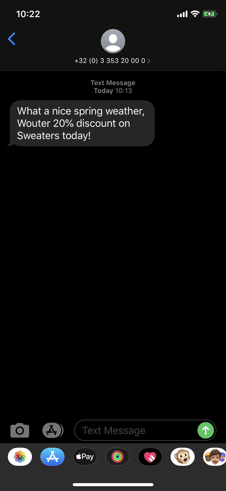

* The same message will also be sent to the Adobe Hands-On Lab Slack channel. Your trainer is able to show you the received messages in the Slack channel.
  
  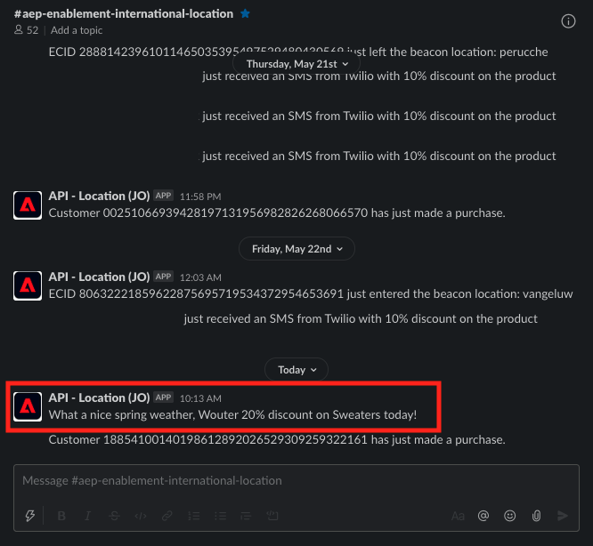

If you've received your SMS Message, you've successfully completed this module! 

[Go Back to Module 12](journey-orchestration-external-weather-api-sms.md)

[Go Back to All Modules](../../overview.md)
