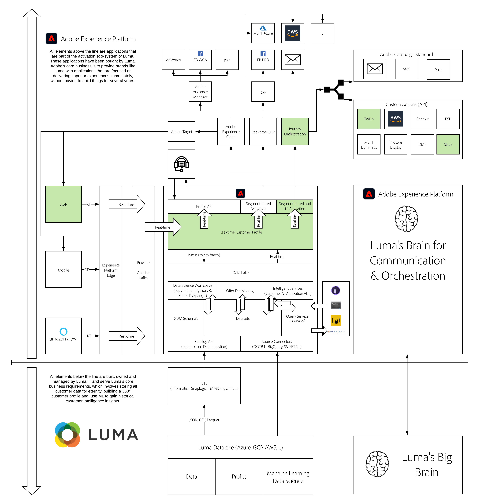

# 12. Journey Orchestration - External Weather API, SMS Action & more

**Author: [Wouter Van Geluwe](https://www.linkedin.com/in/woutervangeluwe/)**

In this module, you'll use Journey Orchestration to listen to customer behavior, both online and offline, and respond to it in an intelligent, contextual and real-time way. You've already had an initial hands-on experience with Journey Orchestration in Module 6. In this exercise, you'll go a bit deeper and explore a more advanced use case whereby external data sources are used as part of a journey.

## Learning Objectives

- Learn how to create events, external data sources and journeys in Journey Orchestration
- Learn how to consume weather information from the Open Weather API
- Learn how to use custom action destinations like Twilio and Slack from Journey Orchestration

## Prerequisites

- Access to Adobe Experience Platform: [https://experience.adobe.com/platform](https://experience.adobe.com/platform)
- Access to Journey Orchestration
- Access to the Open Weather API
- Access to Twilio
- This documentation has been created to facilitate hands-on, technical enablement around Adobe Experience Platform. In order to complete some of the modules, you'll need to change some variables and replace them by your specific **Environment Variables**. Please contact your Adobe contact who will provide you with the required **Environment Variables** of your specific Adobe Experience Platform instance.

>[!IMPORTANT]
>
>This tutorial was created to facilitate a particular workshop format. It uses specific systems and accounts to which you might not have access. Even without access, we think you can still learn a lot by reading through this very detailed content. If you're a participant in one of the workshops and need your access credentials, please contact your Adobe representative who will provide you with the required information.

## Architecture Overview

Have a look at the below architecture, which highlights the components that will be discussed and used in this module.

## Business Context

As a brand, you've invested heavily in personalizing online experiences. Now, you want to be as contextual and relevant for offline experiences.
In this module, you'll use a customer's presence in an offline store to then deliver a personalized experience inside the store by showcasing relevant content to that customer on our in-store screens and at the same time, we want to deliver a personalized Push or SMS Message to that same customer, all in real-time.
As a brand, you also understand that context greatly impacts a customer's interest, so you want to bring in the current weather information of that customer's location, to decide what content or promotion to display.

## Sandbox to use

For this module, please use this sandbox: `--aepSandboxId--`.

>[!NOTE]
>
>Don't forget to install, configure and use the Chrome Extension as referenced in [0.5 - Install the Chrome extension for the Experience League documentation](../module0/ex5.md)

## Exercises

[12.1 Define an Event](./ex1.md)

Learn how to define a custom event using Journey Orchestration.

[12.2 Define an External Data Source](./ex2.md)

Learn how to configure an external Data Source using Journey Orchestration.

[12.3 Define a Custom Action](./ex3.md)

Learn how to define an external Action using Journey Orchestration.

[12.4 Design a trigger-based Customer Journey](./ex4.md)

Combine events, data sources and actions into an intelligent and contextual Journey.

[12.5 Trigger your Orchestrated Customer Journey](./ex5.md)

Trigger your specific Journey.

[Summary and benefits](./summary.md)

Summary of this module and overview of the benefits.

>[!NOTE]
>
>Thank you for investing your time in learning all there is to know about Adobe Experience Platform. If you have questions, want to share general feedback of have suggestions on future content, please contact Wouter Van Geluwe directly, by sending an email to **vangeluw@adobe.com**.

[Go Back to All Modules](../../overview.md)
