# 14.5 Test your Offer Activity using the API

## 14.5.1 Work with the Offer Decisioning API using Postman

Download [this Postman Collection for Offer Decisioning](./../../assets/postman/postman_module14_offer-decisioning.zip) to your desktop and unzip it. You'll then have this:

You now have this file on your desktop:

- \_Module 14- Decisioning Service.postman_collection.json

In [Exercise 3.3.3 - Postman authentication to Adobe I/O](./../../modules/module3/ex3.md) you installed Postman. You'll need to use Postman again for this exercise.

Open Postman. Click **Import**.

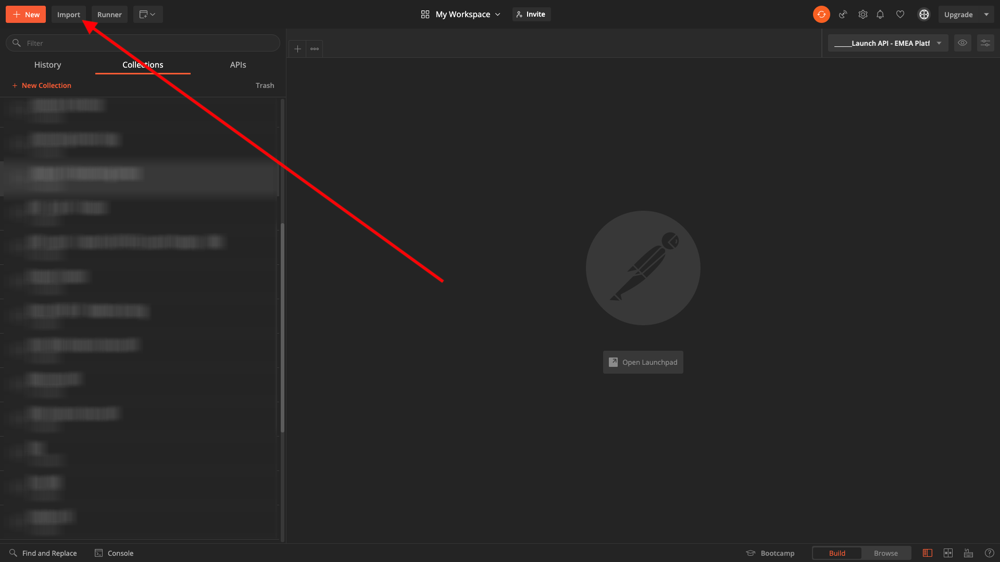

Click on **Upload files**.

Select the file **_Module 14- Decisioning Service.postman_collection.json** and click **Open**.

You'll then have this collection available in Postman.

You now have everything you need in Postman to start interacting with Adobe Experience Platform through the APIs.

Click to open the request **GET - List Containers**. 

Under **Params**, you'll see this: 

- property: `_instance.parentName==aepenablement`

In that parameter, **aepenablement** is the name of the sandbox that is used in Adobe Experience Platform. The sandbox you should use is --aepSandboxId--. Replace the text **aepenablement** by --aepSandboxId--.

After replacing the sandbox name, click **Send**.

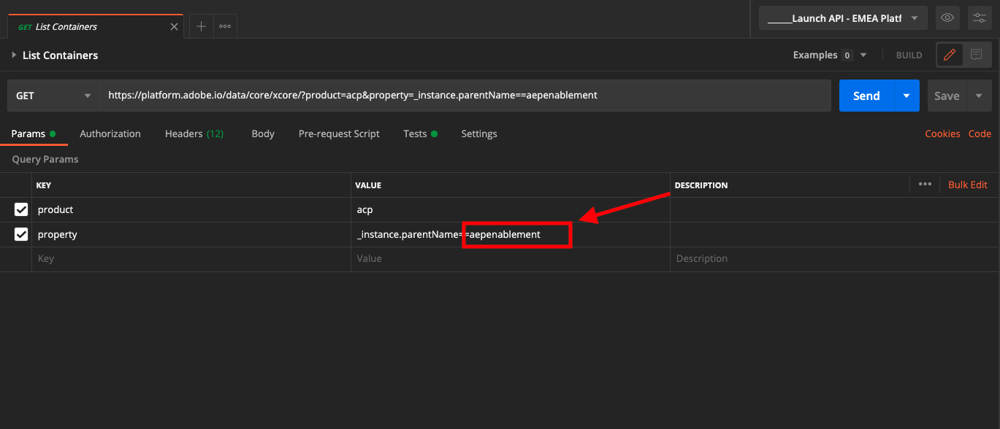

This is the response, which shows the offer container for the sandbox that you specified.

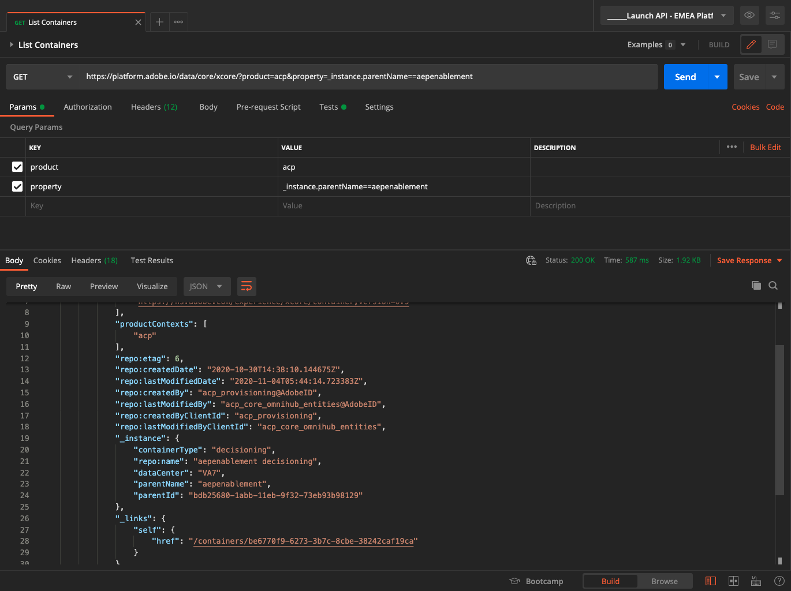

Click to open the request **GET - List Placements**. Click **Send**.

You're now seeing all available placements in your offer container. The placements you're seeing were defined in the Adobe Experience Platform UI, as you could see in [Exercise 14.1.3](./ex1.md).

Click to open the request **GET - List Decision Rules**. Click **Send**.

In the response, you'll see the Decision Rules that you defined in the Adobe Experience Platform UI, as you could see in [Exercise 14.1.4](./ex1.md).

Click to open the request **GET - List Personalized Offers**. Click **Send**.

In the response, you'll see the Personalized Offers that you defined in the Adobe Experience Platform UI in [Exercise 14.2.1](./ex2.md).

Click to open the request **GET - List Fallback Offers**. Click **Send**.

In the response, you'll see the Fallback Offer that you defined in the Adobe Experience Platform UI in [Exercise 14.2.2](./ex2.md).

Click to open the request **GET - List Collections**.

In the response, you'll see the Collection that you defined in the Adobe Experience Platform UI in [Exercise 14.2.3](./ex2.md).

Click to open the request **GET - List Activities**.

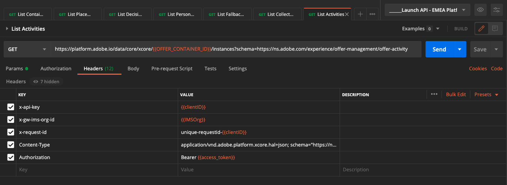

In the response, you'll see the Activity that you defined in the Adobe Experience Platform UI in [Exercise 14.2.4](./ex2.md).

In order to send the next API requests, you now need to search for and then copy the field **@id** for your Offer Activity ID. 

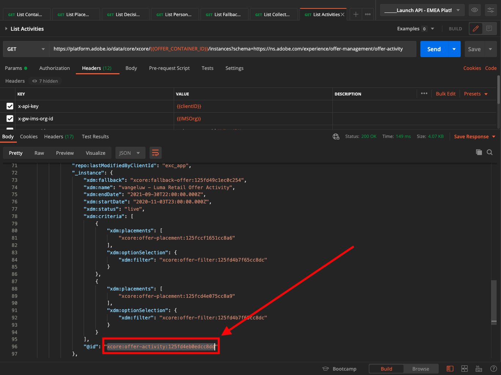

You can see the Offer Activity ID in the above response, or you can take it from the Adobe Experience Platform UI as indicated below. 

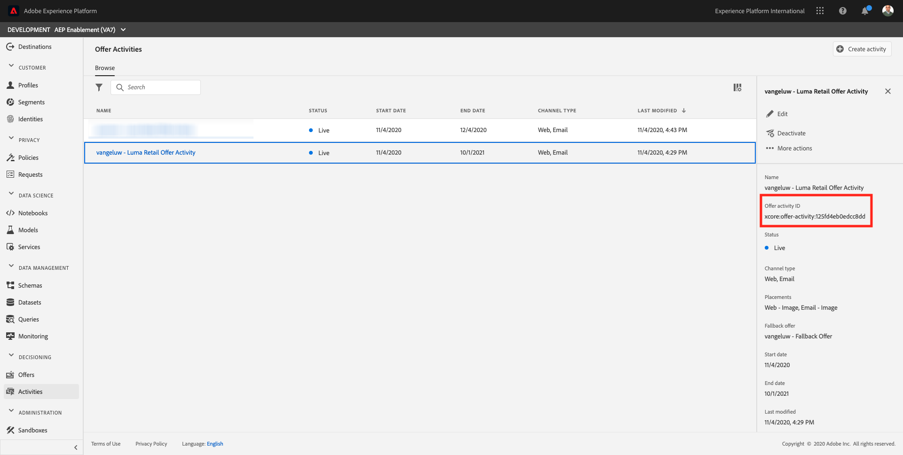

Next, edit your Postman environment.

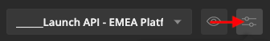

Create the variable **OFFER_ACTIVITY_ID** and assign the value of your Offer Activity ID to it. Click **Update** to save your changes.

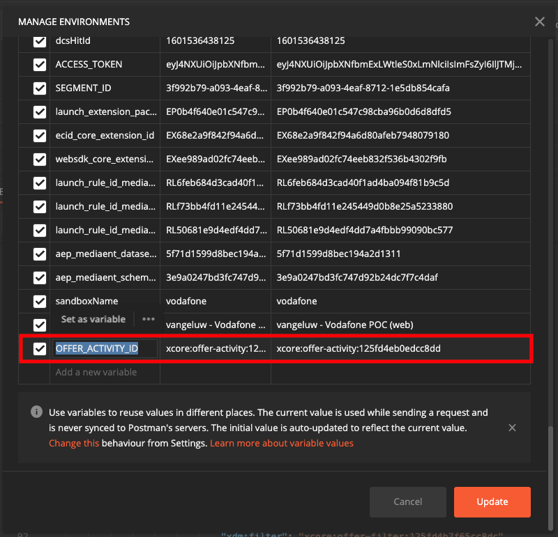

Click to open the request **GET - Get Offers by Activity Id**. 

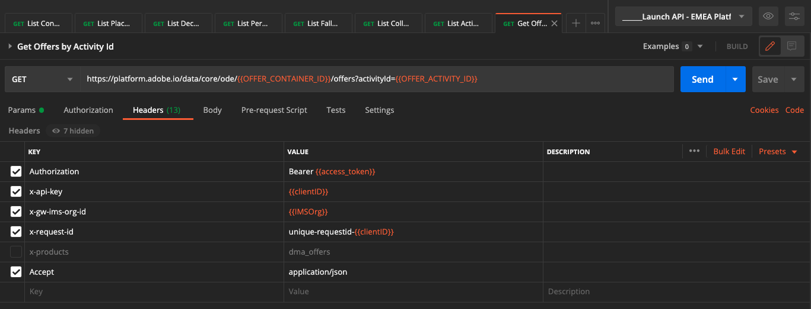

In the response, you'll then see the offers that are part of your activity.

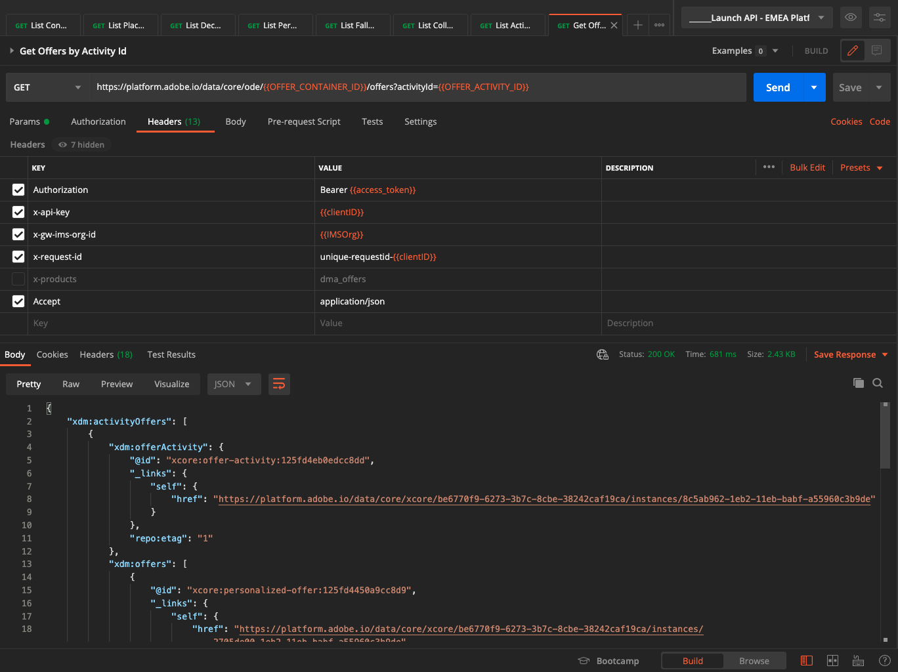

Click to open the request **POST - Get Offers for Customer Profile**. With this request, you're able to enter for instance, the email address of a customer to retrieve the offer that should be presented to that customer.

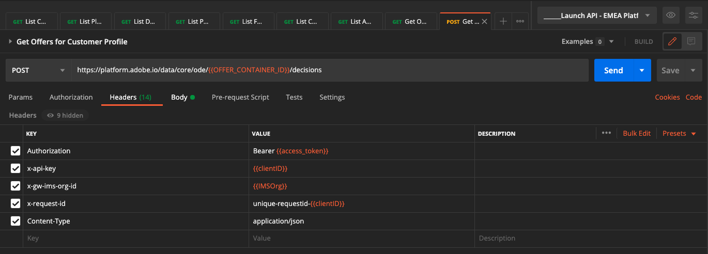

Go to **Body** and enter the email address of the customer for whom you'd like to request an offer. Click **Send**.

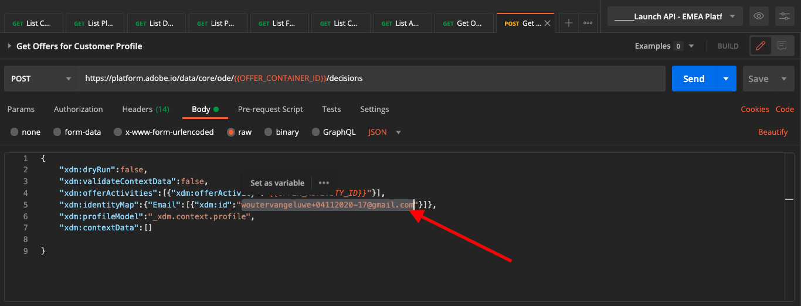

You'll then get the response from Offer Decisioning with the id's of the personalized offer and fallback offer. If you need more detail, continue to the next request.

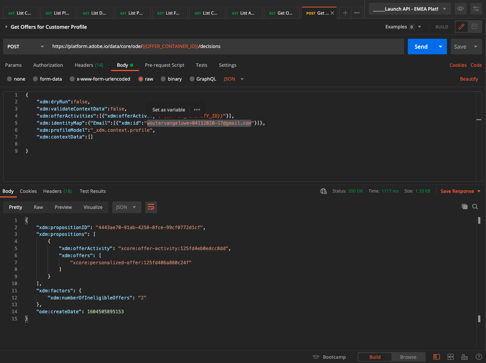

Click to open the request **POST - Get Detailed Offers for Customer Profile**. This request is similar to the previous one, but will actually return details like image URLs, text etc.

For this request, similar to the previous exercise which has similar requirements, you need to provide the values for **xdm:placementId** and **xdm:activityId** to retrieve the specific offer details for a customer.

The field **xdm:activityId** is already populated as the result of a previous request you sent, after which you stored the key **OFFER_ACTIVITY_ID** in your Postman environment.

The field **xdm:placementId** needs to be filled out. You can retrieve that in the Adobe Experience Platform UI, as indicated below. In the below example, you can see the placementId for the placement **Web - Image**.

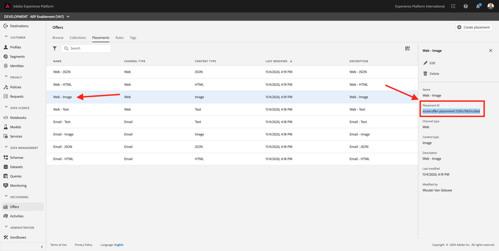

Go to **Body** and enter the email address of the customer for whom you'd like to request an offer. Click **Send**.

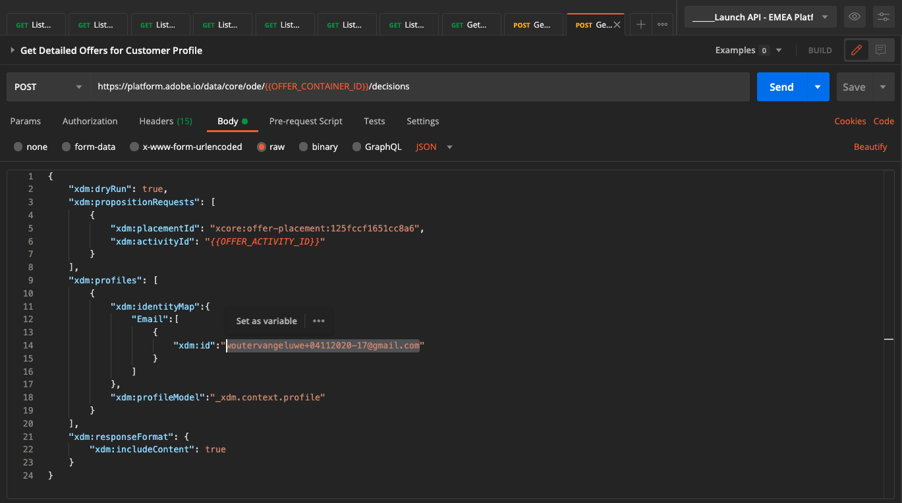

Finally, you'll then see the result of what kind of personalized offer and what assets need to be displayed to this customer.

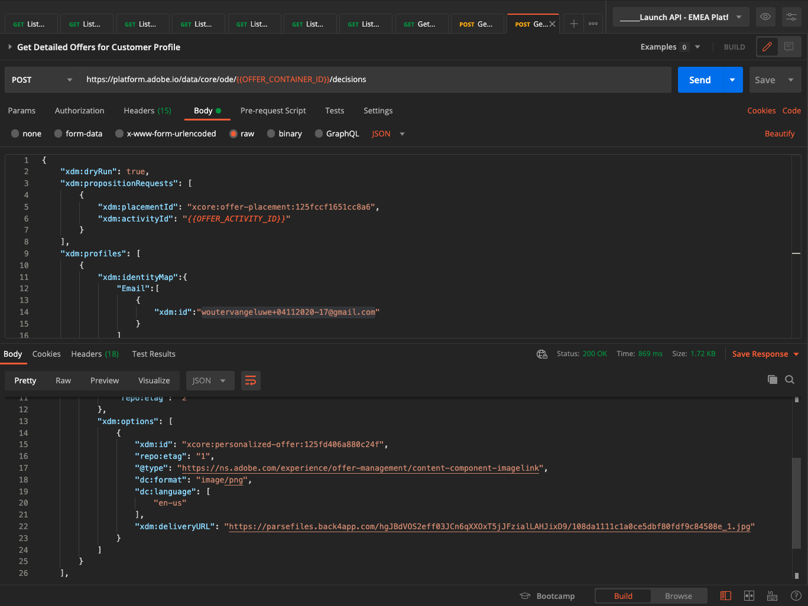

## 14.5.2 Use the Offer Decisioning API to showcase offers on Xray

You've now completed this exercise.

Next Step: [14.6 Test your Offer Activity using Journey Orchestration](./ex6.md)

[Go Back to Module 14](./offer-decisioning.md)

[Go Back to All Modules](./../../overview.md)