# 17.3 Create a Contact in Microsoft Dynamics 365 using Journey Orchestration & Import data from Microsoft Dynamics

In this exercise, you'll be doing the following tasks:

- Modify an existing journey, created in Module 6, to enable creation of contact in Microsoft Dynamics 365. For this modification we will be creating an action in Journey Orchestration.
- Verify the contact is created in Microsoft Dynamics 365 once you have submitted the Registration form on the AEP Demo website. 
- Setup a data flow from Microsoft Dynamics 365 to Adobe Experience Platform using Microsoft Power Automate. Power Automate is a service that helps you create automated workflows between your favorite apps and services to synchronize files, get notifications, collect data and more.
- Lastly, you'll test the complete flow and understand how data flows between applications.

## 17.3.1 Create Contact in Dynamics 365 using Journey Orchestration 

In this exercise, you'll edit your existing Journey created in Module 6 of Enablement. This new version of Journey will then create a Contact in Microsoft Dynamics 365 whenever a customer creates an account on the AEP Demo website. 

Go to [https://experience.adobe.com/#/home](https://experience.adobe.com/#/home). Click to open **Journey Orchestration**.

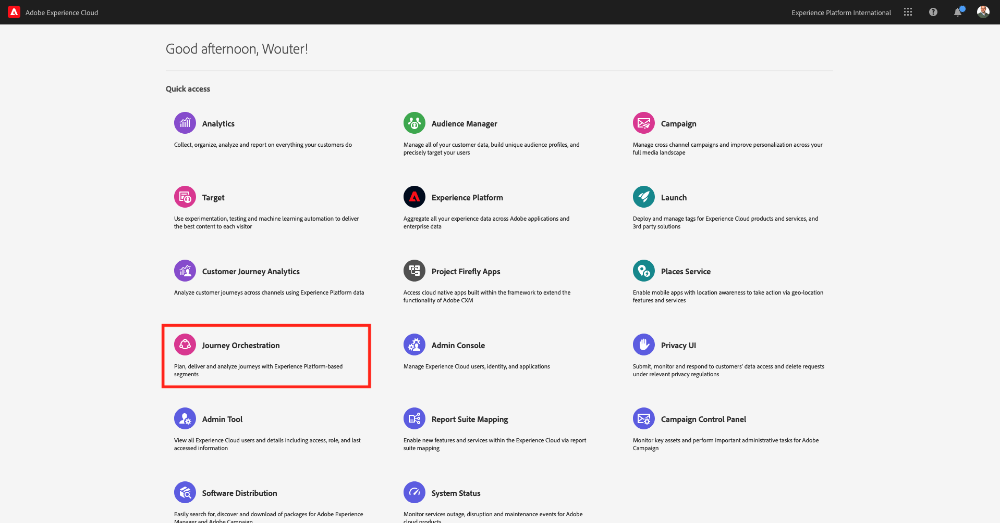

You'll then be redirected to the Journey Orchestration homepage. Search for your Account Creation journey, which is named by this naming convention: **ldap - Account Creation Journey**. This is the journey that you'll update in a couple of minutes. 

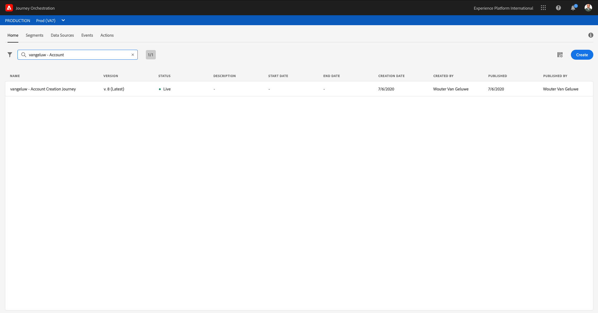

Before you can update your journey, you need to create a new **Action** in Journey Orchestration which will update Microsoft Dynamics 365.

To do that, go to **Actions**.

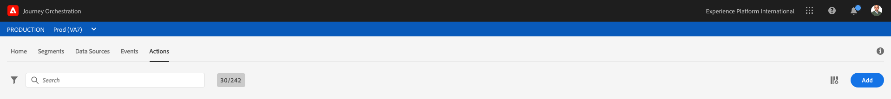

Click **Add** to add a new action.

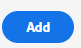

You'll then see this:


Fill out the following fields like this:

- Name: **ldapD365ContactCreation**, in this example: **vangeluwD365ContactCreation**
- Description: **Create a Contact in Dynamics 365**
- URL: **https://salesvelocity.adobeio-static.net/api/v1/web/d365_prd/crmOperationsBulk**
- Authentication: **No authentication**

**Note** : Here we are using a Runtime Action for making a call to Microsoft Dynamics 365 APIs. This Runtime call when made via an action consumed in Journey will help us create `Contact` in Microsoft Dynamics 365.

Your action now looks like this:

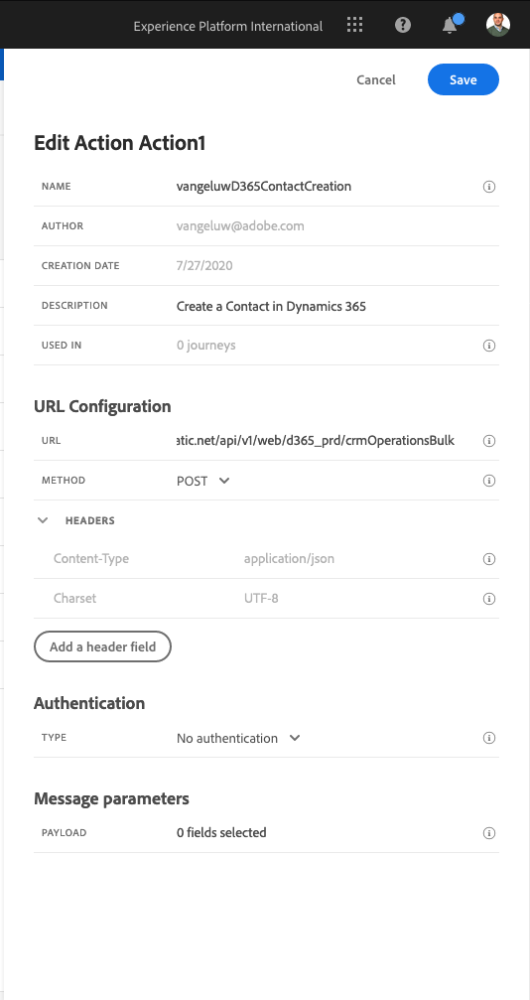

Next, under **Message parameters** you will need to add the following payload by clicking on the pencil icon. Role over the i icon to display the icon to edit the payload

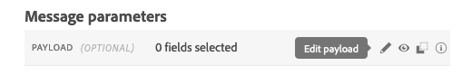

The Field configuration screen will appear.

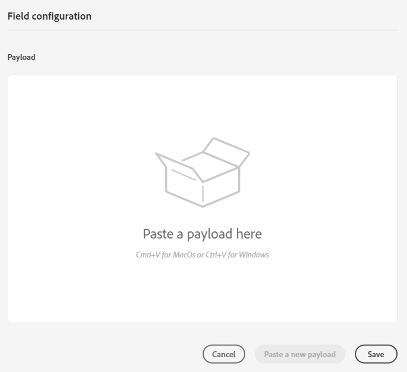

Use this payload json, you will need to add the Microsoft Dynamics 365 and Microsoft Azure app credentials you created as part of exercise 17.1.

Copy this json:

```json
{
 "d365_config": {
 "webApiUrl": "",
 "authorityUrl": "",
 "resource": "",
 "clientId": "",
 "username": "",
 "password": ""
 },
 "entity": "contacts",
 "action": "insert",
 "response_attributes": "*",
 "data": [
 {
 "emailaddress1": {
 "toBeMapped": true,
 "dataType": "string",
 "label": "email"
 },
 "firstname": {
 "toBeMapped": true,
 "dataType": "string",
 "label": "fName"
 },
 "lastname": {
 "toBeMapped": true,
  "dataType": "string",
 "label": "lName"
}
}
]
}
```

You will need to go through the settings with your values:

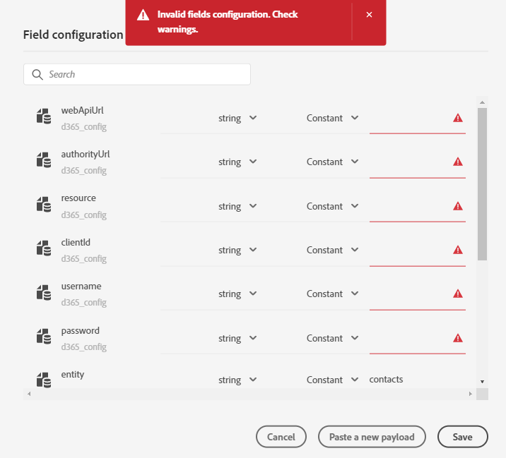

As a reminder, you populated this table as part of exercise 17.1.

| Attribute | Description | Example |
|----------|-------------|-------------|
| Web API URL | https://**NAME**.**REGION**.dynamics.com/api/data/v9.1/ |https://aepdemovangeluw1.crm4.dynamics.com/api/data/v9.1/|
| Authority URL | https://login.microsoftonline.com/**Directory (tenant) ID**/oauth2/token |https://login.microsoftonline.com/459cea37-2ca1-4431-9a2b-1abfcf33e32b/oauth2/token|
| Resource | The URL of the Dynamics instance, for example https://**NAME**.**REGION**.dynamics.com |https://aepdemovangeluw1.crm4.dynamics.com|
| Application (client) ID | The **Application (client) ID** of the Azure SyncContact app |9a86216a-b8c3-4b7e-a873-305d429eb90d|
| Username | The username you use to connect to Microsoft Dynamics 365|admin@aepdemovangeluw1.onmicrosoft.com|
| Password | The password you use to connect to Microsoft Dynamics 365|Password_1234|

Once you have update the configuration fields, you'll see this:

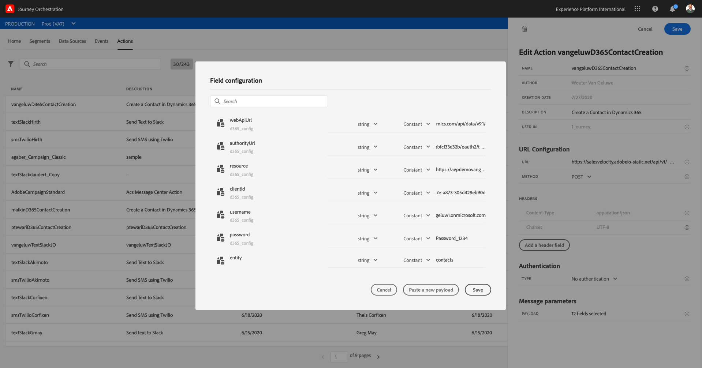

Click **Save** on the Field Configuration window.

Click **Save** to save your action.


Now you are ready to edit the **ldap - Account Creation Journey**.

In the top menu, click **Home** and search for your **ldap - Account Creation Journey** you created in Module 6.


Click to open the journey and edit it.

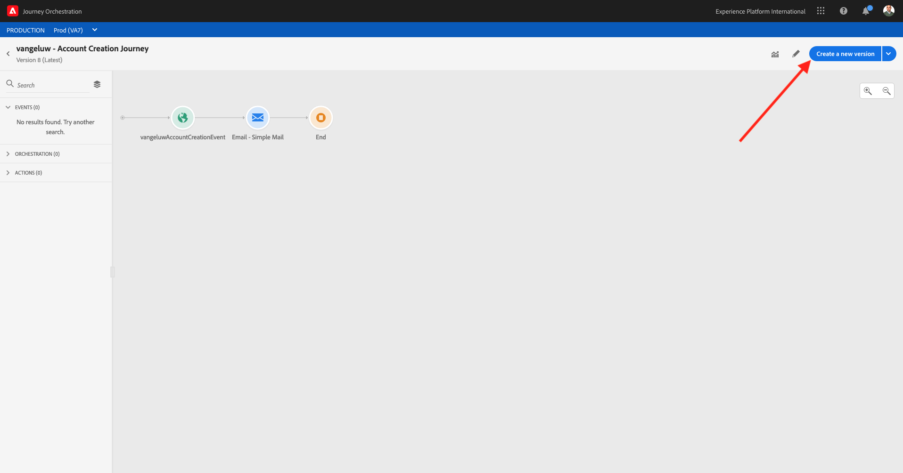

Click **Create a new version**.


Click **Create a new version** again.

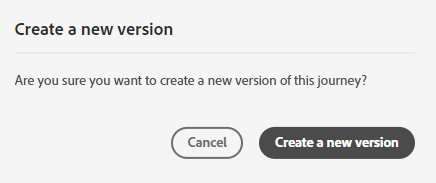

First you will need to remove the **End** orchestration step. Click **End** and click the bin icon in the right panel.

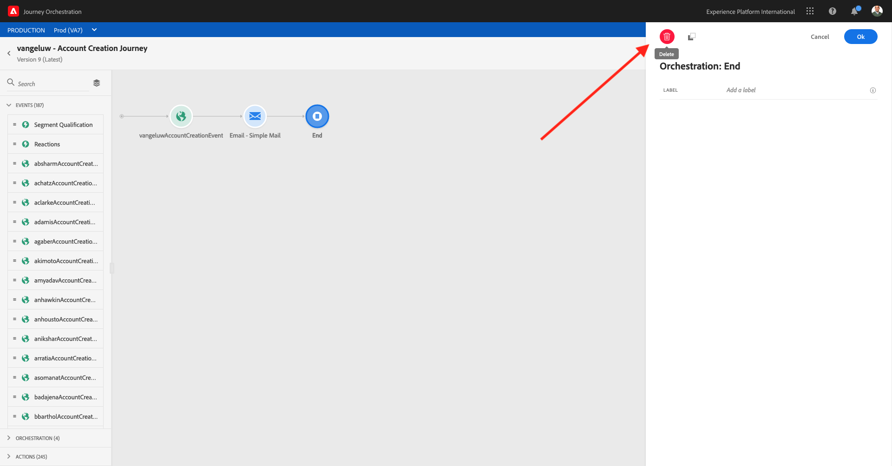

Click **Confirm**.


Now search for your Action from the left panel. Search for **ldapD365** and your Action should appear under **Actions**.

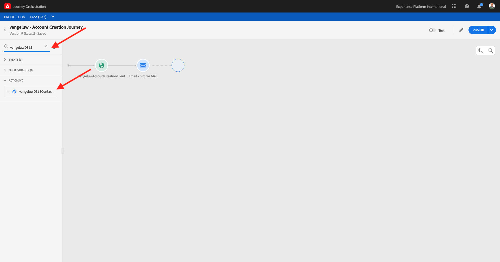

Drag your **ldapD365ContactCreation** action onto the canvas, after the **Email - Simple Mail** object.

You'll then see this.

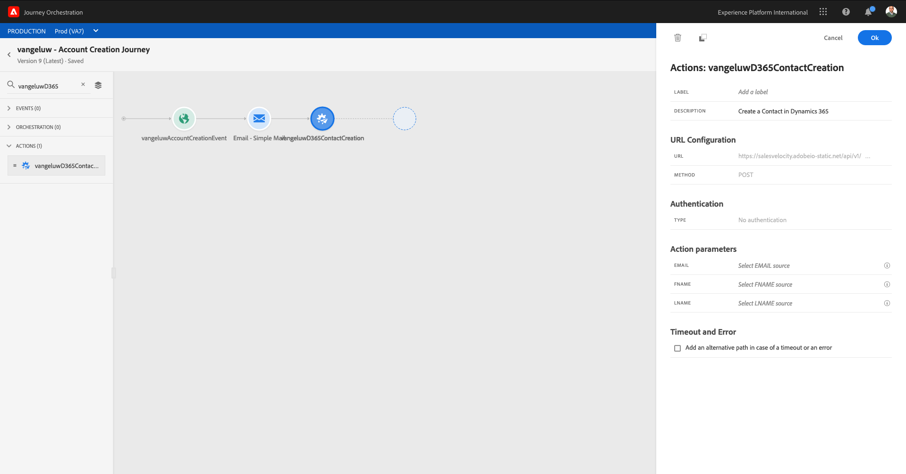

You now need to edit the **Action parameters**.

For the **EMAIL** Parameter, click the pencil/edit icon.

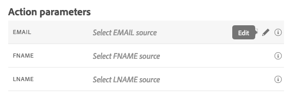

Search for **email** and select the email field under **ldapAccountCreationEvent**.--aepTenantId--.accountcreation.email.

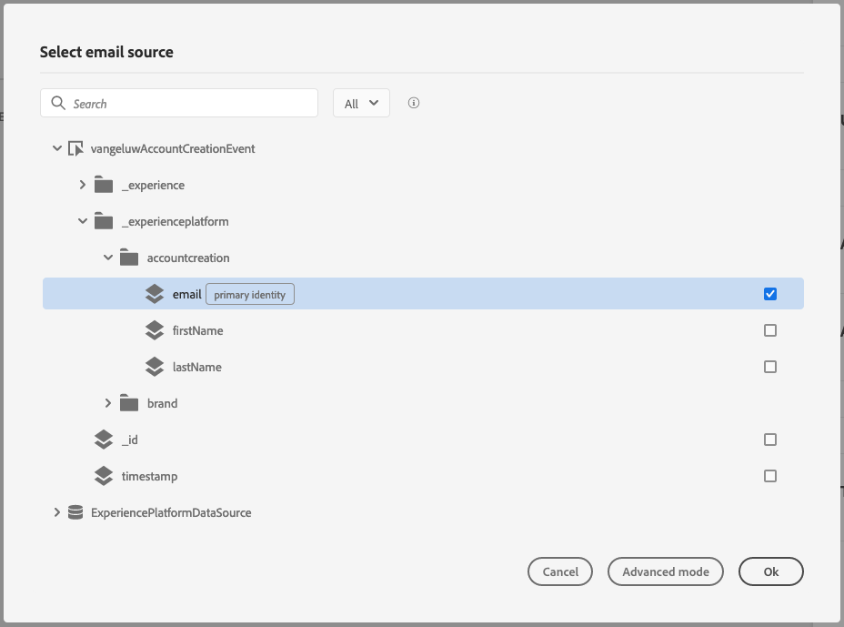

For the **FNAME** Parameter, click the pencil/edit icon.

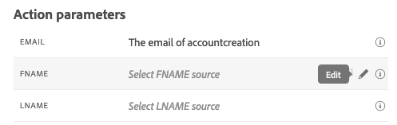

Search for **firstName** and select the email field under **ldapAccountCreationEvent**.--aepTenantId--.accountcreation.firstName.

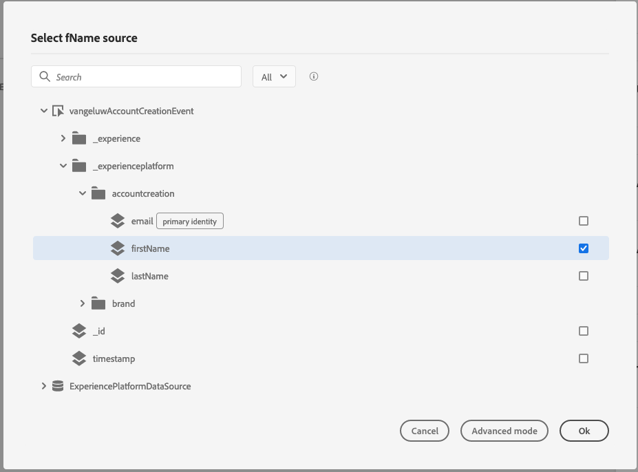

For the **LNAME** Parameter, click the pencil/edit icon.

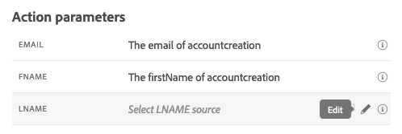

Search for **lastName** and select the email field under **ldapAccountCreationEvent**.--aepTenantId--.accountcreation.lastName.


Your action now looks like this.


Click **OK**.


Re-add the **End** orchestration. Clear the search term and under **ORCHESTRATION**, drag **End** to the next step in the Journey.

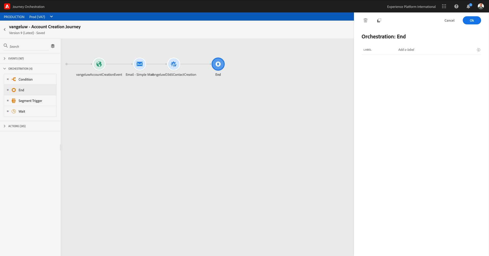

Click **Ok**.


Your Journey should now look like this:

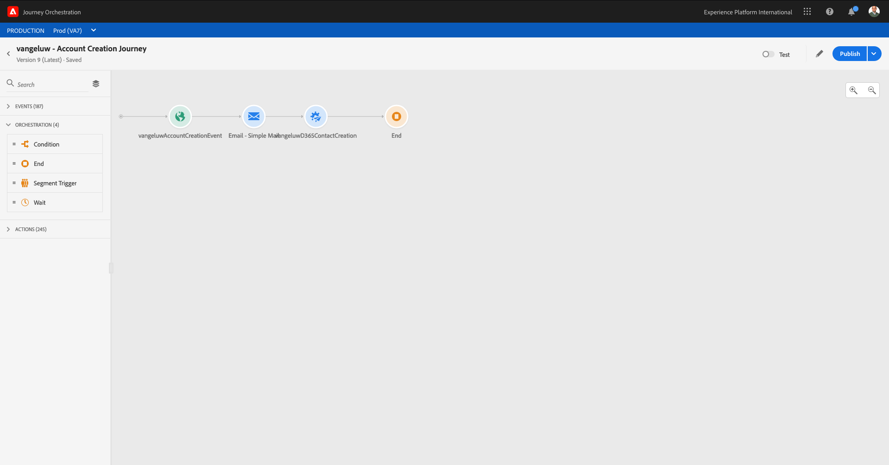

Click **Publish**.


Click **Publish**.

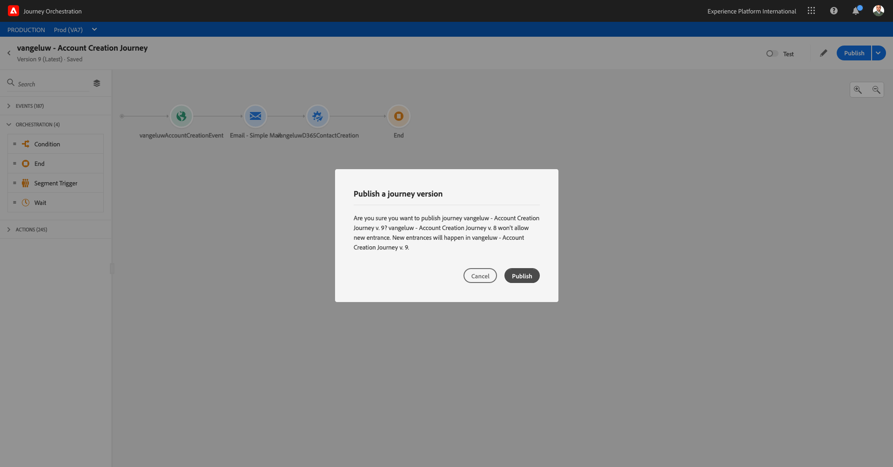

After a couple of seconds, your journey will be published and live.

## 17.3.2 Create your account to test

Open your AEP Demo website and load a brand of choice. Go to the **Login/Register**-page.

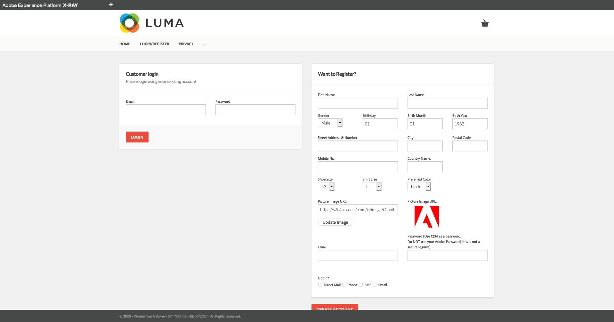

Fill out the form fields and finish by clicking **CREATE ACCOUNT**.

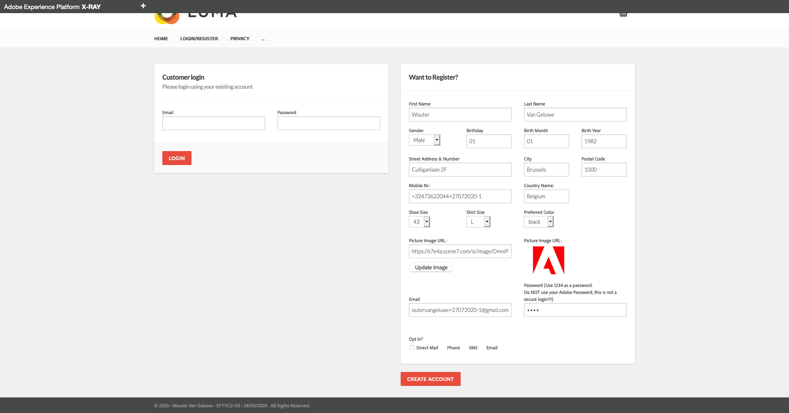

After clicking **CREATE ACCOUNT**, go back to your Microsoft Dynamics 365 dashboard and go to contacts. Search for your email-address and you'll find your contact created inside Microsoft Dynamics 365 in real-time.

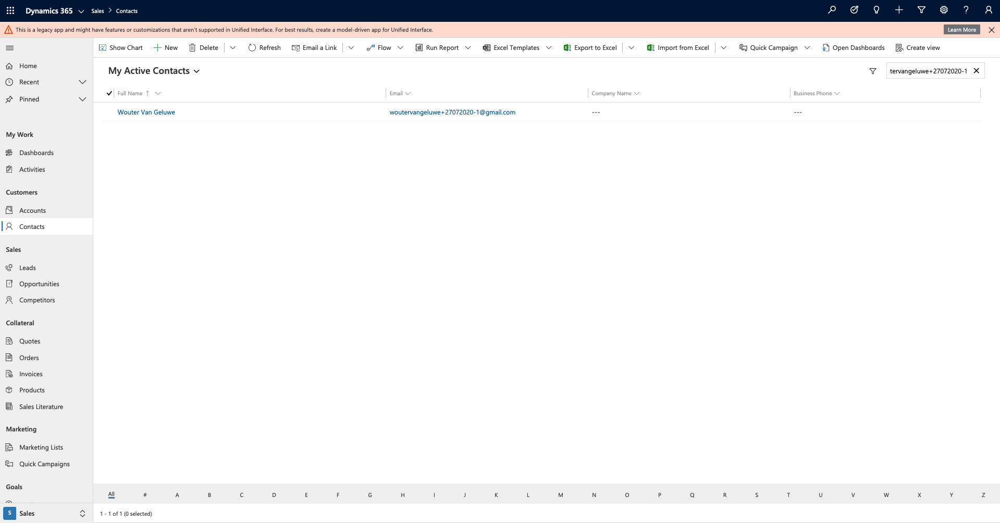

Next Step: [17.4 Update a contact in Microsoft Dynamics 365 and automatically trigger a journey](./ex4.md)

[Go Back to Module 17](./adobe-experience-platform-microsoft-dynamics-365.md)

[Go Back to All Modules](./../../overview.md)