# 17.4 Update a contact in Microsoft Dynamics 365 and automatically trigger a journey

## 17.4.1 Configure a journey to trigger when sentiment changes

## 17.4.2 Create automation using Microsoft Automate (Flow) to listen to the sentiment change

After creating a journey that will trigger when customer sentiment changes, you'll now create a flow in Microsoft Power Automate that will listen to a change to the sentiment field in Microsoft Dynamics 365 and then send an update to the Real-time Customer Profile in Adobe Experience Platform.

Go to [https://flow.microsoft.com](https://flow.microsoft.com). Sign in with the Microsoft account you created in exercise 1.

You'll be redirected to the Microsoft Power Automate home screen.


In the left menu, click **My Flows**.

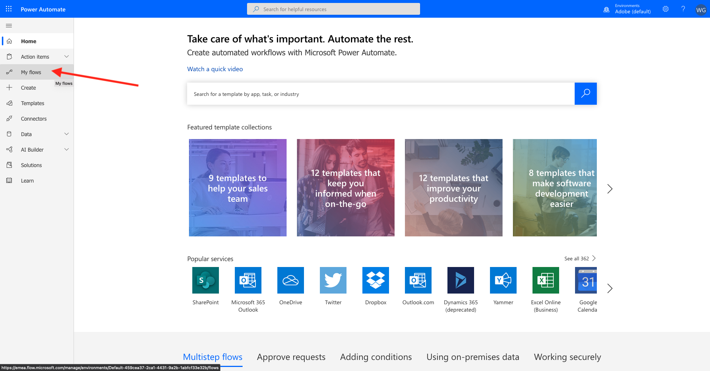

Click **+ New**, then click **Automated - from blank**.

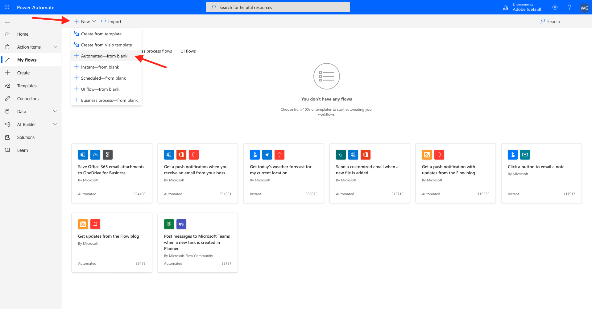

In Choose your flow's trigger, search for **Dynamics**. From the result list, select **When a record is updated**


Click **Create**.


You will be redirected to the **Flow creation** screen.

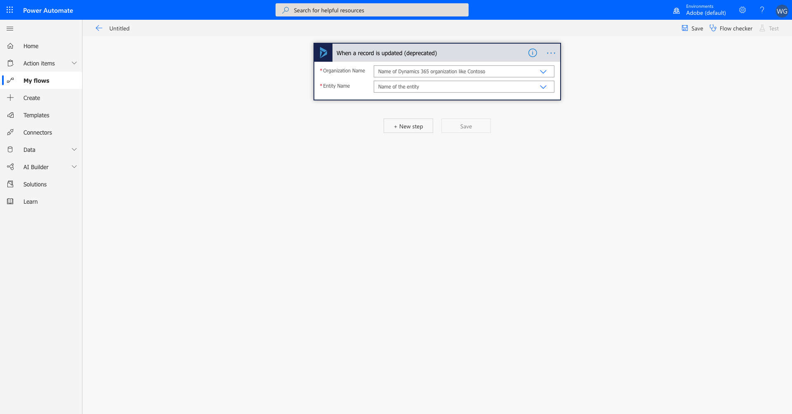

From the **Organization Name** select **Adobe** and in the **Entity Name** type **Contacts** and then select **Contacts**.

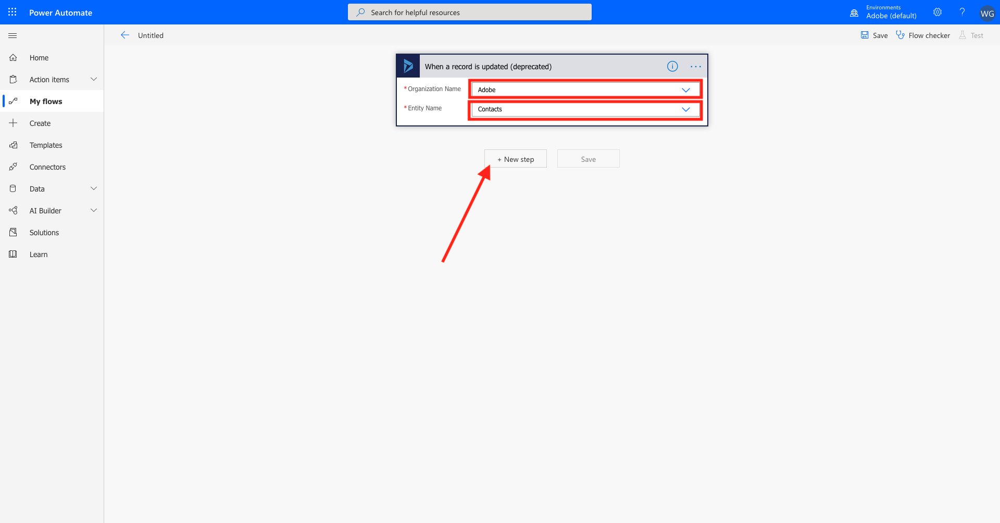

Click **+ New step**.

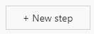

Click **Condition** form the list of available actions.

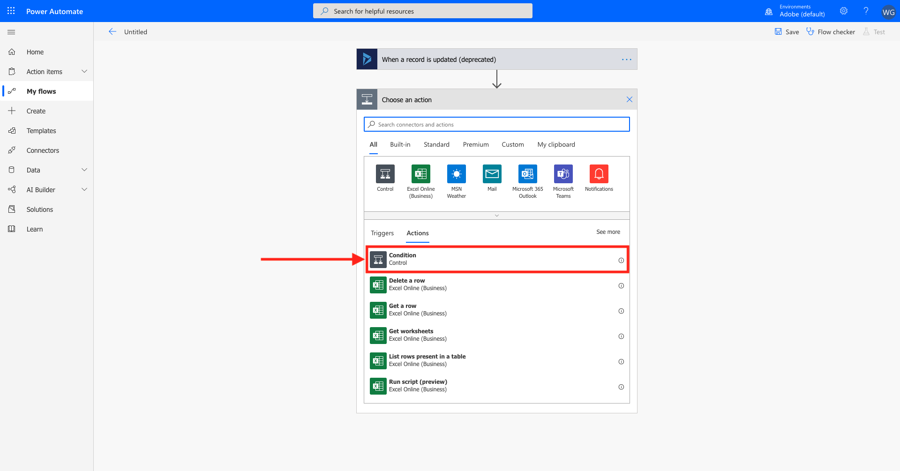

You will now see the Condition field and **Yes/No** options

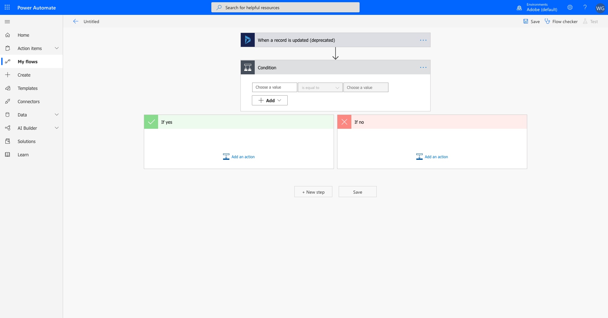

In the **Condition** panel, click the **Choose a value** field and start searching for the **Sentiment** you created in Dynamics

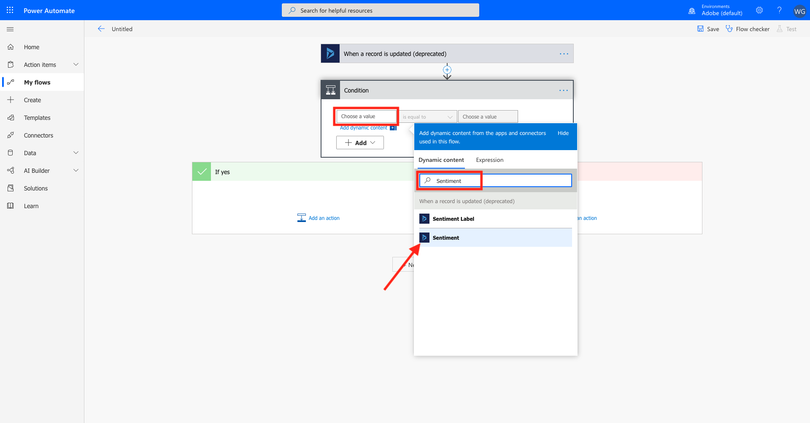

Click **Sentiment** and you'll see it assigned into the Condition.

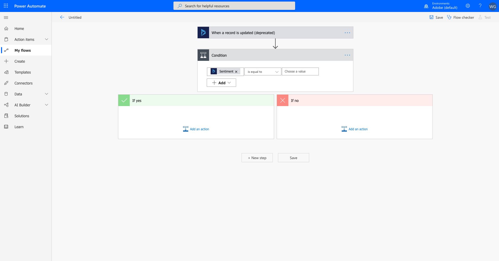

Set the operator to **is not equal to**.

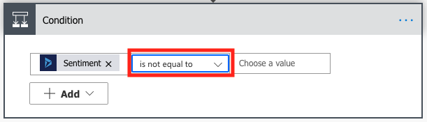

Click in the **Choose a value** field and select the **Expression** option

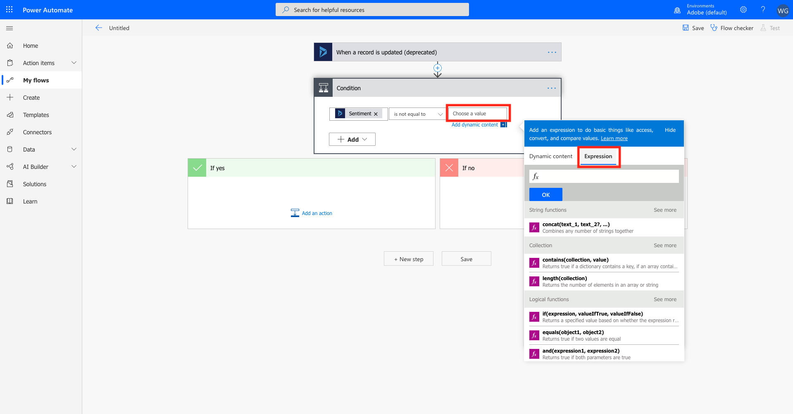

Type **null** and click **OK**.


Your Condition now looks like this:


Next, you'll enter the **If yes** expression.

Click **Add an action** in the **If yes** expression.

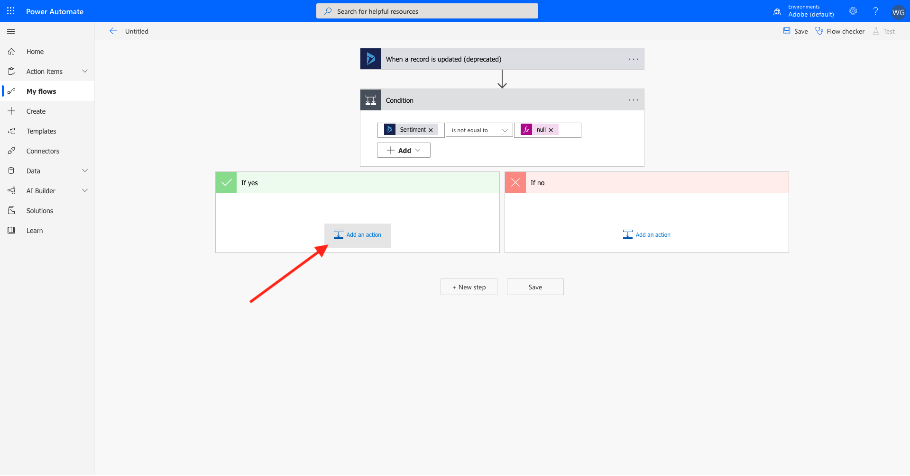

From the **Choose an action**, search for **HTTP**.

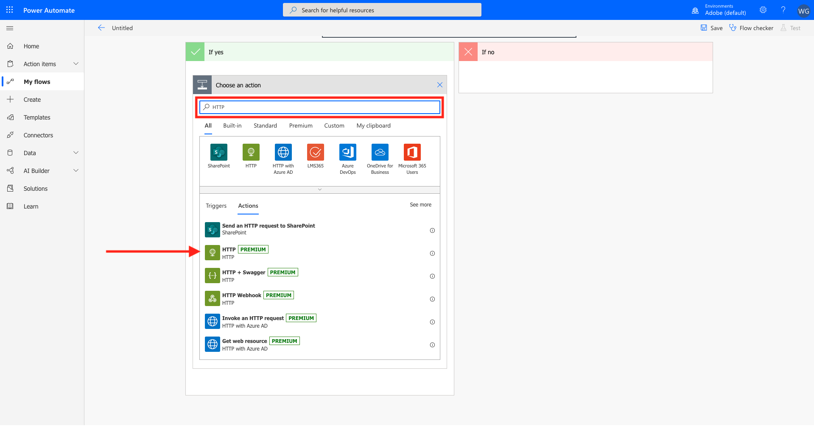

Click the **HTTP PREMIUM** option.

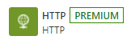

You'll now see the expression builder options.

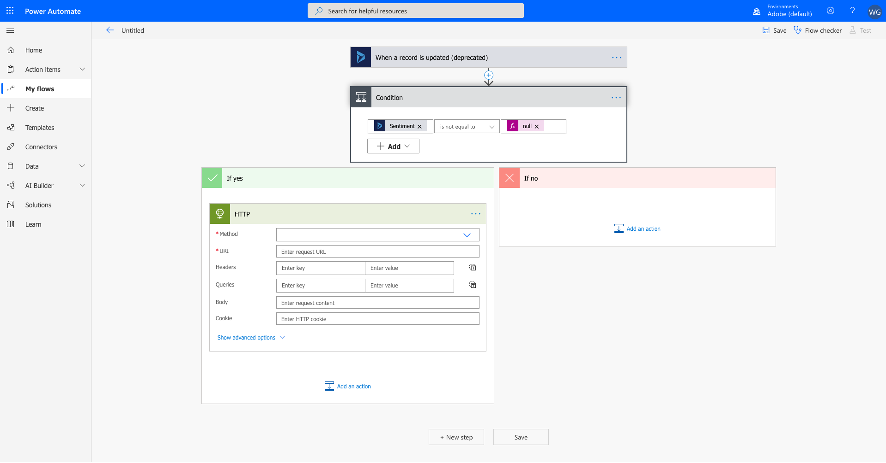

Follow these instructions to set the fields of the HTTP expression builder:

- Method: **POST**
- URI: **--dcsInletId--**

Enter the following Header values

| Header | Value|
|--- |--- |
| **Content-Type** | **application/json** |
| **Accept-Encoding** | **gzip, deflate, br**|
| **Connection** | **keep-alive** |
| **Accept** |\*/*|

You should now have this:

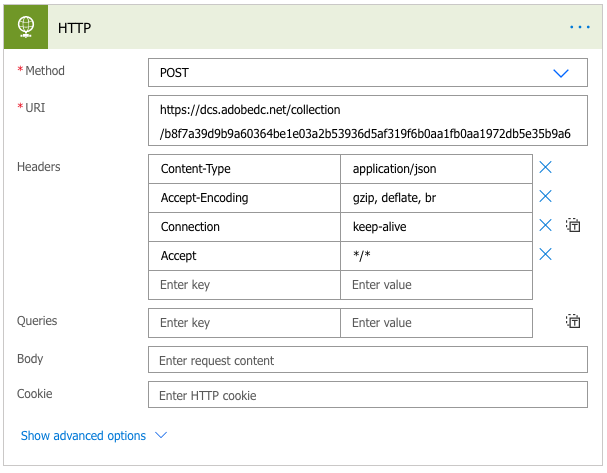

At the point it is good to save the Flow. Enter the name **AEP Demo - Sentiment Event** in the title field.

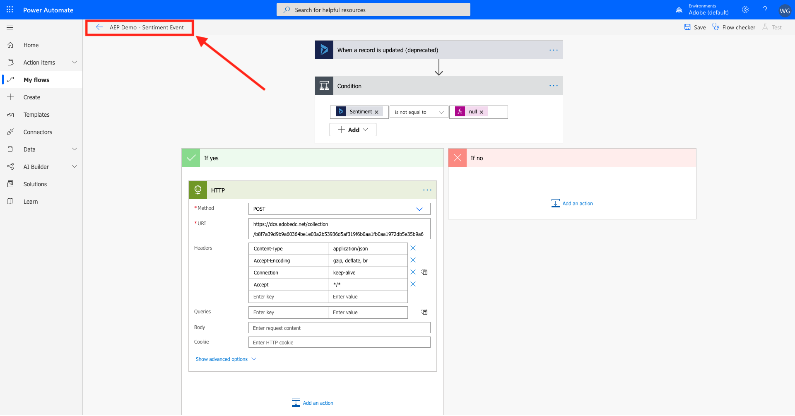

Next, you need to enter the **Body** of the HTTP request.

Copy the below payload.

```json
{
  "header": {
    "datasetId": "--msftProfileDatasetId--",
    "imsOrgId": "--aepImsOrgId--",
    "source": {
      "name": "D365 Sentiment Change"
    },
    "schemaRef": {
      "id": "https://ns.adobe.com/--aepTenantIdSchema--/schemas/--msftProfileSchemaRef--",
      "contentType": "application/vnd.adobe.xed-full+json;version=1"
    }
  },
  "body": {
    "xdmMeta": {
      "schemaRef": {
        "id": "https://ns.adobe.com/--aepTenantIdSchema--/schemas/--msftProfileSchemaRef--",
        "contentType": "application/vnd.adobe.xed-full+json;version=1"
      }
    },
    "xdmEntity": {
      "--aepTenantId--": {
        "identification": {
          "crmId": "@{triggerOutputs()?['body/contactid']}",
          "emailId": "@{triggerOutputs()?['body/emailaddress1']}"
        },
        "sentiment": {
          "sentiment": "@{triggerOutputs()?['body/_new_sentiment_label']}"
        }
      },
      "person": {
        "name": {
          "firstName": "@{triggerOutputs()?['body/firstname']}",
          "lastName": "@{triggerOutputs()?['body/lastname']}"
        }
      },
      "personalEmail": {
        "address": "@{triggerOutputs()?['body/emailaddress1']}"
      }
    }
  }
}
```

Click **Save**.

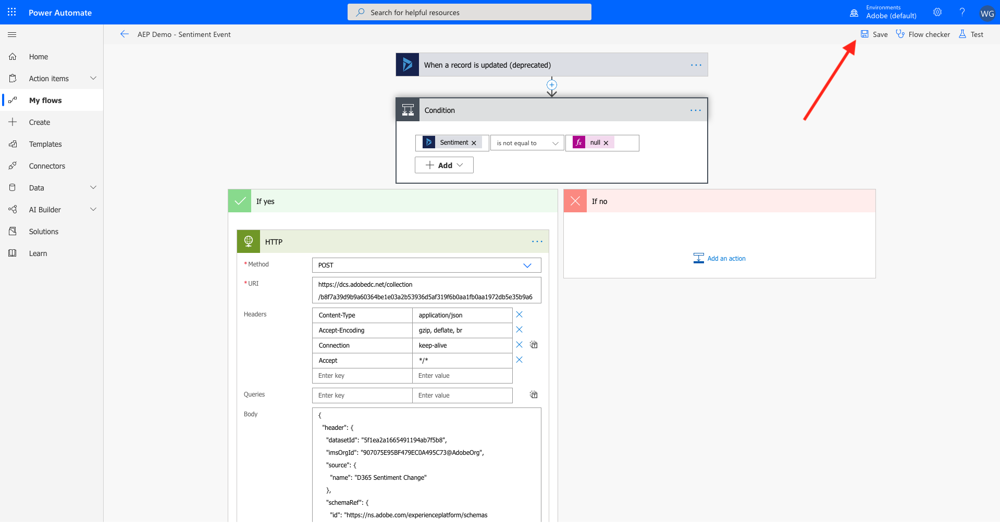

To test your automation, go back to your Microsoft Dynamics 365 Dashboard, and go to **Contacts**. Open a contact record.

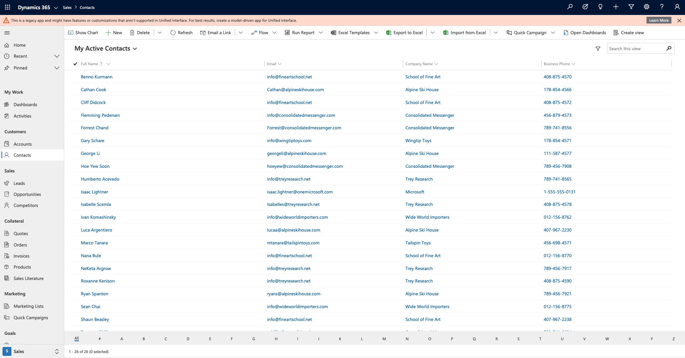

Scroll down to the **Sentiment** field and change the value for that customer. Lastly, save your changes.

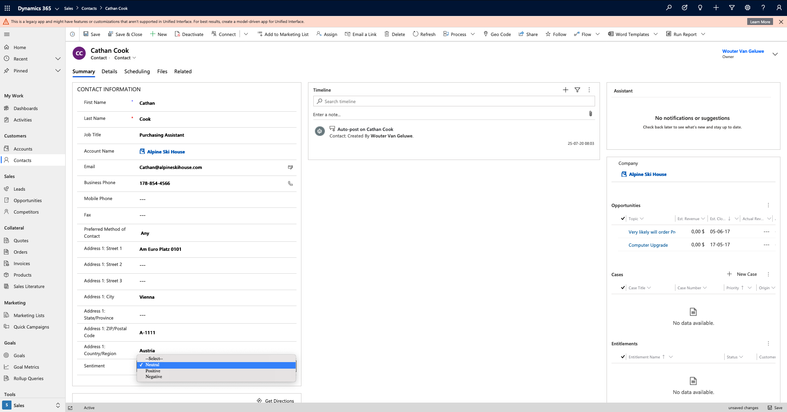

By saving your changes in Microsoft Dynamics 365, an automated request will be sent from Microsoft Dynamics 365 to Adobe Experience Platform which will update the Real-time Customer Profile in Adobe Experience Platform and as a consequence, a journey in Journey Orchestration will be activated.

Next Step: [Summary & benefits](./summary.md)

[Go Back to Module 17](./adobe-experience-platform-microsoft-dynamics-365.md)

[Go Back to All Modules](./../../overview.md)