# 18.3 Define an Azure Function

## 18.3.1 Getting familiar with Azure Event Hub functions

Azure Functions allows you to run small pieces of code (called **functions**) without worrying about application infrastructure. With Azure Functions, the cloud infrastructure provides all the up-to-date servers you need to keep your application running at scale.

A function is **triggered** by a specific type of event. Supported triggers include responding to changes in data, responding to messages (for example Event Hubs), running on a schedule, or as the result of an HTTP request.

Azure Functions is a serverless compute service that lets you run event-triggered code without having to explicitly provision or manage infrastructure. 

Azure Event Hubs integrates with Azure Functions for a serverless architecture.

## 18.3.2 Open Visual Studio Code and Logon to Azure

Visual Studio Code makes it easy to
- define and bind Azure functions to Event Hubs
- test locally 
- deploy to Azure
- remote log function execution

### Open Visual Studio Code

To open Visual Studio Code enter **visual** in your operating system's search (Spotlight search on OSX, Search in Window's Taskbar). If you do not find it, you need to repeat the steps outlined in [Exercise 0 - Pre-requisites](exercises/0-prereq.md). 


### Logon to Azure

When you logon with your Azure account that you used to register in [Exercise 0 - Pre-requisites](./ex0.md), Visual Studio Code will let you find and bind all Event Hub resources. 

Click the **Azure** icon in Visual Studio Code. If you do not have that option, something might have gone wrong with the installaton of the required extensions.

Next select **Sign in to Azure** (2):


You will be redirected to you browser to login. Remember to select the Azure account that you used to register.


When you see the following screen in your browser, you are logged in with Visual Code Studio:


Return to Visual Code Studio (you will see the name of your Azure subscription, for example **Azure subscription 1**):


## 18.3.3 Create an Azure Project

When you hover over **Azure subscription 1**, a menu will appear above the section, select **Create New Project...** (2):

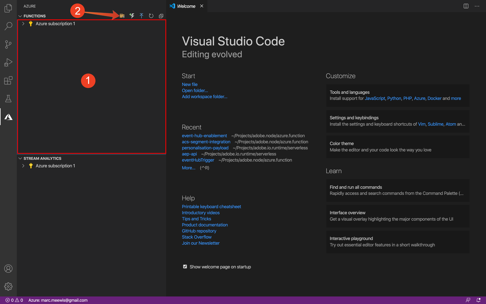

Select a local folder of your choice to save the project and click **Select**:

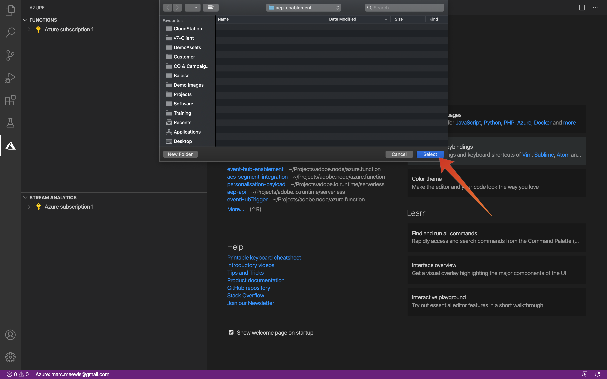

You will now enter the project creation wizard. Select **Javascript** as the language for your project:

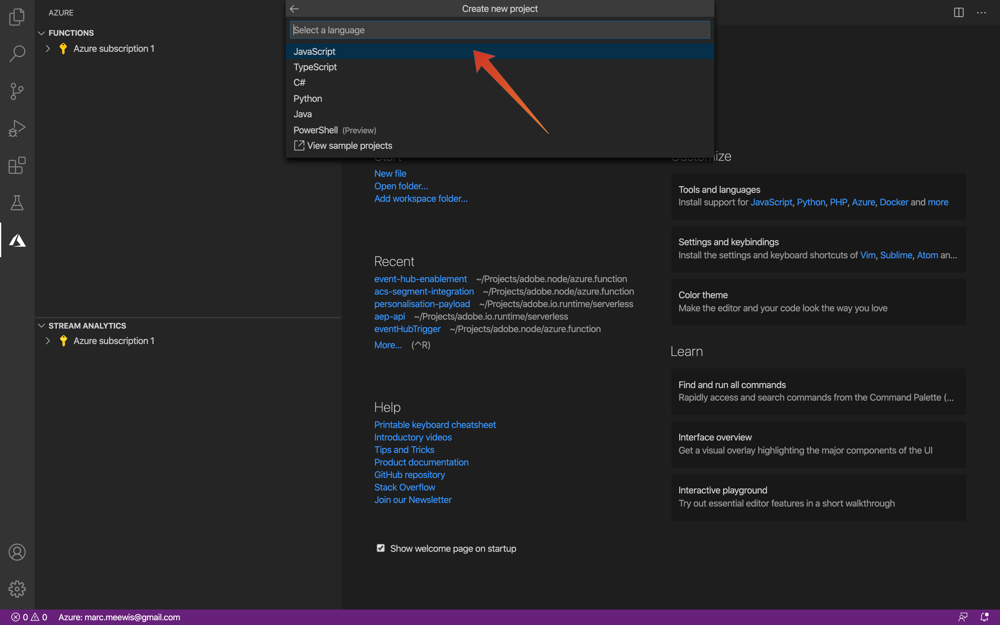

Select **Azure Event Hub trigger** as your project's first function template:

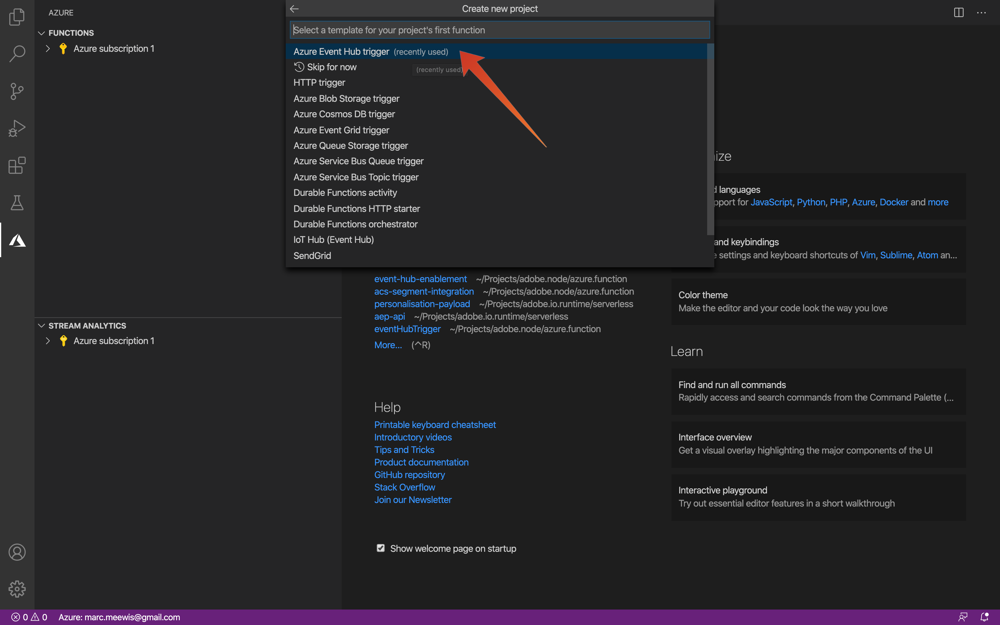

Enter a name for your function, use the following format **ldap-aep-event-hub-trigger** and press enter:
  
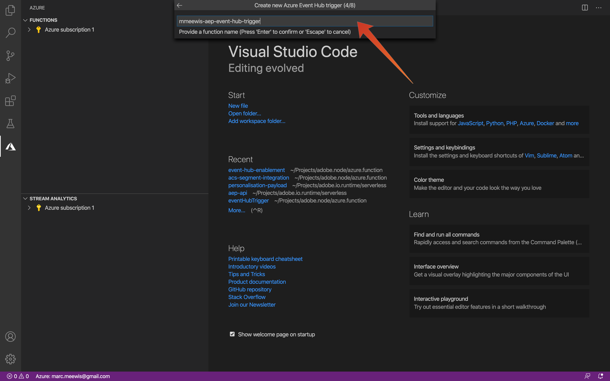

Select **Create new local app setting**:

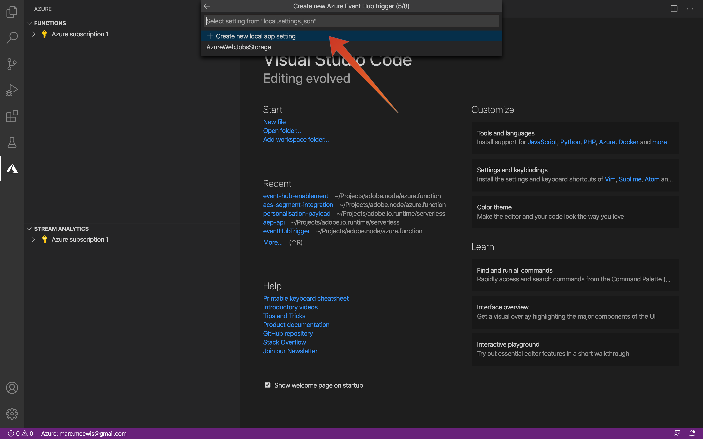

Select an ecent hub namespace, you should see the Event Hub that you defined in **Excercise 2**. In this example the Event Hub namespace is **mmeewis-aep-enablement**:

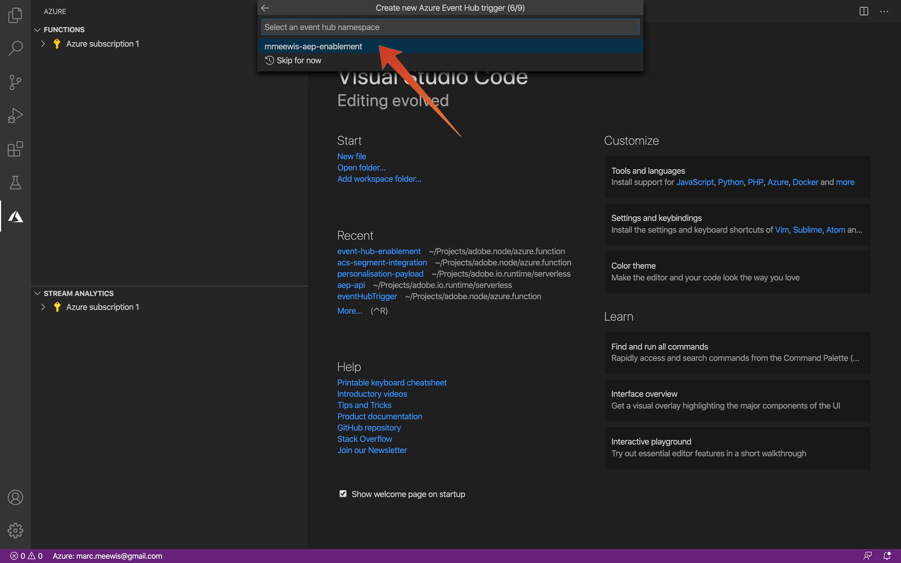

Select your Event Hub, you should see the Event Hub that you defined in **Exercise 2**. In my case that is **mmeewis-aep-enablement-event-hub**:

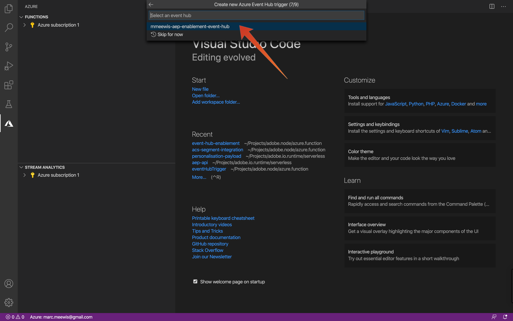

Select **RootManageSharedAccessKey** as your Event Hub policy:

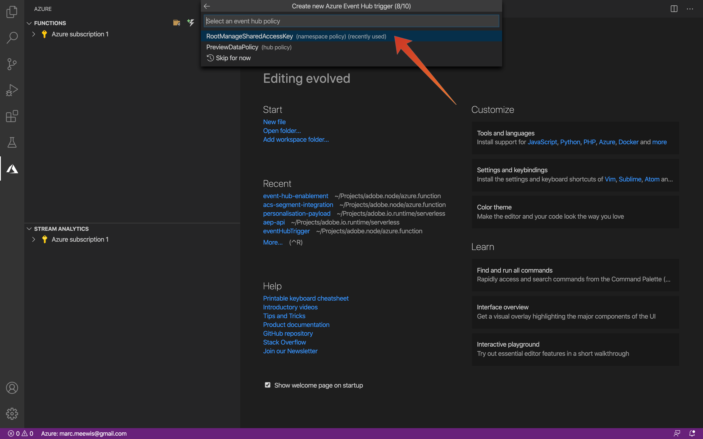

Enter to use **Default**:

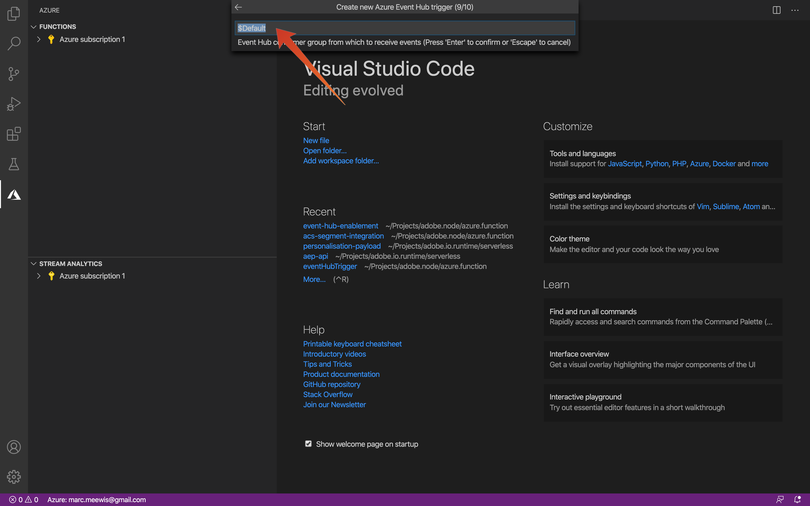

Select **Add to workspace** on how to open your project:

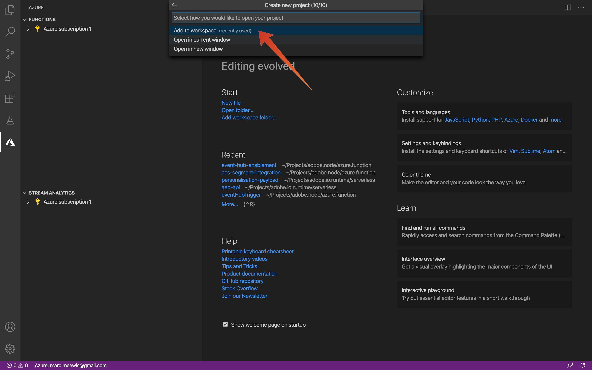

After you project is created, click on **index.js** to have the file open in the editor:

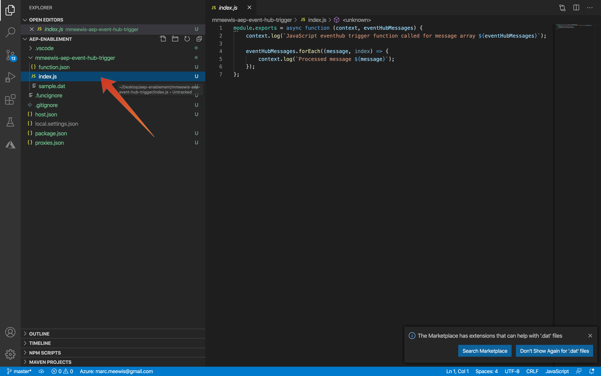

The payload send by Adobe Experience Platform to our Event Hub will only include segment id's:

```json
[{
	"segmentMembership": {
		"ups": {
			"ca114007-4122-4ef6-a730-4d98e56dce45": {
				"lastQualificationTime": "2020-08-31T10:59:43Z",
				"status": "realized"
			},
			"be2df7e3-a6e3-4eb4-ab12-943a4be90837": {
				"lastQualificationTime": "2020-08-31T10:59:56Z",
				"status": "realized"
			},
			"39f0feef-a8f2-48c6-8ebe-3293bc49aaef": {
				"lastQualificationTime": "2020-08-31T10:59:56Z",
				"status": "realized"
			}
		}
	},
	"identityMap": {
		"ecid": [{
			"id": "08130494355355215032117568021714632048"
		}]
	}
}]
```

Our Event Hub function will add the segment name for each of the segments in the AEP response payload. To do so, our azure function will invoke an Adobe IO Runtime function to fetch segment definitions from Adobe Experience Platform. This runtime function will return segment definitions of which the segment names starts with **all** and your **ldap**. The segments prefixed with **all** are default segments used by your Adobe Experience Platform environment, for example **all - Homepage Visitor**.

You can test the function to see if it returns your segments (next to the **all**), make sure that you replace **ldap**:

```http
https://adobeioruntime.net/api/v1/web/mmeewis-ns/aep-segment/getSegmentDefinitionsForLdapIncludingAll.json?ldap=<your ldap>
```

The response will have quite a few segments that start with **all**, it should also include **&lt;your ldap&gt; - Luma Sports Fan** segment. If not, then you naming of the segment is probably not correct:

```json
{
  "segments": {
    "39f0feef-a8f2-48c6-8ebe-3293bc49aaef": {
      "description": "mmeewis - Luma Telco Sports Fan",
      "name": "mmeewis - Luma Telco Sports Fan"
    },
    "a77d96aa-d166-43b1-baba-005d35261b8a": {
      "description": "all - Interest in Nadia Elements Shell",
      "name": "all - Interest in Nadia Elements Shell"
    },
    "ca114007-4122-4ef6-a730-4d98e56dce45": {
      "description": "all - Homepage Visitors",
      "name": "all - Homepage Visitors"
    }
  }
}
```

Replace the code in your Visual Studio Code's index.js with the code below. This code will be executed each time Adobe Experience Platform Real-time CDP sends segment qualifications to your Event Hub destination. In our example, the code is just about displaying and enhancing the received payload. But you can imagine any kind of function to process segment qualifications in real-time.

```javascript
const fetch = require('node-fetch'); 

const sandbox = "aepenablement";
const ldap = "<your ldap>";

module.exports = async function (context, eventHubMessages) {

    const apiEndpoint = "https://adobeioruntime.net/api/v1/web/mmeewis-ns/aep-segment/getSegmentDefinitionsForLdapIncludingAll.json?ldap=" + ldap + "&sandbox=" + sandbox;

    const segmentResponse = await fetch(apiEndpoint)
    
    if (!segmentResponse.ok) {
      throw new Error(`request to '${apiEndpoint}' failed with status code '${segmentResponse.status}'`)
	}

    const segmentDefinitions = await segmentResponse.json();
    
    eventHubMessages.forEach((message, index) => {
    
        // context.log('Message : ' + JSON.stringify(message, null, 2));

        var segmentKeys = Object.keys(message.segmentMembership.ups);

        for (var segmentKey of segmentKeys) {
     
            var segmentContent = "";

            // context.log("Segment Key => " + segmentKey);
            
            if (segmentDefinitions.segments.hasOwnProperty(segmentKey)) {
                segmentName = segmentDefinitions.segments[segmentKey].name;
            }
            else {
                segmentName = "";
            }
            
            // context.log("Segment Key => " + segmentKey + " : " + segmentName);

            message.segmentMembership.ups[segmentKey].segmentName = segmentName;         

        }
    });

    context.log('Message : ' + JSON.stringify(eventHubMessages, null, 2));
    
};
```

After pasting the code below in your index.js, make sure to modify **line 4** to reflect your ldap, in this example that is **mmeewis**:

```javascript
const ldap = "mmeewis";
```

The result should look like:

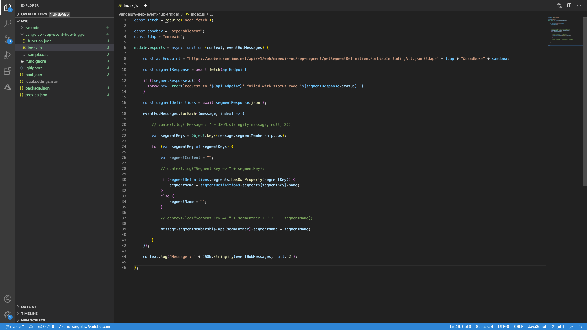


## 18.3.4 Run Azure Project

Now it is time to run your project. At this stage we will not deploy the project to Azure. We will run it locally in debug mode. Select the Run icon, click the green arrow. The first time you run you project in debug mode, you will need to attach a Azure storage account, hit Select storage account.

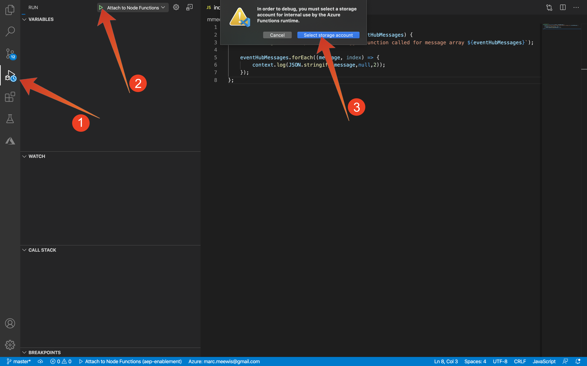

In the storage account wizard select + Create new storage account:

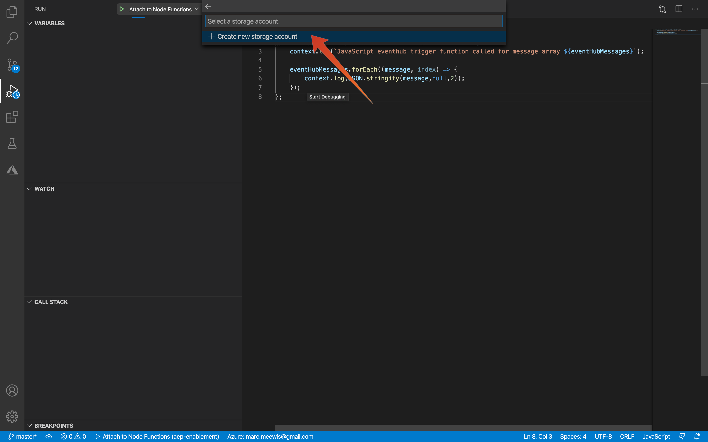

Enter the name of the storage account, use the format ldapaepstorage, for example **mmeewisaepstorage** and hit enter:

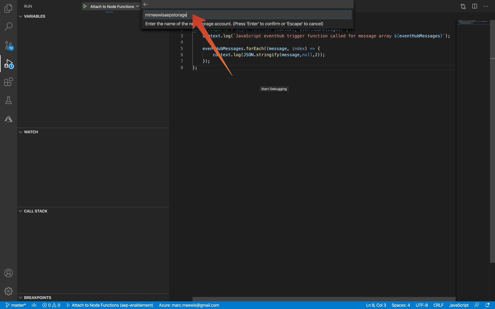

Select the resource group that you created as part of **exercise 1**. If you followed the naming conventions it will look like **ldap-aep-enablement**, for example **mmeewis-aep-enablement**
  
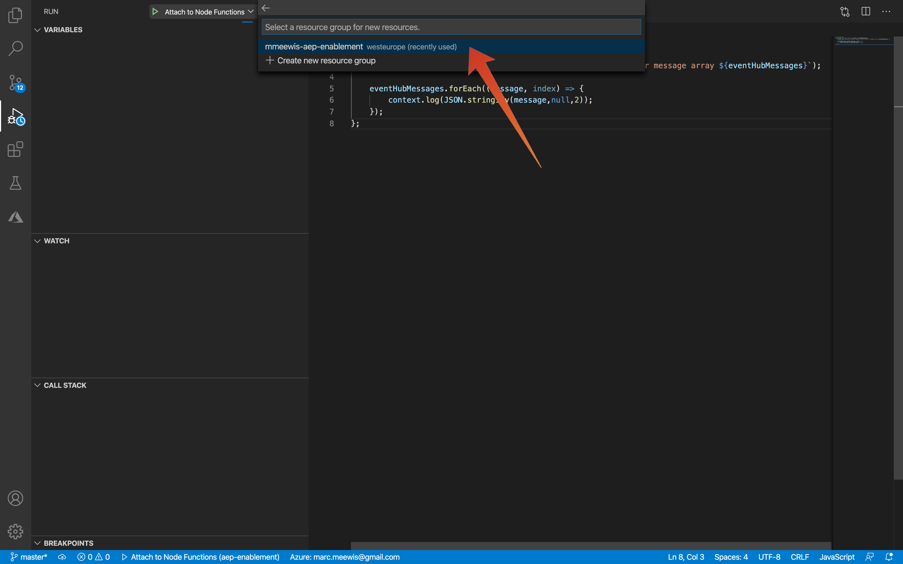

Select West Europe as the location for new resources:

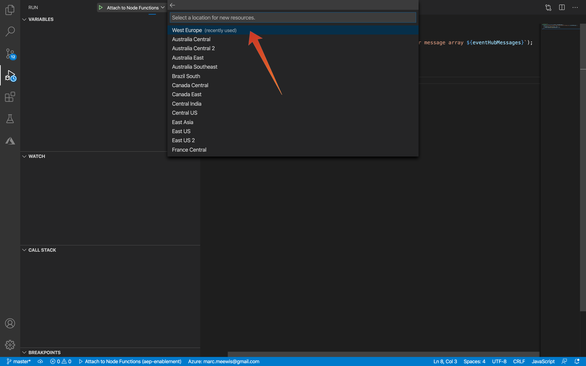

Let the storage account creation finish (can take 1-2 minutes):

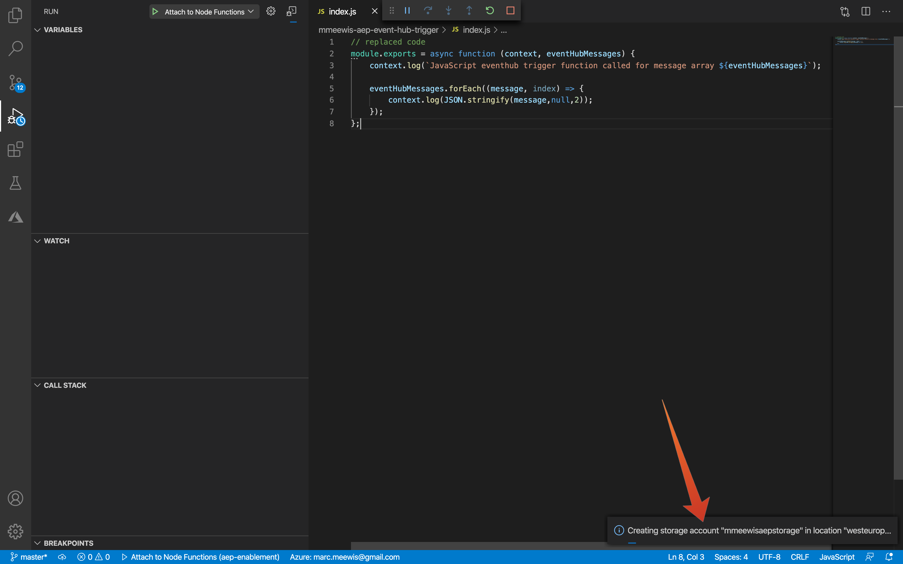

Your project is now up and running and is listing for events in the Event Hub. In the next exercise we will activate segments and demonstrate behavior in Luma Telco that will qualify us. As a result you will receive a segment qualification payload in the terminal of your Event Hub trigger function:

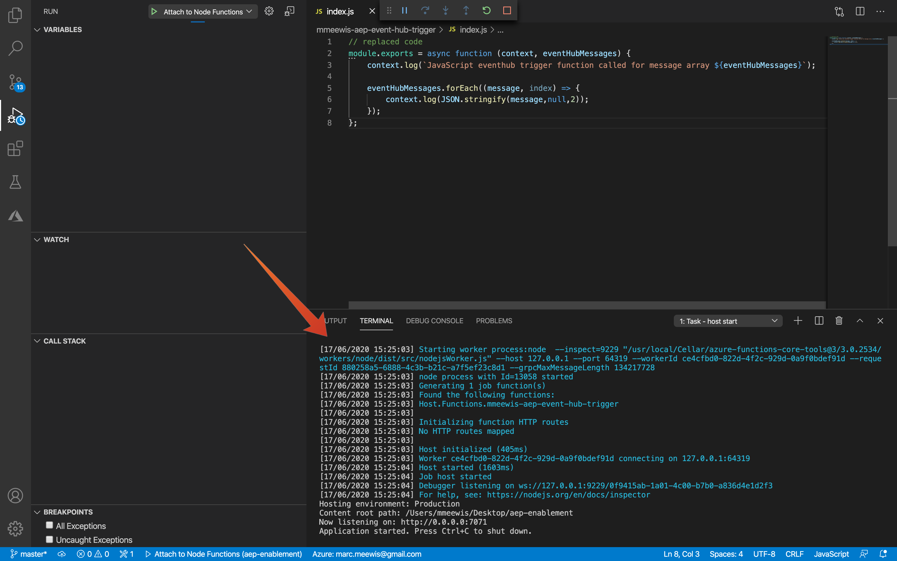

## 18.3.5 Stop Azure Project

To stop your project, select the **Terminal** tab, click in the terminal window and press **CMD-C** on OSX or **CTRL-C** on Windows:

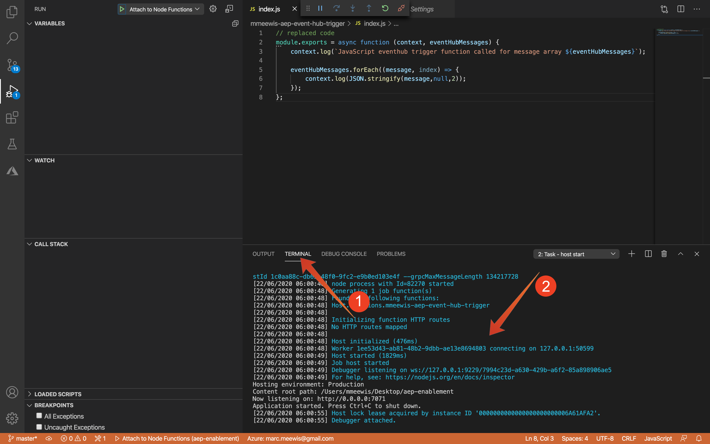

Next Step: [Exercise 4 - Create Streaming Segments](./ex4.md)

[Go Back to Module 18](./segment-activation-microsoft-azure-eventhub.md)

[Go Back to All Modules](./../../overview.md)