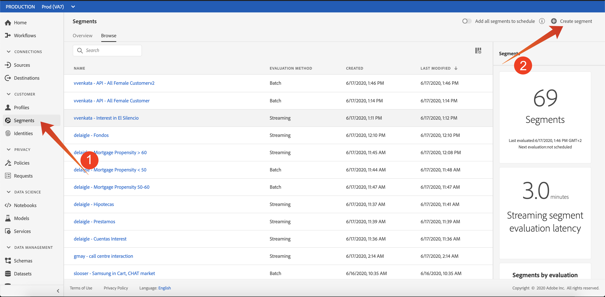
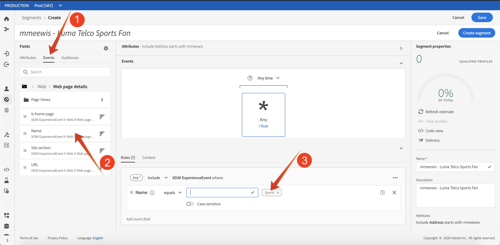
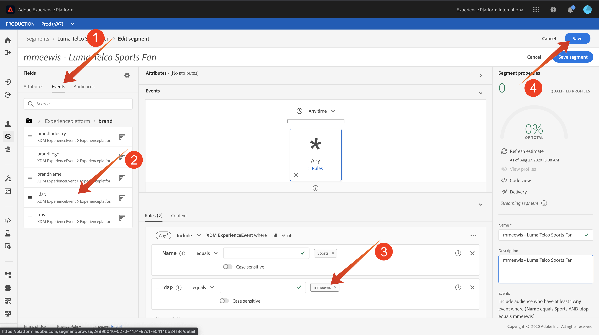

# 18.3 Create a Streaming Segment

## 18.3.1 Introduction

You'll create a simple segment:

- **Luma Telco Sports Fan** for which customer profiles will qualify when they visit the **Sports** page of the Luma Telco brand. 

### Good to know

Adobe Experience Platform Real-time CDP will trigger an activation to a destination when you qualify for a segment that is part of that destination's activation list. When that is the case, the segment qualification payload that will be send to that destination will contain **all the segments for which your profile qualifies**. 

The goal of this module is to show that your Customer Profile's segment qualification is sent to **your** event hub destination in real-time. As a result our segment defintion will have to include your **ldap** so that it only indentifies your profiles. If we would not do that, and everyone doing this enablement would create a segment with the exact same definition, you would potentially get a lot of segment qualification messages on your event hub. 

To avoid that and to keep the qualification payload small, we will only look at experience events that have a **brand.ldap** equals to **your ldap**

### Segment Status

A segment qualification in Adobe Experience Platform always has a **status**-property and can be one of the following:

- **realized**: this indicates a new segment qualification
- **existing**: this indicates an existing segment qualification
- **exited**: this indicates that the profile does no longer qualify for the segment

## 18.3.2 Build the segment

Building a segment in explained in detail in [Module 11](../module11/real-time-cdp-build-a-segment-take-action.md).

### Create Segment



Let's start with adding the profile email address expression to make sure we are only qualifying for our own segments:

Name your segment **ldap - Luma Telco Sports Fan** and add the page name experience event:

Click on **Events** (1), and drag and drop **XDM ExperienceEvent &gt; Web &gt; Web page details &gt; Name** (2). Enter **Sports** (3) as the value:



Drag and drop **XDM ExperienceEvent &gt; Brand &gt; ldap** (2). Enter &lt;your ldap&gt; (3) as the value and click save (4):



### PQL Definition

The PQL of our segment looks like:

```code
select _Any1 from xEvent where _Any1.web.webPageDetails.name.equals("Sports", false) and _Any1._experienceplatform.brand.ldap.equals("<your ldap>", false)
```

Next Step: [Exercise 4 - Activate Segment](./ex4.md)

[Go Back to Module 18](./segment-activation-microsoft-azure-eventhub.md)

[Go Back to All Modules](./../../overview.md)