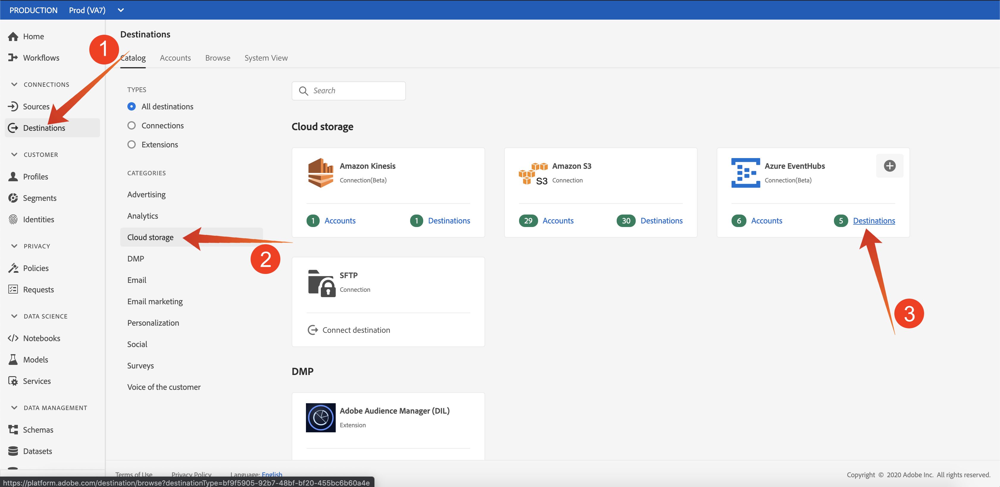
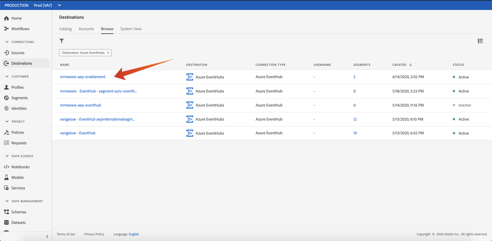
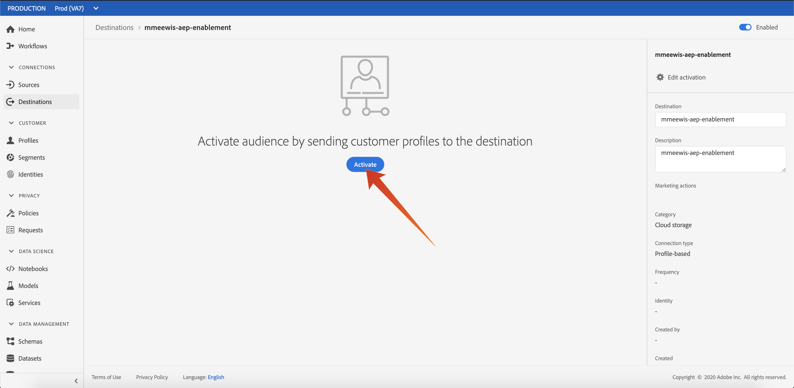
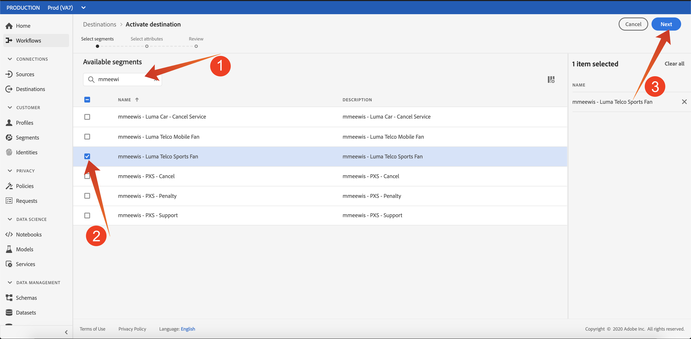
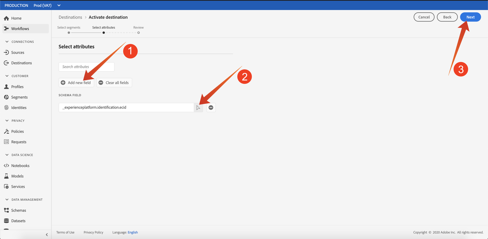
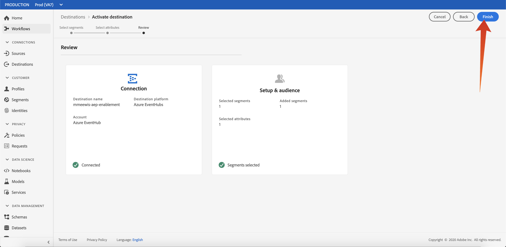
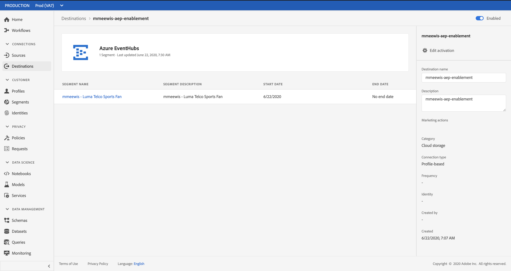

# Exercise 18.5: Activate Segment

## Objectives

- Add "Luma Telco Sports Fan" to Azure Event hub RT-CDP destination 

## Exercise 18.5.1 - Add Segment to Azure Event Hub Destination

In this exercise you will add your "**&gt;ldap&lt; - Luma Telco Sports Fan**" to your "&lt;ldap&gt;-aep-enablement" Azure Event Hub destination.

Navigate to https://platform.adobe.com and select "Destinations" (1), select "Cloud storage" (2) and click the "Destinations" link (3) in the Azure EventHubs card:

From the list of Event Hub destinations select your Event Hub, if you followed the naming conventions: **&lt;ldap&gt;-aep-enablement**, in my case that is **mmeewis-aep-enablement**:

Click "Activate":

Search (1) for your segment using your &lt;ldap&gt; and select **&lt;ldap&gt; - Luma Telco Sports Fan** (2) from the list of segments and click "Next" (3):

Adobe Experience Platform Real-time CDP can deliver a payload to two types of destinations, segment destinations and profile destinations.

Segment destinations will receive a predefined segment qualification payload that will be discussed later. Such a payloasd contains **all** the segment qualifications for a specific profile. Even for segments that are not in de destination's activation list. An example of such a segment destination are **Azure Event Hubs**, **Google DV360**

Profile based destinations let you pick any attribute (firstName, lastName, ...) from the XDM Profile Union Schema and include it in the activation payload. An example of such destination is the **Email Marketing**

Because our Azure Event Hub destination is a **segment** destination, we just need to select for example the **_experienceplatform.identification.ecid**. 

Click "Add new field" (1), click browse schema (2) and select the **_experienceplatform.identification.ecid** and click "Next" (3):

Click "Finish":

Your segment is activated:

Next Step: [Exercise 6 - Action!](./ex6.md)

[Go Back to Module 18](./segment-activation-microsoft-azure-eventhub.md)

[Go Back to All Modules](./../../overview.md)