# 19.5 Setup your ServiceNow Flow

## 19.5.1 Open the Flow 

In ServiceNow, in the Filter Navigator, enter the search term **Flow Designer**. Click **Flow Designer**.

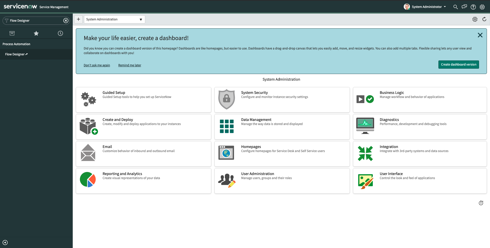

You'll then see this.

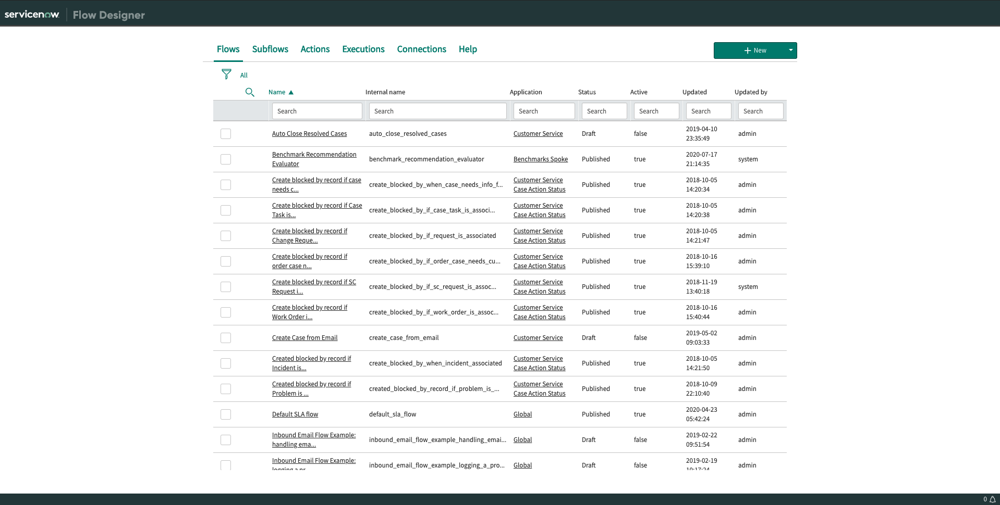

Click the **Search** icon and search for the flow that is named **ServiceNow CSM Case ingestion to AEP**.

Click to open the flow **ServiceNow CSM Case ingestion to AEP**.

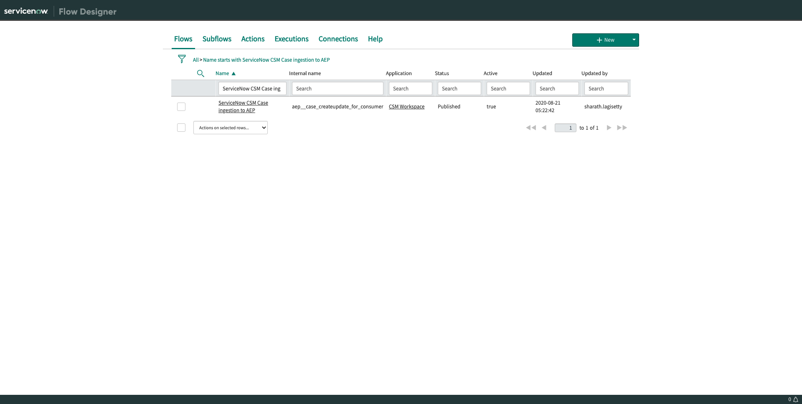

You'll then see this:

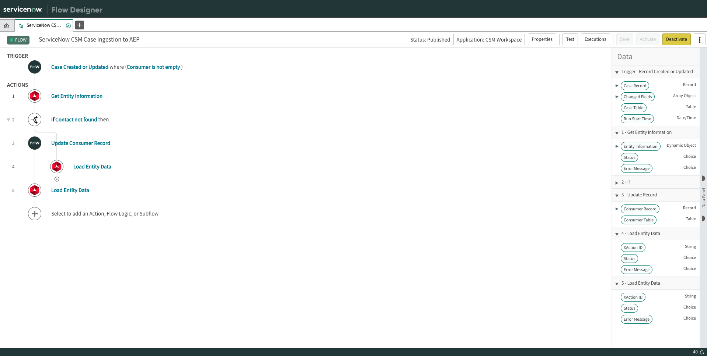

Your flow already has all the required building blocks, you now need to complete this configuration.

It's important to understand that this flow will be triggered when a customer service management case is created or updated. A case is created or updated when a Customer Service Agent has had an interaction with a customer.

## 19.5.2 Action 1 - Get Entity Information

Click to open Action 1 - Get Entity Information. This configuration was created by importing the XML file in one of the previous exercises. This action should look like this:

- **Entity**: XDM Individual Profile
- **Identity Field**: Email
- **Identity Value**: Trigger > Case Record > Consumer > Email

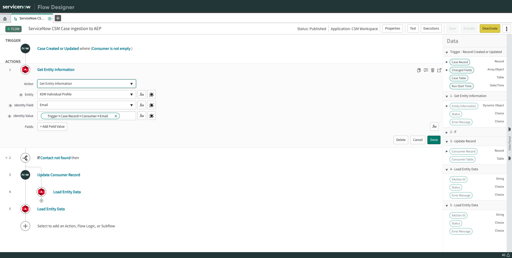

The goal of this action is to verify if the customer that contacted the Service Center, already exists in Adobe Experience Platform. Based on the response from Adobe Experience Platform, a different next action will be triggered.

Action 2 in this flow verifies if the customer was found or not. If the customer was found in Adobe Experience Platform, the next action will be Action 3. If the customer wasn't found in Adobe Experience Platform, the next action will be Action 4, which will actually create the customer in Adobe Experience Platform.

If your configuration corresponds with the above image, continue with the next action.

## 19.5.3 Action 3 - Update Consumer Record

Click to open Action 3 - Update Consumer Record. You'll then see this.

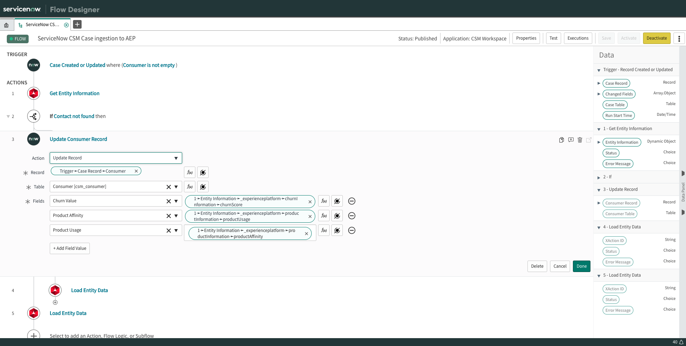

The goal of this step is to read the response from Adobe Experience Platform, and filter out the values for a couple of fields. In this use case, you need to collect the values for the fields **Churn Value**, **Product Affinity** and **Product Usage** from the response from Adobe Experience Platform.

This configuration was copied from the XML template that you imported before, and its configuration isn't correct. You need to verify the mapping for each of the below three fields.

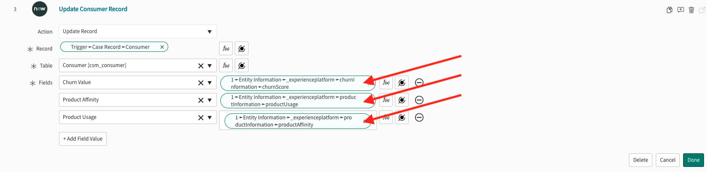

First, click the **X** icon on each of those three mapped fields to remove the current mapping. You'll then have this:

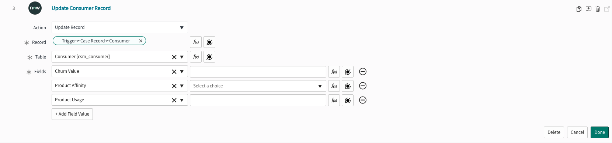

To do so, click the **data pill** icon next to each field. You'll then see this:

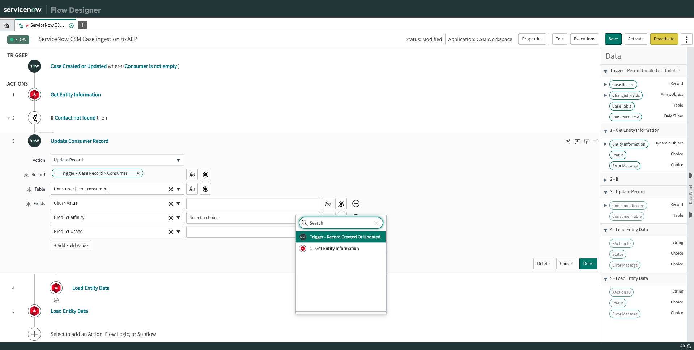

Next, click **Get Entity Information**. You'll then see this:

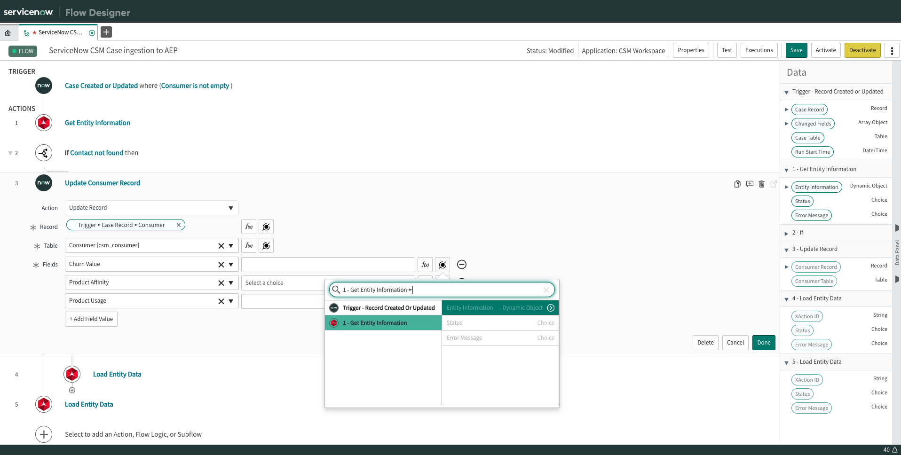

Next, click the little arrow icon on the field **Entity Information**. You'll then see this:

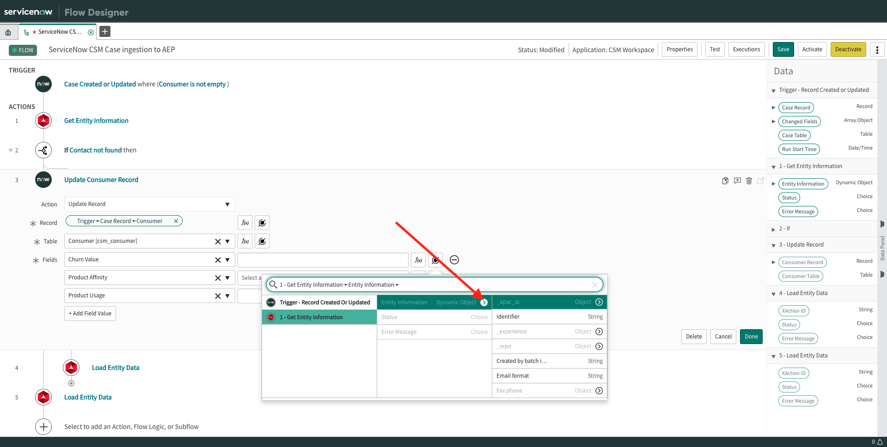

Next, click the little arrow icon on the field `--aepTenantId--`. You'll then see this:

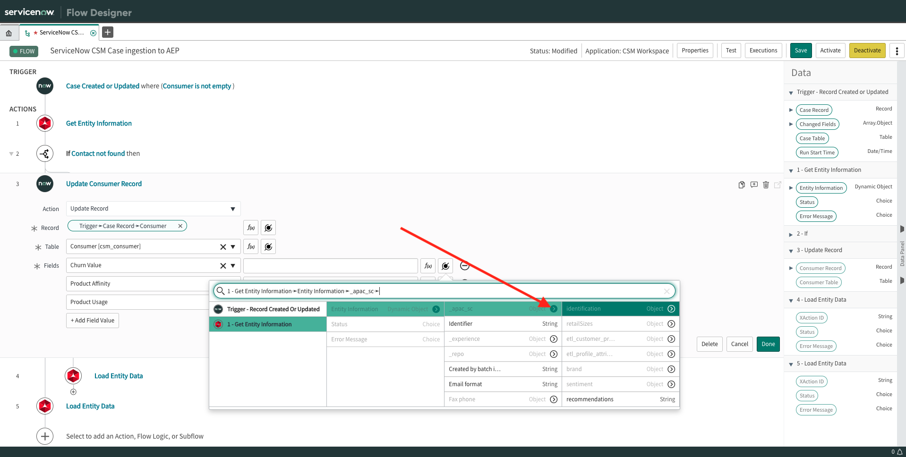

Next, scroll down and click the little arrow icon on the field **churnInformation**. You'll then see this:

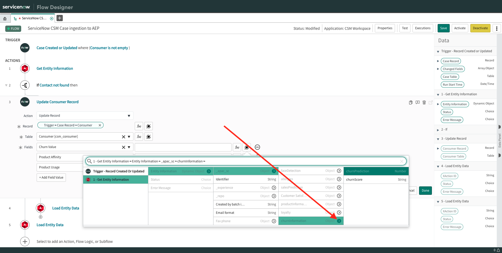

Finally, click to select the field **churnScore**.

Repeat this process to select the values for the fields **Product Affinity** and **Product Usage**.

- Product Affinity should be linked to the field `--aepTenantId--`.**productInformation**.**productAffinity**.

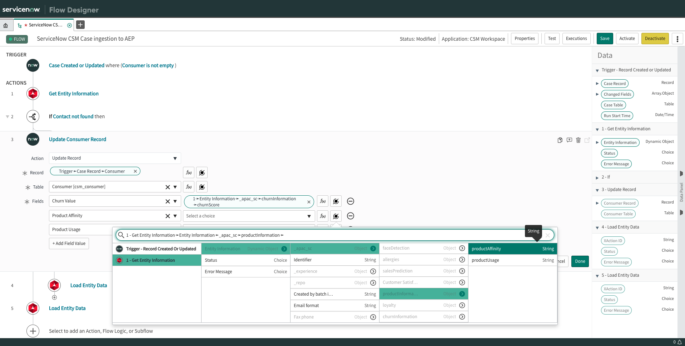

- Product Usage should be linked to the field `--aepTenantId--`.**productInformation**.**productUsage**.

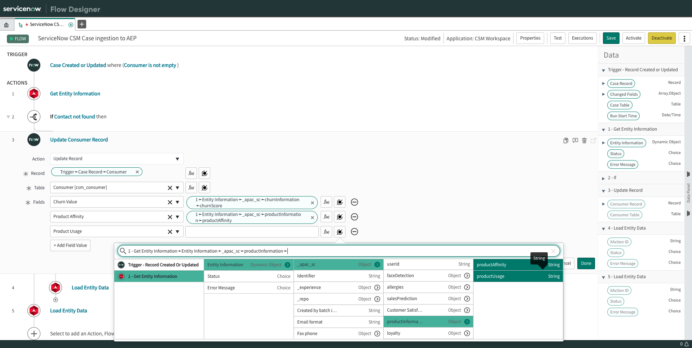

Finally, action 3 should look like this now. Click **Done** first, followed by **Save**.

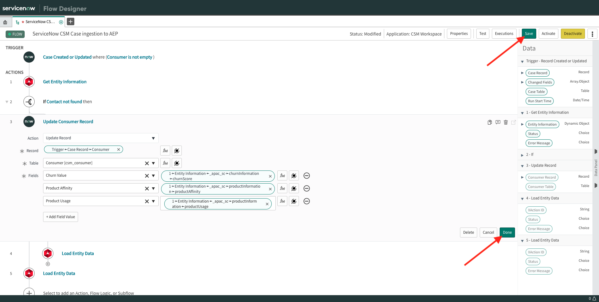

## 19.5.4 Action 4 - Load Entity Data

Click to open Action 4 - Load Entity Data. You'll then see this.

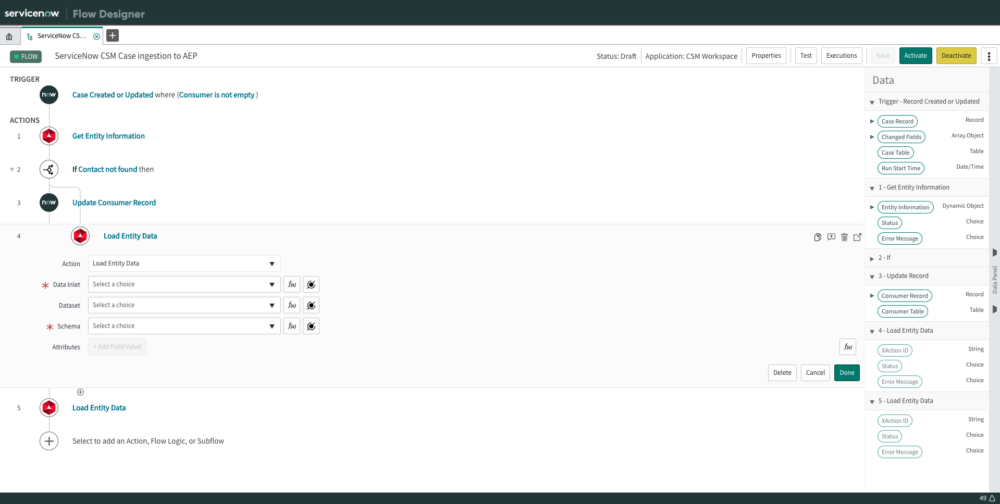

This is the step that will create a customer profile in Adobe Experience Platform, if the customer profile doesn't exist yet in Adobe Experience Platform.

You now need to make a selection for the fields Data Inlet, Dataset and Schema:

- Data Inlet: select **Demo System Next Streaming Endpoint**
- Dataset: select **AEP Demo - Website Registrations**
- Schema: select **AEP Demo - Website Registrations Schema**

You should then see this:

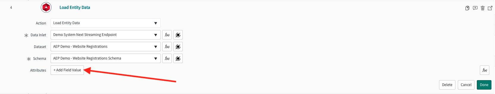

Next, you need to add attribute fields to this action by clicking the **+ Add Field Value** button.

These fields need to be added:

| Key |  Value |
|---|---|
| --aepTenantId-- > identification > emailId | 3 - Update Record > Consumer Record > Email |
| --aepTenantId-- > identification > mobilenr | 3 - Update Record > Consumer Record > Mobile Phone |
| Person > Full Name > First Name | 3 - Update Record > Consumer Record > First Name |
| Person > Full Name > Last Name | 3 - Update Record > Consumer Record > Last Name |
| Identifier | Trigger - Record Created or Updated > Case Record > ID for AEP|

Here's how to find the above fields to map (values in the above table):

- 3 > Consumer Record > Email

  

- 3 > Consumer Record > Mobile Phone

  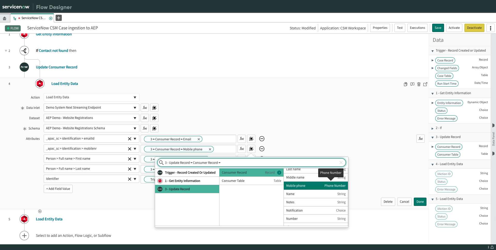

- 3 > Consumer Record > First Name

  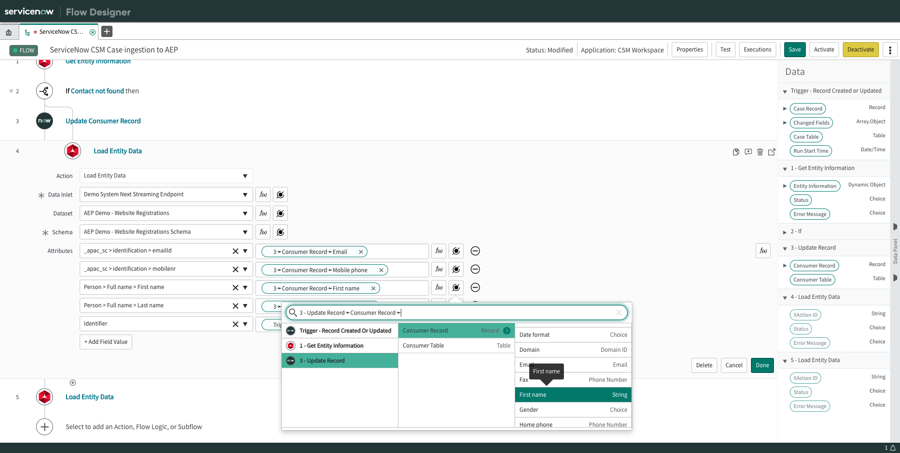

- 3 > Consumer Record > Last Name

  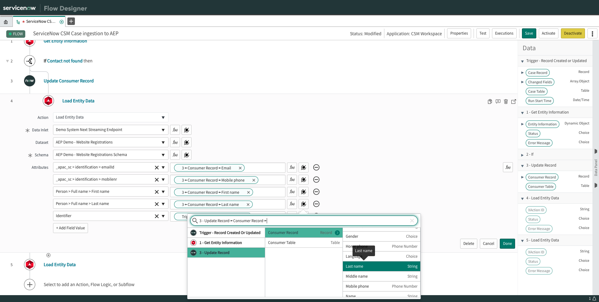

- Trigger > Case Record > ID for AEP
  
  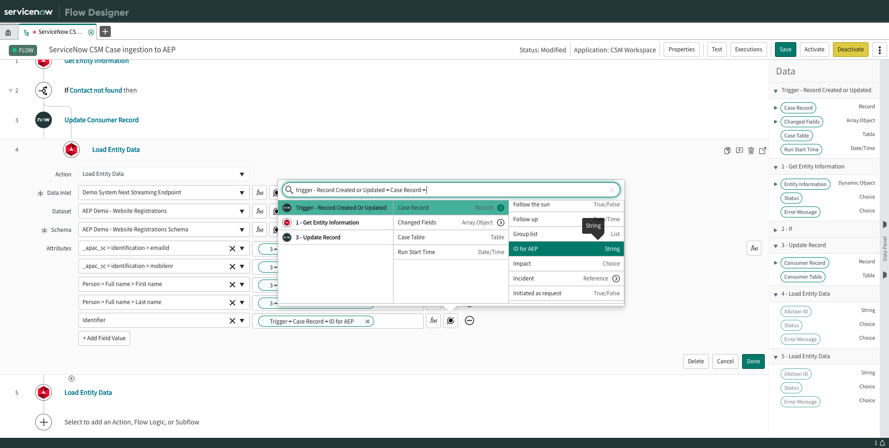
  
Finally, action 4 should look like this now. Click **Done** first, followed by **Save**.

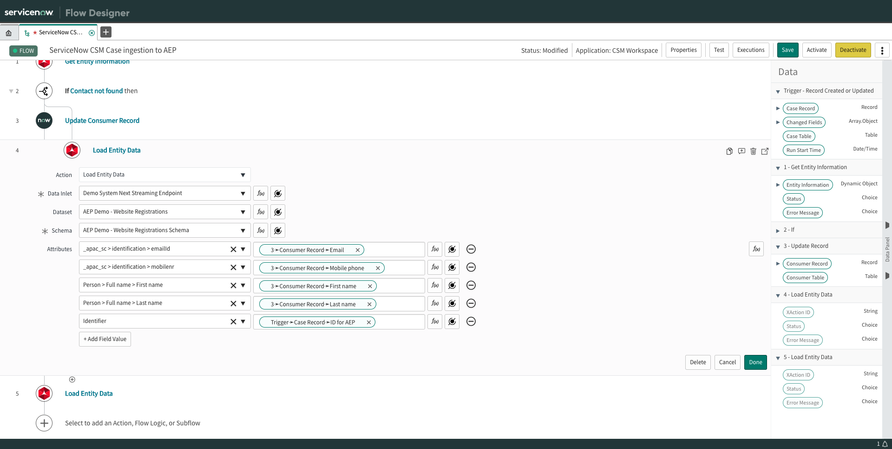

## 19.5.5 Action 5 - Load Entity Data

Click to open Action 5 - Load Entity Data. You'll then see this.

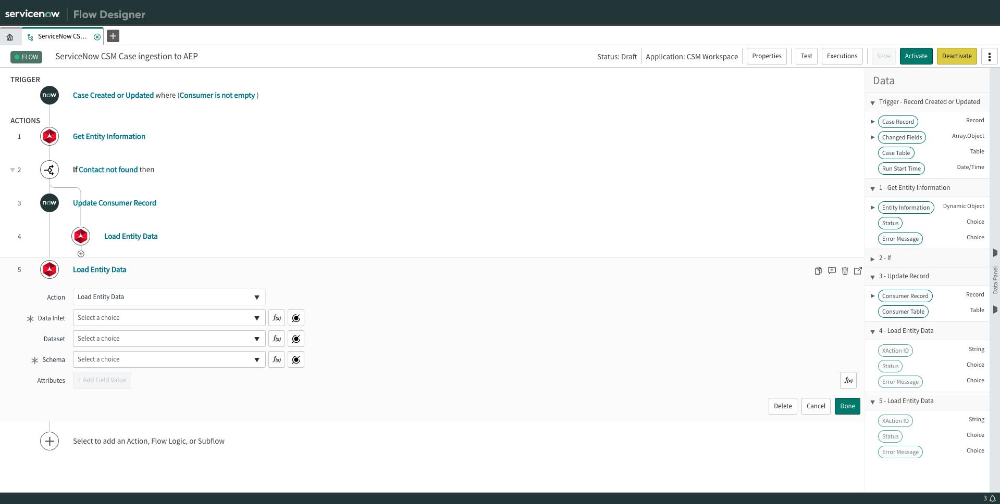

This is the step that will send a service center interaction event to Adobe Experience Platform, when the Service Agent has created or updated a case in ServiceNow.

You now need to make a selection for the fields Data Inlet, Dataset and Schema:

- Data Inlet: select **Demo System Next Streaming Endpoint**
- Dataset: select **AEP Demo - Call Center Interactions**
- Schema: select **AEP Demo - Call Center Interactions Schema**

You should then see this:

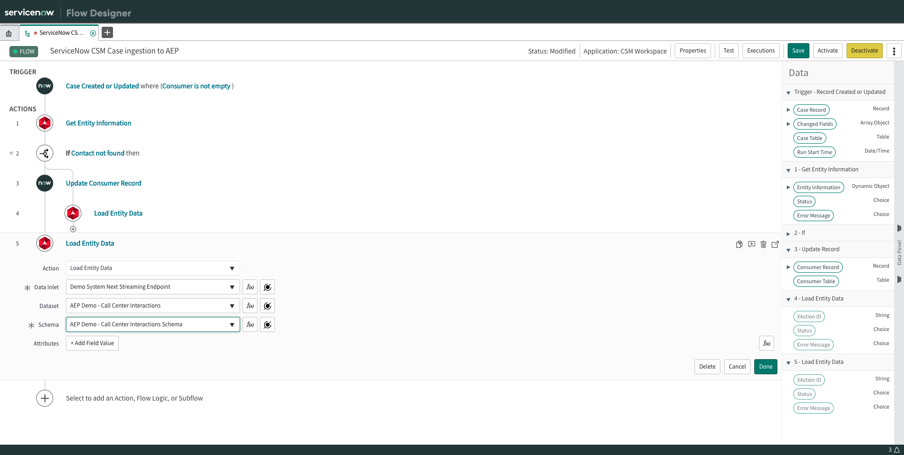

Next, you need to add attribute fields to this action by clicking the **+ Add Field Value** button.

These fields need to be added:

| Key |  Value |
|---|---|
| --aepTenantId-- > callDetails > callFeeling | Trigger - Record Created or Updated > Case Record > Call Feeling |
| --aepTenantId-- > callDetails > callInteractionType | Trigger - Record Created or Updated > Case Record > Number |
| --aepTenantId-- > callDetails > callTopic | Trigger - Record Created or Updated > Case Record > Short Description |
| --aepTenantId-- > callDetails > callChannel | Trigger - Record Created or Updated > Case Record > Channel |
| --aepTenantId-- > callDetails > callPriority | Trigger - Record Created or Updated > Case Record > Priority |
| --aepTenantId-- > identification > mobilenr | Trigger - Record Created or Updated > Case Record > Consumer > Mobile Phone |
| --aepTenantId-- > identification > emailId | Trigger - Record Created or Updated > Case Record > Consumer > Email |
| Event Type | serviceNow_CSMCase |
| Identifier | Trigger - Record Created or Updated  > Case Record > ID for AEP |
| Timestamp | Trigger - Record Created or Updated  > Case Record > Timestamp for AEP |

Here's how to find the above fields to map (values in the above table):
  
- Trigger > Case Record > Call Feeling
  
  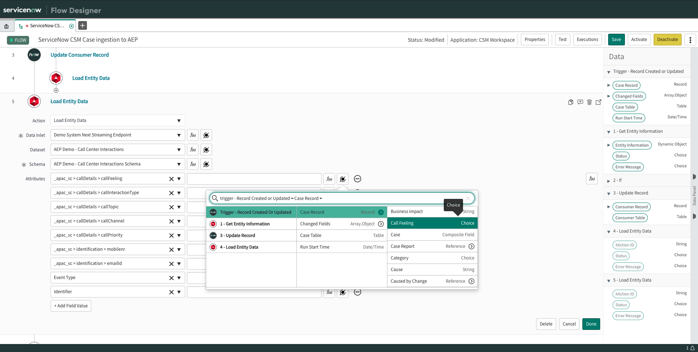
  
- Trigger > Case Record > Number
  
  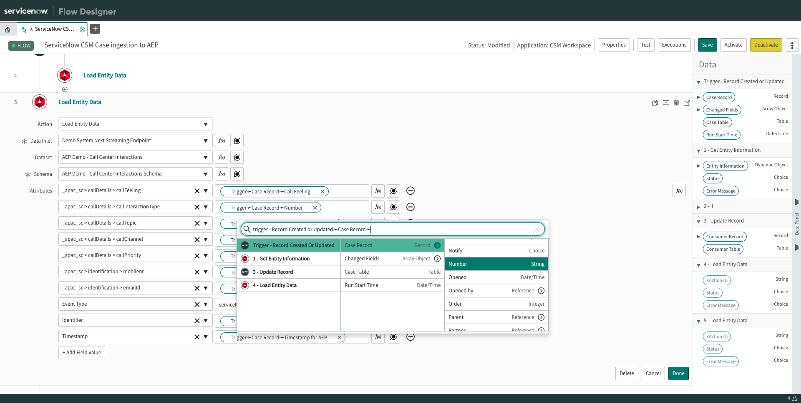
  
- Trigger > Case Record > Short Description
  
  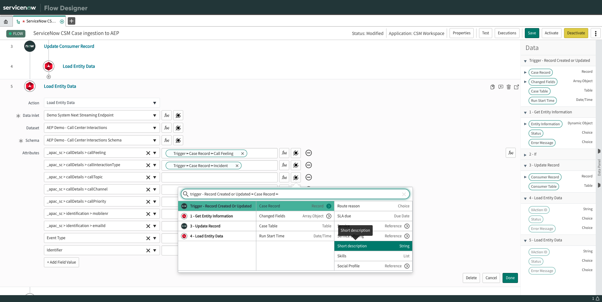
  
- Trigger > Case Record > Channel
  
  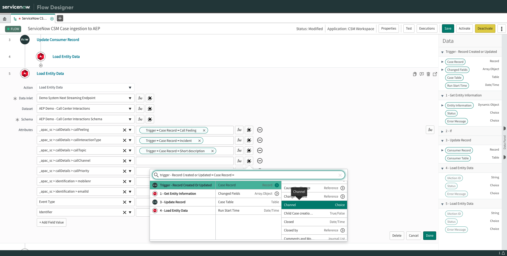
  
- Trigger > Case Record > Priority
  
  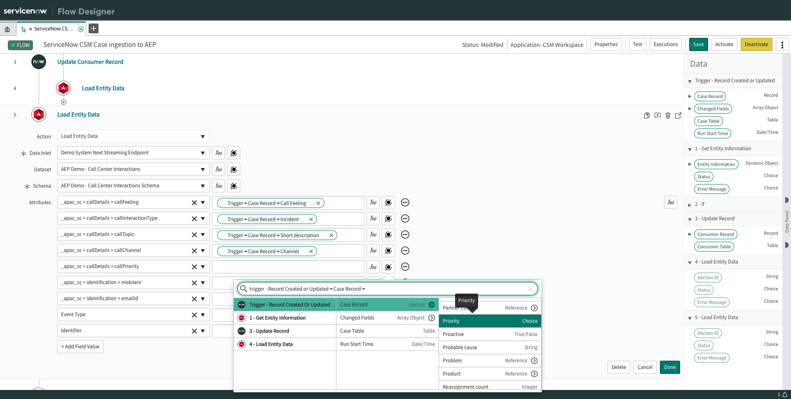
  
- Trigger > Case Record > Consumer > Mobile Phone
  
  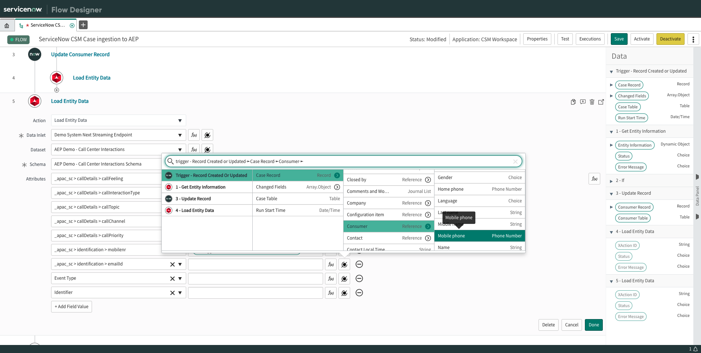
  
- Trigger > Case Record > Consumer > Email
  
  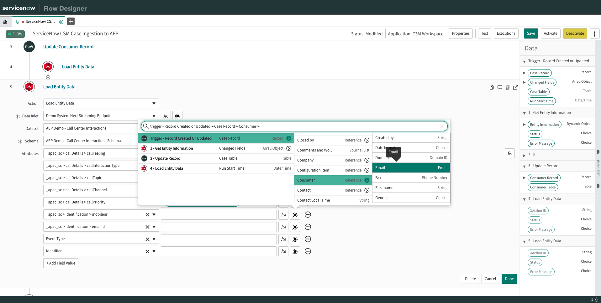
  
- Trigger > Case Record > ID for AEP
  
  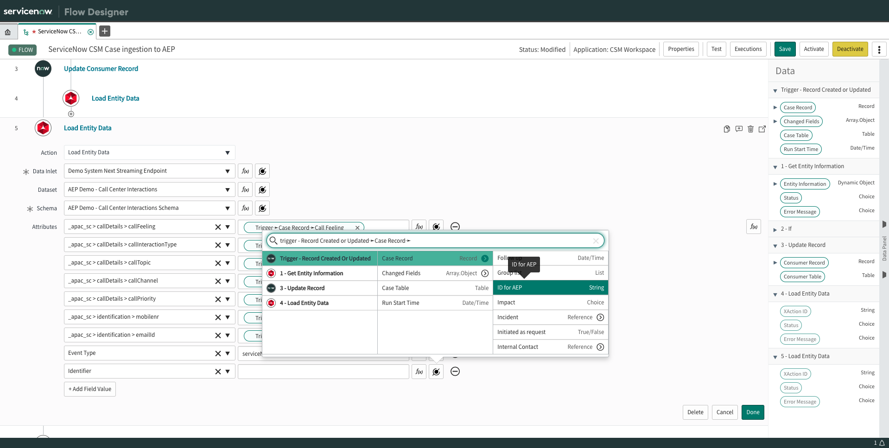
  
- Trigger > Case Record > Timestamp for AEP
  
  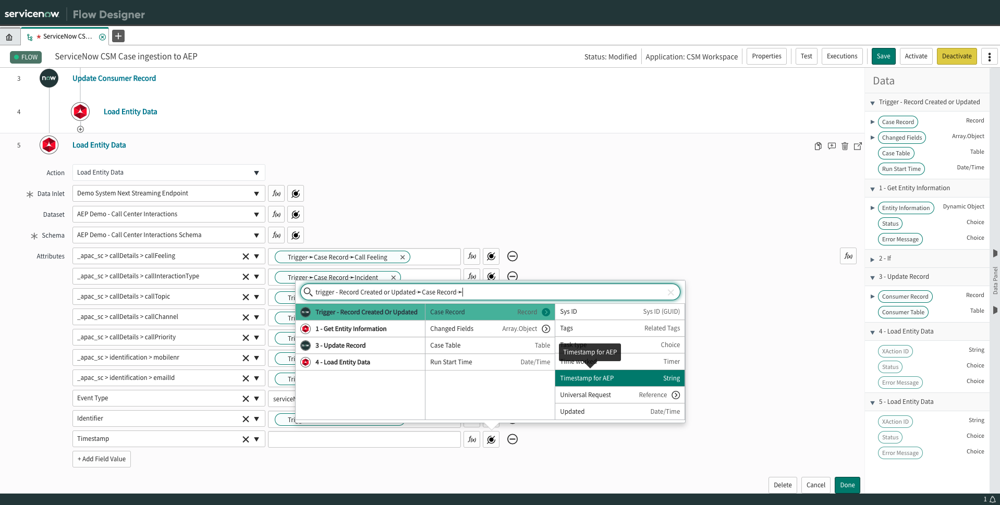
  
Finally, action 4 should look like this now. Click **Done** first, followed by **Save**.

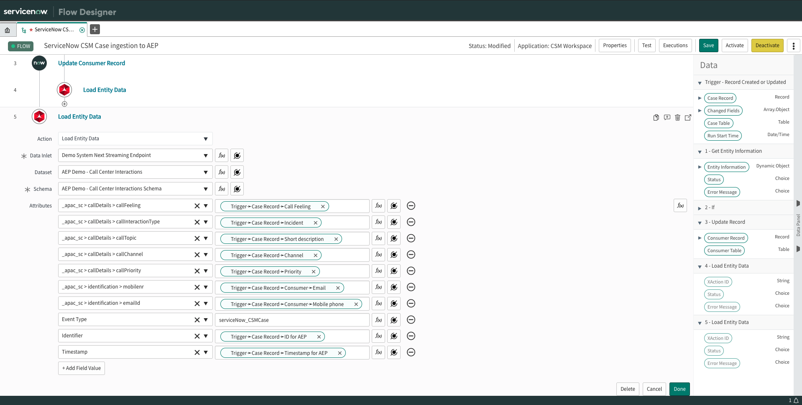

You've now completed the configuration of your flow. Click **Activate**.

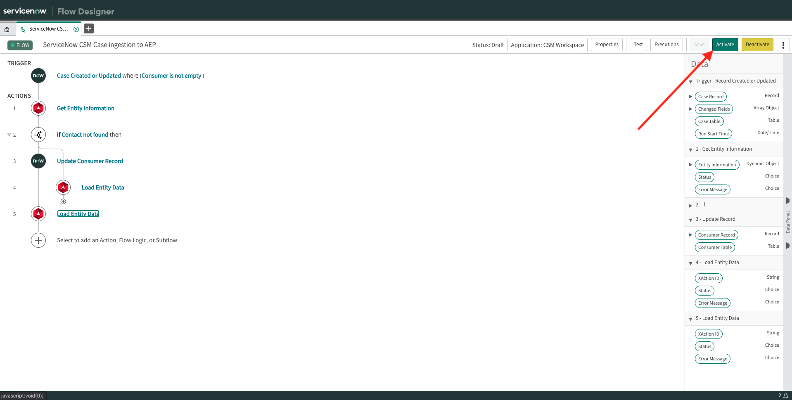

Next Step: [19.6 Prepare End-to-end Demo](./ex6.md)

[Go Back to Module 19](./call-center-servicenow.md)

[Go Back to All Modules](./../../overview.md)
