# 2.4 Data Ingestion from Offline Sources

In this exercise, the goal is to onboard external data like CRM Data in Platform.

## Learning Objectives

- Learn how to generate test data
- Learn how to ingest CSV
- Learn how to use the web UI for data ingestion through Workflows
- Understand the data governance features of Experience Platform

## Resources

- Mockaroo UI: [https://www.mockaroo.com/](https://www.mockaroo.com/)
- Experience Platform UI: [https://experience.adobe.com/platform/](https://experience.adobe.com/platform/)

## Tasks

- Create a CSV file with demo date. Ingest the CSV file in Adobe Experience Platform by making use of the available workflows.
- Understand data governance options in Adobe Experience Platform

## 2.4.1 Create your CRM Dataset through a data generator tool

For this you need 1000 sample lines of CRM Data.

Open the Mockaroo Template by going to [https://www.mockaroo.com/12674210](https://www.mockaroo.com/12674210).

On the template, you'll notice the following fields:

- id
- first_name
- last_name
- email
- gender
- birthDate
- home_latitude
- home_longitude
- country_code
- city
- country

All these fields have been defined to produce data that is compatible with Platform. 

To generate your CSV-file, click the **[!DNL Download Data]** button which will give you a CSV-file with 1000 lines of demo-data. 

Open your CSV-file in Microsoft Excel to visualize its contents.

With your CSV-file ready, you can proceed with mapping it against XDM.

### 2.4.2 Verify the CRM Onboarding Dataset in Adobe Experience Platform

Open [Adobe Experience Platform](https://experience.adobe.com/platform) and go to **[!DNL Datasets]**. 

Before you continue, you need to select a **[!DNL sandbox]**. The sandbox to select is named ``--module2sandbox--``. You can do this by clicking the text **[!DNL Production Prod]** in the blue line on top of your screen.

From the list of available [!DNL sandboxes], select the [!DNL sandbox] that matches the number you've been assigned.

After selecting the appropriate [!DNL sandbox], you'll see the screen change and now you're in your dedicated [!DNL sandbox].

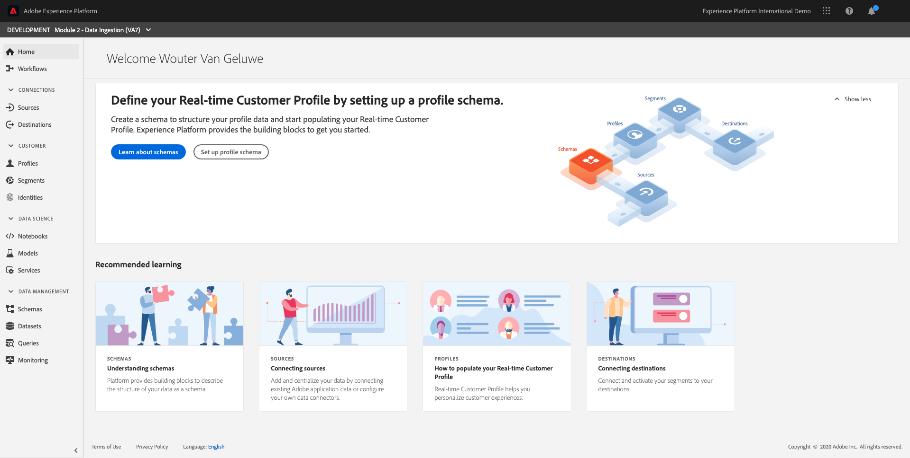

In Adobe Experience Platform, click on **[!DNL Datasets]** in the menu on the left side of your screen.

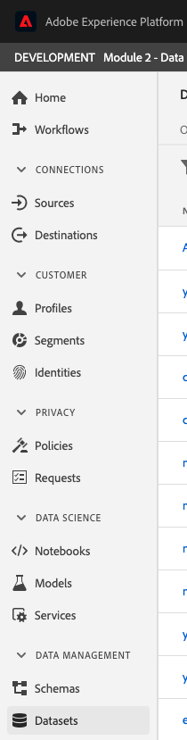

You're going to use a shared dataset based in this enablement. The shared dataset has been created already and is called **[!DNL Demo System - Profile Dataset for CRM]**. 

>[!NOTE]
>
> Depending on the Adobe Experience Platform template that was installed in your environment, the dataset may also be named **[!DNL AEP Demo - CRM Onboarding]**. If that is the case, please proceed by using the dataset **[!DNL AEP Demo - CRM Onboarding]**.

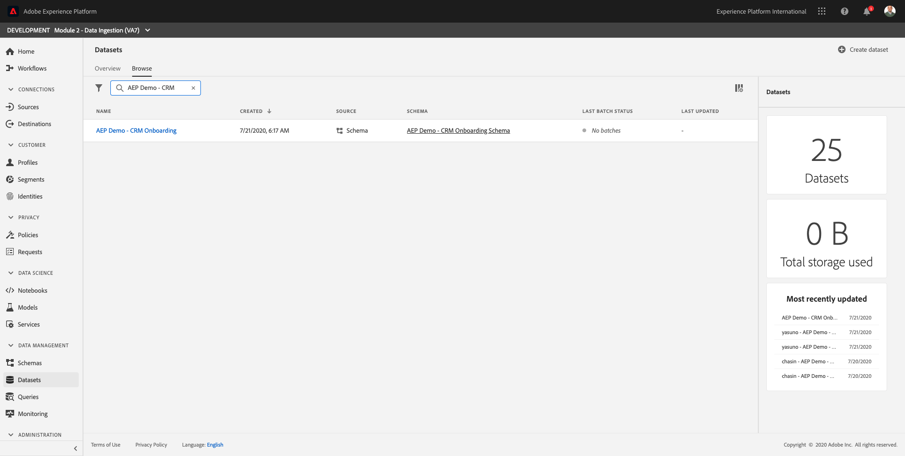

Open the dataset **[!DNL Demo System - Profile Dataset for CRM]**.

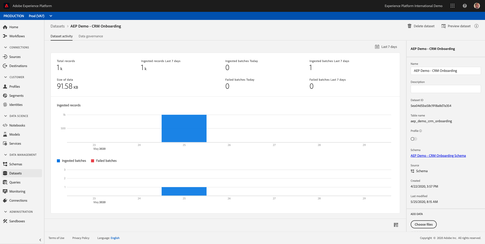

On the overview screen, you can see 3 main pieces of information.

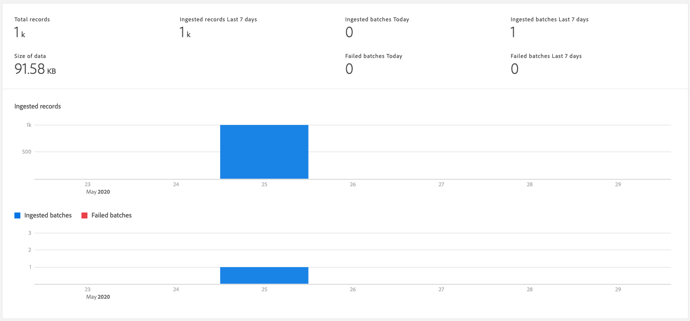

First of all, the [!DNL Dataset Activity] dashboard shows the total number of CRM records in the dataset and the ingested batches and their status

Second, by scrolling down on the page you can check when batches of data were ingested, how many records were onboarded and also, whether or not the batch was successfully onboarded. The **[!DNL Batch ID]** is the identifier for a specific batch job, and the **[!DNL Batch ID]** is important as it can be used for troubleshooting why a specific batch was not successfully onboarded. More on that in Enablement Module 2.

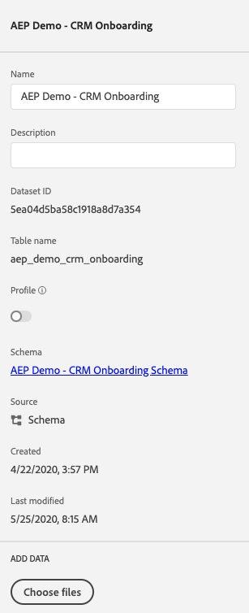

Lastly, the [!DNL Dataset Info] tab shows important information like the [!DNL Dataset ID] (again, important from a troubleshooting perspective), the Dataset's Name and whether the dataset was enabled for Profile. 

The most important setting here is the link between the dataset and the Schema. The Schema defines what data can be ingested and how that data should look like. 

In this case, we're using the **[!DNL Demo System - Profile Schema for CRM]**, which is mapped against the class of **[!DNL Profile]** and has implemented extensions, also called mixins. 

>[!NOTE]
>
> Depending on the Adobe Experience Platform template that was installed in your environment, the dataset may also be named **[!DNL AEP Demo - CRM Onboarding Schema]**. If that is the case, please proceed by using the dataset **[!DNL AEP Demo - CRM Onboarding Schema]**.

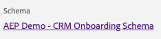

By clicking on the name of the schema, you're taken to the [!DNL Schema] overview were you can see all the fields that have been activated for this schema.

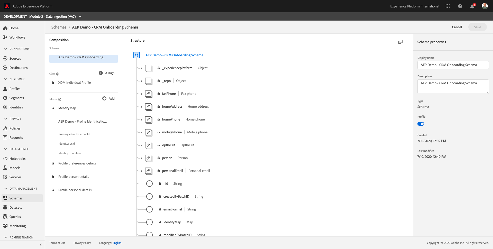

Every schema needs to have a custom, primary descriptor defined. In the case of our CRM dataset, the schema has defined that the field **[!DNL email]** should be the primary identifier. If you want to create a schema and link it to the [!DNL Real-time Customer Profile], you need to define a custom [!DNL Mixin] that refers to your primary descriptor.

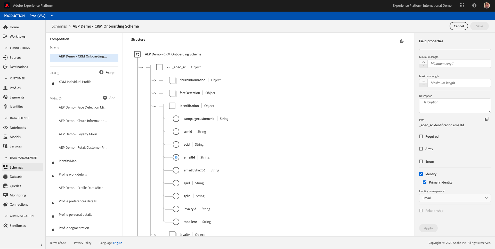

In the above screenshot, you can see that our descriptor is located in `--aepTenantId--.identification.emailId`, which is set as the [!DNL Primary Identifier], linked to the [!DNL namespace] of **[!DNL email]**.

Every schema and as such, every dataset that should be used in the [!DNL Real-time Customer Profile] should have one [!DNL Primary identifier]. This [!DNL Primary Identifier] is the identifier user by the brand for a customer in that dataset. In the case of a CRM dataset it might be the email-address or the CRM ID, in the case of a Call Center dataset it might be the mobile number of a customer.

It is best practice to create a separate, specific schema for every dataset and to set the descriptor for every dataset specifically to match how the current solutions used by the brand operate.

### 2.4.3 Using a workflow to map a CSV file to an XDM Schema

The goal of this is to onboard CRM data in Platform. All the data that is ingested in Platform should be mapped against the specific XDM Schema. What you currently have is a CSV dataset with 1000 lines on the one side, and a dataset that is linked to a schema on the other side. To load that CSV file in that dataset, a mapping needs to take place. To facilitate this mapping exercise, we have **[!DNL Workflows]** available in Adobe Experience Platform.

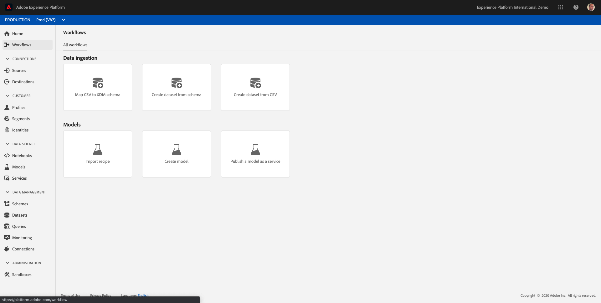

The [!DNL workflow] that we'll use here, is the [!DNL workflow] named **[!DNL Map CSV to XDM Schema]** in the [!DNL Data Ingestion] menu.

Click the **[!DNL Map CSV to XDM Schema]** button.

Click **[!DNL Launch]** to start the process.

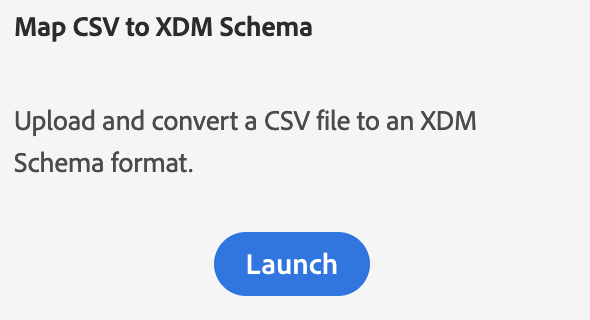

On the next screen, you need to select a dataset to ingest your file in. You have the choice between selecting an already existing dataset or creating a new one. For this exercise, we'll reuse an existing one: please select **[!DNL Demo System - Profile Dataset for CRM]** as indicated below.

>[!NOTE]
>
> Depending on the Adobe Experience Platform template that was installed in your environment, the dataset may also be named **[!DNL AEP Demo - CRM Onboarding]**. If that is the case, please proceed by using the dataset **[!DNL AEP Demo - CRM Onboarding]**.

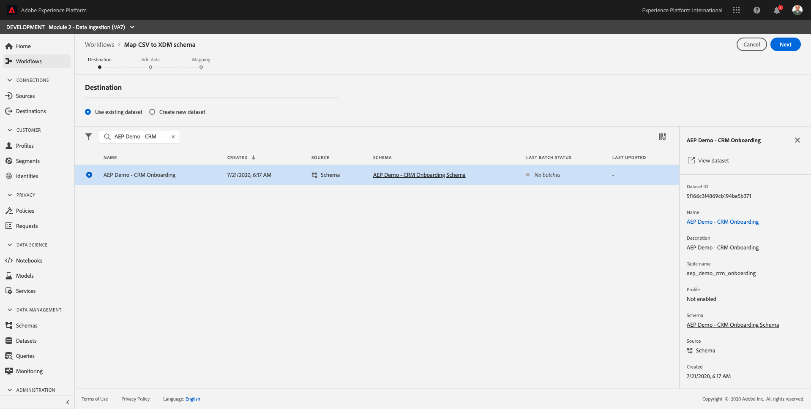

Click **[!DNL Next]** to go to the next step.

Drag & Drop your CSV-file or click **[!DNL Browse]** and navigate on your computer to your desktop and select your CSV-file.

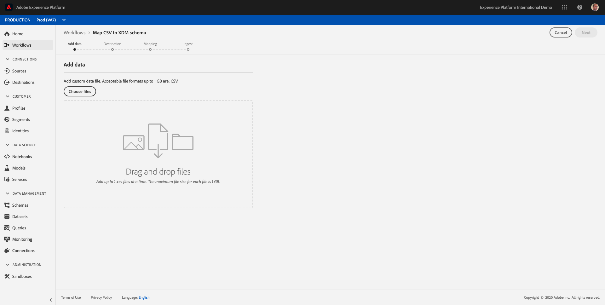

After selecting your CSV-file it will upload immediately and you will see a preview of your file within seconds.

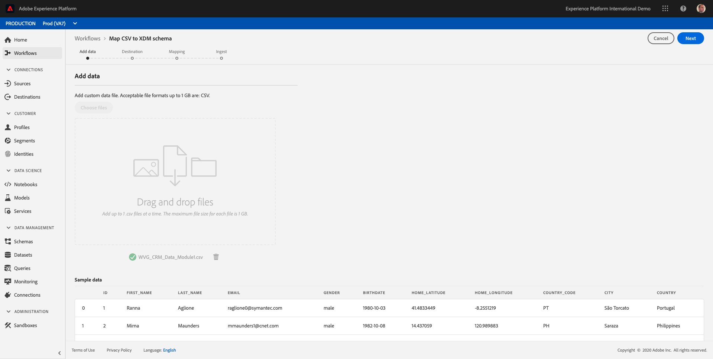

Click **[!DNL Next]** to go to the next step. It can take a few seconds while the file is processed completely.

It's now time to map your CSV Column Headers with an XDM-property in your **[!DNL Demo System - Profile Dataset for CRM]**.

Adobe Experience Platform has already done some guessing for us, by trying to link the [!DNL Source Attributes] with the [!DNL Target Schema Fields].

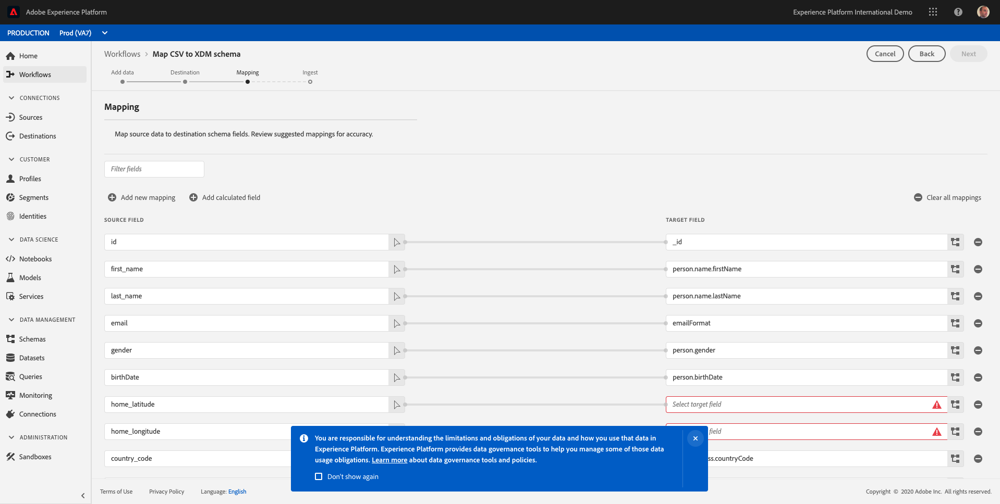

First of all, we need to add the required mapping for the primary identifier field. The primary identifier field is a required field in this workflow and expects you to indicate what the primary identifier is of the file you're uploading, as defined in the schema that is linked to this dataset. 

Selecting the primary identifier is actually the most important thing: you'll be defining the custom, brand-specific, primary identifier. The primary identifier is a requirement for this data to be onboarded. Without the presence of the primary identifier, the ingestion of this CSV-file will fail.

The primary identifier for the **[!DNL Demo System - Profile Dataset for CRM]**-dataset is the **[!DNL email]** as it's the unique identifier for this dataset.
In this case, based on the selection of the dataset and the schema that is linked to the dataset, the required [!DNL Target Schema Field] in XDM is `--aepTenantId--.identification.emailId`. You need to map the **[!DNL email]**-field from your CSV file as the source attribute for this required [!DNL Target Schema Field].

To do this, click the **[!DNL Add new mapping]** button.

In the [!DNL Source Field], click the **[!DNL arrow]** icon.

In the popup, select the field **[!DNL email]**.

You'll then see this. Click the **[!DNL schema]** icon.

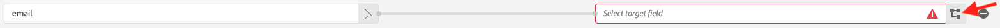

In the popup, select the field `--aepTenantId--.identification.emailId`.

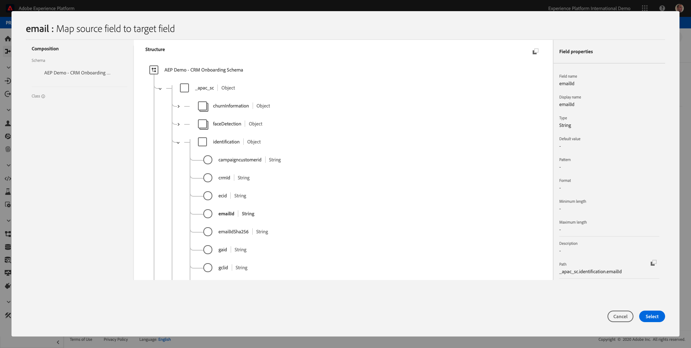

The result should look like this:

For the [!DNL Schema Mappings], Adobe Experience Platform has tried to link fields together already. However, not all proposals of mapping are correct.

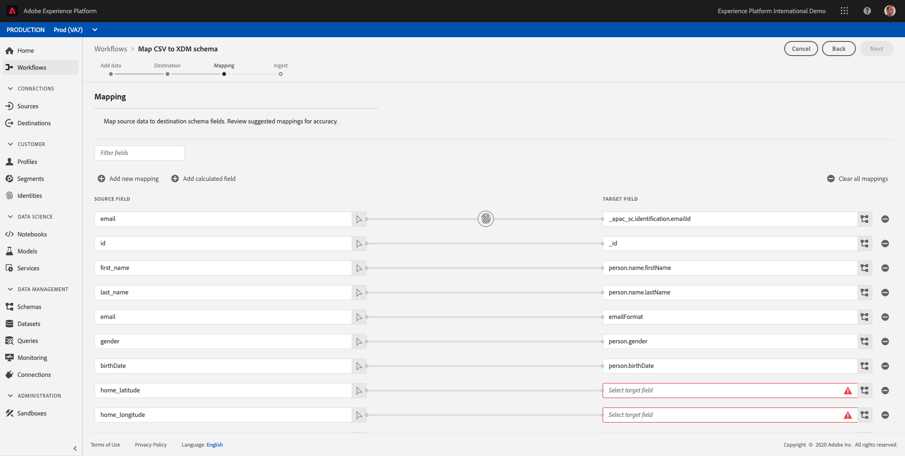

For the [!DNL Source Attribute] **[!DNL email]**, the Target Schema Field should be **[!DNL personalEmail.address]**. You can either enter **[!DNL personalEmail.address]** in the field, or you can click the icon to visually locate the correct property in the **[!DNL Demo System - Profile Dataset for CRM Schema]**.

You also need to update 2 fields: **[!DNL home_latitude]** and **[!DNL home_longitude]** haven't been filled out by the mapper tool.

Locate the **[!DNL home_latitude]**-line.

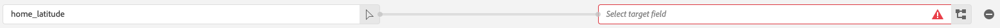

Click the **[!DNL schema]** icon:
 

Locate the property **[!DNL homeAddress._schema.latitude]** by making use of the visual mapping tool.

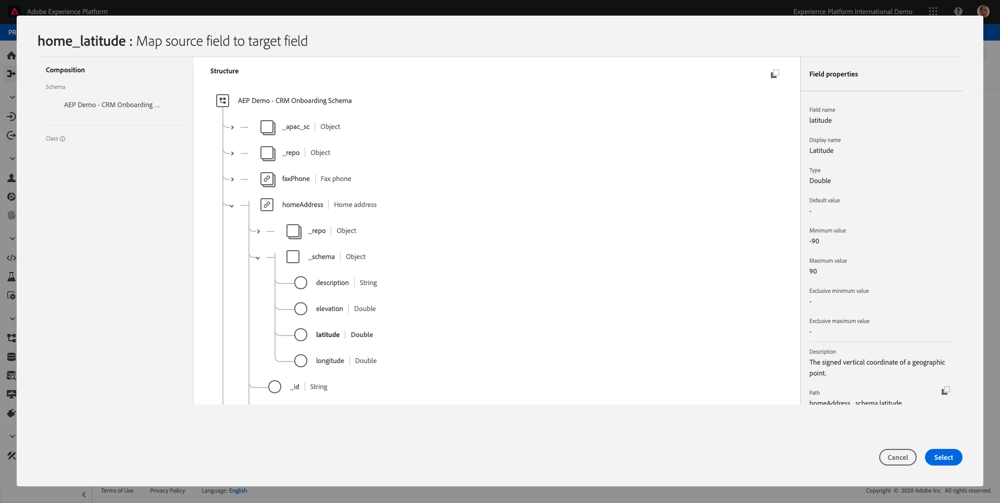

Click **[!DNL Select]** to confirm your choice. You should then see this:

Repeat the process for the Source Field **[!DNL home_longitude]**, linking it to the [!DNL Target Field] of **[!DNL homeAddress._schema.longitude]** so that you have this as a result:
 

This should be the overall result of the mapping exercise. If you have additional lines, feel free to delete them as they aren't needed for this exercise.

Click the **[!DNL Finish]** button to finish the workflow.

After clicking **[!DNL Finish]**, you're taken to your dataset where your ingestion is being processed.

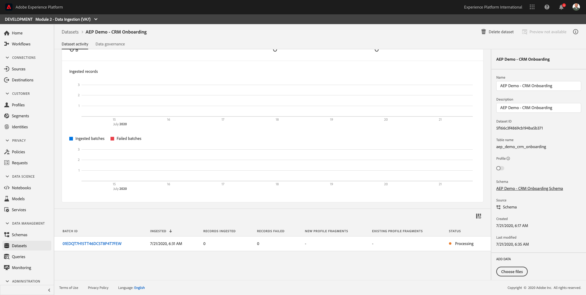

On the dataset, you'll see a [!DNL Batch ID] that is being ingested just now, with 1000 records ingested and a status of **[!DNL Processing]**.

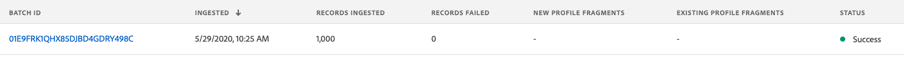

Wait until the status changes into **[!DNL Success]**.

Click on the **[!DNL Preview Dataset]**- button to get a quick view of a small sample of the dataset to ensure that the loaded data is correct.

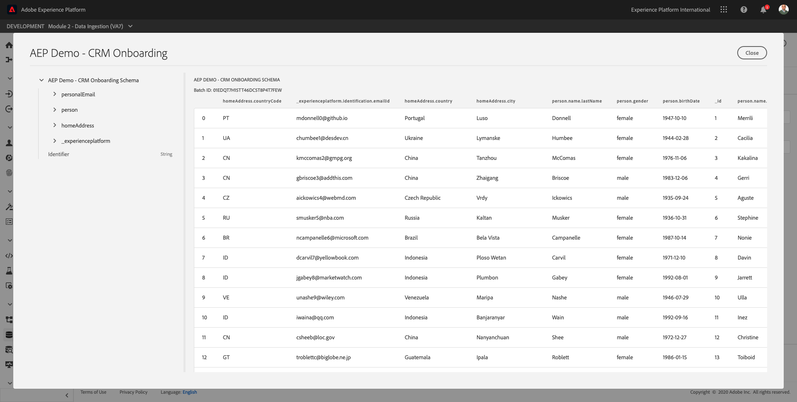

Once data is loaded, you can define the correct data governance approach for our dataset.
   
### 2.5.4 Adding data governance to your dataset 

>[!NOTE]
>
> Depending on the Adobe Experience Platform template that was installed in your environment, the dataset to use may also be named **[!DNL AEP Demo - CRM Onboarding]**. If that is the case, please proceed by using the dataset **[!DNL AEP Demo - CRM Onboarding]**.

Now that your customer data is ingested, you need to make sure that this dataset is properly governed for usage and export control. Click on the **[!DNL Data Governance]** tab and observe that you can set three types of restrictions: Contractual, Identity, and Sensitive Data.

You can find more info on the different labels and how they will be enforced in the future through the policy framework on this link: [https://www.adobe.io/apis/experienceplatform/home/dule/duleservices.html](https://www.adobe.io/apis/experienceplatform/home/dule/duleservices.html) 
 
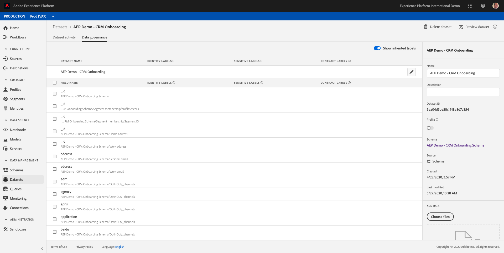

Let's restrict identity data for the entire dataset. Hover over your dataset name, and click the Pencil icon to edit the settings. 

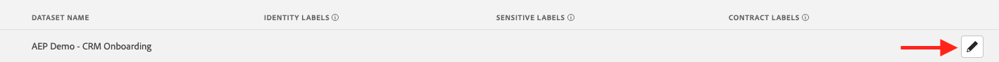

Go to **[!DNL Identity Data]** and you'll see that the **[!DNL I2]** option is checked - this will assume that all pieces of information in this dataset are at least indirectly identifiable to the person.

Click **[!DNL Save Changes]** and observe that **[!DNL I2]** is now set for all data fields in the dataset. 

You can also set these flags for individual data fields - for example, the **[!DNL firstName]** field is likely to be classified as an **[!DNL I1]** level for directly identifiable information.

Select the field **[!DNL firstName]** by checking the checkbox and click on **[!DNL Edit Governance Labels]** in the upper right corner of your screen.

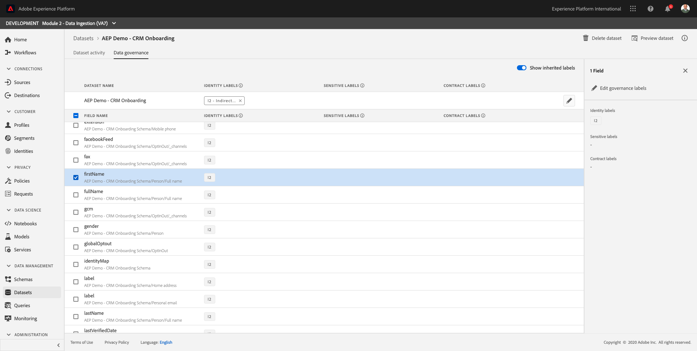

Go to **[!DNL Identity Data]** and you'll see that the **[!DNL I2]** option is already checked (inherited from the dataset). The field firstName also has a field-specific configuration and is set as **[!DNL I1 - Directly Identifiable Data]**.

With this, you've now successfully ingested and classified CRM Data in Adobe Experience Platform.

Next Step: [Summary and benefits](./summary.md)

[Go Back to Module 2](./data-ingestion.md)

[Go Back to All Modules](../../overview.md)
