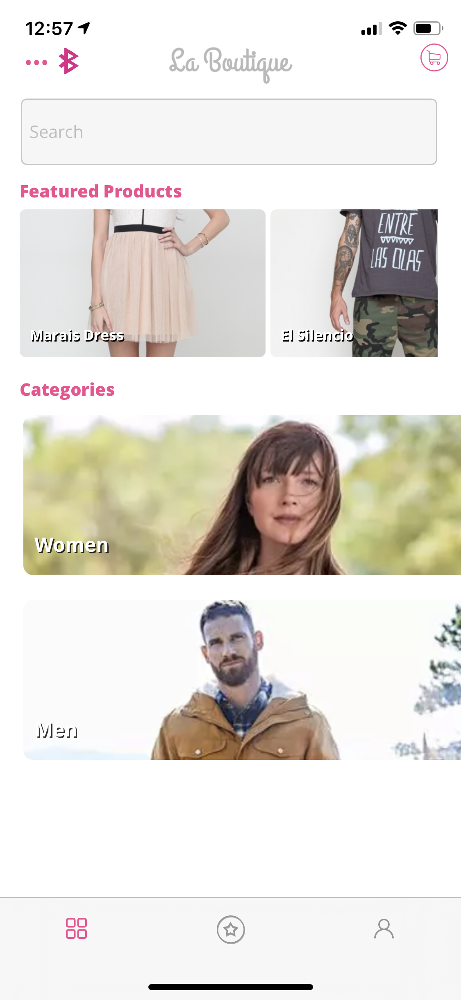
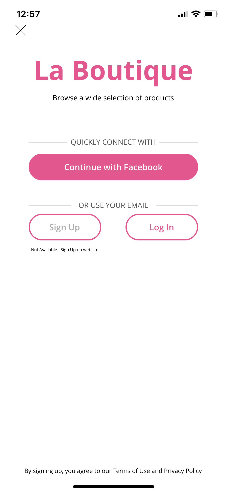
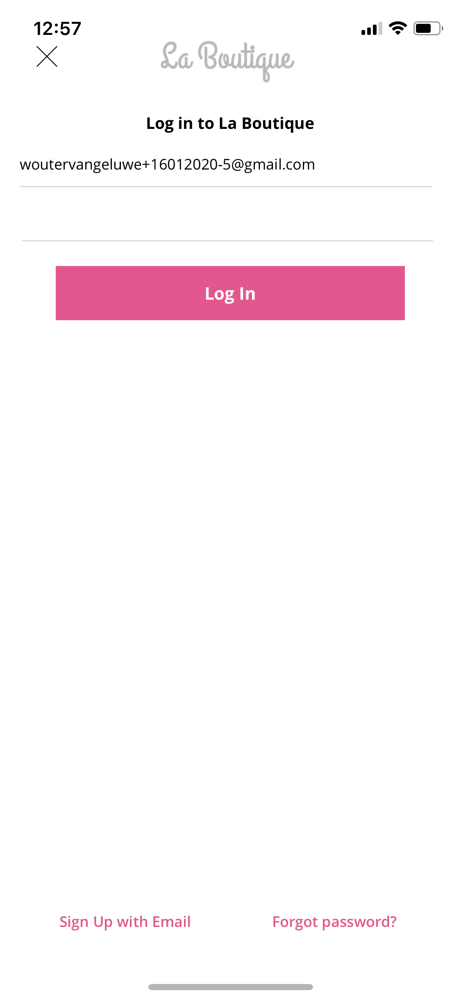
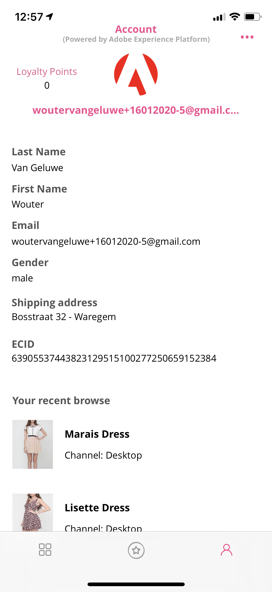
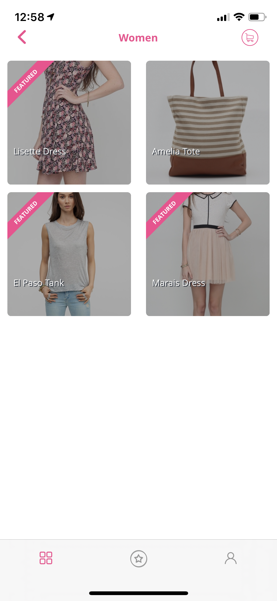
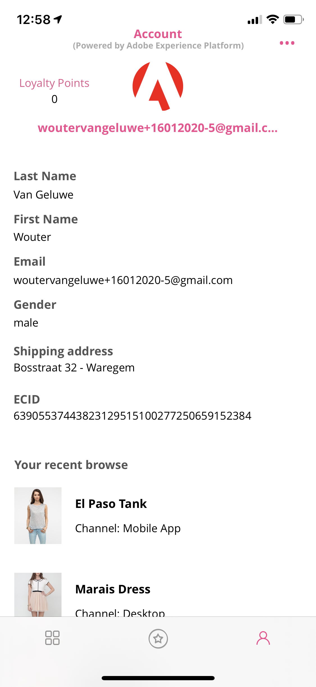
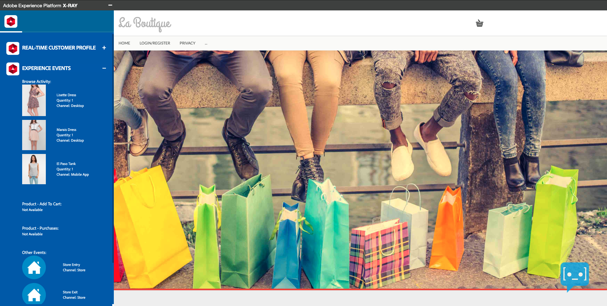

# 3.1 - From unknown to known on the website

## **Context**

The journey from unknown to known is one of the most important topics amongst brands these days, as is the customer journey from acquisition to retention. 

Adobe Experience Platform plays a huge role in this journey. Platform is the brains for communication, the "experience system of record."

Platform is an environment in which the word *customer* is broader than just the *known*-customers. An unknown visitor on the website is also a customer from Platform's perspective and as such, all of the behavior as an unknown visitor is also sent to Platform. Thanks to that approach, when this visitor eventually becomes a known customer, a brand can visualize what happened before that moment as well. This helps from an attribution and experience optimization perspective.

## **What are you going to do?**

You will now ingest data into Adobe Experience Platform and that data will be linked to identifiers like ECIDs and email-addresses. The goal of this exercise is to understand the business context of what you're about to do from a configuration perspective. In the next exercise, you'll start configuring everything you need to make all that data ingestion possible in your own sandbox environment.

## **Customer journey flow**

### Create the website and mobile app

* Go to your Platform Demo website.

* You'll be redirected to the **Admin** page

  
  
* On the **Admin** page, click **Select LDAP**.
  
   
  
* Select your LDAP from the list of available LDAPs. Click **Save**.
  
  
  
* Back on the **Admin** page, click **Select Brand**.
  
  
  
* Select the brand **Luma Retail** from the list of available brands. Click **Save**.
  
  
  
* Wait 10 seconds for the brand to load. You'll then be redirected to the Admin homepage.
  
  
  
* Click the **Luma**-logo to go to the demo website. You'll then see this:
  
  
  
### Navigate the website

* Have a look at the X-ray panel and the Real-time Customer Profile:
  * **Experience Cloud ID (ECID)** is the internal Adobe identifier
      
  

* You'll also see **Experience Events**

  
  
* Scroll down on the page until you see the products, click on the product **Nadia Elements Shell**.
  
  
  
* Have a look at the product. An experience event of type **Product View** has been sent to Adobe Experience Platform. 
  
  
  
* Next, go to the Homepage. Open the X-ray panel and have a look at your **Experience Events**.
  
  
  
* On the Homepage, click another product. Another Experience Event has been sent to Adobe Experience Platform. 
  
  
  
* Go back to the Homepage and open the X-ray panel. You'll now see 2 experience events of type **Product View**. While the behavior is anonymous, we're able to track every click and store it in in Adobe Experience Platform. Once the anonymous customer becomes known, we'll be able to merge all anonymous behavior automatically to the known profile.
  
  

* Go to the Register/Login page. Fill out your registration details and click **CREATE ACCOUNT**.
  
   
  
* After clicking **Create Account**, you'll be redirected to the homepage. Open the X-ray panel and go to Real-time Customer Profile. On the X-ray panel, you should see all of your personal data displayed.
  
  

* On the X-ray panel, go to Experience Events. You should see the two products that you viewed previously on the X-ray panel.

  

### Navigate the mobile app

After becoming a known customer, it's time to start using the mobile app:

* Open the mobile app on your iPhone and then login to the app. 

* You'll now see an updated homepage of the app, which matches the products and brand of the website you selected on the website.
  
  

* Go to the Account screen.
  
  

* Login with the email address you used in the website steps and the password of 1234.
  
  

* See your Real-time Customer Profile data appear in the application, along with your Desktop Product Views

  

* Go to the app's Home screen
  
  

* Go to any category
  
  

* Click on a product to view it.
  
  

* Go back to the previous screen
  
  

* Go to the Account screen and your Real-time Customer Profile data will be refreshed, after which you'll see the product you just viewed in the "Your recent browse" section.
  
  

* Now go back to your desktop computer and refresh the homepage, after which you'll see the product appear there, too.
  
  
  
You've now ingested data into Adobe Experience Platform and you've linked that data to identifiers like ECIDs and email addresses. The goal of this exercise was to understand the business context of what you're about to do. You've now effectively built a real-time, cross-device customer profile. In the next exercise, you'll go ahead and visualize your profile in Adobe Experience Platform.

Next Step: [3.2 Visualize your own real-time customer profile - UI](./ex2.md)

[Go Back to Module 3](./real-time-customer-profile.md)

[Go Back to All Modules](../../overview.md)
