# 6.1 Journey Orchestration: Setup Event

Login to Journey Orchestration by going to [Adobe Experience Cloud](https://experience.adobe.com).

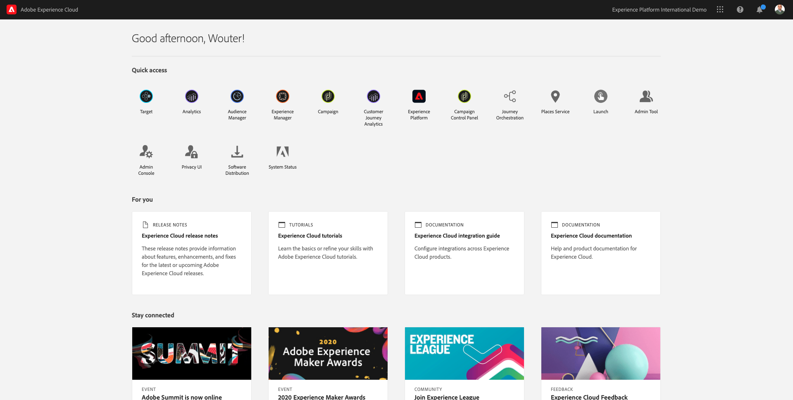

Click on **Journey Orchestration**.

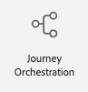

You'll be redirected to the **Home** view in Journey Orchestration.

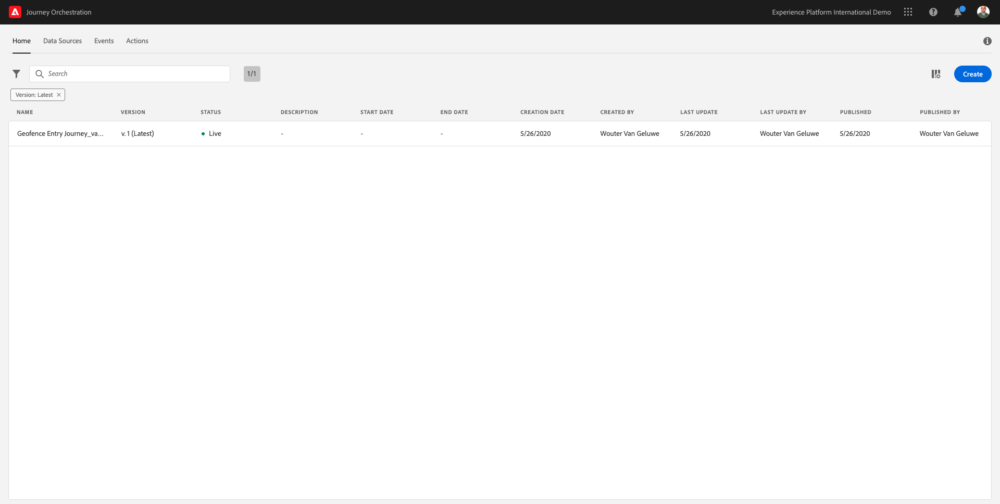

First, make sure you're using the correct sandbox. The sandbox to use is called `--aepSandboxId--`. To change from one sandbox to another, click on **PRODUCTION Prod (VA7)** and select the sandbox from the list. In this example, the sandbox is named **AEP Enablement**.

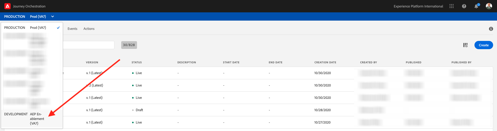

You'll then be in the **Home** view of your sandbox `--aepSandboxId--`.

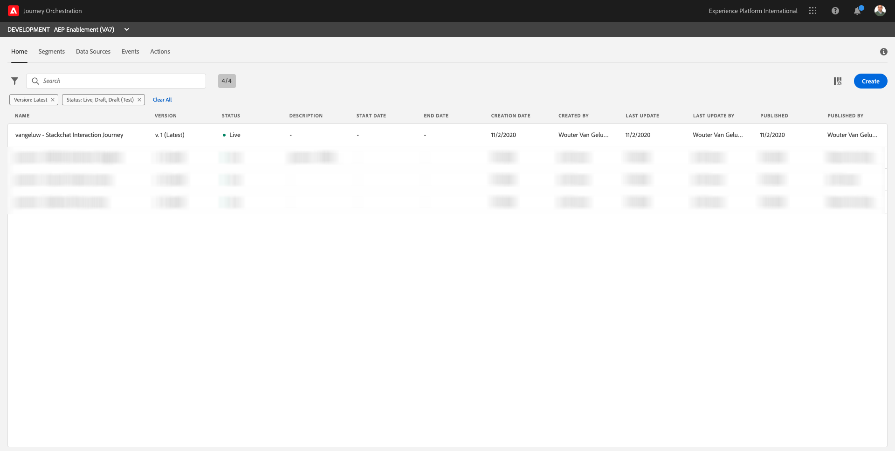

In the menu, click **Events**.

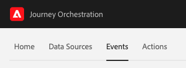

On the **Events** screen, you'll see a view similar to this:

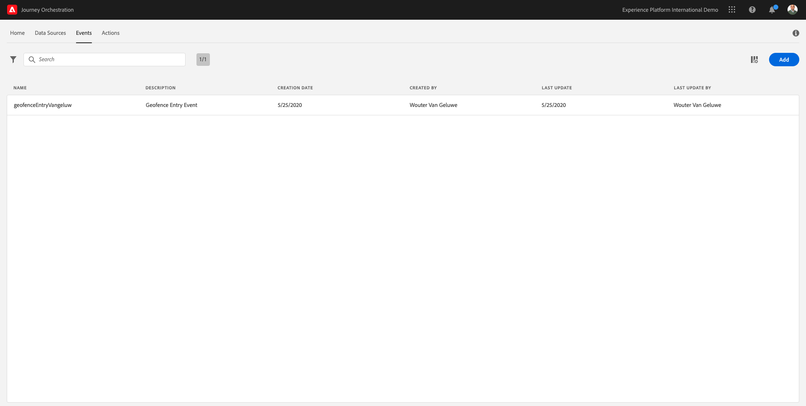

Click the **Add** button.

You'll then see an empty event configuration.

First of all, give your Event a Name like this: `ldapAccountCreationEvent` and replace `ldap` with your ldap.

Next, add a description like this `Account Creation Event`.

Next is the **Event ID Type** selection. Select **System Generated**

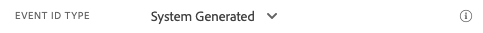 

Next is the Schema selection. A schema was prepared for this exercise. Please use the schema `AEP Demo - Account Creation Schema v.1`.

After selecting the Schema, you'll see a number of fields being selected in the **Payload** section. You should now hover over the **Payload** section and you'll see 3 icons popup. Click on the **Edit** icon.

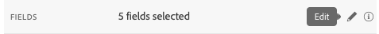

You'll see a **Fields** window popup, in which you need to select the fields that we need to personalize the email.

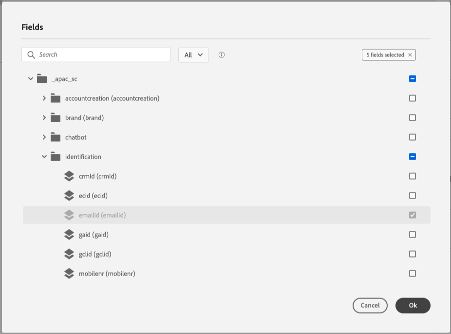 

In the object `--aepTenantId--.accountcreation`, please make sure to select the fields **firstName** and **lastName**.

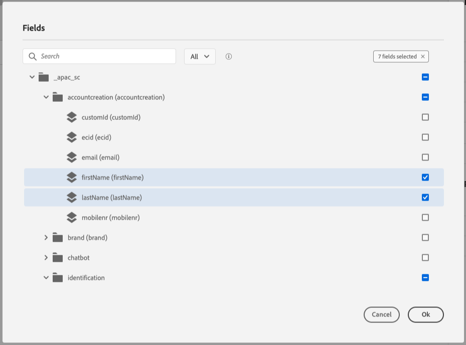

In the object `--aepTenantId--.brand`, please make sure to select the fields **brandLogo** and **brandName**.

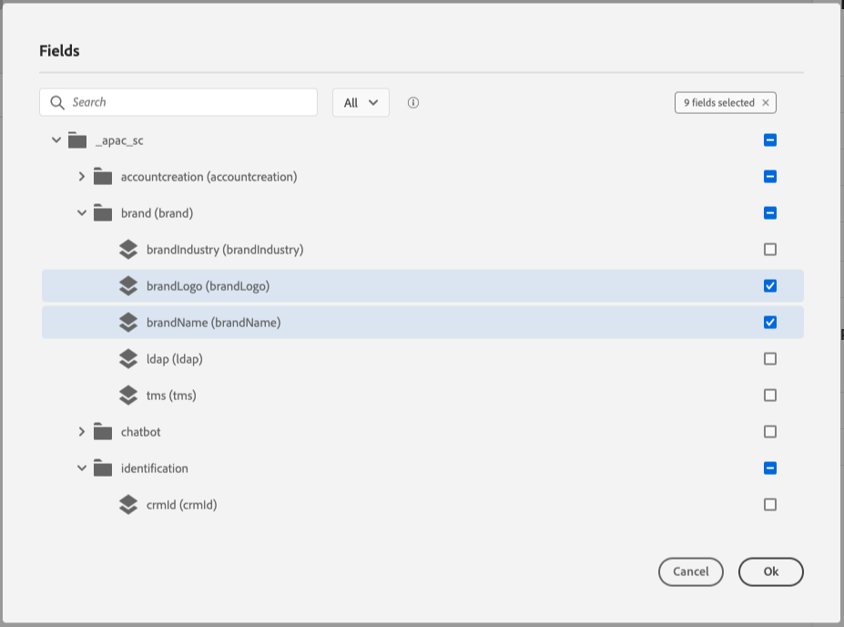

Click **Save** to save your changes.

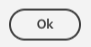

You should then see this:

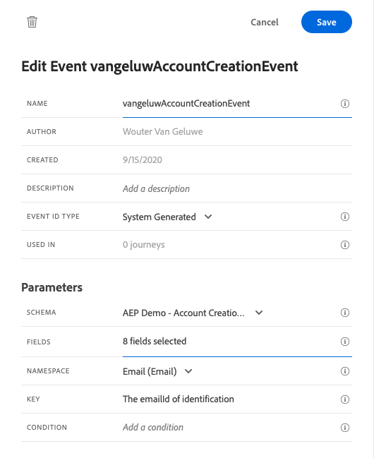 

Click **Save** once more to save your changes.

Your Event is now configured and saved.

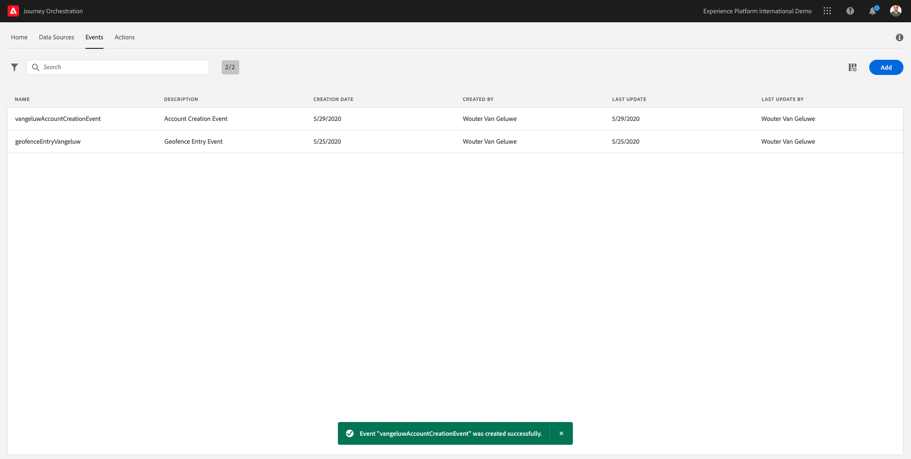

Click on your event again to open up the **Edit Event** screen again.

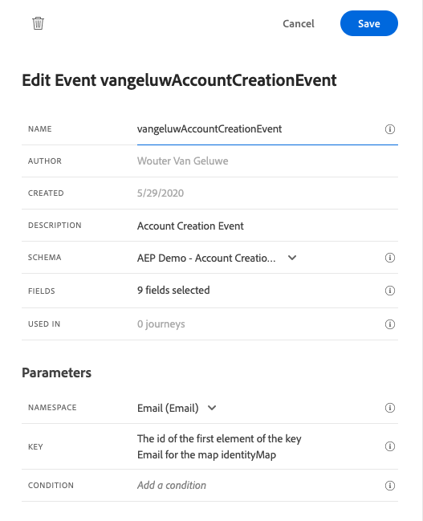

Hover over the **Payload** field again to see the 3 icons again.

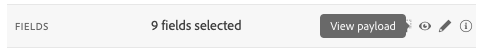

Click on the **View** icon. You'll now see an example of the expected payload.

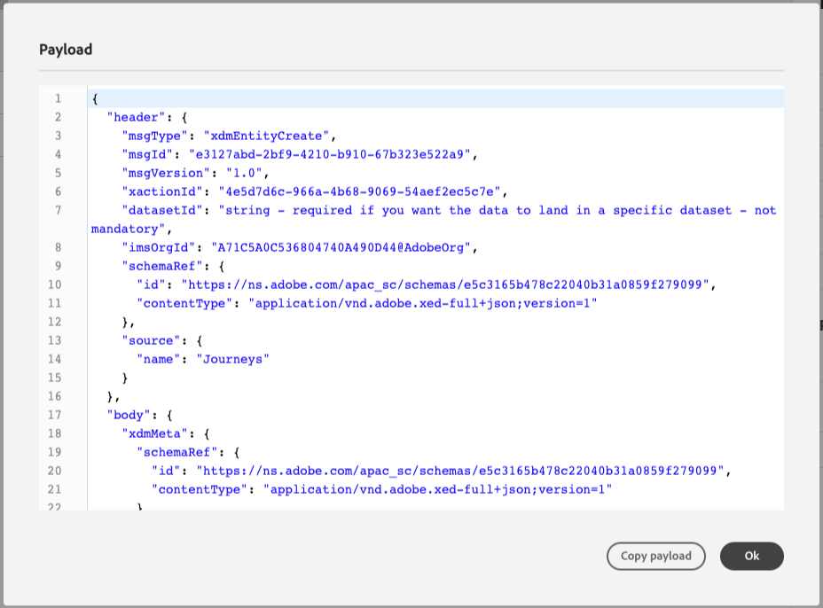

Your Event has a unique orchestration eventID, which you can find by scrolling down in that payload until you see `_experience.campaign.orchestration.eventID`.

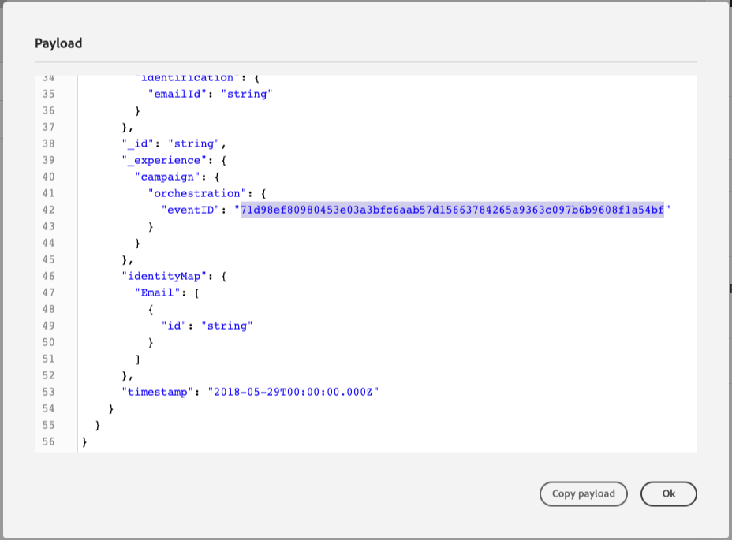

The event ID is what needs to be sent to Adobe Experience Platform in order to trigger the Journey that you'll build in Exercise 6.2. Remember this eventID, as you'll need it in Exercise 6.3.
`"eventID": "71d98ef80980453e03a3bfc6aab57d15663784265a9363c097b6b9608f1a54bf"`

Click **Close**.

You've now finished this exercise.

Next Step: [6.2 Journey Orchestration: Setup Journey](./ex2.md)

[Go Back to Module 6](./journey-orchestration-create-account.md)

[Go Back to All Modules](../../overview.md)
