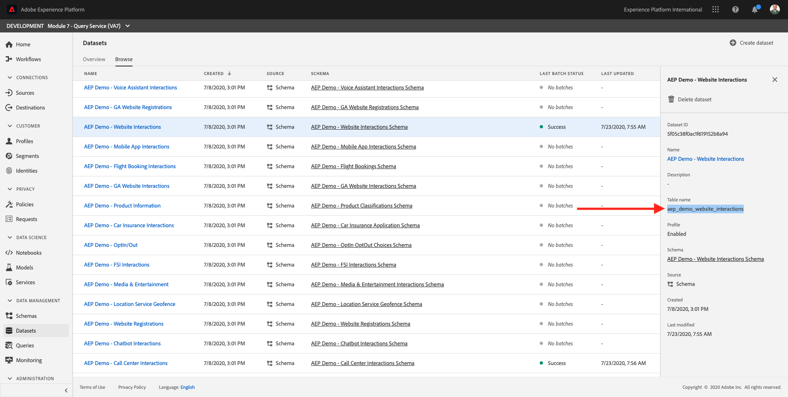
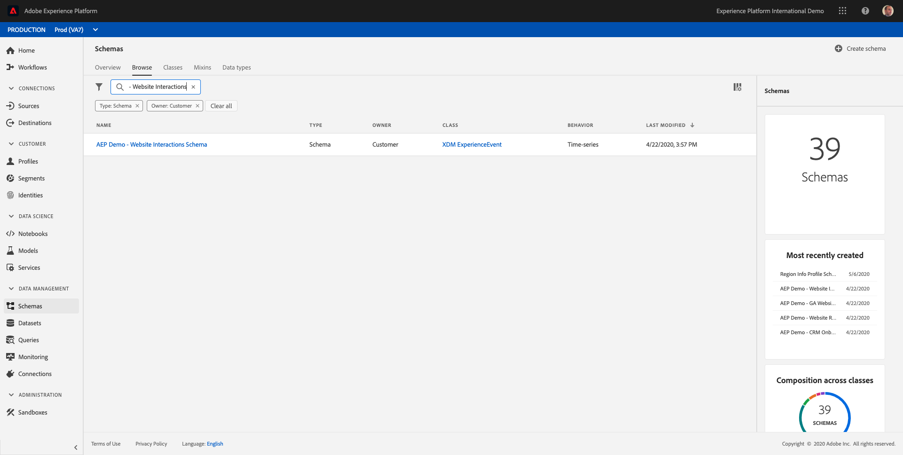
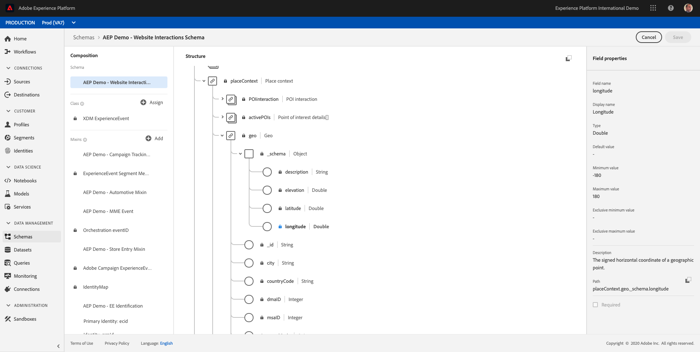

# 7.2 Using the Query Service

## Objective

- Find and explore datasets
- Learn how to address Experience Data Models objects and attributes in your queries

## Context

In this you will learn how to use PSQL to retrieve information about the available datasets, how to write a queries for Experience Data Model (XDM), and write your first simple reporting queries using the Query Service and Citi Signal datasets.

## 7.2.1 Basic Queries

In this you will learn about the methods to retrieve information about the available datasets and how to properly retrieve data with a query from an XDM dataset.

All the datasets hat we have explored via Adobe Experience Platform in the beginning of 1, are also available for access via a SQL interface as tables. To list those tables you can use the **show tables;** command.

Execute **show tables;** in your **PSQL command-line interface**. (do not forget to end your command with a semicolon).

Copy the command **show tables;** and paste it at the **module7:all >** prompt:


You will see the following result:

```text
module7:all=> show tables;
                   name                   |        dataSetId         |                 dataSet                  | description | resolved 
------------------------------------------+--------------------------+------------------------------------------+-------------+----------
 aep_demo_call_center_interactions        | 5f05c38f2ec69d1915d11414 | AEP Demo - Call Center Interactions      |             | false
 aep_demo_loyalty_data                    | 5f05c38fb1c81b191616cb77 | AEP Demo - Loyalty Data                  |             | false
 aep_demo_website_interactions            | 5f05c38f0ac1f619152b8a94 | AEP Demo - Website Interactions          |             | false
(3 rows)
```

At the colon, press space bar to see the next page of the resultset, or enter `q` to revert to the command prompt.

Every dataset in Platform has its corresponding Query Service table. You can find a dataset's table via the Datasets ui:



The `aep_demo_website_interactions` table is the Query Service table that corresponds with the `AEP Demo - Website Interactions` dataset.

To query some information about where a product was viewed, we will select the **geo** information.

Copy the statement below and paste it at the **module7:all >** prompt in your **PSQL command-line interface** and hit enter:

```sql
select placecontext.geo
from   aep_demo_website_interactions
where  --aepTenantId--.productData.productInteraction = 'productView'
and placecontext.geo.countryCode <> ''
limit 1;
```

In your query result, you will notice that columns in the Experience Data Model (XDM) can be complex types and not just scalar types. In the query above we would like to identify geo locations where a **productView** did occur. To identify a **productView** we have to navigate through the XDM model using the **.** (dot) notation.

```text
module7:all=> select placecontext.geo
module7:all-> from   aep_demo_website_interactions
module7:all-> where  --aepTenantId--.productData.productInteraction = 'productView'
module7:all-> and placecontext.geo.countryCode <> ''
module7:all-> limit 1;
                 geo                 
-------------------------------------
 ("(50.4198861,4.9246444)",Namur,BE)
(1 row)
```

Notice the result is a flat object rather than a single value? The **placecontext.geo** object contains four attributes: schema, country and city. And when an object is declared as a column it will return the entire object as a string. The XDM schema may be more complex than what you are familiar with but it's very powerful and was architected to support many solutions, channels, and use cases.

To select the individual properties of an object, you use the **.** (dot) notation.

Copy the statement below and paste it at the **module7:all >** prompt in your **PSQL command-line interface**:

```sql
select placecontext.geo._schema.longitude
      ,placecontext.geo._schema.latitude
      ,placecontext.geo.city
      ,placecontext.geo.countryCode
from   aep_demo_website_interactions
where  --aepTenantId--.productData.productInteraction = 'productView'
and placecontext.geo.countryCode <> ''
limit 1;
```

The result of the above query should look like this.
The result is now a set simple values:

```text
module7:all=> select placecontext.geo._schema.longitude
module7:all->       ,placecontext.geo._schema.latitude
module7:all->       ,placecontext.geo.city
module7:all->       ,placecontext.geo.countryCode
module7:all-> from   aep_demo_website_interactions
module7:all-> where  --aepTenantId--.productData.productInteraction = 'productView'
module7:all-> and placecontext.geo.countryCode <> ''
module7:all-> limit 1;
 longitude |  latitude  | city  | countrycode 
-----------+------------+-------+-------------
 4.9246444 | 50.4198861 | Namur | BE
(1 row)
```

Don't worry, there is an easy way to obtain the path towards a specific property. In the following part you will learn how. 

You will need to edit a query, so let's first open an editor.

On Windows

Click the **search** icon in the windows toolbar, type **notepad** in the **search** field, click the **notepad** result:


On Mac

Install [Brackets](https://github.com/adobe/brackets/releases/download/release-1.14/Brackets.Release.1.14.dmg) or use another Text Editor of choice if you don't have it installed and follow the instructions. After installation, search for **Brackets** via Mac's spotlight search and open it.

Copy the following statement to notepad or brackets:

```sql
select your_attribute_path_here
from   aep_demo_website_interactions
where  --aepTenantId--.productData.productInteraction = 'productView'
and placecontext.geo.countryCode <> ''
limit 1;
```

Go back to your Adobe Experience Platform UI (should be open in your browser) or navigate to [http://platform.adobe.com](http://platform.adobe.com).

Select **Schemas**, enter `AEP Demo - Website Interactions` in the **search** field and select `AEP Demo - Website Interactions Schema` from the list.



Explore the XDM model for **AEP Demo - Website Interactions**, by clicking on an object. Expand the tree for **placecontext**, **geo** and **schema**. When you select the actual attribute **longitude**, you will see the complete path in the highlighted red box. To copy the attribute's path, click on the copy path icon.



Switch to your notepad/brackets and remove **your_attribute_path_here** from the first line. Position your cursor after **select** on the first line and paste (CTRL-V). 

Copy the modified statement from notepad/brackets and paste it at the **module7:all >** prompt in your **PSQL command-line interface** and hit enter.

The result should look like:

```text
module7:all=> select placeContext.geo._schema.longitude
module7:all-> from   aep_demo_website_interactions
module7:all-> where  --aepTenantId--.productData.productInteraction = 'productView'
module7:all-> and placecontext.geo.countryCode <> ''
module7:all-> limit 1;
 longitude
-----------
 4.9246444
(1 row)
```

Next Step: [7.3 - Queries, queries, queries...  and churn analysis](./ex3.md)

[Go Back to Module 7](./query-service.md)

[Go Back to All Modules](../../overview.md)
