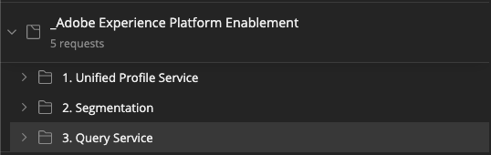

# 7.7 Query Service API

## Objective

- Use the query service api to manage query templates and query schedules

## Context

In this exercise you will execute API calls to manage query templates and query schedules using a Postman collection. You will define query templates, execute regular queries and CTAS queries. A **CTAS** query (create table as select query) stores its resultset in an explicit dataset. While regular queries are stored in a implicit (or system generated) dataset, that is typically exported in parquet file format.

## Documentation

- [Adobe Experience Platform Query Service Help](https://experienceleague.adobe.com/docs/experience-platform/query/api/getting-started.html)
- [Query Service API](https://www.adobe.io/apis/experienceplatform/home/api-reference.html#!acpdr/swagger-specs/qs-api.yaml)

## 7.7.1 Query Service API

The Query Service API lets you manage non-interactive queries against the Adobe Experience Platform data-lake. 

Non-interactive means that a request to execute a query will not result in an immediate response. The query will be processed and its resultset will be stored in an implicit or explicit (CTAS: create table as select) dataset. 

## 7.7.2 Example Query

As an example query we will use the first query listed in [7.3 - Queries, queries, queries...  and churn analysis](./ex3.md):

How many product views do we have on a daily basis? 

**SQL**

```sql
select date_format( timestamp , 'yyyy-MM-dd') AS Day,
       count(*) AS productViews
from   aep_demo_website_interactions
where  --aepTenantId--.brand.brandName IN ('Luma Telco', 'Citi Signal')
and    --aepTenantId--.productData.productInteraction = 'productView'
group by Day
limit 10;
```

## 7.7.3 Queries

Open Postman on your computer. As part of Module 3, you created a Postman environment and imported a Postman collection. Follow the instructions in [Exercise 3.3.3](./../module3/ex3.md) in case you haven't done that yet.

As part of the Postman collection you imported, you'll see a folder **3. Query Service**.

 

Open that folder and get to know the Query Service API calls to execute, monitor and download the query resultset.

A POST call to [/query/queries] with the following payload will trigger the execution of our query;

### 7.7.3.1 Create Query

**Postman**: 1.1 QS - Create Query

```sql
{
    "name" : "mmeewis - QS API demo - Citi Signal - Product Views Per Day",
    "description": "mmeewis - QS API demo - Citi Signal - Product Views Per Day",
    "dbName": "--aepSandboxId--",
    "sql": "select date_format( timestamp , 'yyyy-MM-dd') AS Day, count(*) AS productViews from aep_demo_website_interactions where --aepTenantId--.brand.brandName IN ('Luma Telco', 'Citi Signal') and --aepTenantId--.productData.productInteraction = 'productView' group by Day limit 10"
}
```

>[!NOTE]
>
>The key **dbName** in the above JSON code refers to the sandbox that is used in your Adobe Experience Platform instance. If you're using the PROD sandbox, the dbName should be **prod:all**, if you use another sandbox like for instance **aepenablement**, the dbName should be equal to **aepenablement:all**.

When successful the POST call will return the following response:

```json
{
    "isInsertInto": false,
    "request": {
        "dbName": "all",
        "sql": "select date_format( timestamp , 'yyyy-MM-dd') AS Day, count(*) AS productViews from aep_demo_website_interactions where --aepTenantId--.brand.brandName IN ('Luma Telco', 'Citi Signal') and --aepTenantId--.productData.productInteraction = 'productView' group by Day limit 10",
        "name": "mmeewis - QS API demo - Citi Signal - Product Views Per Day",
        "description": "mmeewis - QS API demo - Citi Signal - Product Views Per Day"
    },
    "clientId": "140cf1483216478396e7b5568cd2181d",
    "state": "SUBMITTED",
    "rowCount": 0,
    "errors": [],
    "isCTAS": false,
    "version": 1,
    "id": "a13f016b-5ecc-4250-a853-c9261ea0ebc6",
    "elapsedTime": 0,
    "updated": "2020-10-13T12:19:50.232Z",
    "client": "API",
    "userId": "35D705BA5C69E6640A495D66@techacct.adobe.com",
    "created": "2020-10-13T12:19:50.232Z",
    "_links": {
        "self": {
            "href": "https://platform-va7.adobe.io/data/foundation/query/queries/a13f016b-5ecc-4250-a853-c9261ea0ebc6",
            "method": "GET"
        },
        "soft_delete": {
            "href": "https://platform-va7.adobe.io/data/foundation/query/queries/a13f016b-5ecc-4250-a853-c9261ea0ebc6",
            "method": "PATCH",
            "body": "{ \"op\": \"soft_delete\"}"
        },
        "cancel": {
            "href": "https://platform-va7.adobe.io/data/foundation/query/queries/a13f016b-5ecc-4250-a853-c9261ea0ebc6",
            "method": "PATCH",
            "body": "{ \"op\": \"cancel\"}"
        }
    }
}
```

The current **state** of the query is **SUBMITTED**, once executed its state will become **SUCCESS**.

You can also lookup submitted queries via Adobe Experience Platform UI, open [Adobe Experience Platform](https://experience.adobe.com/#/@experienceplatform/platform/home) and navigate to queries (1) and select your query:

### 7.7.3.2 Monitor Query

- Postman **1.2 QS - Get Queries**, which will return a list of all your queries, you can apply an **orderby** (http-) query parameter and specify a sort order by the **created** property. Notice the '-' sign in front of created, this order the list of queries by their created date in **descending** order. Your query should be on top of the list.

```http
https://platform.adobe.io/data/foundation/query/queries?orderby=-created
```

- Postman **1.3 QS - Get Query Status**, which will return the status for the query that was create in **7.7.3.1 Create Query**. Just add the query Id (**id** property in your create query response). Postman does this for you automatically. 

It might take a couple of minutes before the query starts executing, it will change state from "****SUBMITTED****", to "****IN_PROGRESS****" to "****SUCCESS****" (SUBMITTED and IN_PROGRESS responses are simplified but they are identical to th SUCCESS response)

```json
{
    "state": "SUBMITTED",
    "rowCount": 0,
}
```

```json
{
    "state": "IN_PROGRESS",
    "rowCount": 0,
}
```

```json
{
    "isInsertInto": false,
    "request": {
        "dbName": "all",
        "sql": "select date_format( timestamp , 'yyyy-MM-dd') AS Day, count(*) AS productViews from aep_demo_website_interactions where --aepTenantId--.brand.brandName IN ('Luma Telco', 'Citi Signal') and --aepTenantId--.productData.productInteraction = 'productView' group by Day limit 10",
        "name": "mmeewis - QS API demo - Citi Signal - Product Views Per Day",
        "description": "mmeewis - QS API demo - Citi Signal - Product Views Per Day"
    },
    "clientId": "140cf1483216478396e7b5568cd2181d",
    "state": "SUCCESS",
    "rowCount": 10,
    "errors": [],
    "isCTAS": false,
    "version": 1,
    "id": "08a580aa-f627-41b6-9f03-d2883e98ed88",
    "elapsedTime": 235328,
    "updated": "2020-10-13T13:00:17.335Z",
    "client": "API",
    "userId": "35D705BA5C69E6640A495D66@techacct.adobe.com",
    "created": "2020-10-13T12:56:22.007Z",
    "_links": {
        "self": {
            "href": "https://platform-va7.adobe.io/data/foundation/query/queries/08a580aa-f627-41b6-9f03-d2883e98ed88",
            "method": "GET"
        },
        "soft_delete": {
            "href": "https://platform-va7.adobe.io/data/foundation/query/queries/08a580aa-f627-41b6-9f03-d2883e98ed88",
            "method": "PATCH",
            "body": "{ \"op\": \"soft_delete\"}"
        },
        "referenced_datasets": [
            {
                "id": "5f024b63cf07a21916361bea",
                "href": "https://platform-va7.adobe.io/data/foundation/catalog/dataSets/5f024b63cf07a21916361bea"
            }
        ]
    }
}
```

When a query reaches the state of **SUCCESS**, the response will also indicate the number of rows retrieved by the query via the **rowCount** property. In our example 10 rows are returned by the query. Let's see in the next section how we can retrieve the 10 rows.

### 7.7.3.3 Retrieve Query Result

The **SUCCESS** response above includes a **referenced_datasets** property, which points to the implicit dataset which stores the query result. To get access to the result, we use its href or id property. 

Postman: **1.4 QS - Get Query Result** (make sure to execute **1.3 QS - Get Query Status** first)

```http
https://platform-va7.adobe.io/data/foundation/catalog/dataSets/{{QS_DATASET_ID}}
```

The response of this get request will point to the dataset files:

```json
{
    "5f024b63cf07a21916361bea": {
        "description": "",
        "imsOrg": "907075E95BF479EC0A495C73@AdobeOrg",
        "name": "AEP Demo - Website Interactions",
        "namespace": "ACP",
        "state": "DRAFT",
        "tags": {
            "aep/siphon/partitions": [
                "_ACP_YEAR",
                "_ACP_MONTH",
                "_ACP_DAY"
            ],
            "acp_granular_plugin_validation_flags": [
                "identity:enabled",
                "profile:enabled"
            ],
            "adobe/pqs/table": [
                "aep_demo_website_interactions"
            ],
            "acp_granular_validation_flags": [
                "requiredFieldCheck:enabled"
            ],
            "aep/siphon/cleanup/trash/timestamp": [
                "1602510735112"
            ],
            "acp_validationContext": [
                "disabled"
            ],
            "adobe/siphon/table/format": [
                "parquet"
            ],
            "unifiedProfile": [
                "enabled:true",
                "enabledAt:2020-07-08 04:19:58"
            ],
            "aep/siphon/cleanup/meta/timestamp": [
                "1602510735196"
            ],
            "unifiedIdentity": [
                "enabled:true"
            ]
        },
        "lastBatchId": "01EMH1QBAG73RYKXAHTBDWWD79",
        "lastBatchStatus": "success",
        "lastSuccessfulBatch": "01EMH1QBAG73RYKXAHTBDWWD79",
        "id": "5f024b63cf07a21916361bea",
        "lastFailedBatch": "01EM039K1SQ6009WMAZHXH14QR",
        "version": "1.0.109",
        "created": 1593985891437,
        "updated": 1602510735292,
        "createdClient": "750e24ee855b4ac18ccc4f4817f96ee1",
        "createdUser": "3A260B485E909A170A495E76@techacct.adobe.com",
        "updatedUser": "acp_foundation_dataTracker@AdobeID",
        "viewId": "5f024b63cf07a21916361bec",
        "fileDescription": {
            "containerFormat": "parquet",
            "format": "parquet",
            "persisted": true
        },
        "files": "@/dataSets/5f024b63cf07a21916361bea/views/5f024b63cf07a21916361bec/files",
        "schemaMetadata": {
            "delta": [],
            "gdpr": []
        },
        "schemaRef": {
            "contentType": "application/vnd.adobe.xed-full+json;version=1",
            "id": "https://ns.adobe.com/experienceplatform/schemas/12c681c810da9deaae0424fcab65f590"
        }
    }
}
```

Next Step: [Summary and benefits](./summary.md)

[Go Back to Module 7](./query-service.md)

[Go Back to All Modules](../../overview.md)
