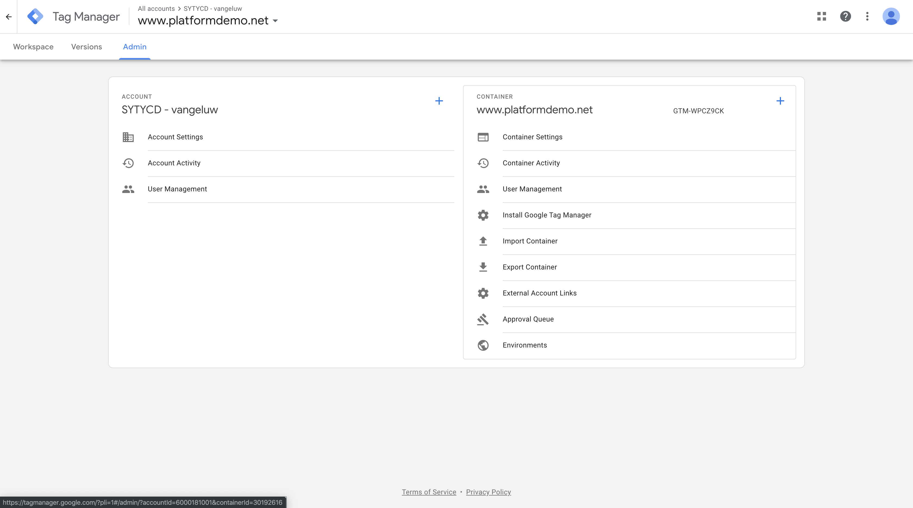
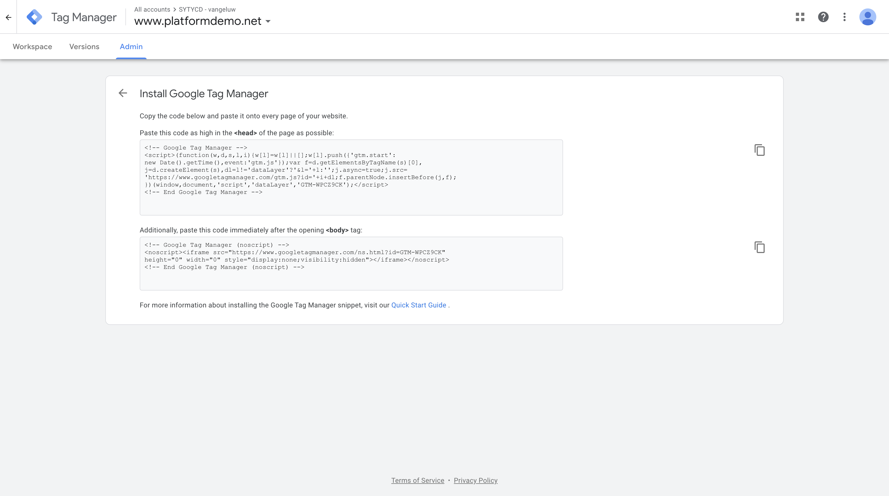
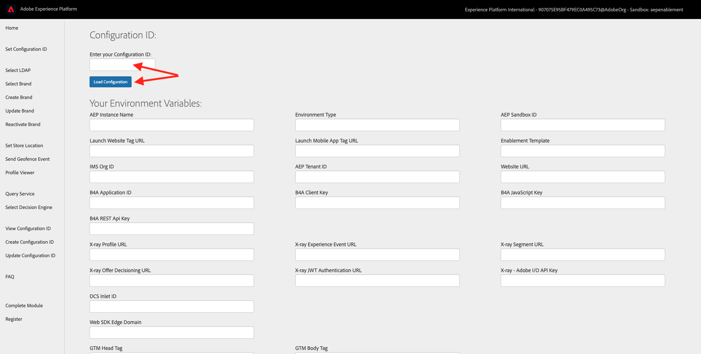
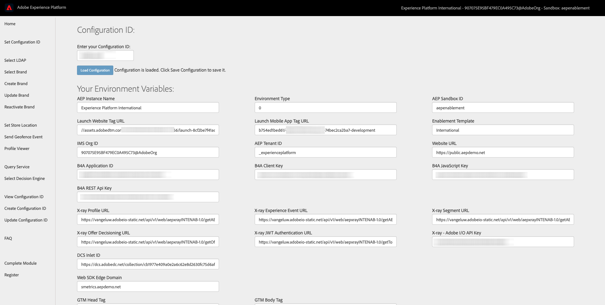
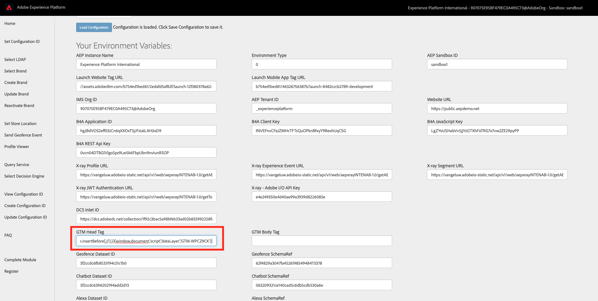
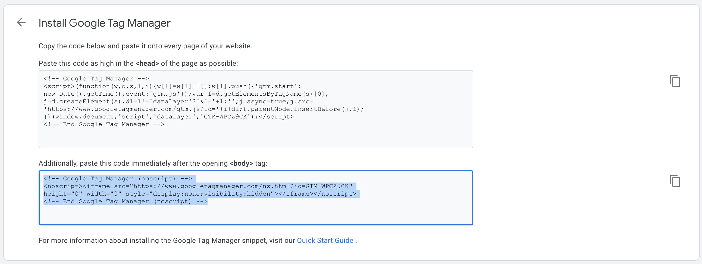
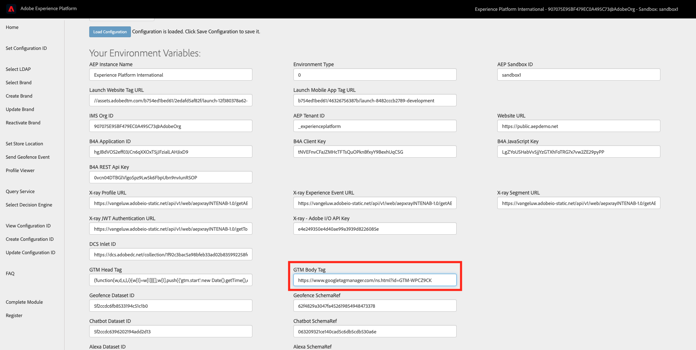
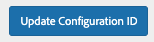

# 9.7 Implement Google Tag Manager Tag on Platform Demo website

Go to [https://tagmanager.google.com/](https://tagmanager.google.com/) and login with your personal login details.

In the Google Tag Manager UI, navigate to the menu option **Admin**.

Go to **Install Google Tag Manager**.

You now see two code fragments that need to be implemented on your Platform Demo website.

You'll need to update your Configuration ID settings and enter those two code fragments on the **Update Configuration ID** page of the AEP Demo website Admin pages.

## GTM Head Tag

Go to [https://public.aepdemo.net/admin_configuration_update.html](https://public.aepdemo.net/admin_configuration_update.html).

You'll then see this:

Click **Load Configuration**. After clicking **Load Configuration**, scroll down until you see the fields **GTM Head Tag** and **GTM Body Tag**.

Go back to the **Update Configuration ID** screen and paste the code that you copied in the field **GTM Head Tag**.

Next, go back to Google Tag Manager.

## GTM Body Tag

In the second code fragment, copy the URL of the iFrame src. Make sure you copy everything between the brackets as indicated in the screenshot:

Go back to the **Update Configuration ID** screen and paste the iFrame src URL that you copied into the field **GTM Body Tag**. Make sure to only paste the iFrame src URL as indicated in the below screenshot.

Next, scroll down and click **Update Configuration ID**.

After this change, your website and configuration are ready for Production!

Next Step: [9.8 Verify Data Ingestion from website into Platform](./ex8.md)

[Go Back to Module 9](./data-ingestion-using-google-tag-manager-and-google-analytics.md)

[Go Back to All Modules](../../overview.md)