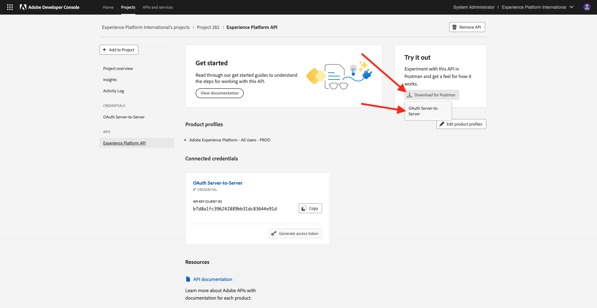

# 2.1.3 Visualize your own real-time customer profile - API

In this exercise, you'll use Postman and Adobe I/O to query Adobe Experience Platform's APIs to view your own real-time customer profile.
 
## Context

In the Real-time Customer Profile, all profile data is shown alongside event data, as well as existing audience memberships. The data shown can come from anywhere, from Adobe applications and external solutions. This is the most powerful view in Adobe Experience Platform, the experience system of record.

The Real-time Customer Profile can be consumed by all Adobe applications, but also by external solutions like Call Centers or in-store clienteling apps. The way to do this is to connect those external solutions to Adobe Experience Platform's APIs.

## Your Identifiers

On the Profile Viewer panel on the website, you can find multiple identities. Every Identity is linked to a Namespace. 


On the X-ray panel, we can see 4 different combinations of IDs and Namespaces:

| Identity     | Namespace       |
|:-------------:| :---------------:|
| Experience Cloud ID (ECID)          | 79943948563923140522865572770524243489 |
| Experience Cloud ID (ECID)          | 70559351147248820114888181867542007989 |
| Email ID          | woutervangeluwe+18112024-01@gmail.com|
| Mobile Number ID          | +32473622044+18112024-01|

Remember these identifiers for the next step.

## Configure your Adobe I/O Project

In this exercise you'll be using Adobe I/O quite intensively to query against Platform's APIs. Please follow the below steps to setup Adobe I/O.

Go to [https://developer.adobe.com/console/home](https://developer.adobe.com/console/home)


Make sure to select the correct Adobe Experience Platform instance in the top right corner of your screen. Your instance is `--aepImsOrgName--`. Click **Create new project**.


Select **+ Add to Project** and select **API**.


You'll then see this:


Select **Experience Platform API** and click **Next**.


You'll now see this. Provide a name for your credential: `--aepUserLdap-- - OAuth credential`. Click **Next**.


Next, you need to select a product profile that will define what permissions are available to this integration.

Select the required Product Profiles. 

>[!NOTE]
>
> Product Profile names will vary in your Adobe Experience Platform instance as they are instance specific. You need to select at least one product profile with the proper access rights, which are set up in the Adobe Admin Console and the AEP Permissions UI.

Click **Save Configured API**.


Your Adobe I/O integration is now ready.


Click the **Download for Postman** button and then click **OAuth Server-to-Server** to download a Postman environment (wait until the environment is downloaded, this can take a couple of seconds).



Your IO Project currently has a generic name. You need to give a friendly name to your integration. Click on **Project X** (or similar name) as indicated


Click **Edit Project**.


Enter a Name and Description for your integration: `--aepUserLdap-- AEP Tutorial`. 

Click **Save**.


Your Adobe I/O integration is now finished.


>[!NOTE]
>
>There's an additional step to ensure that this Adobe I/O project has access to Adobe Experience Platform's permission settings. The API credential of your project needs to be added into the Permissions UI of Adobe Experience Platform, for which System Administrator access rights are required. The steps are documented below, but you may need to contact your System Administrator to have this processed for you in case you don't have the required access rights.

## AEP Permissions for API credential

Go to [Adobe Experience Platform](https://experience.adobe.com/platform). After logging in, you'll land on the homepage of Adobe Experience Platform.

Go to **Permissions**, to **Roles**, and click the relevant product profile.

>[!NOTE]
>
> Product Profile names will vary in your Adobe Experience Platform instance as they are instance specific. You need to select at least one product profile with the proper access rights, which are set up in the Adobe Admin Console and the AEP Permissions UI.


Click **API credentials**.


Click **+ Add API credentials**.


Select the newly created Adobe I/O project and click **Save**.


## Postman authentication to Adobe I/O

Go to [https://www.postman.com/downloads/](https://www.postman.com/downloads/). 

Download and install the relevant version of Postman for your OS.


After installation of Postman, start the application.

In Postman, there are 2 concepts: Environments and Collections.

- The Environment contains all of your environmental variables which are more or less consistent. In the Environment, you'll find things like the IMSOrg of our Platform environment, alongside security credentials like your Private Key and others. The environment file is the one you downloaded during the Adobe I/O setup in the previous exercise, it's name like this: **`oauth_server_to_server.postman_environment.json`**.
  
- The Collection contains a number of API requests that you can use. We will use 2 collections
  - 1 Collection for Authentication to Adobe I/O
  - 1 Collection for the exercises in this module
  - 1 collection for the exercises in the Real-Time CDP module, for Destination Authoring

Please download the file [postman.zip](./../../../assets/postman/postman_profile.zip) to your local desktop. 

In this **postman.zip** file, you'll find the following files:

- `Adobe IO - OAuth.postman_collection.json`
- `AEP Tutorial.postman_collection.json`
- `Destination_Authoring_API.json`
  
Unzip the **postman.zip** file and store these 3 files in a folder on your desktop, together with the downloaded Postman environment from Adobe I/O. You need to have these 4 files in that folder:


Go back to Postman. Click **Import**.


Click **files**.


Navigate to the folder on your desktop in which you extracted the 4 downloaded files. Select these 4 files at the same time and click **Open**.


After having clicked **Open**, Postman will show you an overview of the Environment and Collections you're about to import. Click **Import**.


You now have everything you need in Postman to start interacting with Adobe Experience Platform through the APIs.

The first thing to do, is to make sure you're properly authenticated. To be authenticated, you need to request an access token.

Make sure that you've got the right Environment selected before executing any request. You can check the currently selected Environment by verifying the Environment-dropdown list in the top right corner. 

The selected Environment should have a name similar to this one, `--aepUserLdap-- OAuth Credential`.


Your Postman environment and collections are now configured and working. You can now authenticate from Postman to Adobe I/O.

In the **Adobe IO - OAuth** collection, select the request with the name **POST - Get Access Token**. Click **Send**.


After a couple of seconds, you should see a response displayed in the **Body** section of Postman:


If your configuration was successful, you should see a similar response that contains the following information:

| Key     | Value     | 
|:-------------:| :---------------:| 
| token_type          | **bearer** |
| access_token    | **eyJhbGciOiJSU...jrNZ6mdaQ** | 
| expires_in          | **86399** |

Adobe I/O has given you a **bearer**-token, with a specific value (the very long access_token) and an expiration window.

The token that we've received is now valid for 24 hours. This means that after 24 hours, if you want to use Postman to authenticate to Adobe I/O, you will have to generate a new token by running this request again.

## Real-time Customer Profile API, Schema: Profile

Now you can go ahead and send your first request to Platform's Real-time Customer Profile APIs.

In Postman, locate the collection **AEP Tutorial**.


In **1. Unified Profile Service**, click the first request with the name **UPS - GET Profile by Entity ID & NS**.


For this request, there are three required variables:

| Key     | Value     | Definition |
|:-------------:| :---------------:| :---------------:| 
| entityId          | **id** | the specific customer ID |
| entityIdNS    | **namespace** | the specific namespace that is applicable to the ID |
| schema.name          | **_xdm.context.profile** | the specific schema for which you want to receive information |

So, if you want to ask Adobe Experience Platform's APIs to give you back all Profile information for your own ECID, you will need to configure the request as follows:

| Key     | Value     | 
|:-------------:| :---------------:| 
| entityId          | **yourECID** |
| entityIdNS    | **ecid** | 
| schema.name          | **_xdm.context.profile** |


You should also verify the **Header** - fields of your request. Go to **Headers**. You'll then see this:


>[!NOTE]
>
>You need to specify the name of the Adobe Experience Platform sandbox you're using. Your x-sandbox-name should be `--aepSandboxName--`.

| Key      | Value |
| ----------- | ----------- |
| x-sandbox-name      |`--aepSandboxName--`|


Once you've checked the sandbox name, click **Send** to send your request to Platform.

You should get an immediate response from Platform, showing you something like this:


This is the full response from Platform:

```javascript
{
    "A2_ETHkJxMvxbiEmIZlAj8Qn": {
        "entityId": "A2_ETHkJxMvxbiEmIZlAj8Qn",
        "mergePolicy": {
            "id": "64e4b0ed-dfc3-4084-8e67-643e977168d7"
        },
        "sources": [
            "672a10cdb015162aefedfc0f",
            "672a10b1a05e282aee19737c"
        ],
        "tags": [
            "0938B898-469A-4513-8E86-87464307120F:va7",
            "3ba34930-405e-4b31-aafa-bac22d35203e:va7"
        ],
        "identityGraph": [
            "G7z3JAFBY4I6Rzg",
            "A2_ETHkJxMvxbiEmIZlAj8Qn",
            "BkFvK4QcJpSPByuDGF4UAS0wMQ",
            "BUF9zMKLrXq72p4HpbsHv1SDGF4UAS0wMUBnbWFpbC5jb20",
            "A29btmFXmrfrYbXQWISCT9ZD"
        ],
        "entity": {
            "_experienceplatform": {
                "identification": {
                    "core": {
                        "ecid": "79943948563923140522865572770524243489",
                        "phoneNumber": "+32473622044+18112024-01",
                        "email": "woutervangeluwe+18112024-01@gmail.com"
                    }
                }
            },
            "userAccount": {
                "ID": "3688250"
            },
            "pushNotificationDetails": [
                {
                    "denylisted": false,
                    "token": "2E0945F186CE5ED8CBFD1EB519A8CF38BA2B28A67FB381D45AA15EE37D289214",
                    "identity": {
                        "namespace": {
                            "code": "ECID"
                        },
                        "id": "70559351147248820114888181867542007989"
                    },
                    "platform": "apns",
                    "appID": "com.adobe.demosystem.dxdemo"
                }
            ],
            "personalEmail": {
                "address": "woutervangeluwe+18112024-01@gmail.com"
            },
            "_repo": {
                "createDate": "2024-11-18T10:39:12.296Z"
            },
            "extSourceSystemAudit": {
                "lastUpdatedDate": "2024-11-19T07:46:52.001Z"
            },
            "testProfile": true,
            "mobilePhone": {
                "number": "+32473622044"
            },
            "consents": {
                "metadata": {
                    "time": "2024-11-19T07:46:52.001Z"
                },
                "idSpecific": {
                    "ECID": {
                        "70559351147248820114888181867542007989": {
                            "collect": {
                                "val": "y"
                            }
                        }
                    }
                }
            },
            "person": {
                "name": {
                    "lastName": "Van Geluwe",
                    "firstName": "Wouter"
                }
            },
            "userActivityRegions": {
                "IRL1": {
                    "captureTimestamp": "2024-11-19T07:46:51.239Z"
                }
            },
            "identityMap": {
                "ecid": [
                    {
                        "id": "70559351147248820114888181867542007989"
                    },
                    {
                        "id": "79943948563923140522865572770524243489"
                    }
                ],
                "email": [
                    {
                        "id": "woutervangeluwe+18112024-01@gmail.com"
                    }
                ],
                "phone": [
                    {
                        "id": "+32473622044+18112024-01"
                    }
                ],
                "userid": [
                    {
                        "id": "3688250"
                    }
                ]
            }
        },
        "lastModifiedAt": "2024-11-19T07:47:23Z"
    }
}
```

This is currently all of the available Profile data in Platform for this ECID.

You're not required to use the ECID to request Profile data from Platform's Real-time Customer Profile, you can use any ID in any namespace to request this data. 

Let's go back to Postman and pretend we're the call center, and send a request to Platform specifying the namespace of **Phone** and your mobile number.

So, if you want to ask Platform's APIs to give you back all Profile information for a specific Phone, you will need to configure the request as follows:

| Key     | Value     | 
|:-------------:| :---------------:| 
| entityId          | **your phone number** |
| entityIdNS    | **phone** (replace ecid by phone) | 
| schema.name          | **_xdm.context.profile** |

If your phone number contains special symbols like **+**, you have to select your full phone number, do a right-click and click **EncodeURIComponent**.


You'll then have this:


You should also verify the **Header** - fields of your request. Go to **Headers**. You'll then see this:


>[!NOTE]
>
>You need to specify the name of the Adobe Experience Platform sandbox you're using. Your x-sandbox-name should be `--aepSandboxName--`.

| Key      | Value |
| ----------- | ----------- |
| x-sandbox-name      |`--aepSandboxName--`|


Click **Send** and verify the response, you'll see that it's the same as before when you were using the ECID as identity.


Let's do the same thing for your email address by specifying the namespace of **email** and your email address.

So, if you want to ask Platform's APIs to give you back all Profile information for a specific email address, you will need to configure the request as follows:

| Key     | Value     | 
|:-------------:| :---------------:| 
| entityId          | **youremail** |
| entityIdNS    | **email** (replace Phone with email) | 
| schema.name          | **_xdm.context.profile** |

If your email address contains special symbols like **+**, you have to select your full email address, do a right-click and click **EncodeURIComponent**.


You'll then have this:


You should also verify the **Header** - fields of your request. Go to **Headers**. You'll then see this:

>[!NOTE]
>
>You need to specify the name of the Adobe Experience Platform sandbox you're using. Your x-sandbox-name should be `--aepSandboxName--`.


| Key      | Value |
| ----------- | ----------- |
| x-sandbox-name      |`--aepSandboxName--`|

Click **Send** and verify the response, you'll again see that it's the same as before with ECID and phone number.


This is a very important kind of flexibility that is offered to brands. This means that any environment can send a request to Platform, using their own ID and namespace, without having to understand the complexity of multiple namespaces and IDs.

As an example:

- the Call Center can request data from Platform using the namespace **phone**
- the Loyalty System can request data from Platform using the namespace **email**
- online applications can use the namespace **ecid**

The Call Center doesn't necessarily know what kind of identifier is used in the Loyalty System and the Loyalty System doesn't necessarily know what kind of identifier is used by online applications. Each individual system can use the information that they have and understand to get the information they need, when they need it.

## Real-time Customer Profile API, Schema: Profile and ExperienceEvent

After having queried Platform's APIs successfully for Profile data, let's now do the same with ExperienceEvent data.

In Postman, locate the collection **AEP Tutorial**.


In **1. Unified Profile Service**, select the second request with the name **UPS - GET Profile & EE by Entity ID & NS**.


For this request, there are four required variables:

| Key     | Value     | Definition | 
|:-------------:| :---------------:|  :---------------:| 
| schema.name          | **_xdm.context.experienceevent** | the specific schema for which you want to receive information. In this case, we're looking for data that is mapped against the ExperienceEvent schema. | 
| relatedSchema.name          | **_xdm.context.profile** | While we're looking for data that is mapped against the ExperienceEvent schema, we need to specify an identity for which we want to receive that data. The schema that has access to identity is the Profile-schema, so the relatedSchema here is the Profile-schema. |
| relatedEntityId          | **id** | the specific customer I D|
| relatedEntityIdNS    | **namespace** | the specific namespace that is applicable to the ID | 

So, if you want to ask Platform's APIs to give you back all Profile information for your own ecid, you will need to configure the request as follows:

| Key     | Value     | 
|:-------------:| :---------------:| 
| schema.name          | **_xdm.context.experienceevent** |
| relatedSchema.name          | **_xdm.context.profile** |
| relatedEntityId          | **yourECID** |
| relatedEntityIdNS    | **ecid** | 


You should also verify the **Header** - fields of your request. Go to **Headers**. You'll then see this:


>[!NOTE]
>
>You need to specify the name of the Adobe Experience Platform sandbox you're using. Your x-sandbox-name should be `--aepSandboxName--`.

| Key      | Value |
| ----------- | ----------- |
| x-sandbox-name      |`--aepSandboxName--`|

Click **Send** to send your request to Platform.

You should get an immediate response from Platform, showing you something like this:


Below is the full response from Platform. In this example, there are eight ExperienceEvents linked to this customer's ECID. Have a look at the below to see the different variables on the request, as what you see below is the direct consequence of your configuration in Launch in previous exercises.

Also, when the X-ray panel shows ExperienceEvent information, it is using the below payload to parse and retrieve the information like Product Name (search for productName in the below payload) and Product Image URL (search for productImageUrl in the below payload).

```javascript
{
    "_page": {
        "orderby": "timestamp",
        "start": "b1325606-9b96-4e51-b7dd-73aacf527c72-0",
        "count": 14,
        "next": ""
    },
    "children": [
        {
            "relatedEntityId": "A2_ETHkJxMvxbiEmIZlAj8Qn",
            "entityId": "b1325606-9b96-4e51-b7dd-73aacf527c72-0",
            "sourceId": "672a10b1074ceb2af0aa7034",
            "timestamp": 1731923802848,
            "entity": {
                "environment": {
                    "ipV4": "141.134.241.99",
                    "type": "browser",
                    "browserDetails": {
                        "userAgentClientHints": {
                            "mobile": false,
                            "platform": "macOS",
                            "brands": [
                                {
                                    "brand": "Chromium",
                                    "version": "130"
                                },
                                {
                                    "brand": "Google Chrome",
                                    "version": "130"
                                },
                                {
                                    "brand": "Not?A_Brand",
                                    "version": "99"
                                }
                            ]
                        },
                        "userAgent": "Mozilla/5.0 (Macintosh; Intel Mac OS X 10_15_7) AppleWebKit/537.36 (KHTML, like Gecko) Chrome/130.0.0.0 Safari/537.36",
                        "viewportHeight": 992,
                        "viewportWidth": 1920
                    }
                },
                "web": {
                    "webPageDetails": {
                        "name": "Home",
                        "viewName": "Home",
                        "pageViews": {
                            "value": 1
                        },
                        "URL": "https://dsn.adobe.com/web/vangeluw-QIMU"
                    },
                    "webReferrer": {
                        "URL": "https://auth.services.adobe.com/"
                    }
                },
                "_experienceplatform": {
                    "interactionDetails": {
                        "core": {
                            "channel": "web"
                        }
                    },
                    "demoEnvironment": {
                        "brandName": "vangeluw-QIMU"
                    },
                    "identification": {
                        "core": {
                            "ecid": "79943948563923140522865572770524243489"
                        }
                    }
                },
                "implementationDetails": {
                    "name": "https://ns.adobe.com/experience/alloy/reactor",
                    "version": "2.24.0+2.27.0",
                    "environment": "browser"
                },
                "identityMap": {
                    "ECID": [
                        {
                            "id": "79943948563923140522865572770524243489",
                            "authenticatedState": "ambiguous",
                            "primary": true
                        }
                    ]
                },
                "eventType": "web.webpagedetails.pageViews",
                "_id": "b1325606-9b96-4e51-b7dd-73aacf527c72-0",
                "placeContext": {
                    "localTime": "2024-11-18T10:56:42.848+01:00",
                    "localTimezoneOffset": -60
                },
                "device": {
                    "screenOrientation": "landscape",
                    "screenWidth": 1920,
                    "screenHeight": 1080
                },
                "timestamp": "2024-11-18T09:56:42.848Z"
            },
            "lastModifiedAt": "2024-11-18T09:56:45Z"
        },
    "_links": {
        "next": {
            "href": ""
        }
    }
}
```

This is currently all of the available ExperienceEvent data in Platform for this ECID.

You're not required to use the ECID to request ExperienceEvent data from Adobe Experience Platform's Real-time Profile, you can use any ID in any namespace to request this data. 

Next Step: [2.1.4 Create an audience - UI](./ex4.md)

[Go Back to Module 2.1](./real-time-customer-profile.md)

[Go Back to All Modules](../../../overview.md)
