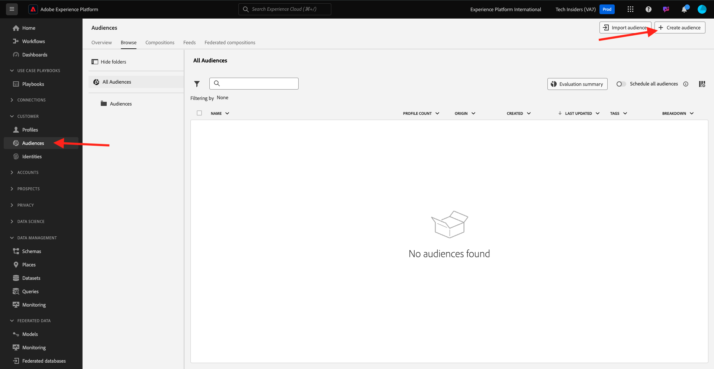
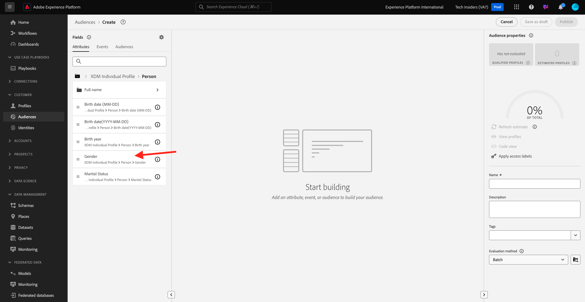
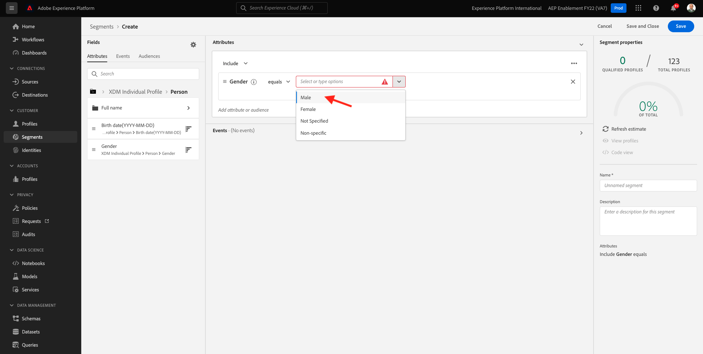
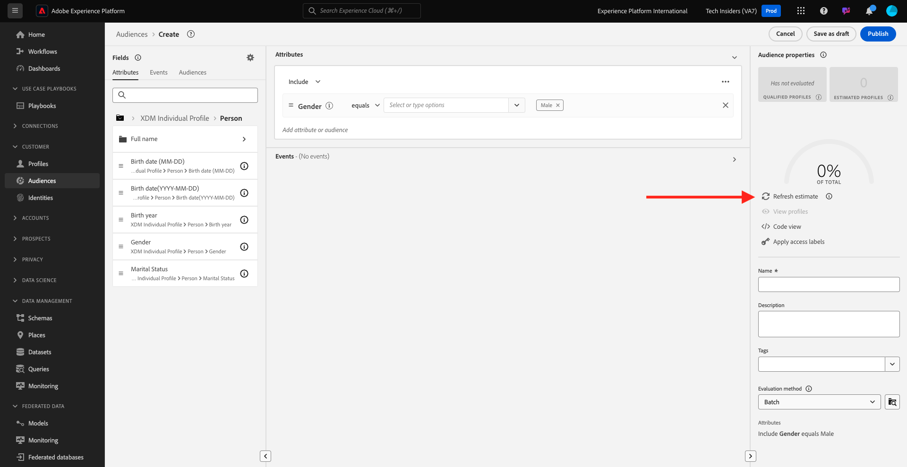
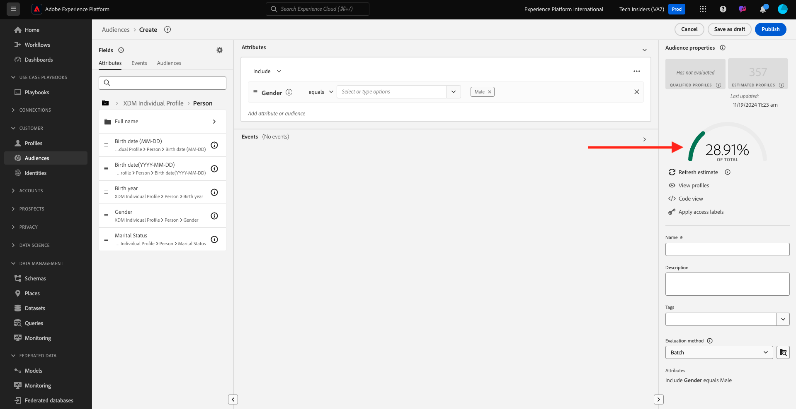
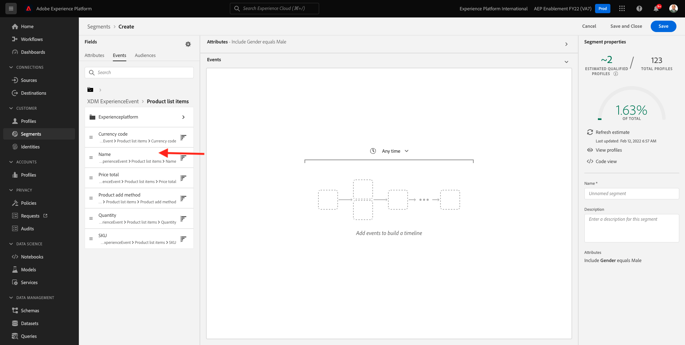
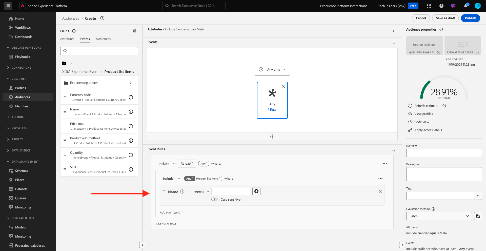
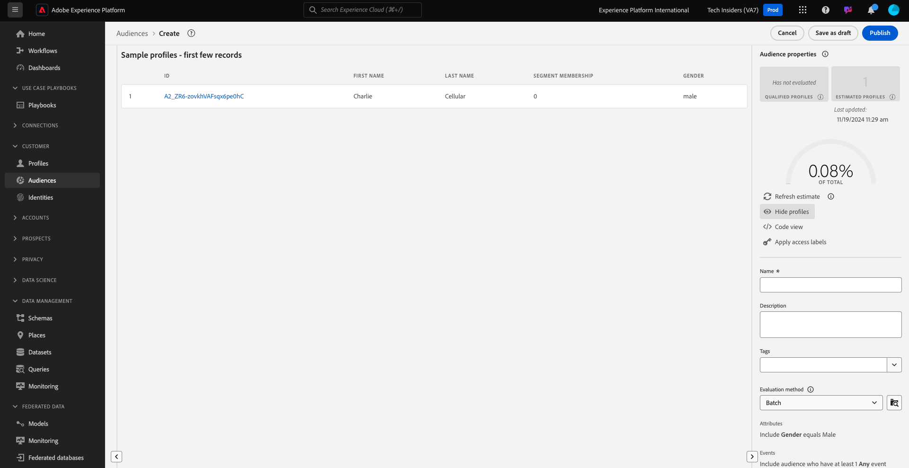
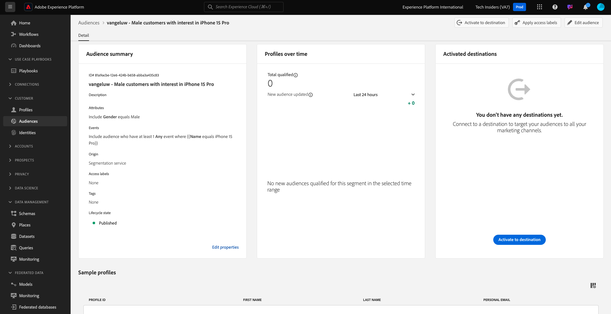

# 2.1.4 Create an audience - UI

In this exercise, you'll create an audience by making use of Adobe Experience Platform's Audience Builder.

Go to [Adobe Experience Platform](https://experience.adobe.com/platform). After logging in, you'll land on the homepage of Adobe Experience Platform.


Before you continue, you need to select a **sandbox**. The sandbox to select is named ``--aepSandboxName--``. After selecting the appropriate [!UICONTROL sandbox], you'll see the screen change and now you're in your dedicated [!UICONTROL sandbox].


In the menu on the left side, go to **Audiences**. On this page, you can see an overview of all existing audiences. Click on the **+ Create audience** button to start creating a new audience.



Select **Build rule** and click **Create**.


Once you're in the new audience builder, you immediately notice the **Attributes** menu option and the **XDM Individual Profile** reference.


Since XDM is the language that powers the experience business, XDM is also the foundation for the audience builder. All data that is ingested in Platform should be mapped against XDM, and as such, all data becomes part of the same data model regardless of where that data comes from. This gives you a big advantage when building audiences, as from this one audience builder UI, you can combine data from any origin in the same workflow. Audiences built within audience builder can be sent to solutions like Adobe Target, Adobe Campaign and Adobe Audience Manager for activation.

Let's build an audience which includes all **male** customers.

To get to the gender attribute, you need to understand and know XDM. 

Gender is an attribute of Person, which can be found under Attributes. So to get there, you'll start by clicking on **XDM Individual Profile**. You'll then see this. From the **XDM Individual Profile** window, select **Person**. 


You'll then see this. In **Person**, you can find the **Gender** attribute. Drag the Gender attribute onto the audience builder.



Now you can choose the specific gender out of the pre-populated options. In this case, let's pick **Male**.



After selecting **Male**, you can get an estimation of the audience's population by pushing the **Refresh Estimate** button. This is very helpful for a business user, so that they can see the impact of certain attributes on the resulting audience size.



You'll then see an estimation such as the one below:



Next, you should refine your audience a bit. You need to build out a audience of all male customers that have viewed the product **iPhone 15 Pro**.

To build out this audience, you need to add an Experience Event. You can find all Experience Events by clicking on the **Events** icon in the **Fields** menu bar. Next, you'll see the top-level, **XDM ExperienceEvents** node. Click **XDM ExperienceEvent**.


Go to **Product List Items**.


Select **Name** and drag and drop the **Name** object from the left menu onto the audience builder canvas into the **Events** section.



You'll then see this:



The comparison parameter should be **equals** and in the input field, enter **iPhone 15 Pro**.


Every time you add an element to the audience builder, you can click the **Refresh Estimate** button to get a new estimate of the population in your audience.

So far, you've only used the UI to build your audience, but there's also a code-option to build a audience.

When building an audience, you're actually composing a Profile Query Language (PQL) query. To visualize the PQL code, you can click on the **Code View** switcher in the upper right corner of the audience builder.


Now you can see the full PQL statement:

```sql
person.gender in ["male"] and CHAIN(xEvent, timestamp, [C0: WHAT(productListItems.exists(name.equals("iPhone 15 Pro", false)))])
```

You can also preview a sample of the customer profiles that are part of this audience, by clicking on **View Profiles**.



Finally, let's give your audience a name, 
set the **Evaluation method** to **Streaming** and click **Publish**.

As a naming convention, use:

- `--aepUserLdap-- - Male customers with interest in iPhone 15 Pro`


You'll be taken back to the Audience overview page.



Next Step: [2.1.5 See your Real-time Customer Profile in action in the Call Center](./ex5.md)

[Go Back to Module 2.1](./real-time-customer-profile.md)

[Go Back to All Modules](../../../overview.md)
