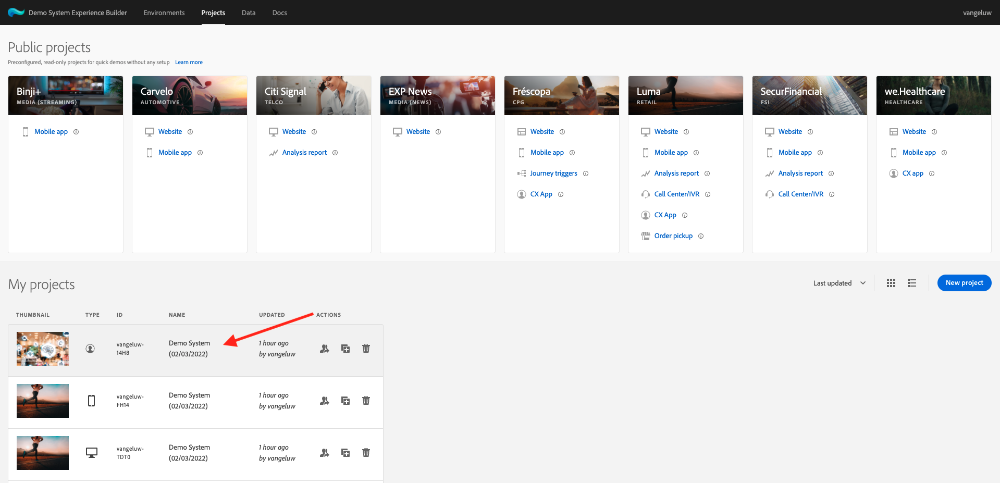
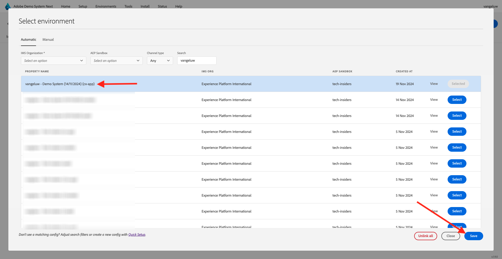

# 2.1.5 See your Real-time Customer Profile in action in the Call Center

In this exercise, the goal is to have you walk through the customer journey and act like a real customer.

On this website, we've implemented Adobe Experience Platform. Every action is considered an experience event and is sent to Adobe Experience Platform in real-time, hydrating the Real-time Customer Profile.

In an earlier exercise, you started as an anonymous customer who was browsing the site, and after a couple of steps, you became a known customer.

When that same customer eventually picks up their phone and calls your call center, it's crucial that the information from other channels is available immediately, so that the call center experience can be relevant and personalized.

## Use your CX App

Go to [https://dsn.adobe.com](https://dsn.adobe.com). After logging in with your Adobe ID, you'll see this. Click the 3 dots **...** on your CX App project and then click **Edit** to open it.

In your CX App project, go to **Integrations**. Click **Select environment**.

Select the Adobe Experience Platform Data Collection property that was created in Getting Started. You need to select the property that has **(cx-app)** in its name.

You'll then see this. Click **Run**.

Next, you need to select one of your identities and the according namespace, and click the **search-icon**.

| Identity     | Namespace       |
|:-------------:| :---------------:|
| Experience Cloud ID (ECID)          | 79943948563923140522865572770524243489 |
| Experience Cloud ID (ECID)          | 70559351147248820114888181867542007989 |
| Email ID          | woutervangeluwe+18112024-01@gmail.com|
| Mobile Number ID          | +32473622044+18112024-01|

When the customer calls your call center, the phone number can be used to identify the customer. So in this exercise, you'll use the phone number to retrieve the customer's profile in the CX App.

You'll now see the information that would ideally be displayed in the Call Center, so that the Call Center employees have all relevant information available immediately when speaking to a customer.

Next Step: [Summary and benefits](./summary.md)

[Go Back to Module 2.1](./real-time-customer-profile.md)

[Go Back to All Modules](../../../overview.md)
