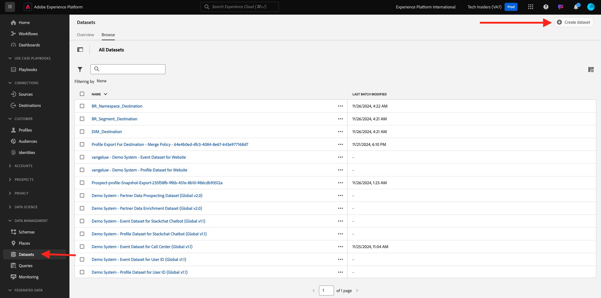

# 2.2.1 Customer AI - Data Preparation (Ingest)

In order for Intelligent Services to discover insights from your marketing events data, the data must be semantically enriched and maintained in a standard structure. Intelligent Services leverages Adobe's Experience Data Model (XDM) schemas in order to achieve this.
Specifically, all datasets that are used in Intelligent Services must conform to the **Consumer Experience Event** XDM schema.

## Create Schema

In this exercise, you'll create a schema that contains the **Consumer Experience Event mixin**, which is required by the **Customer AI** Intelligent Service.

Log in to Adobe Experience Platform by going to this URL: [https://experience.adobe.com/platform](https://experience.adobe.com/platform).

After logging in, you'll land on the homepage of Adobe Experience Platform.

Before you continue, you need to select a **sandbox**. The sandbox to select is named ``--aepSandboxName--``. After selecting the appropriate sandbox, you'll see the screen change and now you're in your dedicated sandbox.

From the left menu, click **Schemas** and go to **Browse**. Click **Create Schema**.

In the popup, select **Manual** and click **Select**.

Next, select **Experience Event** and click **Next**.

You need to provide a name for your schema now. As the name for our schema, use this: `--aepUserLdap-- - Demo System - Customer Experience Event` and click **Finish**.

You'll then see this. Click **+ Add** under Field groups.

Search and select the following **Field Groups** to add to this Schema:

- Consumer Experience Event

- IdentityMap

Click **Add Field Groups**.

You'll then see this. Next, select the name of your schema. You should now enable your schema for **Profile**, by clicking the **Profile** toggle.

You'll then see this. CHeck the checkbox for **Data for this schema will contain a primary identity in the identityMap field.**. Click **Enable**.

You should now have this. Click **Save** to save your schema.

## Create Dataset

From the left menu, click **Datasets** and go to **Browse**. Click **Create dataset**.

Click **Create dataset from schema**.

In the next screen, select the dataset you created in the previous exercise, which is named **[!UICONTROL ldap - Demo System - Customer Experience Event]**. Click **Next**.

As a name for your dataset, use `--aepUserLdap-- - Demo System - Customer Experience Event Dataset`. Click **Finish**.

Your dataset is now created. Enable the **Profile** toggle.

Click **Enable**.

You should now have this:

You're now ready to start ingesting Consumer Experience Event data and start using the Customer AI service.

## Download Experience Event test data

Once the **Schema** and **Dataset** are configured, you're now ready to ingest Experience Event data. Since Customer AI requires has specific data requirements, you'll need to ingest externally prepared data.

The data prepared for the experience events in this exercise must comply to the requirements and schema of the [Consumer Experience Event XDM Field Group](https://github.com/adobe/xdm/blob/797cf4930d5a80799a095256302675b1362c9a15/docs/reference/context/experienceevent-consumer.schema.md).

Please download the zip file with demo data from this location: [https://tech-insiders.s3.us-west-2.amazonaws.com/CUSTOM-CAI-EVENTS-WEB.zip](https://tech-insiders.s3.us-west-2.amazonaws.com/CUSTOM-CAI-EVENTS-WEB.zip).

You've now downloaded a file named **CUSTOM-CAI-EVENTS-WEB.zip**. Place the file on your computer's desktop and unzip it, after which you'll see a folder named **CUSTOM-CAI-EVENTS-WEB**. 

In that folder, you'll find multiple sequenced json files, which all need to be ingested in the next exercise.

## Ingest Experience Event test data

In Adobe Experience Platform, go to **Datasets** and open your dataset, which is named **[!UICONTROL ldap - Demo System - Customer Experience Event Dataset]**.

In your dataset, click **Choose files** to add data.

In the popup, select the files **WEBSITE-EE-1.json** until **WEBSITE-EE-5.json** and click **Open**.

Repeat this ingestion process for the files **WEBSITE-EE-6.json** and **WEBSITE-EE-7.json**.

You'll then see the data being imported, and a new batch is created in the **Loading** state. Don't navigate away from this page until the file is uploaded.

 

Once the file has been uploaded, you'll see the batch status change from **Loading** to **Processing**.

Ingesting and processing the data might take 10-20min.

Once data ingestion is successful, the batch status of the various uploads will change to **Success**.

Next Step: [2.2.2 Customer AI - Create a New Instance (Configure)](./ex2.md)

[Go Back to Module 2.2](./intelligent-services.md)

[Go Back to All Modules](./../../../overview.md)
