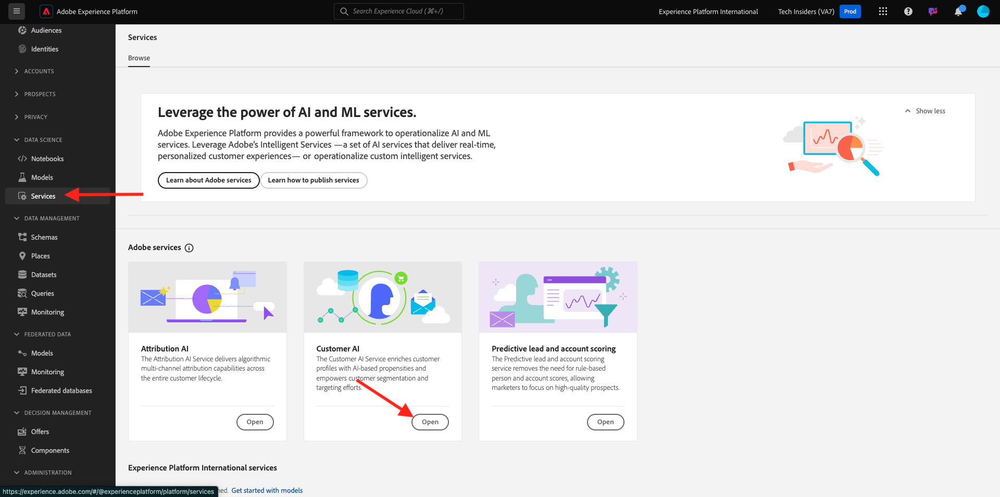
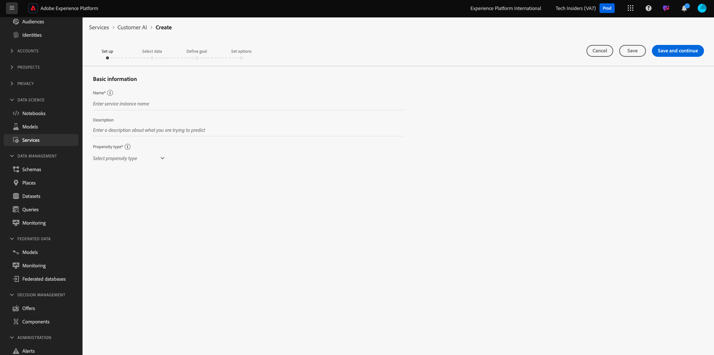
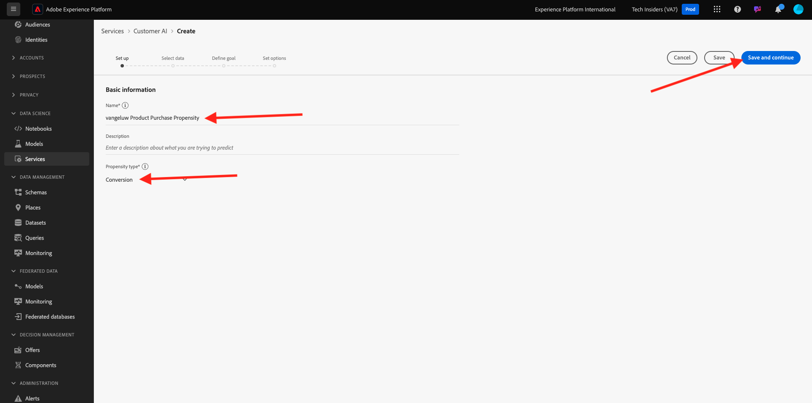
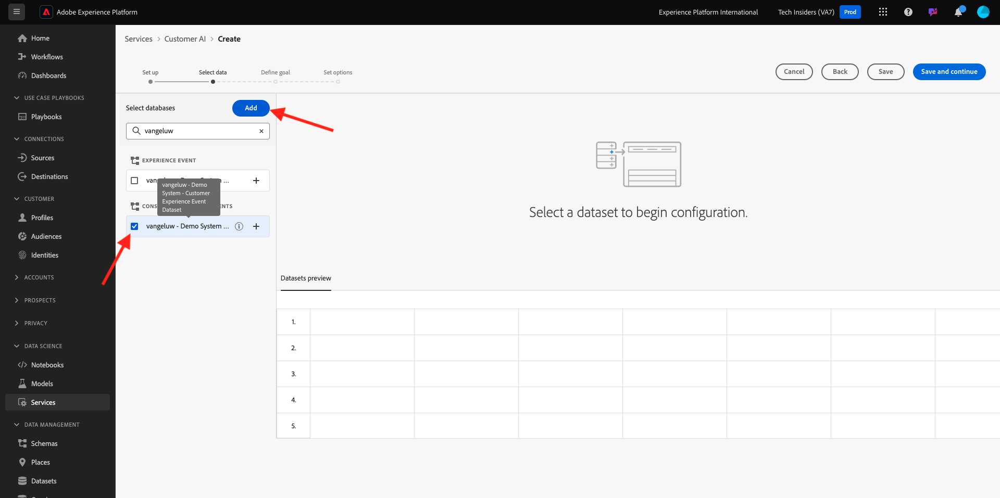
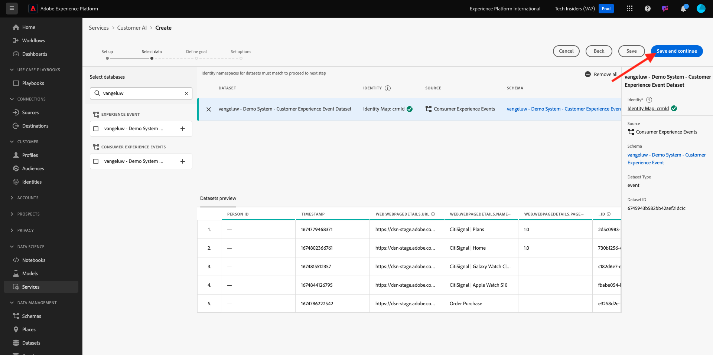
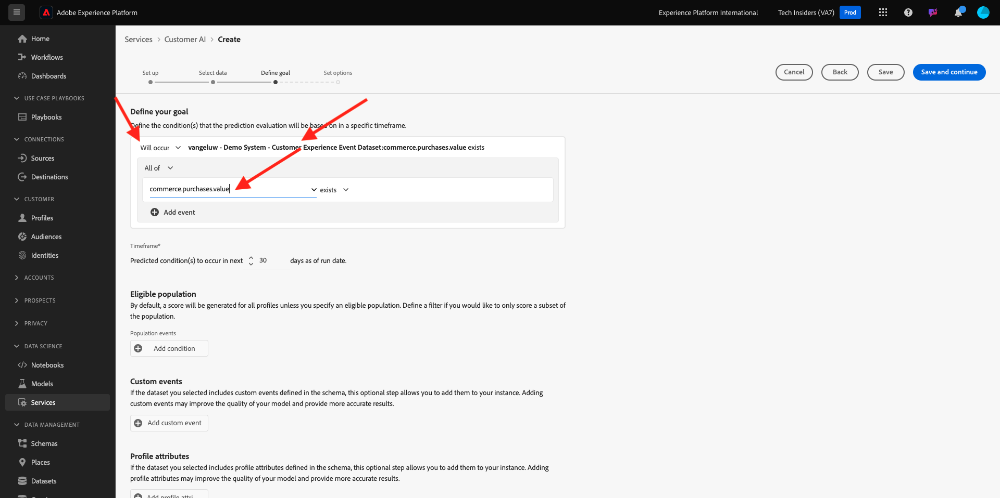
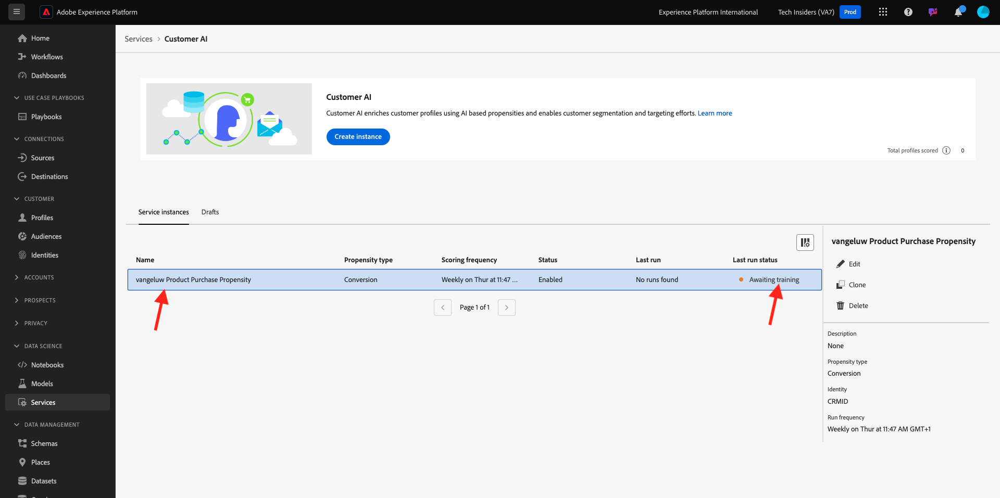

# 2.2.2 Customer AI - Create a New Instance (Configure)

Customer AI works by analyzing existing Consumer Experience Event data to predict churn or conversion propensity scores. Creating a new Customer AI instance allows marketeers to define goals and measures.

## Setup a new Customer AI instance

In Adobe Experience Platform, click **Services** in the left menu. The **Services** browser appears and displays all available services at your disposal. In the card for Customer AI, click **Open**.

Click **Create instance**.

You'll then see this.

 

Enter the required details for the Customer AI instance:

- Name: use `--aepUserLdap-- Product Purchase Propensity`
- Description: use: **Predict the likelihood for customers to purchase a product**
- Propensity type: select **Conversion**

Click **Save and continue**.

You'll then see this. Select the dataset you created in the previous exercise which is named `--demoProfileLdap - Demo System - Customer Experience Event Dataset`. Click **Add**.

You'll then see this. you need to define the **Identity** field. Click **None**.

In the popup, select **Identity Map (identityMap)** and then select the namespace **Demo System - CRMID (crmId)**. Next, click **Save**.

Click **Save and continue**.

Select **Will occur** in your specific dataset, and define the field **commerce.purchases.value** as the target variable.

Next, set your schedule to run **Weekly** and set the time as close as possible to your current time. Ensure that the toggle **Enable scores for Profile** is enabled. Click **Save and continue**.

After you configure the instance, you can see it in the Customer AI service list and you can also preview the summary of the setup and execution details by clicking on the Customer AI instance row. The summary panel will also display error details in case errors have been found.

>[!NOTE]
>
>You can modify any definition or attribute as long as your Customer AI instance's status is either **Awaiting training** or **Error**

Once your model has run, you'll see this.

Next Step: [2.2.3 Customer AI - Scoring Dashboard and Segmentation (Predict & Take Action)](./ex3.md)

[Go Back to Module 2.2](./intelligent-services.md)

[Go Back to All Modules](./../../../overview.md)
