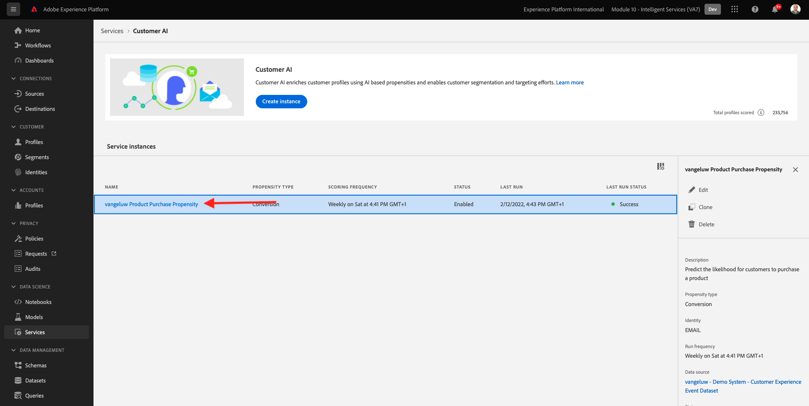
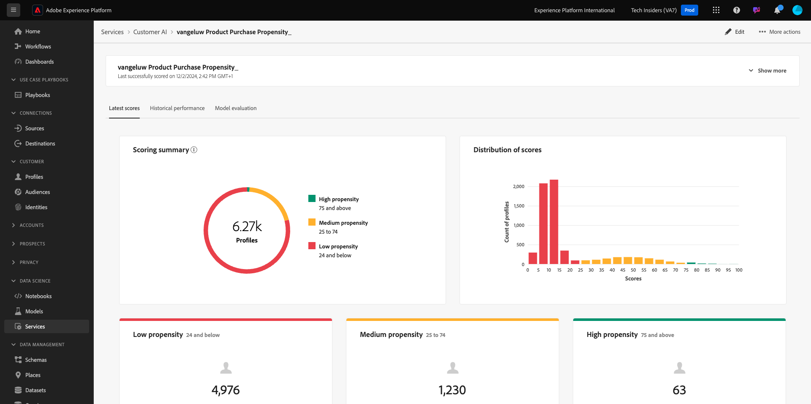
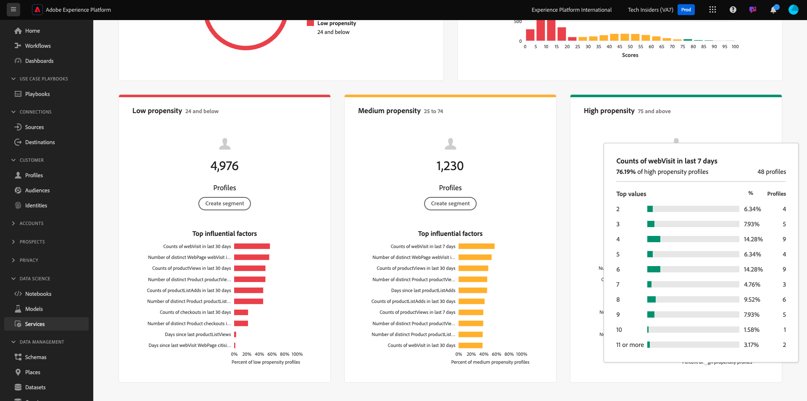

# 2.2.3 Customer AI - Scoring Dashboard and Segmentation (Predict & Take Action)

Once your Customer AI instance completes a model run, it'll enable you to visualize the propensity score that is evaluated to predict a customer performing a purchase in the next 30 days.

>[!NOTE]
>
>Only a Customer AI instance with a status of **Success** will allow you to preview the service's insights.

## Propensity Prediction

Now let's review the predicted propensity generated by the Customer AI instance model. Click on the instance name to view the dashboard.

The Customer AI dashboard shows the summary about score, distribution of population and the influential factors for the model to evaluate.

Hover on the influential factors to view the further breakdown of data distribution.

## Business actions

### Segmenting Customers

The Customer AI dashboard allows to define segments with single click. Click on the **Create Segment** button on the propensity cards.

You'll see that a segment definition is created automatically.

Give your segment a name, following this naming convention: `--aepUserLdap-- - Customer AI High Propensity`. Click **Publish**.

You can now use this segment for targeting using for instance Real-time CDP, Journey Optimizer and Adobe Target.

## Cleanup

To ensure that no unneeded demo data is kept in your environment, please make sure to delete the dataset `--aepUserLdap-- - Demo System - Customer Experience Event Dataset` once you've successfully completed this exercise. If you don't delete the demo data, there will be a cost impact for your AEP instance.

Next Step: [Summary and benefits](./summary.md)

[Go Back to Module 2.2](./intelligent-services.md)

[Go Back to All Modules](./../../../overview.md)
