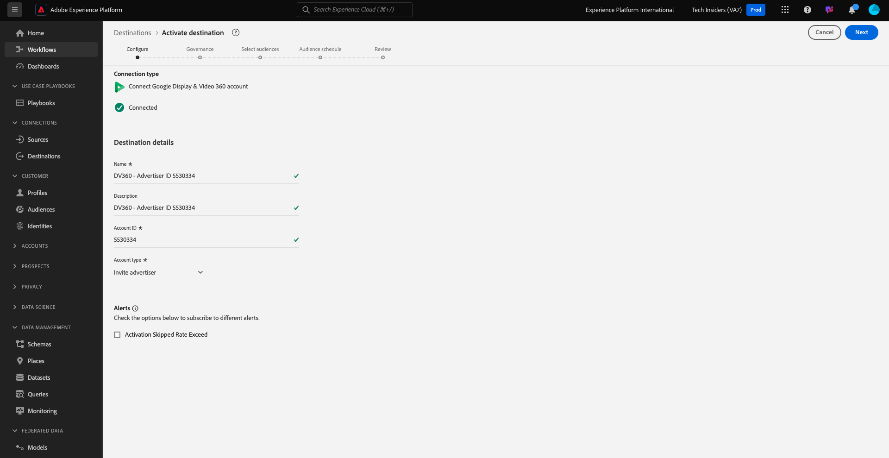
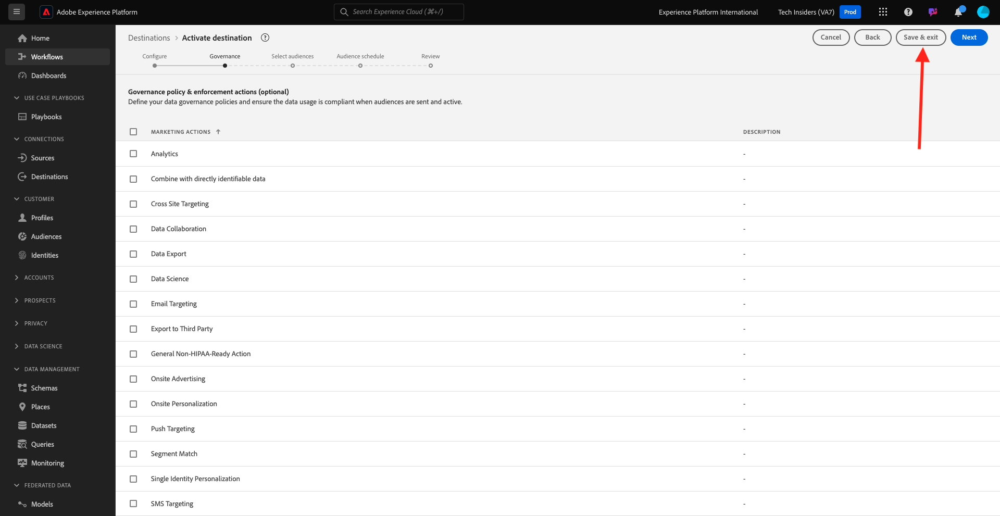

# 2.3.2 Configure an Advertising Destination like Google DV360

>[!IMPORTANT]
>
>The below content is partially intended as FYI - If such a destination already exists in your instance, then you do **NOT** have to configure a new destination for DV360. The destination has already been created in that case and you can use it in the next exercise.

Go to [Adobe Experience Platform](https://experience.adobe.com/platform). After logging in, you'll land on the homepage of Adobe Experience Platform.

Before you continue, you need to select a **sandbox**. The sandbox to select is named ``--aepSandboxName--``. After selecting the appropriate [!UICONTROL sandbox], you'll see the screen change and now you're in your dedicated [!UICONTROL sandbox].

In the left menu, go to **Destinations**, then go to **Catalog**. You'll then see the **Destinations Catalog**.

In **Destinations**, click on **Google Display & Video 360** and then click **+ Set Up**.

You'll then see this. Click **Connect to destination**.

In the next screen, you can configure your destination to Google DV360.

Enter a value in the fields **Name** and **Description**.

The field **Account ID** is the **Advertiser ID** of the DV360 Account. You can find that here:

The **Account Type** should be set to **Invite Advertiser**.

Now you have this. Click **Next**.

>[!NOTE]
>
>Google needs to allow-list Adobe in order for Adobe Experience Platform to send data to Google DV360. Contact your Google Account Manager to enable this dataflow.

After creating the destination, you'll see this. You can optionally select a data governance policy. Next, click **Save & exit**.

You'll then see a list of available destinations. 
In the next exercise, you'll connect the audience you built in the previous exercise to the Google DV360 destination.

Next Step: [2.3.3 Take Action: send your audience to DV360](./ex3.md)

[Go Back to Module 2.3](./real-time-cdp-build-a-segment-take-action.md)

[Go Back to All Modules](../../../overview.md)
