# 2.3.4 Take Action: send your audience to an S3-destination

Adobe Experience Platform also has the ability to share audiences to Email Marketing Destinations such as Salesforce Marketing Cloud, Oracle Eloqua, Oracle Responsys and Adobe Campaign.

You can use FTP or SFTP as part of the dedicated destinations for each of these Email Marketing Destinations, or you can use AWS S3 to exchange lists of customers between Adobe Experience Platform and these Email Marketing Destinations.

In this module, you'll configure such a destination by making use of an AWS S3 bucket.

## Create your S3 bucket

Go to [https://console.aws.amazon.com](https://console.aws.amazon.com) and sign in.

>[!NOTE]
>
>If you don't have an AWS account yet, please create a new AWS account using your personal email address.

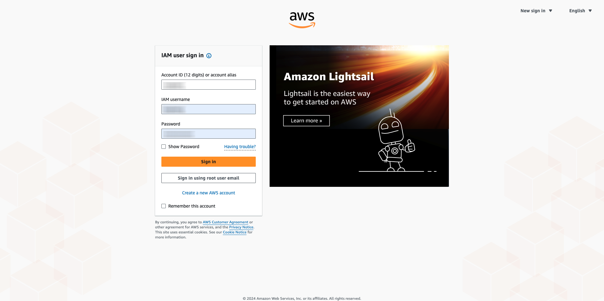

After logging in, you'll be redirected to the **AWS Management Console**.

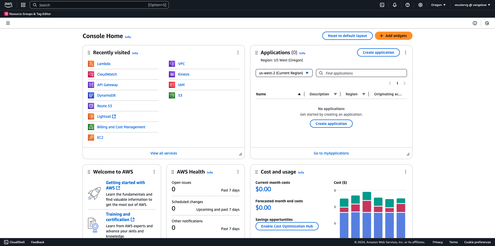

In the search bar, search for **s3**. Click the first search result: **S3 - Scalable Storage in the Cloud**.

You'll then see the **Amazon S3** homepage. Click **Create Bucket**.

In the **Create Bucket** screen, use the name `aepmodulertcdp--aepUserLdap--`

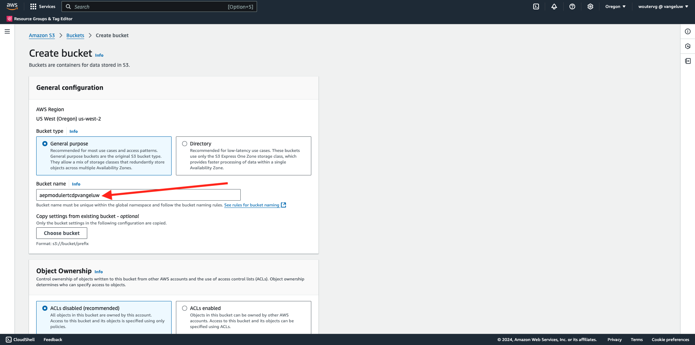

Leave all the other default settings as they are. Scroll down and click **Create bucket**.

You'll then see your bucket being created and will be redirected to the Amazon S3 homepage.

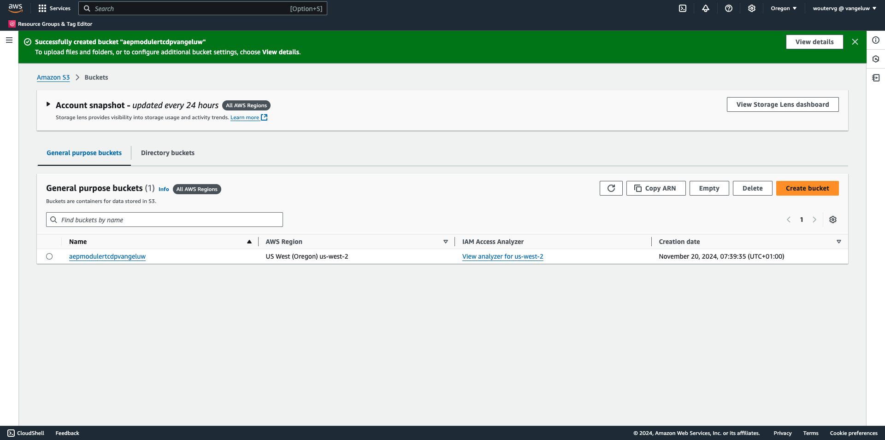

## Set permissions to access your S3 bucket

The next step is to setup access to your S3 bucket.

To do that, go to [https://console.aws.amazon.com/iam/home](https://console.aws.amazon.com/iam/home).

Access to AWS resources is controlled by Amazon Identity and Access Management (IAM).

You'll now see this page.

In the left menu, click **Users**. You'll then see the **Users** screen. Click **Create user**.

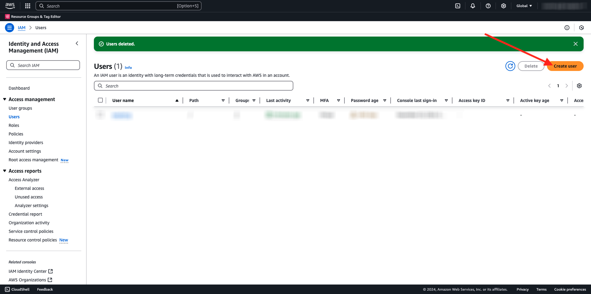

Next, configure your user:

- User Name: use `s3_--aepUserLdap--_rtcdp`

Click **Next**.

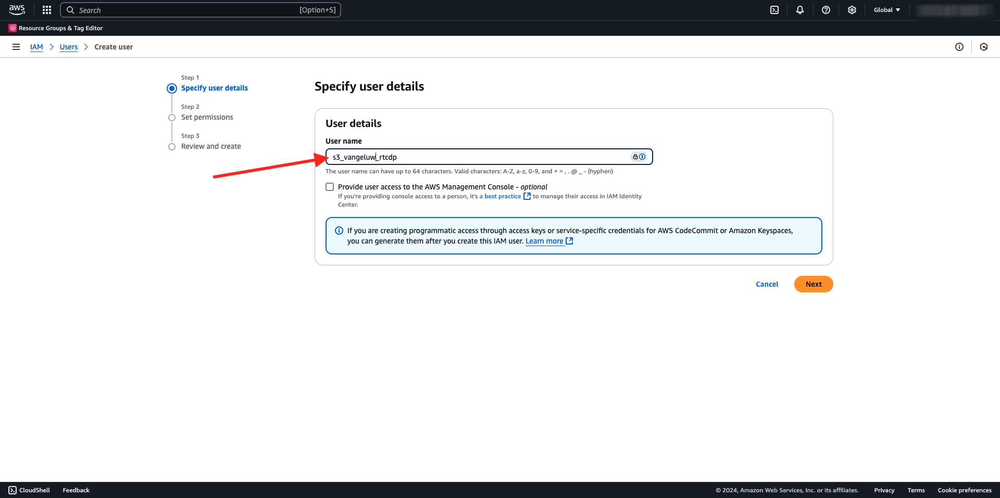

You'll then see this permissions screen. Click **Attach policies directly**.

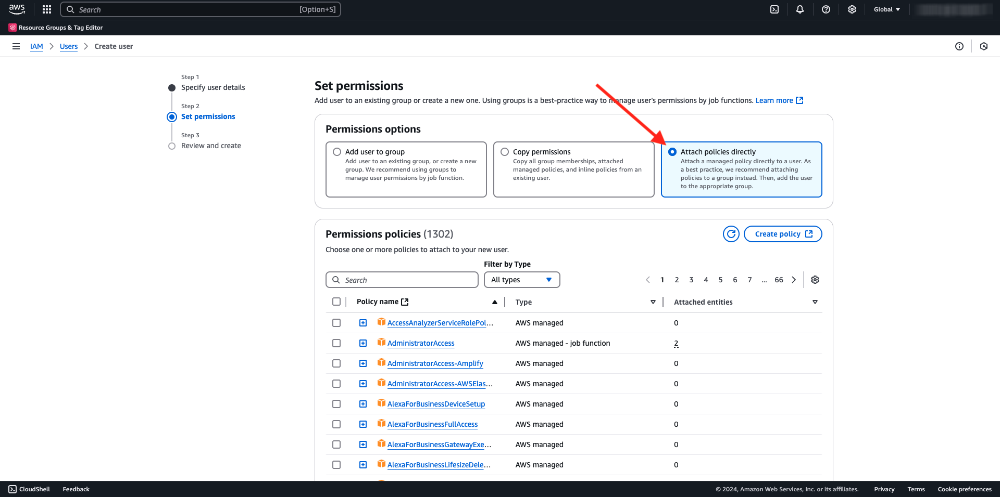

Enter the search term **s3** to see all related S3 policies. Select the policy **AmazonS3FullAccess**. Scroll down and click **Next**.

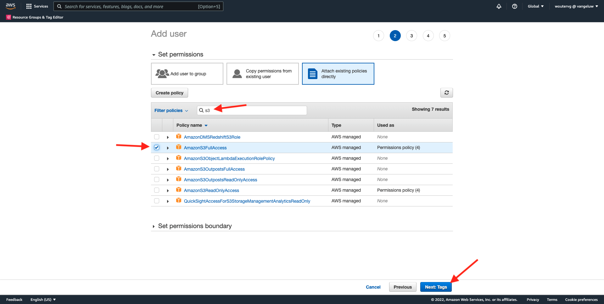

Review your configuration. Click **Create User**.

You'll then see this. Click **View User**.

Click **Security credentials** and then click **Create access key**.

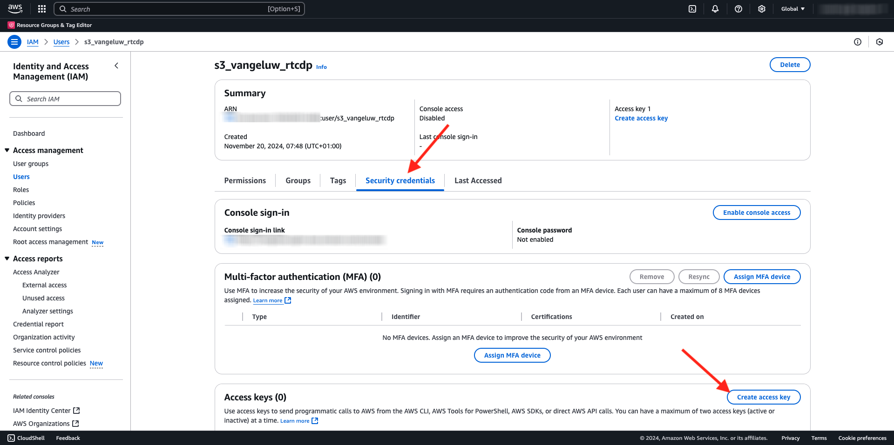

Select **Application running outside AWS**. Scroll down and click **Next**.

Click **Create access key**

You'll then see this. Click **Show** to see your Secret access key:

Your **Secret access key** is now being shown.

>[!IMPORTANT]
>
>Store your credentials in a text-file in your computer.
>
> - Access key ID: ...
> - Secret access key: ...
>
> Once you click **Done** you'll never see your credentials again!

Click **Done**. 

You've now successfully created an AWS S3 bucket and you've created a user with permissions to access this bucket.

## Configure Destination in Adobe Experience Platform

Go to [Adobe Experience Platform](https://experience.adobe.com/platform). After logging in, you'll land on the homepage of Adobe Experience Platform.

Before you continue, you need to select a **sandbox**. The sandbox to select is named ``--aepSandboxName--``. After selecting the appropriate [!UICONTROL sandbox], you'll see the screen change and now you're in your dedicated [!UICONTROL sandbox].

In the left menu, go to **Destinations**, then go to **Catalog**. You'll then see the **Destinations Catalog**.

Click **Cloud Storage**, then click the **Set up** button (or on **Activate Audiences**, depending on your environment) on the **Amazon S3** card.

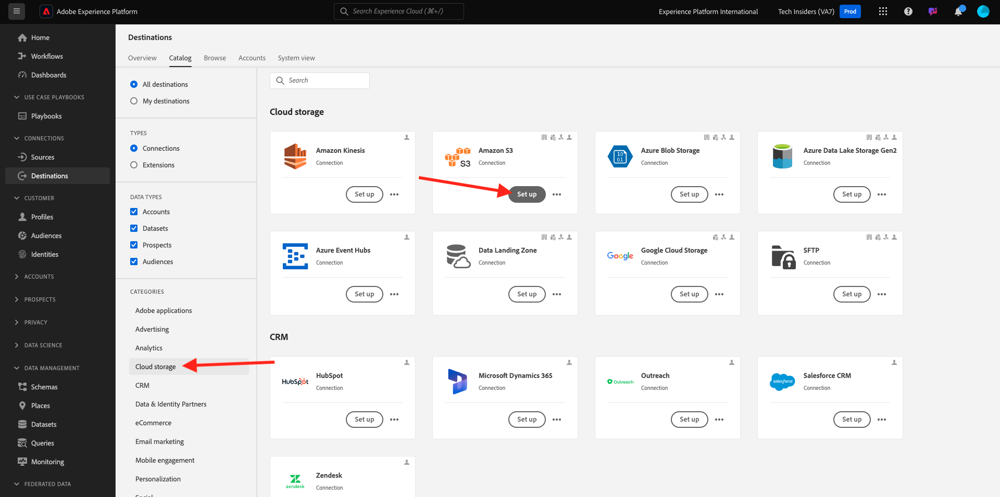

Select **Access Key** as Account Type. Please use the S3 credentials that were given to you in the previous step:

| Access Key ID             | Secret Access Key             |
|:-----------------------:| :-----------------------:|
| AKIA..... |7Icm.....|

Click **Connect to destination**.

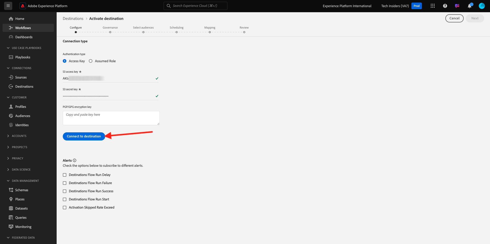

You'll then see a visual confirmation that this destination is now connected.

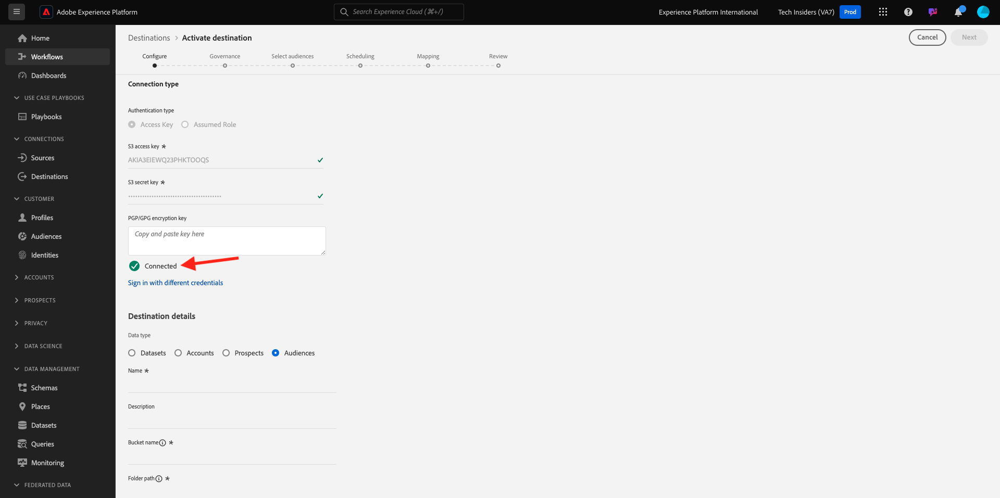

You have to provide S3 bucket details so that Adobe Experience Platform can connect to the S3 bucket.

As a naming convention, please use the following:

| Access Key ID             | Secret Access Key             |
|:-----------------------:| :-----------------------:|
| Name |`AWS - S3 - --aepUserLdap--`|
| Description |`AWS - S3 - --aepUserLdap--`|
| Bucket Name |`aepmodulertcdp--aepUserLdap--`|
| Folder Path |/now |

Select **Audiences**.

For **File Type**, select **CSV** and leave the default settings unchanged.

Scroll down. For **Compression format**, select **None**. Click **Next**.

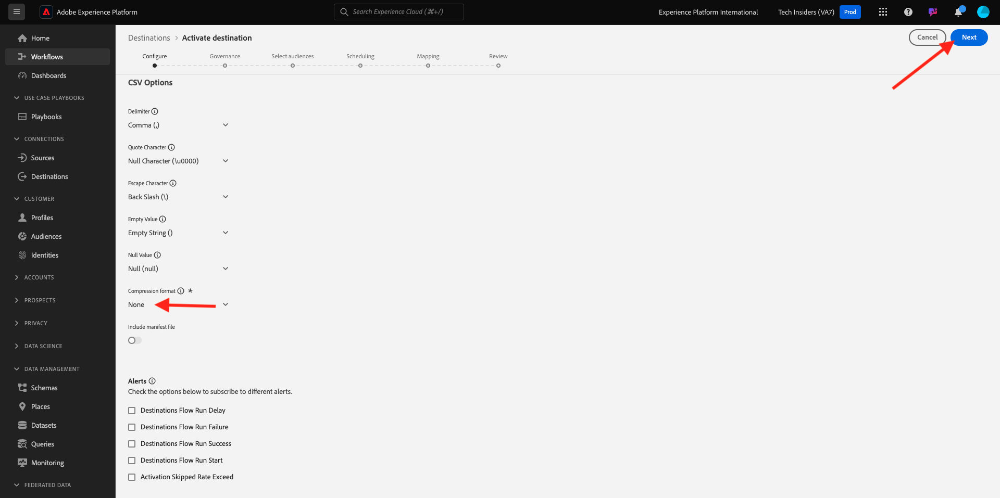

You can now optionally attach a Data Governance Policy to your new destination. Click **Next**.

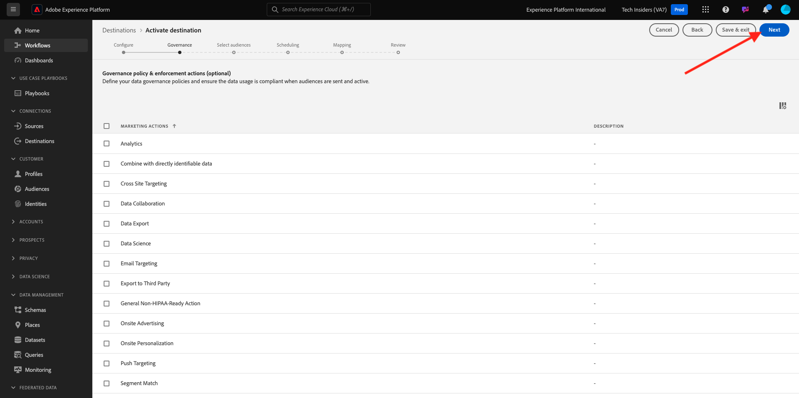

In the list of audiences, search for the audience you created in the previous exercise, `--aepUserLdap-- - Interest in Galaxy S24` and select it. Click **Next**.

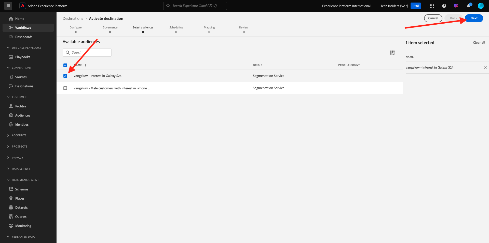

You'll then see this. If you wish, you can edit the schedule and filename by clicking the **pencil** icon. Click **Next**.

You can now select profile attributes for the export towards AWS S3. Click **Add new field** and ensure the field `--aepTenantId--.identification.core.ecid` is added and marked as **Deduplication Key**.

Optionally, you can add as many other profile attributes as required.

Once you've added all fields, click **Next**.

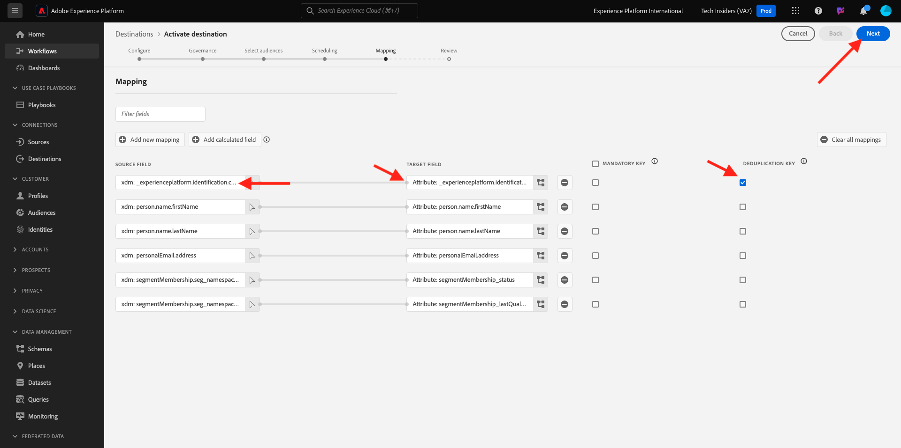

Review your configuration. Click **Finish** to finish your configuration.

You'll then be back at the Destination Activation screen and you'll see your audience added to this destination.

If you'd like to add more audience exports, you can click **Activate Audiences** to restart the process and add more audiences.

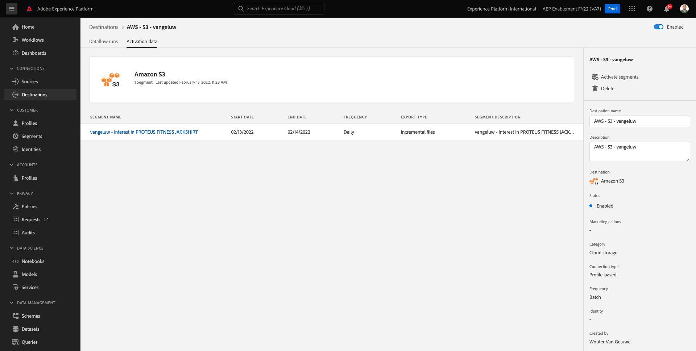

Next Step: [2.3.5 Take Action: send your audience to Adobe Target](./ex5.md)

[Go Back to Module 2.3](./real-time-cdp-build-a-segment-take-action.md)

[Go Back to All Modules](../../../overview.md)
