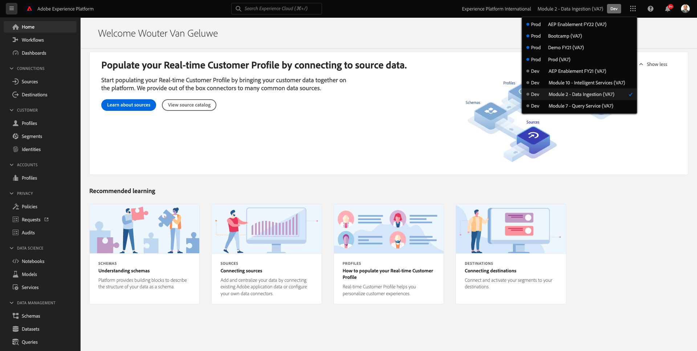
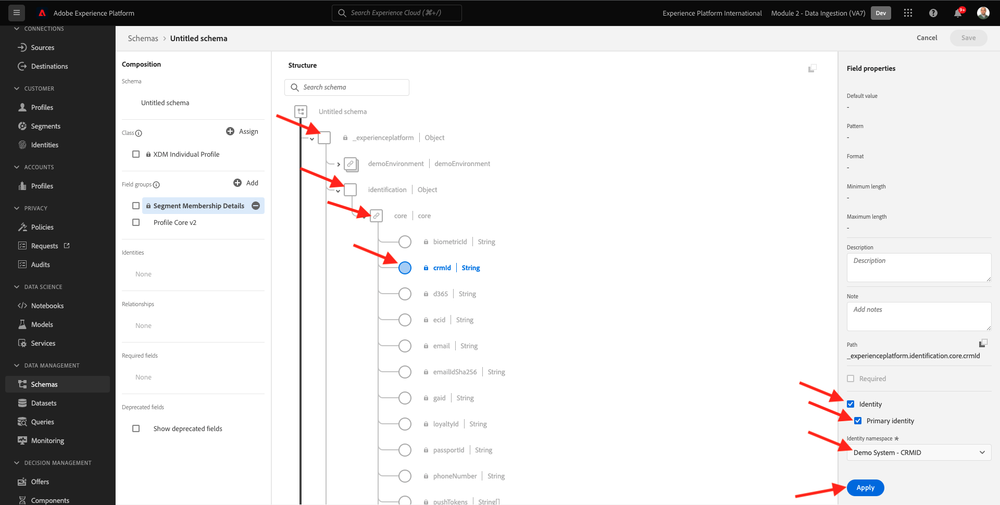
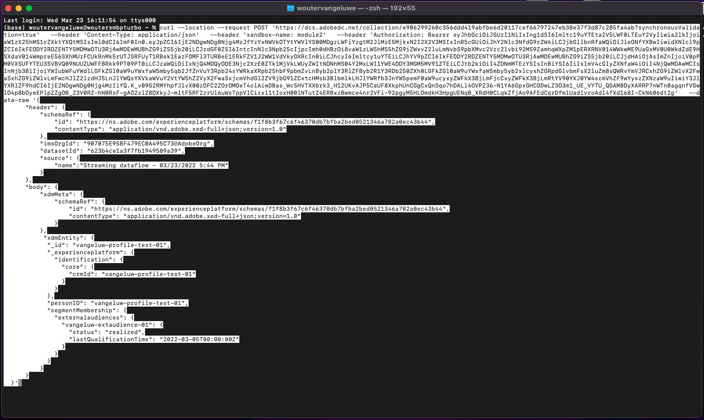

# 2.3.6 External Audiences

In many cases your company may want to use existing segments from other applications to enrich the customer profile in Adobe Experience Platform.
Those external audiences may have been defined based on a data science model or using external data platforms.

The external audiences feature of Adobe Experience Platform lets you focus on the ingestion of the external audiences and their activation without any need to redefine the corresponding segment definition in detail in Adobe Experience Platform.

The overall process is divided in three main steps:

- Import the external audience metadata: this step is meant to ingest the external audience metadata, such as the audience name, into Adobe Experience Platform.
- Assign the external audience memebrship to the cutomer profile: this step is meant to enrich the customer profile with the external segment membership attribute.
- Create the segments in Adobe Experience Platform: this step is meant to create actionable segments based on the external audiences membership.

## 2.3.6.1 Metadata

Go to [Adobe Experience Platform](https://experience.adobe.com/platform). After logging in, you'll land on the homepage of Adobe Experience Platform.


>[!IMPORTANT]
>
>The sandbox to use for this exercise is ``--module2sandbox--``!

Before you continue, you need to select a **sandbox**. The sandbox to select is named ``--module2sandbox--``. You can do this by clicking the text **[!UICONTROL Production Prod]** in the blue line on top of your screen. After selecting the appropriate [!UICONTROL sandbox], you'll see the screen change and now you're in your dedicated [!UICONTROL sandbox].



While the segment data defines the condition for a profile to be part of a segment, the segment metadata are information about the segment such as the name, the description and the status of the segment. As the external audiences metadata will be stored in Adobe Experience Platform, you need to use an identity namespace to ingest the metadata in Adobe Experience Platform.

## 2.3.6.1.1 Identity Namespace for External Audiences

An identity namespace has already been created for usage with **External Audiences**.
To view the identity that was already created, go to **Identities**, and search for **External**. Click on the "External Audiences" item.

Please note:

- The identity symbol **externalaudiences** will be used in the next steps to refer to the external audiences identity.
- The **Non-people identifier** type is used for this identity namespace, as this namespace isn't meant to identify customer profiles but segments.


## 2.3.6.1.2 Create the External Audiences Metadata schema

The external audiences metadata are based on the **Segment definition Schema**. You can find more details in the [XDM Github repository](https://github.com/adobe/xdm/blob/master/docs/reference/classes/segmentdefinition.schema.md).

In the left menu, go to Schemas. Click **+ Create Schema** and then click **Browse**.


To assign a class, search for **segment definition**. Select the **Segment definition** class and click **Assign Class**.


You'll then see this. Click **Cancel**.


You'll then see this. Select the field **_id**. In the right menu, scroll down and enable the **Identity** and the **Primary identity** check boxes. Select the **External Audiences** identity namespace. Click **Apply**.


Next, select the schema name **Untitled schema**. Change the name to `--demoProfileLdap-- - External Audiences Metadata`.


Enable the **Profile** toggle and confirm. Finally, click **Save**.


## 2.3.6.1.3 Create the External Audiences Metadata dataset

In **Schemas**, go to **Browse**. Search and click the `--demoProfileLdap-- - External Audiences Metadata` schema you created in the previous step. Next, click **Create Dataset from Schema**.


For the field **Name**, enter `--demoProfileLdap-- - External Audience Metadata`. Click **Create dataset**.


You'll then see this. Don't forget to enable the **Profile** toggle!


## 2.3.6.1.4 Create an HTTP API Source Connection

Next, you need to configure the HTTP API Source Connector which you'll use to ingest the metadata into the dataset.

Go to **Sources**. In the search field, enter **HTTP**. Click **Add data**.


Enter the following information:

- **Account type**: select **New account**
- **Account name**: enter `--demoProfileLdap-- - External Audience Metadata`
- Check the checkbox **XDM compatible box**

Next, click **Connect to source**.


You'll then see this. Click **Next**.


Select **Existing dataset** and in the dropdown menu, search and select the dataset `--demoProfileLdap-- - External Audience Metadata`.

Verify the **Dataflow details** and then click **Next**.


You'll then see this.

The **Mapping** step of the wizard is empty as you'll be ingesting an XDM compliant payload into the HTTP API Source Connector, so no mapping is required. Click **Next**.


In the **Review** step you can optionally review the connection and the mapping details. Click **Finish**.


You'll then see this.


## 2.3.6.1.5 Ingestion of External Audiences metadata

On your Source Connector overview tab, click **...** and then click **Copy schema payload**.


Open your Text Editor application on your computer and paste the payload you just copied, which looks like this. Next, you need to update the **xdmEntity** object in this payload.


The object **xdmEntity** needs to be replaced by the below code. Copy the below code, and paste it into your text file by replacing the **xdmEntity** object in the text editor.

```
"xdmEntity": {
    "_id": "--demoProfileLdap---extaudience-01",
    "description": "--demoProfileLdap---extaudience-01 description",
    "segmentIdentity": {
      "_id": "--demoProfileLdap---extaudience-01",
      "namespace": {
        "code": "externalaudiences"
      }
    },
    "segmentName": "--demoProfileLdap---extaudience-01 name",
    "segmentStatus": "ACTIVE",
    "version": "1.0"
  }
```

You should then see this:


Next, open a new **Terminal** window. Copy all the text in your Text Editor and paste it in the terminal window. 


Next, hit **Enter**.

You'll then see a confirmation of your data ingestion in the Terminal window:


Refresh your HTTP API Source connector screen, where you'll now see that data is being processed:


## 2.3.6.1.6 Validate External Audiences metadata ingestion

When the processing is completed you can check the data availability in the dataset using Query Service.

In the right menu, go to **Datasets** and select the `--demoProfileLdap-- - External Audience Metadata` dataset you created previously.

  

In the right menu, go to Queries and click **Create query**.


Enter the following code and then hit **SHIFT + ENTER**:

```
select * from --demoProfileLdap--_external_audience_metadata
```

In the query results you'll see the external audience's metadata that you ingested.


## 2.3.6.2 Segment Membership

With the external audience metadata available you can now ingest the segment membership for a specific customer profile.

You now need to prepare a profile dataset enriched against the Segment membership schema. You can find more details in the [XDM Github repository](https://github.com/adobe/xdm/blob/master/docs/reference/datatypes/segmentmembership.schema.md).

## 2.3.6.2.1 Create the External Audiences Membership schema

In the right menu, go to **Schemas**. Click **Create Schema** and then click **XDM Individual Profile**.


In the **Add field groups** popup, search for **Profile Core**. Select the **Profile Core v2** field group.


Next, in the **Add field groups** popup, search for **Segment membership**. Select the **Segment Membership Details** field group. Next, click **Add field groups**.


You'll then see this. Navigate to the field `--aepTenantId--.identification.core`. Click the **crmId** field. In the right menu, scroll down and check the **Identity** and the **Primary identity** checkboxes. For the **Identity Namespace** select **Demo System - CRMID**. 

Click **Apply**.



Next, select the Schema name **Untitled schema**. In the display name field, enter `--demoProfileLdap-- - External Audiences Membership`.


Next, enable the **Profile** toggle and confirm. Click **Save**.


## 2.3.6.2.2 Create the External Audiences Membership dataset

In **Schemas**, go to **Browse**. Search and click the `--demoProfileLdap-- - External Audiences Membership` schema you created in the previous step. Next, click **Create Dataset from Schema**.


For the field **Name**, enter `--demoProfileLdap-- - External Audiences Membership`. Click **Create dataset**.


You'll then see this. Don't forget to enable the **Profile** toggle!


## 2.3.6.2.3 Create an HTTP API Source Connection


Next, you need to configure the HTTP API Source Connector which you'll use to ingest the metadata into the dataset.

Go to **Sources**. In the search field, enter **HTTP**. Click **Add data**.


Enter the following information:

- **Account type**: select **New account**
- **Account name**: enter `--demoProfileLdap-- - External Audience Membership`
- Check the checkbox **XDM compatible box**

Next, click **Connect to source**.


You'll then see this. Click **Next**.


Select **Existing dataset** and in the dropdown menu, search and select the dataset `--demoProfileLdap-- - External Audiences Membership`.

Verify the **Dataflow details** and then click **Next**.


You'll then see this.

The **Mapping** step of the wizard is empty as you'll be ingesting an XDM compliant payload into the HTTP API Source Connector, so no mapping is required. Click **Next**.


In the **Review** step you can optionally review the connection and the mapping details. Click **Finish**.


You'll then see this.


## 2.3.6.2.4 Ingestion of External Audiences Membership data

On your Source Connector overview tab, click **...** and then click **Copy schema payload**.


Open your Text Editor application on your computer and paste the payload you just copied, which looks like this. Next, you need to update the **xdmEntity** object in this payload.


The object **xdmEntity** needs to be replaced by the below code. Copy the below code, and paste it into your text file by replacing the **xdmEntity** object in the text editor.

```
  "xdmEntity": {
    "_id": "--demoProfileLdap---profile-test-01",
    "_experienceplatform": {
      "identification": {
        "core": {
          "crmId": "--demoProfileLdap---profile-test-01"
        }
      }
    },
    "personID": "--demoProfileLdap---profile-test-01",
    "segmentMembership": {
      "externalaudiences": {
        "--demoProfileLdap---extaudience-01": {
          "status": "realized",
          "lastQualificationTime": "2022-03-05T00:00:00Z"
        }
      }
    }
  }
```

You should then see this:


Next, open a new **Terminal** window. Copy all the text in your Text Editor and paste it in the terminal window. 



Next, hit **Enter**.

You'll then see a confirmation of your data ingestion in the Terminal window:


Refresh your HTTP API Source connector screen, where after a couple of minutes you'll now see that data is being processed:


## 2.3.6.2.5 Validate External Audiences Membership ingestion

When the processing is completed you can check the data availability in the dataset using Query Service.

In the right menu, go to **Datasets** and select the `--demoProfileLdap-- - External Audiences Membership ` dataset you created previously. 


In the right menu, go to Queries and click **Create query**.


Enter the following code and then hit **SHIFT + ENTER**:

```
select * from --demoProfileLdap--_external_audiences_membership
```

In the query results you'll see the external audience's metadata that you ingested.


## 2.3.6.3 Create a segment

Now you are ready to to take action on the external audiences.
In Adobe Experience Platform taking action is achieved via creating segments, populating the respective audiences and sharing those audiences to the destinations.
You'll now create a segment using the external audience you just created.

In the left menu, go to **Segments** and click **Create segment**.


Go to **Audiences**. You'll then see this. Click **External Audiences**.


Select the external audience you created earlier, which is named `--demoProfileLdap---extaudience-01`. Drag and drop the audience onto the canvas.


Give your segment a name, use `--demoProfileLdap-- - extaudience-01`. Click **Save and Close**.


You'll then see this. You'll also notice that the profile for which you ingested the segment membership now shows in the list of **Sample Profiles**.


Your segment is ready now, and can be sent towards a destination for activation.

## 2.3.6.4 Visualize your customer profile

You can now also visualize the segment qualification on your customer profile. Go to **Profiles**, use the identity namespace **Demo System - CRMID** and provide the identity `--demoProfileLdap---profile-test-01`, which you used as part of exercise 6.6.2.4, and click **View**. Next, click the **Profile ID** to open the profile.


Go to **Segment membership**, where you'll see your external audience appear.


Next Step: [2.3.7 Destinations SDK](./ex7.md)

[Go Back to Module 2.3](./real-time-cdp-build-a-segment-take-action.md)

[Go Back to All Modules](../../../overview.md)
