# 2.3.7 Destinations SDK

## Setup your Adobe I/O project

In this exercise you'll be using Adobe I/O again to query Adobe Experience Platform's API's. If you haven't configured your Adobe I/O project yet, go back to [Exercise 3 in Module 2.1](../module2.1/ex3.md) and follow the instructions there.

## Postman authentication to Adobe I/O

In this exercise you'll be using Postman again to query Adobe Experience Platform's API's. If you haven't configured your Postman appmlication yet, go back to [Exercise 3 in Module 2.1](../module2.1/ex3.md) and follow the instructions there.

## Define endpoint and format

For this exercise, you'll need an endpoint to configure so that when a segment qualifies, the qualification event can be streamed to that endpoint. In this exercise, you'll use a sample endpoint using [https://webhook.site/](https://webhook.site/). Go to [https://webhook.site/](https://webhook.site/), where you'll see something similar to this. Click **Copy to clipboard** to copy the url. You'll need to specify this url in the next exercise. The URL in this example is `https://webhook.site/e0eb530c-15b4-4a29-8b50-e40877d5490a`.

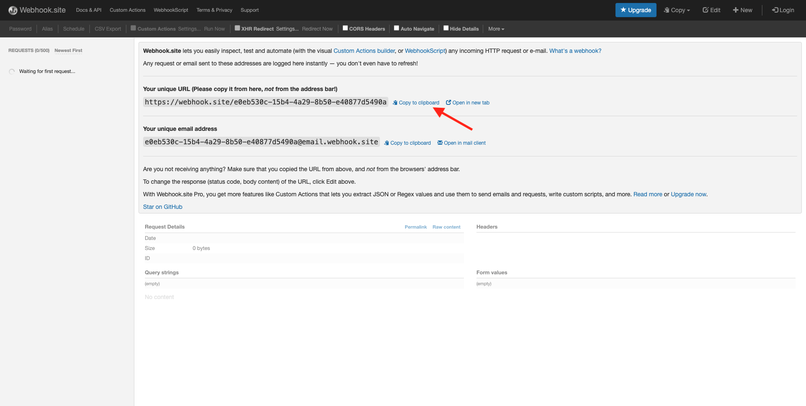

As for the format, we'll use a standard template that will stream segment qualifications or unqualifications along with metadata like customer identifiers. Templates can be customized to meet the expectations of specific endpoints, but in this exercise we'll reuse a standard template, which will result in a payload like this that will be streamed to the endpoint.

```json
{
  "profiles": [
    {
      "identities": [
        {
          "type": "ecid",
          "id": "64626768309422151580190219823409897678"
        }
      ],
      "AdobeExperiencePlatformSegments": {
        "add": [
          "f58c723c-f1e5-40dd-8c79-7bb4ab47f041"
        ],
        "remove": []
      }
    }
  ]
}
```

## Create a server and template configuration

The first step to create your own Destination in Adobe Experience Platform is to create a server and template configuration.

To do that, go to **Destination Authoring API**, to **Destination servers and templates** and click to open the request **POST - Create a destination server configuration**. You'll then see this. Under **Headers**, you need to manually update the value for the key **x-sandbox-name** and set it to `--aepSandboxName--`. Select the value **{{SANDBOX_NAME}}**.

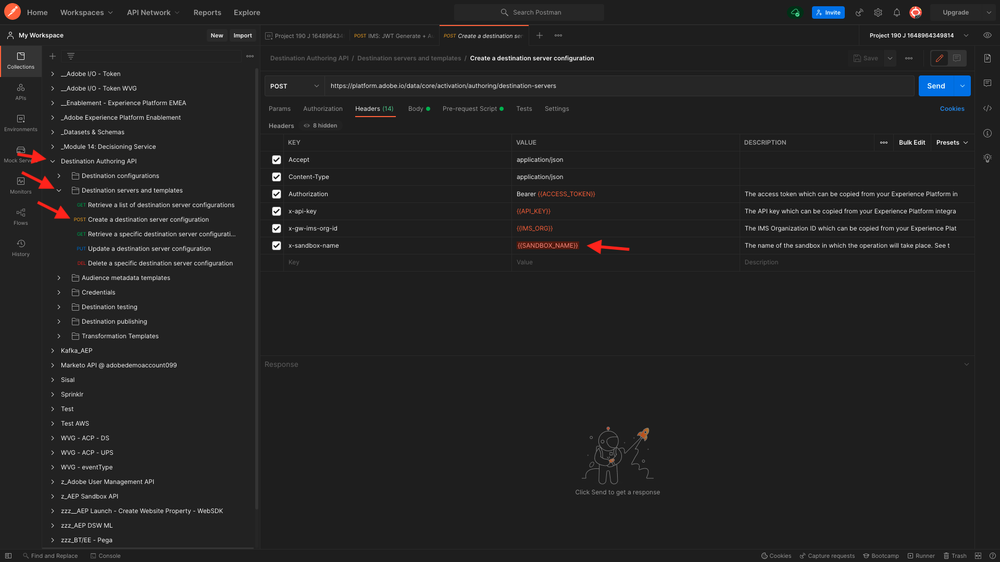

Replace it by `--aepSandboxName--`.

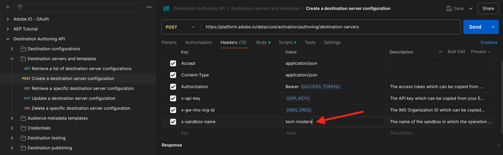

Next, go to **Body**. select the placeholder **{{body}}**.

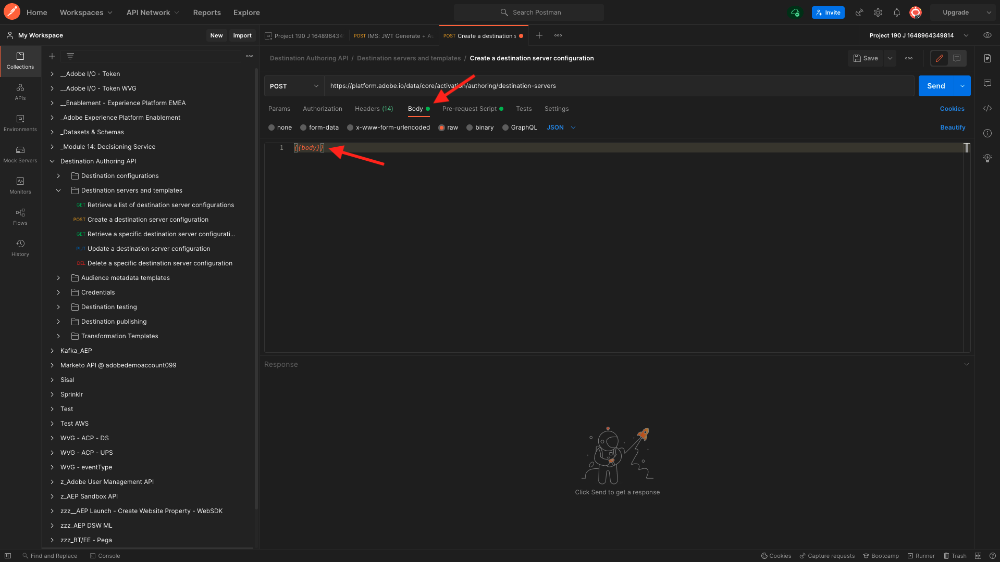

You now need to replace the placeholder **{{body}}** by the below code:

```json
{
    "name": "Custom HTTP Destination",
    "destinationServerType": "URL_BASED",
    "urlBasedDestination": {
        "url": {
            "templatingStrategy": "PEBBLE_V1",
            "value": "yourURL"
        }
    },
    "httpTemplate": {
        "httpMethod": "POST",
        "requestBody": {
            "templatingStrategy": "PEBBLE_V1",
            "value": "{\n    \"profiles\": [\n    \n        {\n            \"identities\": [\n            \n            \n                \n                {\n                    \"type\": \"{{ namespace }}\",\n                    \"id\": \"{{ identity.id }}\"\n                },\n                ,\n            \n            ],\n            \"AdobeExperiencePlatformSegments\": {\n                \"add\": [\n                \n                    \"{{ segment.key }}\",\n                \n                ],\n                \"remove\": [\n                {#- Alternative syntax for filtering segments by status: -#}\n                \n                    \"{{ segment.key }}\",\n                \n                ]\n            }\n        },\n    \n    ]\n}"
        },
        "contentType": "application/json"
    }
}
```

After pasting the above code, you need to manually update the field **urlBasedDestination.url.value**, and you need to set it to the url of the webhook you created in the previous step, which was `https://webhook.site/e0eb530c-15b4-4a29-8b50-e40877d5490a` in this example.


After updating the field **urlBasedDestiantion.url.value**, it should look like this. Click **Send**.

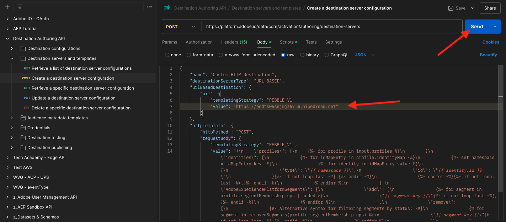

After clicking **Send**, your server template will be created, and as part of the response you'll see a field named **instanceId**. Write it down, as you'll need it in the next step. In this example, the **instanceId** is 
`eb0f436f-dcf5-4993-a82d-0fcc09a6b36c`.

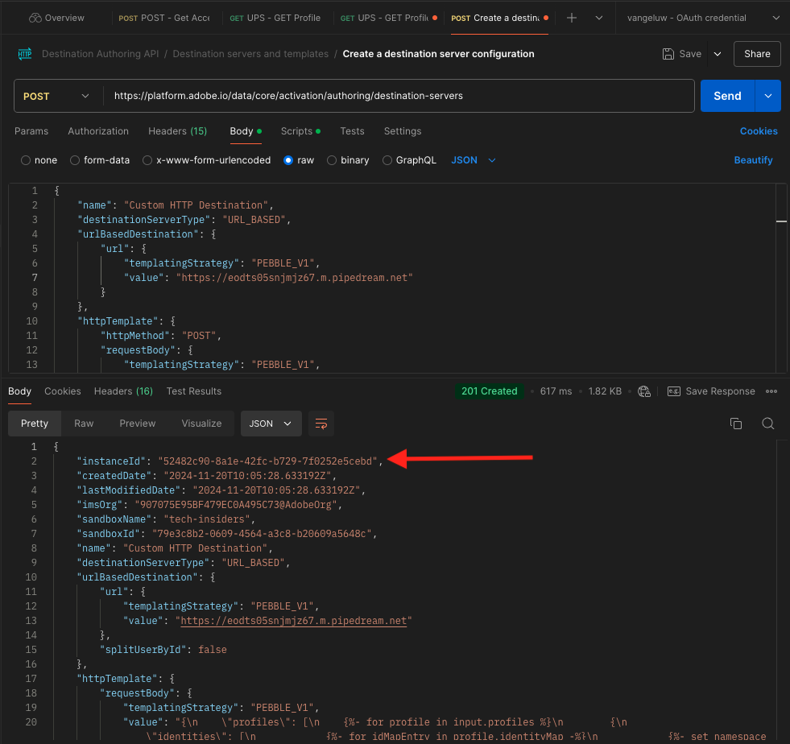

## Create your destination configuration

In Postman, under **Destination Authoring API**, go to **Destination configurations** and click to open the request **POST - Create a destination configuration**. You'll then see this. Under **Headers**, you need to manually update the value for the key **x-sandbox-name** and set it to `--aepSandboxName--`. Select the value **{{SANDBOX_NAME}}**.

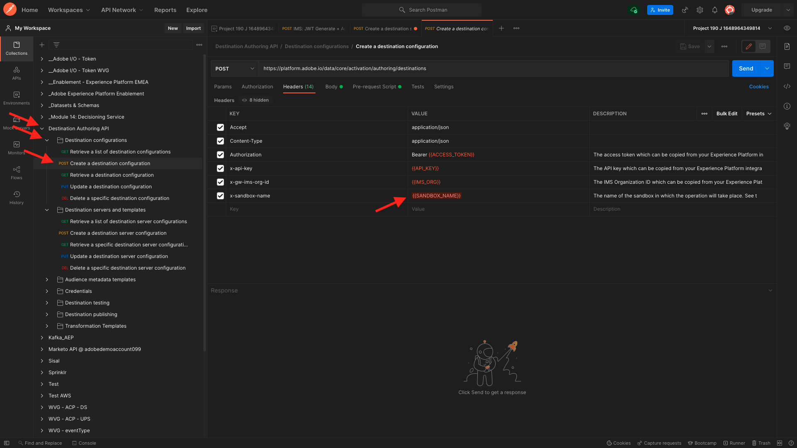

Replace it by `--aepSandboxName--`.


Next, go to **Body**. select the placeholder **{{body}}**.


You now need to replace the placeholder **{{body}}** by the below code:

```json
{
    "name": "--aepUserLdap-- - Webhook",
    "description": "Exports segment qualifications and identities to a custom webhook via Destination SDK.",
    "status": "TEST",
    "customerAuthenticationConfigurations": [
        {
            "authType": "BEARER"
        }
    ],
    "customerDataFields": [
        {
            "name": "endpointsInstance",
            "type": "string",
            "title": "Select Endpoint",
            "description": "We could manage several instances across the globe for REST endpoints that our customers are provisioned for. Select your endpoint in the dropdown list.",
            "isRequired": true,
            "enum": [
                "US",
                "EU",
                "APAC",
                "NZ"
            ]
        }
    ],
    "uiAttributes": {
        "documentationLink": "https://experienceleague.adobe.com/docs/experience-platform/destinations/home.html?lang=en",
        "category": "streaming",
        "connectionType": "Server-to-server",
        "frequency": "Streaming"
    },
    "identityNamespaces": {
        "ecid": {
            "acceptsAttributes": true,
            "acceptsCustomNamespaces": false
        }
    },
    "segmentMappingConfig": {
        "mapExperiencePlatformSegmentName": true,
        "mapExperiencePlatformSegmentId": true,
        "mapUserInput": false
    },
    "aggregation": {
        "aggregationType": "BEST_EFFORT",
        "bestEffortAggregation": {
            "maxUsersPerRequest": "1000",
            "splitUserById": false
        }
    },
    "schemaConfig": {
        "profileRequired": false,
        "segmentRequired": true,
        "identityRequired": true
    },
    "destinationDelivery": [
        {
            "authenticationRule": "NONE",
            "destinationServerId": "yourTemplateInstanceID"
        }
    ]
}
```

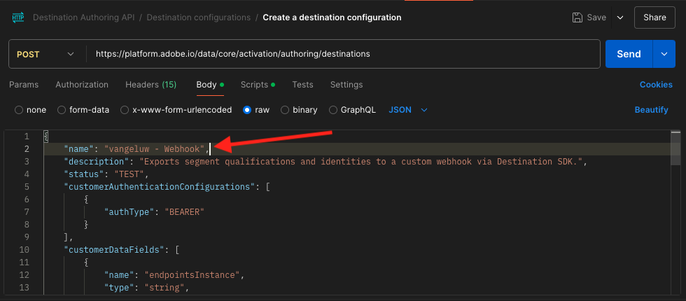

After pasting the above code, you need to manually update the field **destinationDelivery. destinationServerId**, and you need to set it to the **instanceId** of the destination server template you created in the previous step, which was `eb0f436f-dcf5-4993-a82d-0fcc09a6b36c` in this example. Next, cick **Send**.

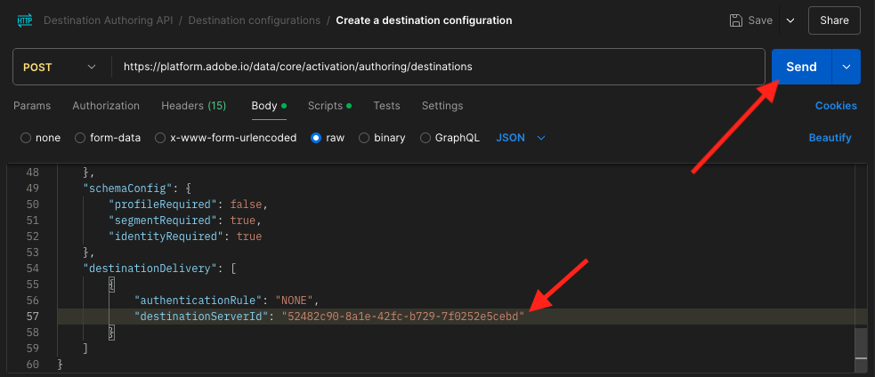

You'll then see this response.

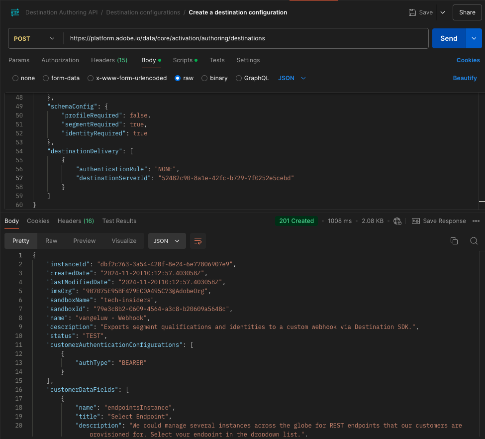

Your destination is now created in Adobe Experience Platform. Let's go there and check it.

Go to [Adobe Experience Platform](https://experience.adobe.com/platform). After logging in, you'll land on the homepage of Adobe Experience Platform.


Before you continue, you need to select a **sandbox**. The sandbox to select is named ``--aepSandboxName--``. You can do this by clicking the text **[!UICONTROL Production Prod]** in the blue line on top of your screen. After selecting the appropriate [!UICONTROL sandbox], you'll see the screen change and now you're in your dedicated [!UICONTROL sandbox].


In the left menu, go to **Destinations**, click **Catalog** and scroll down to the category **Streaming**. You'll see your destination avaiable there now.


## Link your segment to your destination

In **Destinations** > **Catalog**, click **Set up** on your destination to start adding segments to your new destination.

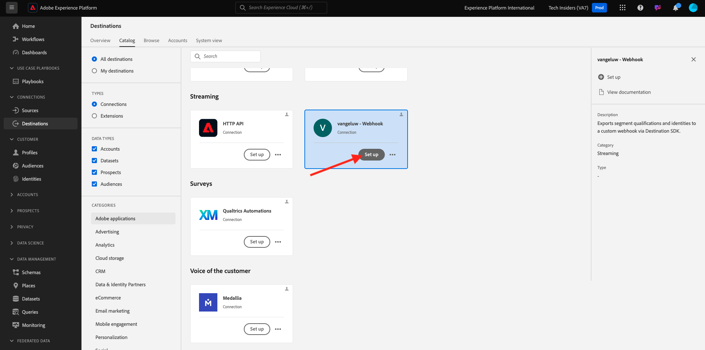

Enter a dummy bearer token, like **1234**. Click **Connect to destination**.

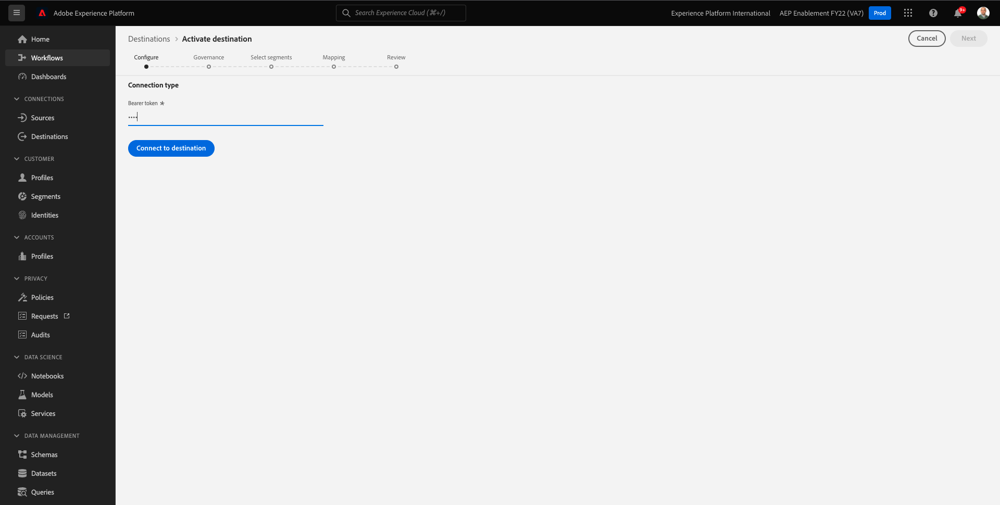

You'll then see this. As a name for your destination, use `--aepUserLdap-- - Webhook`. Select an endpoint of choice, in this example **EU**. Click **Next**.

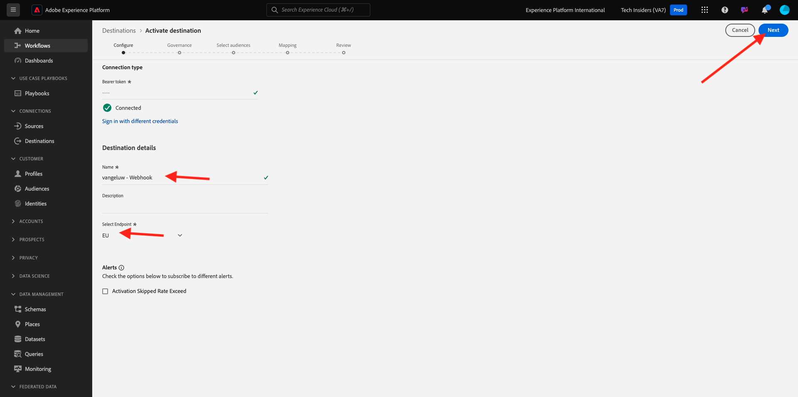

You can optionally select a data governance policy. Click **Next**.


Select the segment you created earlier, which is named `--aepUserLdap-- - Interest in PROTEUS FITNESS JACKSHIRT`. Click **Next**.


You'll then see this. Make sure to map the **SOURCE FIELD** `--aepTenantId--.identification.core.ecid` to the field `Identity: ecid`. Click **Next**.

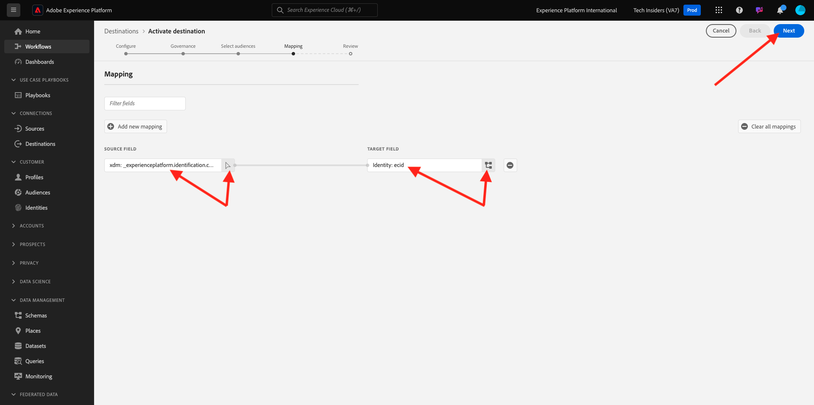

Click **Finish**.

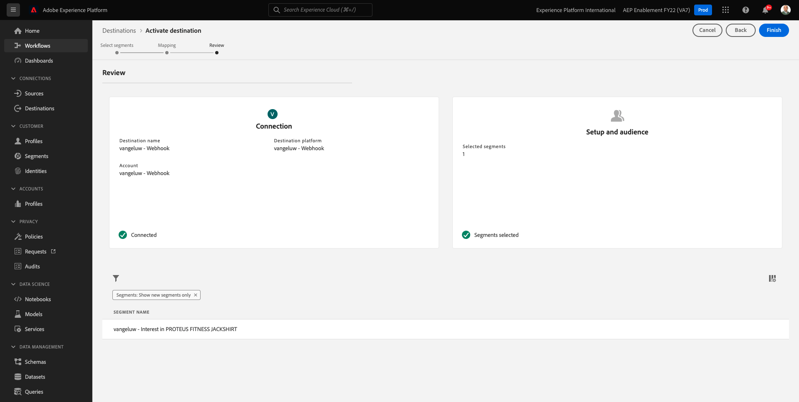

Your destination is now live, new segment qualifications will be streamed to your custom webhook now.

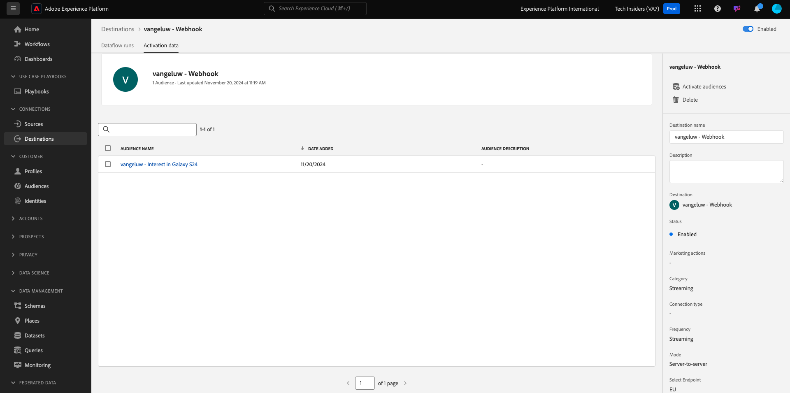

## Test your segment activation

Go to [https://builder.adobedemo.com/projects](https://builder.adobedemo.com/projects). After logging in with your Adobe ID, you'll see this. Click your website project to open it.

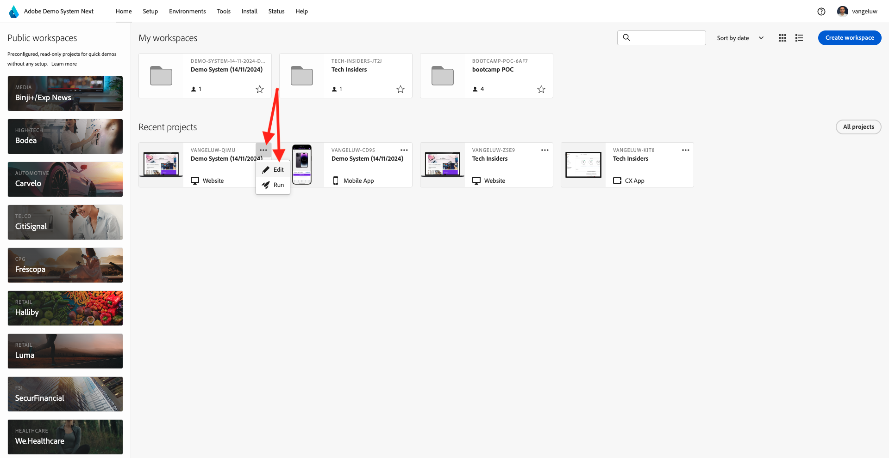

You can now follow the below flow to access the website. Click **Integrations**.

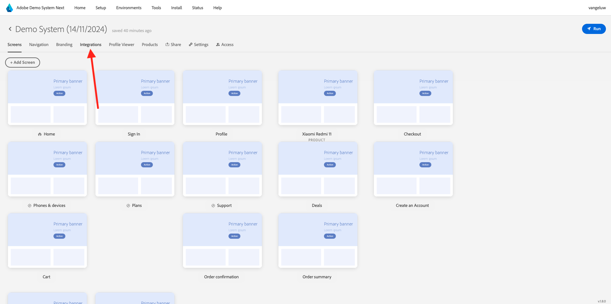

On the **Integrations** page, you need to select the Data Collection property that was created in exercise 0.1. 


You'll then see your demo website open up. Select the URL and copy it to your clipboard.


Open a new incognito browser window.


Paste the URL of your demo website, which you copied in the previous step. You'll then be asked to login using your Adobe ID.


Select your account type and complete the login process.


You'll then see your website loaded in an incognito browser window. For every demonstration, you'll need to use a fresh, incognito browser window to load your demo website URL.


From the **Luma** homepage, go to **Men**, and click the product **PROTEUS FITNESS JACKSHIRT**.


You've now visited the product page for **PROTEUS FITNESS JACKSHIRT**, which means you'll now qualify for the segment that you created earlier in this exercise.


When you open the Profile Viewer, and go to **Segments**, you'll see the segment qualify.

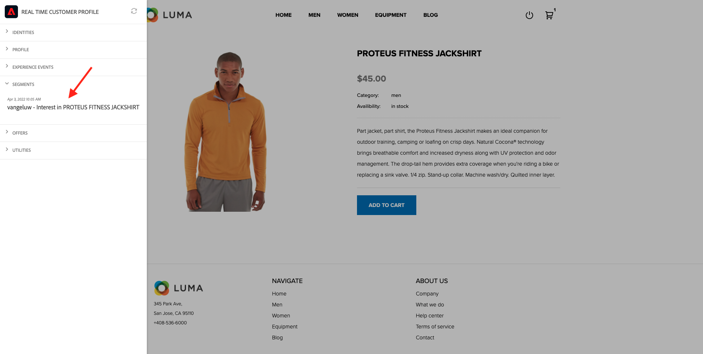

Now go back to your open webhook on [https://webhook.site/](https://webhook.site/), where you should see a new incoming request, which originates from Adobe Experience Platform and which contains the segment qualification event.

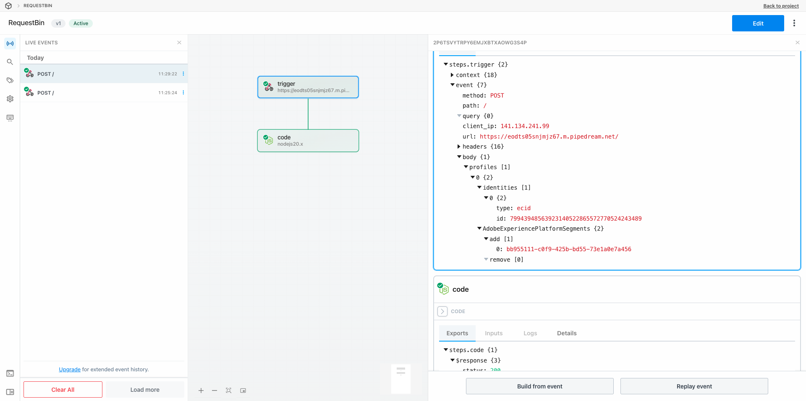

Next Step: [Summary and benefits](./summary.md)

[Go Back to Module 2.3](./real-time-cdp-build-a-segment-take-action.md)

[Go Back to All Modules](../../../overview.md)
