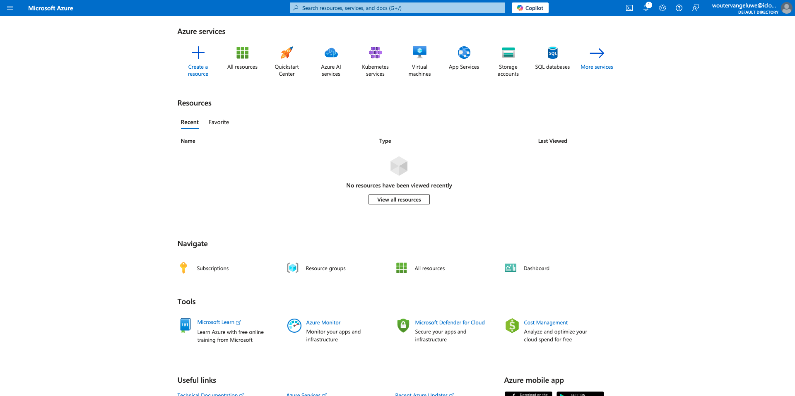
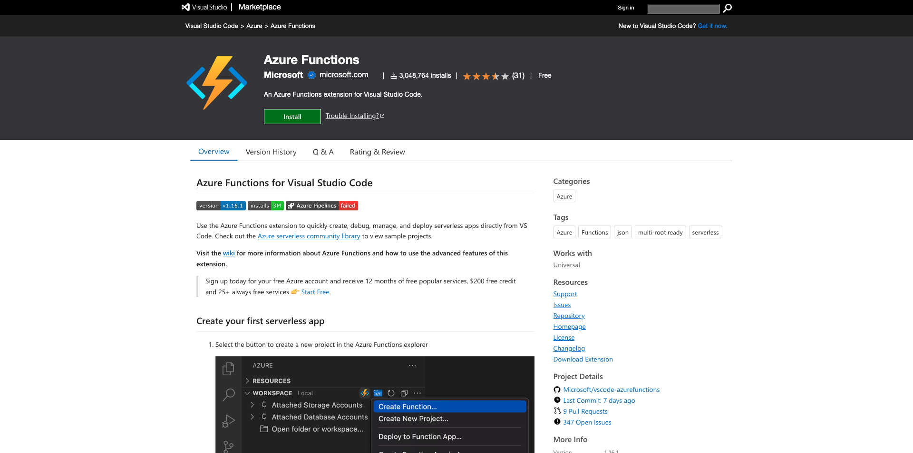
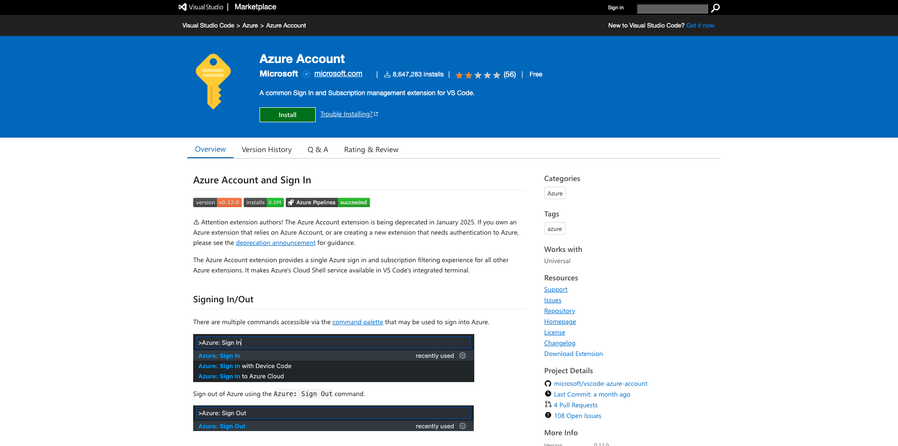
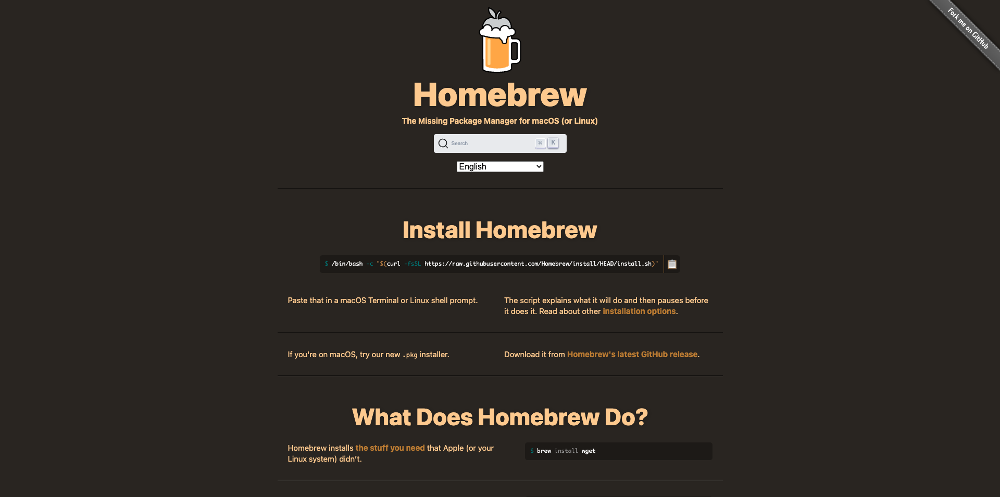

# 2.4.1 Configure your environment

## Create an Azure Subscription

>[!NOTE]
>
>If you already have an Azure Subscription, you can skip this step. Please proceed with the next exercise in that case.

Go to [https://portal.azure.com](https://portal.azure.com) and login with your Azure account. If you don't have one, please use your personal email address to create your Azure account.


After successful login you'll see the following screen:


Click on the to left menu and select **All Resources**, the Azure subscription screen will appear if you are not yet subscribed. In that case select **Start with an Azure free Trial**. 


Fill in the Azure subscription form, provide your mobile phone and credit card for activation (you will have a free tier for 30 days and you will not be charged, unless you upgrade).

When the subscription process is finished you are good to go: 



## Install Visual Code Studio

You'll use Microsoft Visual Code Studio to manage your Azure Project. You can download it via [this link](https://code.visualstudio.com/download). Follow the installation instructions for your specific OS on that same website.

## Install Visual Code Extensions

Install the Azure Functions for Visual Studio Code from [https://marketplace.visualstudio.com/items?itemName=ms-azuretools.vscode-azurefunctions](https://marketplace.visualstudio.com/items?itemName=ms-azuretools.vscode-azurefunctions). Click the install button:



Install Azure Account and Sign-In for Visual Studio Code from [https://marketplace.visualstudio.com/items?itemName=ms-vscode.azure-account](https://marketplace.visualstudio.com/items?itemName=ms-vscode.azure-account). Click the install button:



## Install node.js

>[!NOTE]
>
>If you already have node.js installed, you can skip this step. Please proceed with the next exercise in that case.

### macOS

Make sure to have [Homebrew](https://brew.sh/) installed first. Follow the instructions [here](https://brew.sh/).



Once you've installed Homebrew, run this command:

```javascript
brew install node
```

### Windows

Download the [Windows Installer](https://nodejs.org/en/#home-downloadhead) directly from the [nodejs.org](https://nodejs.org/en/) web site.

## Verify node.js version

For this module, you need to have node.js version 18 installed. Any other version of node.js may cause issues with this exercise.

Before you continue, please verify your version of node.js now.

Run this command to verify your node.js version:

```javascript
node -v
```

If your version is below or above 18, you need to upgrade or downgrade.

### Upgrade/Downgrade node.js version on macOS

Ensure that you have the package **n** installed.

To install the package **n**, run this command:

```javascript
sudo npm install -g n
```

If you version is below or above version 12, run this command to upgrade or downgrade:

```javascript
sudo n 18
```

### Upgrade/Downgrade node.js version on Windows

Uninstall node.js from Windows > Control Panel > Add or remove programs.

Installing the required version from the [nodejs.org](https://nodejs.org/en/) website.

## Install NPM package: request

You need to install the package **request** as part of your node.js setup.

To install the package **request**, run this command:

```javascript
npm install request
```

## Install Azure Functions Core Tools:
 
```
brew tap azure/functions
brew install azure-functions-core-tools@4
```

Next Step: [2.4.2 Configure your Microsoft Azure EventHub environment](./ex2.md)

[Go Back to Module 2.4](./segment-activation-microsoft-azure-eventhub.md)

[Go Back to All Modules](./../../../overview.md)
