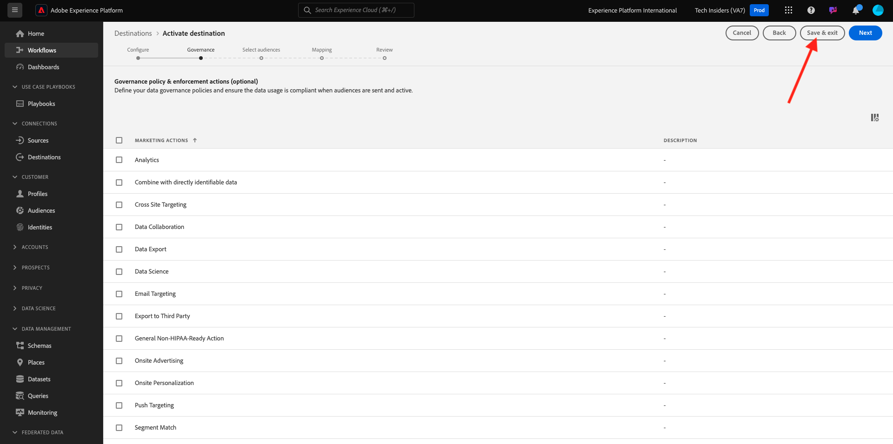

# 2.4.3 Configure your Azure Event Hub Destination in Adobe Experience Platform

## Identify Required Azure Connection parameters

To configure an Event Hub destination in Adobe Experience Platform you need your:

- Event Hubs namespace
- Event Hub
- Azure SAS Key name
- Azure SAS Key

Event Hub and EventHub namespace have been defined in the previous exercise: [Setup Event Hub in Azure](./ex2.md)

### Event Hubs Namespace
  
To lookup the above information in Azure Portal, navigate to [https://portal.azure.com/#home](https://portal.azure.com/#home). Make sure that you are using the correct Azure account.

Click **All Resources** in your Azure portal:

Find your **Event Hubs Namespace** in the list and click it.

The name of your **Event Hubs Namespace** is now clearly visible. It should be similar to `--aepUserLdap---aep-enablement`.

### Event Hub

On your **Event Hubs Namespace** page, click **Entities > Event Hubs** to get a list of Event Hubs defined in your Event Hubs Namespace, if you followed the naming conventions used in the previous exercise you will find an Event Hub named `--aepUserLdap---aep-enablement-event-hub`. Take a note of it, you will need it in the next exercise.
  

### SAS Key Name

On your **Event Hubs Namespace** page, click **Settings > Shared access policies**. You will see a list of Shared access policies. The SAS Key that we are looking for is **RootManageSharedAccessKey**, which is the **SAS Key Name. Write it down.

### SAS Key Value

Next, click on the **RootManageSharedAccessKey** to get the SAS Key Value. And press the **Copy to clipboard** icon to copy the **Primary key**, in this case `pqb1jEC0KLazwZzIf2gTHGr75Z+PdkYgv+AEhObbQEY=`.

### Destination Values Summary

At this point you should have identified all the values needed to define the Azure Event Hub destination in Adobe Experience Platform Real-time CDP.

| Destination Attribute Name |  Destination Attribute Value | Example Value |
|---|---|---|
|sasKeyName|SAS Key Name|RootManageSharedAccessKey|  
|sasKey|SAS Key Value|pqb1jEC0KLazwZzIf2gTHGr75Z+PdkYgv+AEhObbQEY=|
|namespace|Event Hubs Namespace|`--aepUserLdap---aep-enablement`|
|eventHubName|Event Hub|`--aepUserLdap---aep-enablement-event-hub`| 

## Create Azure Event Hub Destination in Adobe Experience Platform

Log in to Adobe Experience Platform by going to this URL: [https://experience.adobe.com/platform](https://experience.adobe.com/platform).

After logging in, you'll land on the homepage of Adobe Experience Platform.

Before you continue, you need to select a **sandbox**. The sandbox to select is named ``--aepSandboxName--``. After selecting the appropriate sandbox, you'll see the screen change and now you're in your dedicated sandbox.

Go to **Destinations**, then go to **Catalog**. Select **Cloud Storage**, go to **Azure Event Hubs** and click **Set up**.

Select **Standard authentication**. Fill in the connection details that you have collected in the previous exercise. Next, click **Connect to Destination**.

If your credentials were correct, you'll see a confirmation: **Connected**. 

You now need to enter the name and description in the format `--aepUserLdap---aep-enablement`. Enter the **eventHubName** (see previous exercise, it looks like this: `--aepUserLdap---aep-enablement-event-hub`) and click **Next**.
  

You can optionally select a Data Governance Policy. Click **Save & exit**.

Your destination is now created and available in Adobe Experience Platform.

Next Step: [2.4.4 Create an audience](./ex4.md)

[Go Back to Module 2.4](./segment-activation-microsoft-azure-eventhub.md)

[Go Back to All Modules](./../../../overview.md)
